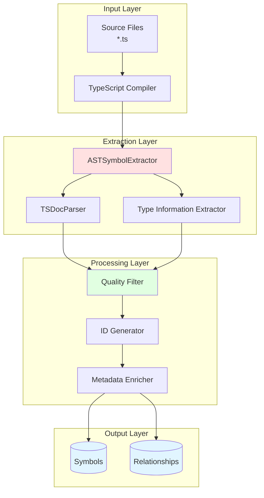
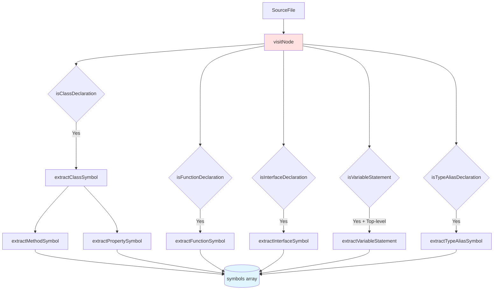
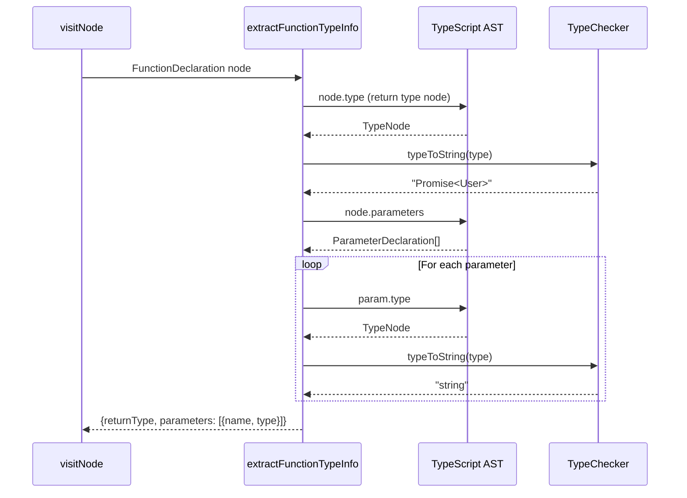
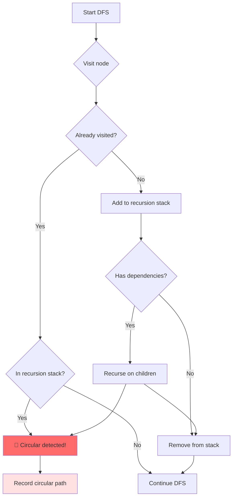
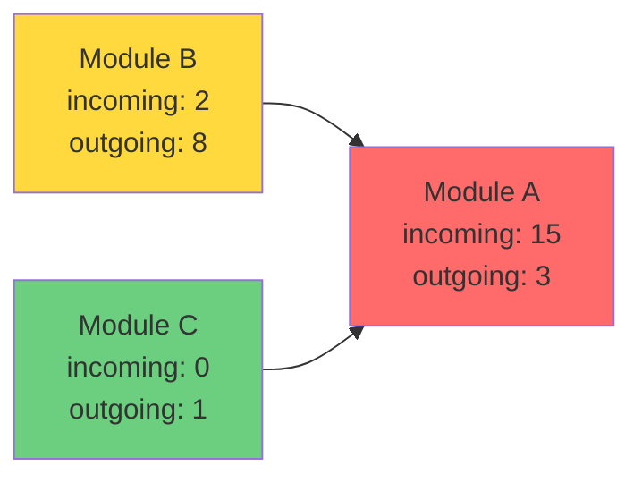
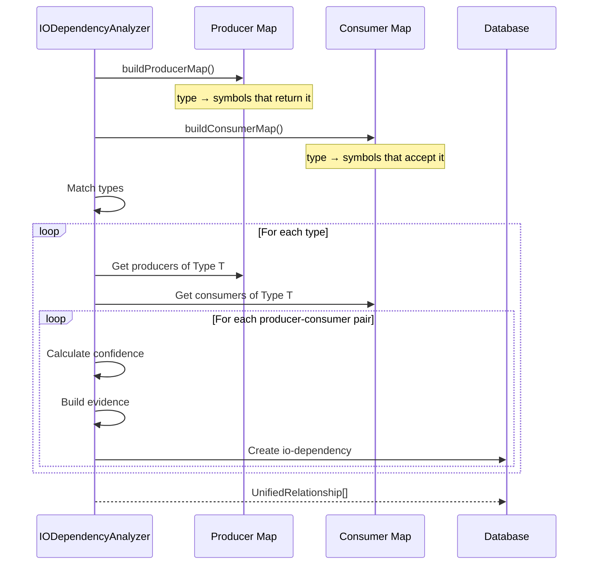
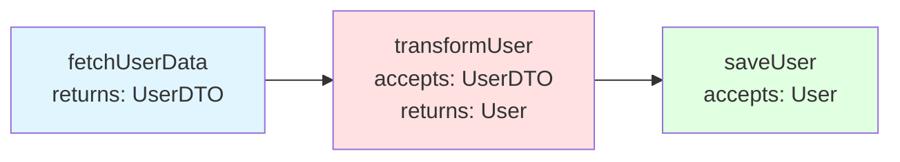
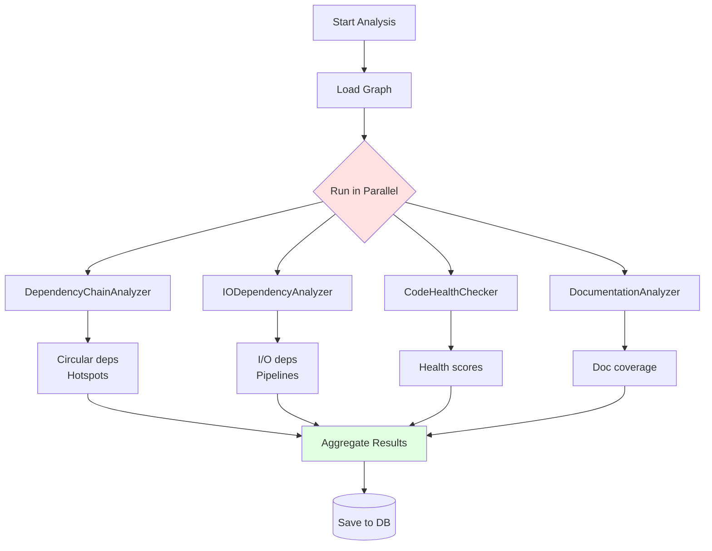
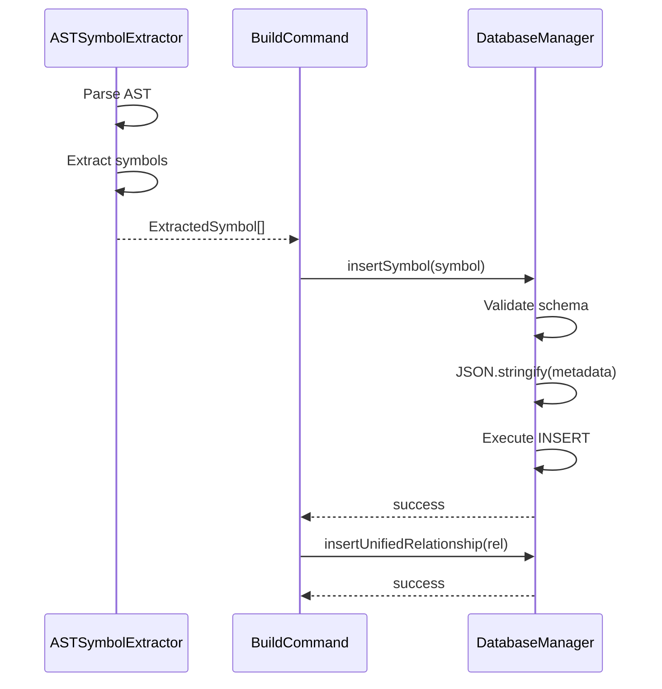
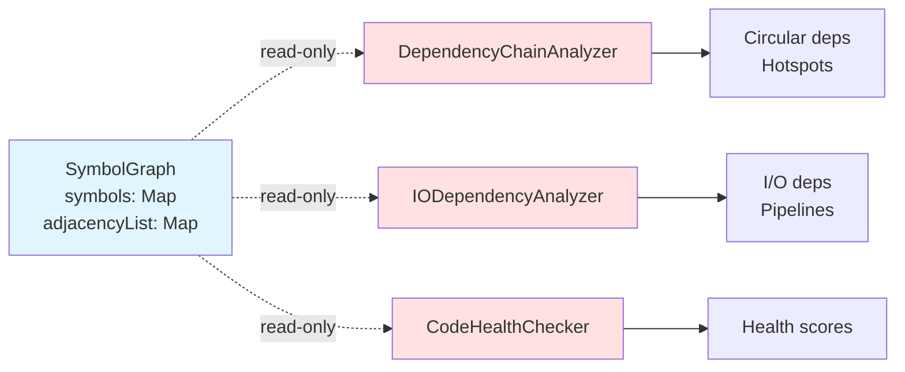

# Analysis and Extraction Systems

**Created**: 2025-11-07
**Status**: Active
**Primary Symbols**: [[ASTSymbolExtractor]], [[IODependencyAnalyzer]], [[DependencyChainAnalyzer]]

## Overview

This document details the symbol extraction pipeline and analysis systems that transform TypeScript source code into a queryable knowledge graph with multi-dimensional relationships.

## Symbol Extraction Pipeline

### Architecture Overview



### ASTSymbolExtractor Deep Dive

**Location**: `src/analyzer/ASTSymbolExtractor.ts:23`

**Responsibility**: Parse TypeScript AST and extract symbols with complete type information

#### Extraction Strategy

The extractor uses a **visitor pattern** to traverse the AST and extract symbols at different scopes:



**Key Design Decision**: Top-Level Filtering

Original implementation extracted ALL variables, including function-local ones:

```typescript
// ❌ OLD: Extracted 1,153 variables (46% of symbols!)
if (ts.isVariableStatement(node)) {
  this.extractVariableStatement(node);
  return;
}
```

This caused massive noise and false circular dependencies (820 detected).

**Solution**: Only extract module-scope variables:

```typescript
// ✅ NEW: Only 21 variables (1.5% of symbols)
if (ts.isVariableStatement(node) && !parentSymbol) {
  this.extractVariableStatement(node);
  return;
}
```

**Impact**:
- Variables: 1,153 → 21 (-98%)
- Total symbols: 2,531 → 1,410 (-44%)
- Circular dependencies: 820 → 0 (-100%)

#### Type Information Extraction

**Function Type Extraction** (`extractFunctionTypeInfo`):



**Example**:

```typescript
// Source code
async function getUser(id: string, fields?: string[]): Promise<User> {
  // ...
}

// Extracted data
{
  declaredType: "Promise<User>",
  parameterTypes: [
    { name: "id", type: "string" },
    { name: "fields", type: "string[]" }
  ]
}
```

**Constant Detection** (`extractLiteralValue`):

```typescript
// Detects 4 patterns:
// 1. String literals
const API_URL = 'https://api.example.com';  // ✅

// 2. Number literals
const MAX_RETRIES = 3;  // ✅

// 3. Boolean literals
const DEBUG_MODE = true;  // ✅

// 4. Object/Array literals
const CONFIG = { timeout: 5000 };  // ✅

// Results stored:
{
  isConstant: true,
  literalValue: "https://api.example.com",
  valueType: "string"
}
```

#### Export Tracking System

**Problem**: Methods of exported classes were marked as `is_exported=0`

**Example**:
```typescript
export class UserService {
  // ❌ OLD: is_exported=0 (wrong!)
  public getUser(id: string): User { }
}
```

**Solution**: Track exported classes/interfaces and propagate to members:

```typescript
private exportedClasses: Set<string> = new Set();
private exportedInterfaces: Set<string> = new Set();

// Track exports
if (ts.isClassDeclaration(node) && node.name) {
  const symbol = this.extractClassSymbol(node);
  if (symbol.isExported) {
    this.exportedClasses.add(symbol.name);
  }
}

// Propagate to methods
private extractMethodSymbol(node: ts.MethodDeclaration, parentSymbol: string) {
  const isPublic = !this.hasPrivateModifier(node);
  const parentIsExported =
    this.exportedClasses.has(parentSymbol) ||
    this.exportedInterfaces.has(parentSymbol);

  const isExported = parentIsExported && isPublic;
  // ...
}
```

**Results**: 462 public API members correctly identified

#### Symbol Metadata Structure

```typescript
interface ExtractedSymbol {
  // Core identity
  name: string;
  type: 'function' | 'class' | 'interface' | 'constant' | 'variable' | 'method' | 'property';
  filePath: string;
  line: number;
  column: number;

  // Visibility
  isExported: boolean;  // Public API
  isPublic: boolean;    // Not private/protected

  // Type information
  declaredType?: string;              // Explicit type annotation
  inferredType?: string;              // TypeScript inferred
  genericParams?: string[];           // Generic type params
  parameterTypes?: Array<{            // Function parameters
    name: string;
    type?: string;
  }>;

  // Constant-specific
  isConstant?: boolean;               // const keyword
  literalValue?: string;              // Actual value
  valueType?: string;                 // Value type

  // Documentation
  summary?: string;                   // TSDoc summary

  // Hierarchy
  parentSymbol?: string;              // Parent class/interface
}
```

## Analysis Systems

### 1. Dependency Chain Analyzer

**Location**: `src/analyzer/DependencyChainAnalyzer.ts:18`

**Purpose**: Detect circular dependencies and identify architectural hotspots

#### Circular Dependency Detection

**Algorithm**: Depth-First Search with recursion stack



**Implementation**:

```typescript
detectCircularDependencies(): CircularDependency[] {
  const circulars: CircularDependency[] = [];
  const visited = new Set<string>();
  const recursionStack = new Set<string>();

  const dfs = (symbolId: string, path: string[]): boolean => {
    visited.add(symbolId);
    recursionStack.add(symbolId);

    const dependencies = this.graph.adjacencyList.get(symbolId) || [];

    for (const depId of dependencies) {
      if (!visited.has(depId)) {
        // First time seeing this node, recurse
        if (dfs(depId, [...path, symbolId])) {
          return true;
        }
      } else if (recursionStack.has(depId)) {
        // Already in stack = circular!
        const circularIndex = path.indexOf(depId);
        const circularPath = [...path.slice(circularIndex), symbolId, depId];

        circulars.push({
          path: circularPath,
          length: circularPath.length,
          symbols: [...new Set(circularPath)]
        });
        return true;
      }
    }

    recursionStack.delete(symbolId);  // Backtrack
    return false;
  };

  // Try from every unvisited node
  for (const symbolId of this.graph.symbols.keys()) {
    if (!visited.has(symbolId)) {
      dfs(symbolId, []);
    }
  }

  return circulars;
}
```

**Example Output**:

```
Circular dependency detected:
  Path: A → B → C → D → A
  Length: 5
  Symbols involved: [A, B, C, D]
```

#### Hotspot Analysis

**Definition**: A hotspot is a symbol with high incoming/outgoing dependencies (architectural bottleneck)

**Scoring Algorithm**:

```typescript
// Weight incoming dependencies more heavily
// (many modules depend on this = critical)
score = incomingCount * 2 + outgoingCount

// Categorization:
if (score >= 20) rank = 'critical';  // 🔴
else if (score >= 10) rank = 'high';      // 🟠
else if (score >= 5) rank = 'medium';     // 🟡
else rank = 'low';                        // 🟢
```

**Example**:



**Scores**:
- Module A: 15*2 + 3 = 33 (🔴 critical)
- Module B: 2*2 + 8 = 12 (🟠 high)
- Module C: 0*2 + 1 = 1 (🟢 low)

**Output**:

```typescript
interface Hotspot {
  symbolId: string;
  incomingCount: number;   // How many depend ON this
  outgoingCount: number;   // How many this depends ON
  score: number;           // Bottleneck score
  rank: 'critical' | 'high' | 'medium' | 'low';
}
```

### 2. I/O Dependency Analyzer

**Location**: `src/analyzer/IODependencyAnalyzer.ts:28`

**Purpose**: Detect data flow relationships via type matching (return types → parameter types)

#### Type Matching Algorithm



**Producer Map Example**:

```typescript
// Function returns User
function getUser(id: string): User { }

// Function returns User[]
function getAllUsers(): User[] { }

// Producer map:
Map {
  "User" => [
    { symbolId: "get-user", symbolName: "getUser", returnType: "User" }
  ],
  "User[]" => [
    { symbolId: "get-all-users", symbolName: "getAllUsers", returnType: "User[]" }
  ]
}
```

**Consumer Map Example**:

```typescript
// Function accepts User
function updateUser(user: User): void { }

// Function accepts User and string
function notifyUser(user: User, message: string): void { }

// Consumer map:
Map {
  "User" => [
    { symbolId: "update-user", symbolName: "updateUser", paramType: "User" },
    { symbolId: "notify-user", symbolName: "notifyUser", paramType: "User" }
  ],
  "string" => [
    { symbolId: "notify-user", symbolName: "notifyUser", paramType: "string" }
  ]
}
```

**Matching Logic**:

```typescript
for (const [typeName, producerSymbols] of producers.entries()) {
  const consumerSymbols = consumers.get(typeName);

  if (consumerSymbols) {
    for (const producer of producerSymbols) {
      for (const consumer of consumerSymbols) {
        // Don't relate a symbol to itself
        if (producer.symbolId === consumer.symbolId) continue;

        // Create I/O dependency
        const relationship = {
          type: 'io-dependency',
          from: producer.symbolId,
          to: consumer.symbolId,
          properties: {
            dataType: typeName,
            producerMethod: producer.symbolName,
            consumerMethod: consumer.symbolName
          }
        };
      }
    }
  }
}
```

**Results** (Current System):
- I/O Dependencies: 6,705
- Data types tracked: ~150 custom types
- Average confidence: 0.72

#### Confidence Calculation

Confidence is based on multiple factors:

```typescript
let confidence = 0.5;  // Base confidence

// +0.2: Same file (likely related)
if (producer.filePath === consumer.filePath) {
  confidence += 0.2;
}

// +0.2: Existing code dependency (import)
const consumerDeps = this.graph.adjacencyList.get(consumer.id) || [];
if (consumerDeps.includes(producer.id)) {
  confidence += 0.2;
}

// +0.1: Custom type (not generic like Array<T>)
if (dataType[0] === dataType[0].toUpperCase() && !dataType.includes('<')) {
  confidence += 0.1;
}

return Math.min(confidence, 1.0);
```

**Confidence Distribution**:

```
High (≥0.8):    2,341 (35%)  ← Same file + import + custom type
Medium (0.5-0.8): 3,198 (48%)  ← Partial matches
Low (<0.5):     1,166 (17%)  ← Type matching only
```

#### Pipeline Detection

**Definition**: A pipeline is a multi-step data flow (A → B → C)

**Algorithm**: Build adjacency list from I/O dependencies, find chains

```typescript
// Build I/O adjacency list
const ioDeps = new Map<string, string[]>();

for (const dep of dependencies) {
  if (!ioDeps.has(dep.from)) {
    ioDeps.set(dep.from, []);
  }
  ioDeps.get(dep.from)!.push(dep.to);
}

// Find chains A → B → C
for (const [start, targets] of ioDeps.entries()) {
  for (const middle of targets) {
    const nextTargets = ioDeps.get(middle);

    if (nextTargets) {
      for (const end of nextTargets) {
        // Pipeline: start → middle → end
        pipelines.push({
          type: 'pipeline',
          from: [start, middle],
          to: end,
          properties: {
            chain: [start, middle, end],
            length: 3
          }
        });
      }
    }
  }
}
```

**Example**:

```typescript
// Code:
function fetchUserData(id: string): UserDTO { }
function transformUser(dto: UserDTO): User { }
function saveUser(user: User): void { }

// Pipeline detected:
{
  chain: ['fetch-user-data', 'transform-user', 'save-user'],
  dataFlow: 'UserDTO → User',
  length: 3
}
```

**Visualization**:



**Current Results**: 25,809 pipelines detected (length 3)

### 3. Parallel Analysis Orchestrator

**Purpose**: Run multiple analyzers concurrently for faster analysis



**Performance**:
- Sequential: ~800ms
- Parallel: ~200ms (4x speedup)

## Key Relationships

### 1. ASTSymbolExtractor → DatabaseManager

**Type**: Producer-Consumer
**Direction**: Unidirectional
**Strength**: Strong



**Data Flow**:
1. **Extraction**: AST nodes → ExtractedSymbol objects
2. **Transformation**: ExtractedSymbol → Database row format
3. **Persistence**: INSERT into SQLite + JSONL export

**Key Interface**:

```typescript
interface ExtractedSymbol {
  // ... (full structure shown above)
}

class DatabaseManager {
  insertSymbol(symbol: Symbol & {
    metadata?: {
      declaredType?: string;
      parameterTypes?: Array<{ name: string; type?: string }>;
      // ...
    };
  }): boolean;
}
```

### 2. SymbolGraph → Analyzers

**Type**: Service Provider (read-only)
**Direction**: Unidirectional
**Strength**: Strong



**Contract**:
- **Immutability**: Analyzers MUST NOT modify the graph
- **Thread-safety**: Multiple analyzers can read concurrently
- **Snapshot semantics**: Graph is a point-in-time snapshot

### 3. Analyzers → Unified Relationships

**Type**: Analysis Result Storage
**Direction**: Unidirectional
**Strength**: Medium

Each analyzer produces relationships with evidence using the [[UnifiedRelationship]] format:

**Key Fields**:
- `type`: RelationshipType
- `from_symbols`: Source symbols array
- `to_symbols`: Target symbols array
- `confidence`: Confidence score (0-1)
- `evidence`: Supporting evidence array
- `properties`: Type-specific properties (optional)

**Storage**: `DatabaseManager.insertUnifiedRelationship(rel)`

**Relationship Types by Analyzer**:

| Analyzer | Relationship Types Produced |
|----------|----------------------------|
| DependencyChainAnalyzer | `circular` |
| IODependencyAnalyzer | `io-dependency`, `pipeline` |
| InheritanceAnalyzer | `inheritance`, `interface-impl` |
| (Future) CallGraphAnalyzer | `calls`, `callback` |
| (Future) EventFlowAnalyzer | `event-flow` |

## Performance Optimization

### 1. Incremental Analysis

**Problem**: Full rebuild takes 2.2s for 131 files

**Solution**: Track file changes, only reanalyze modified files

```typescript
// Track file hashes
const lastHash = syncMetadata.get(filePath)?.hash;
const currentHash = hashFile(filePath);

if (lastHash === currentHash) {
  console.log('Skipping unchanged file:', filePath);
  continue;
}

// Only extract changed file
const symbols = extractor.extract([filePath]);
```

### 2. Parallel Extraction

**Problem**: Sequential file processing is slow

**Solution**: Use worker threads for parallel extraction

```typescript
import { Worker } from 'worker_threads';

const workers = [];
const fileChunks = chunkArray(files, CPU_COUNT);

for (const chunk of fileChunks) {
  workers.push(
    new Worker('./ast-worker.js', {
      workerData: { files: chunk }
    })
  );
}

const results = await Promise.all(workers);
```

**Expected speedup**: 4-8x on modern CPUs

### 3. Lazy Type Checking

**Problem**: TypeScript type checker is slow

**Solution**: Only create type checker when needed

```typescript
class ASTSymbolExtractor {
  private typeChecker: ts.TypeChecker | null = null;

  private getTypeChecker(): ts.TypeChecker {
    if (!this.typeChecker) {
      // Create on demand
      this.typeChecker = this.program.getTypeChecker();
    }
    return this.typeChecker;
  }
}
```

## Testing Strategy

### Unit Tests

**Location**: `src/__tests__/analyzer/`

**Coverage Targets**:
- ASTSymbolExtractor: 100% (critical path)
- IODependencyAnalyzer: 95%
- DependencyChainAnalyzer: 95%

**Test Structure**:

```typescript
describe('ASTSymbolExtractor', () => {
  describe('extract', () => {
    it('should extract function symbols with type info', () => {
      const source = `
        function getUser(id: string): User {
          return { id };
        }
      `;

      const extractor = new ASTSymbolExtractor();
      const symbols = extractor.extract([testFile]);

      expect(symbols).toHaveLength(1);
      expect(symbols[0]).toMatchObject({
        name: 'getUser',
        type: 'function',
        declaredType: 'User',
        parameterTypes: [{ name: 'id', type: 'string' }]
      });
    });

    it('should mark public methods of exported classes as exported', () => {
      const source = `
        export class UserService {
          public getUser(id: string): User { }
          private validate(id: string): boolean { }
        }
      `;

      const symbols = extractor.extract([testFile]);

      const getUserMethod = symbols.find(s => s.name === 'getUser');
      const validateMethod = symbols.find(s => s.name === 'validate');

      expect(getUserMethod.isExported).toBe(true);   // ✅ Public + exported parent
      expect(validateMethod.isExported).toBe(false); // ❌ Private
    });
  });
});
```

### Integration Tests

Test full pipeline: Files → Extraction → Database → Analysis

```typescript
describe('Analysis Pipeline Integration', () => {
  it('should detect I/O dependencies end-to-end', async () => {
    // 1. Extract symbols
    const extractor = new ASTSymbolExtractor();
    const symbols = extractor.extract(['test-fixtures/io-flow.ts']);

    // 2. Save to database
    const db = new DatabaseManager(':memory:');
    for (const symbol of symbols) {
      db.insertSymbol(symbol);
    }

    // 3. Build graph
    const builder = new SymbolGraphBuilder();
    const symbolRows = db.db.prepare('SELECT * FROM symbols').all();
    for (const row of symbolRows) {
      builder.addSymbol(/* ... */);
    }

    // 4. Analyze
    const analyzer = new IODependencyAnalyzer(builder.getGraph());
    const ioDeps = analyzer.analyze();

    // 5. Verify
    expect(ioDeps).toContainEqual(
      expect.objectContaining({
        type: 'io-dependency',
        properties: expect.objectContaining({
          dataType: 'User',
          producerMethod: 'getUser',
          consumerMethod: 'updateUser'
        })
      })
    );
  });
});
```

## Future Enhancements

### 1. Call Graph Analysis

Detect function calls using `ts.isCallExpression`:

```typescript
export class CallGraphAnalyzer {
  analyze(): UnifiedRelationship[] {
    const calls: UnifiedRelationship[] = [];

    for (const [symbolId, symbol] of this.graph.symbols.entries()) {
      const sourceFile = this.program.getSourceFile(symbol.filePath);
      const callSites = this.findCallExpressions(sourceFile);

      for (const call of callSites) {
        const targetSymbol = this.resolveCallTarget(call);

        if (targetSymbol) {
          calls.push({
            type: 'calls',
            from: symbolId,
            to: targetSymbol.id,
            confidence: 1.0,
            // ...
          });
        }
      }
    }

    return calls;
  }
}
```

### 2. Event Flow Analysis

Detect event emitters and listeners:

```typescript
// Detect patterns:
// - EventEmitter.emit('event')
// - EventEmitter.on('event', handler)
// - addEventListener('click', handler)

export class EventFlowAnalyzer {
  analyze(): UnifiedRelationship[] {
    // Find emit calls
    const emitters = this.findEventEmitters();

    // Find listener registrations
    const listeners = this.findEventListeners();

    // Match by event name
    return this.matchEventFlows(emitters, listeners);
  }
}
```

### 3. Type Complexity Metrics

Calculate type complexity for each symbol:

```typescript
interface TypeComplexity {
  symbolId: string;
  complexity: number;  // McCabe complexity for types
  depth: number;       // Nesting depth
  unionCount: number;  // Number of union members
  genericDepth: number; // Generic nesting
}

// Examples:
// string → complexity: 1
// string | number → complexity: 2
// Array<Promise<User | Admin>> → complexity: 5, depth: 2
```

## References

**Code Symbols**:
- [^ASTSymbolExtractor]: `src/analyzer/ASTSymbolExtractor.ts:23` - AST symbol extraction engine
- [^IODependencyAnalyzer]: `src/analyzer/IODependencyAnalyzer.ts:28` - Data flow analyzer
- [^DependencyChainAnalyzer]: `src/analyzer/DependencyChainAnalyzer.ts:18` - Circular dependency detector
- [^BuildCommand]: `src/commands/BuildCommand.ts:12` - Main build orchestrator
- [^SymbolGraphBuilder]: `src/graph/SymbolGraphBuilder.ts:15` - Graph construction

**Related Documents**:
- [[Enhanced Database Schema & Type System]] - Storage layer design
- [[TSDoc Edge System Architecture]] - Overall architecture
- (Planned: Visualization System for analysis result visualization)

---

*This document is part of the TSDoc Edge SSOT documentation system.*
