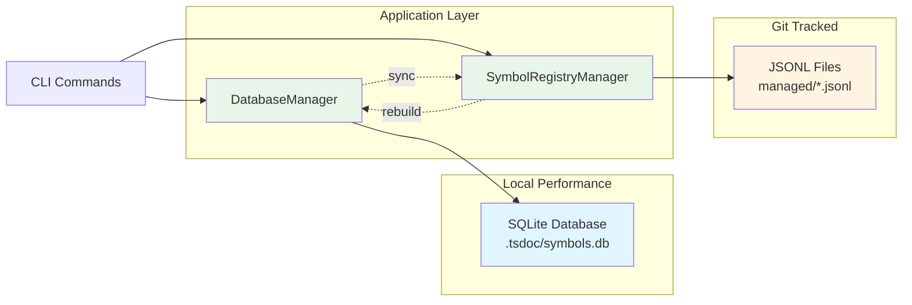
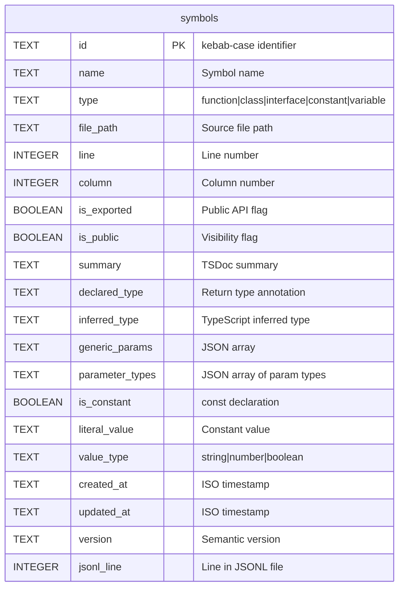
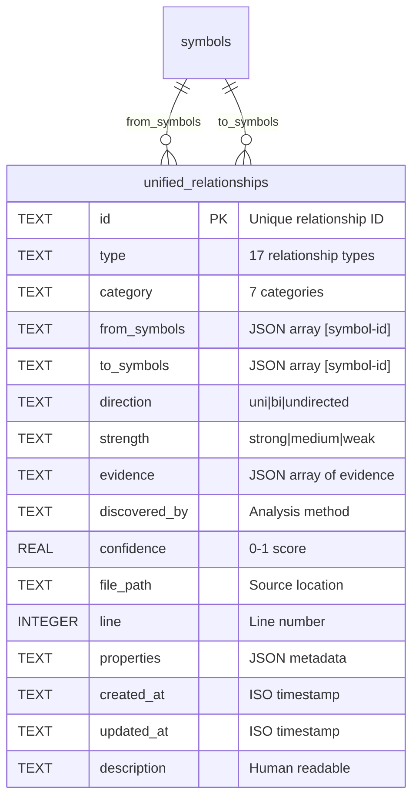
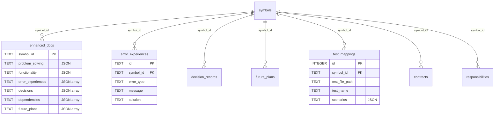
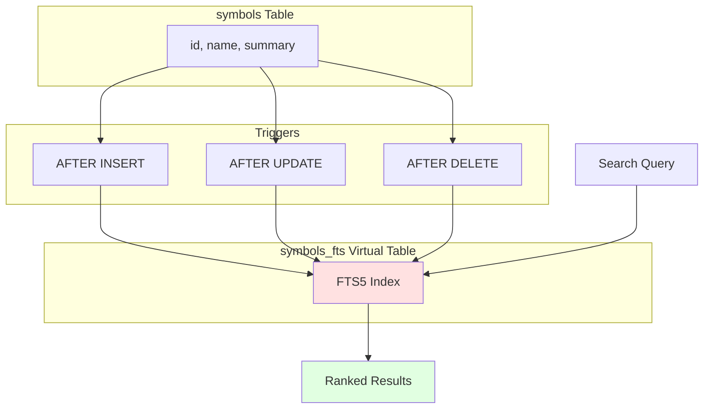
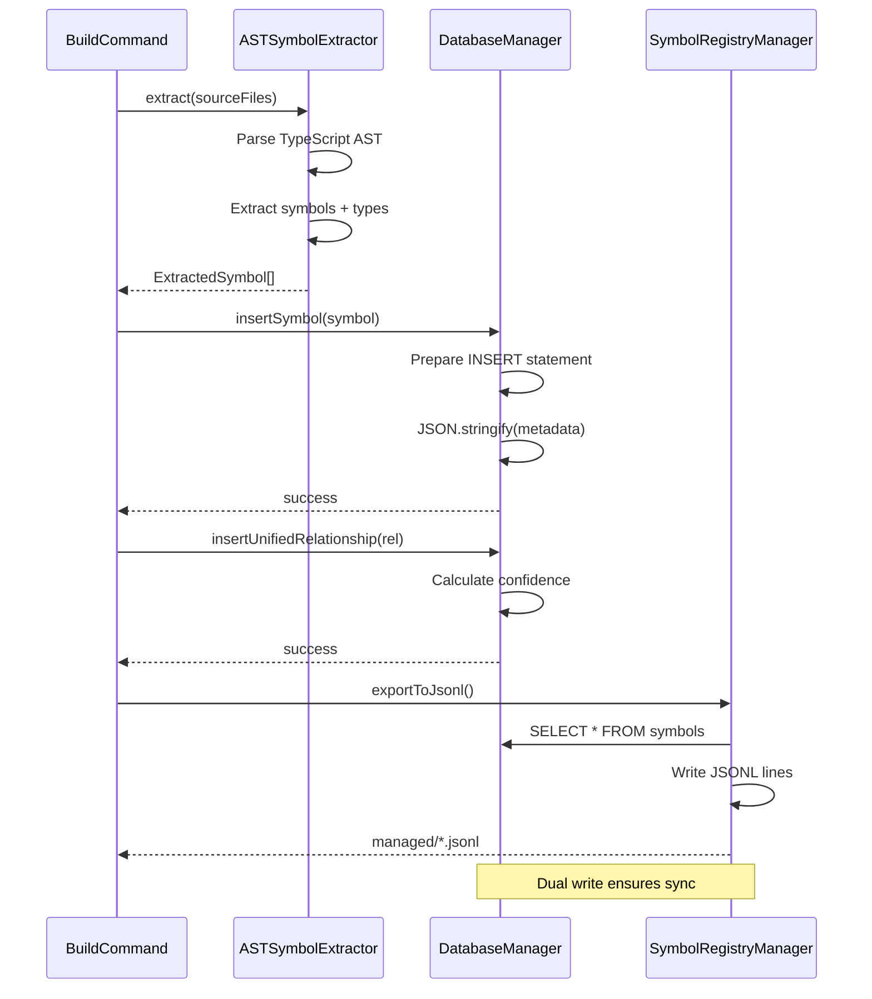
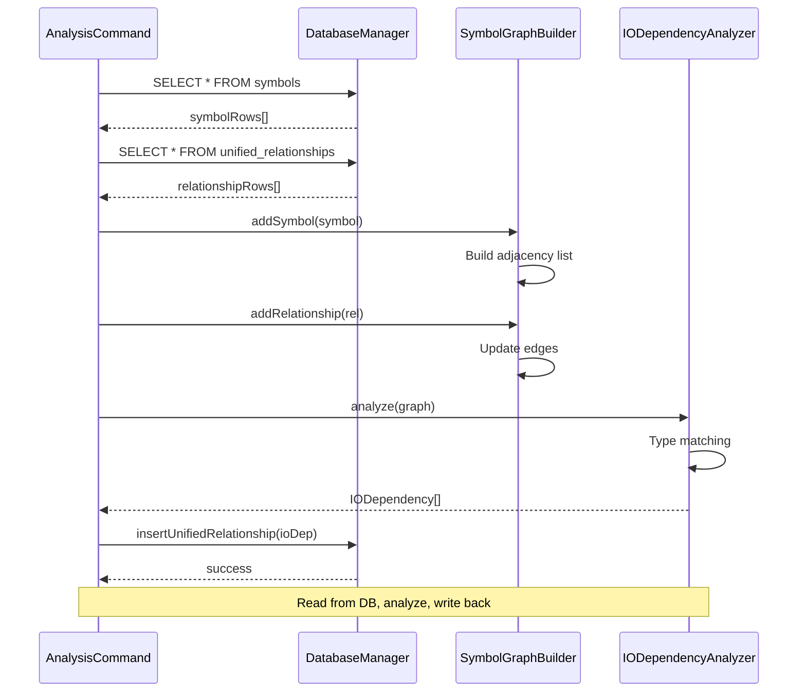
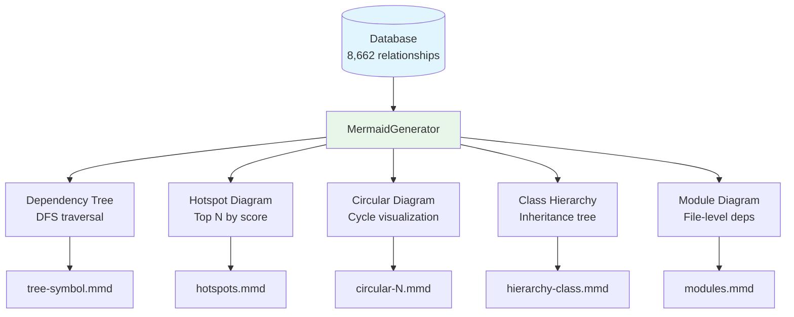

# Database Schema and Relationship System

**Created**: 2025-11-07
**Status**: Active
**Primary Symbol**: [[DatabaseManager]], [[UnifiedRelationships]]

## Overview

This document provides a comprehensive view of TSDoc Edge's database schema and the unified relationship system that enables multi-dimensional code analysis.

## Database Architecture

### Hybrid Storage Model



**Design Rationale**:
- **SQLite**: Fast queries, FTS (Full-Text Search), complex joins
- **JSONL**: Git-friendly, diff-able, human-readable, version controllable
- **Sync Strategy**: Write to both, SQLite as cache, JSONL as source of truth

## Core Schema Tables

### 1. symbols Table

The central table storing all code symbols with comprehensive metadata.



**Type Information Fields**:
- `declared_type`: Explicit type annotations (e.g., `function foo(): User`)
- `inferred_type`: TypeScript compiler's inferred type
- `generic_params`: Array of generic type parameters (e.g., `["T", "K extends keyof T"]`)
- `parameter_types`: Array of `{name, type}` objects for function parameters

**Constant Detection**:
- `is_constant`: Boolean flag (const keyword)
- `literal_value`: Actual value for constants (e.g., `"production"`, `42`)
- `value_type`: Type of literal (string, number, boolean, object, array)

**Example Data**:
```json
{
  "id": "database-manager",
  "name": "DatabaseManager",
  "type": "class",
  "file_path": "src/storage/DatabaseManager.ts",
  "line": 15,
  "column": 14,
  "is_exported": 1,
  "is_public": 1,
  "declared_type": null,
  "parameter_types": null,
  "is_constant": 0
}
```

### 2. unified_relationships Table

The 17-type relationship system enabling multi-dimensional analysis.



**17 Relationship Types** (7 Categories):

| Category | Type | Description | Example |
|----------|------|-------------|---------|
| **Structural** | code-dependency | Direct code import/usage | `import { foo } from './bar'` |
| | inheritance | Class extends class | `class Child extends Parent` |
| | interface-impl | Class implements interface | `class User implements IUser` |
| **Data Flow** | io-dependency | Return type → Parameter type | `getUser(): User` → `updateUser(user: User)` |
| | pipeline | Multi-step data flow | A → B → C |
| | event-flow | Event emission/handling | `emit('data')` → `on('data')` |
| **Behavioral** | calls | Function invocation | `foo()` calls `bar()` |
| | callback | Callback registration | `asyncOp(callback)` |
| | composition | Object composition | `class uses instance of` |
| **Type System** | type-dependency | Type reference | `type Foo = Bar \| Baz` |
| | generic-constraint | Generic bounds | `<T extends Foo>` |
| **Architectural** | layer-dependency | Architectural layer crossing | Controller → Service → Repository |
| | module-boundary | Module import | Package A imports Package B |
| **Testing** | test-coverage | Test → Implementation | `foo.test.ts` covers `foo.ts` |
| **Documentation** | doc-reference | Documentation link | `@see [[Symbol]]` |
| | enhancement | Enhanced doc annotation | `@problem`, `@functionality` |
| **Other** | circular | Circular dependency | A → B → C → A |

**Evidence-Based Confidence**:

Each relationship includes evidence array with confidence scoring:

```typescript
interface Evidence {
  type: 'code' | 'type-signature' | 'test' | 'documentation';
  source: string;           // File path
  lineNumber?: number;      // Line number
  snippet?: string;         // Code excerpt
  confidence: number;       // 0-1
  context?: string;         // Additional context
}
```

**Confidence Calculation** (IODependencyAnalyzer example):
- Base: 0.5
- Same file: +0.2
- Existing code dependency: +0.2
- Custom type (not generic): +0.1
- Max: 1.0

**Strength Categorization**:
- `strong`: confidence ≥ 0.8, direct evidence
- `medium`: 0.5 ≤ confidence < 0.8, indirect evidence
- `weak`: confidence < 0.5, inferred

### 3. Supporting Tables



## Full-Text Search System

### FTS5 Configuration



**Search Capabilities**:
- Full-text search on symbol name and summary
- Phrase matching with quotes: `"error handler"`
- Boolean operators: `auth AND user NOT test`
- Prefix matching: `handle*`
- Ranking by relevance (BM25 algorithm)

**Query Example**:
```sql
SELECT symbols.*, rank
FROM symbols_fts
JOIN symbols ON symbols.rowid = symbols_fts.rowid
WHERE symbols_fts MATCH 'database AND manager'
ORDER BY rank;
```

## Indexes and Performance

### B-Tree Indexes

```sql
-- Symbol lookups
CREATE INDEX idx_symbols_name ON symbols(name);
CREATE INDEX idx_symbols_type ON symbols(type);
CREATE INDEX idx_symbols_file ON symbols(file_path);
CREATE INDEX idx_symbols_public ON symbols(is_public);

-- Relationship lookups
CREATE INDEX idx_ur_type ON unified_relationships(type);
CREATE INDEX idx_ur_category ON unified_relationships(category);
CREATE INDEX idx_ur_strength ON unified_relationships(strength);
CREATE INDEX idx_ur_confidence ON unified_relationships(confidence);

-- JSON extraction indexes (SQLite 3.38+)
CREATE INDEX idx_ur_from_first ON unified_relationships(json_extract(from_symbols, '$[0]'));
CREATE INDEX idx_ur_to_first ON unified_relationships(json_extract(to_symbols, '$[0]'));
```

**Performance Metrics** (1,438 symbols, 8,662 relationships):
- Symbol lookup by name: <1ms
- Relationship query by type: <5ms
- Full-text search: <10ms
- Complex join (3 tables): <50ms
- Full rebuild: ~2.2s

## Data Flow Diagrams

### Build Flow (Write Path)



### Query Flow (Read Path)



## Key Design Decisions

### 1. JSON Columns for Complex Data

**Decision**: Store arrays/objects as JSON TEXT instead of normalized tables

**Rationale**:
- **Flexibility**: Schema changes don't require migrations
- **Atomicity**: Related data stays together
- **Query Power**: SQLite's json_extract() enables querying
- **Storage**: Compressed JSON is space-efficient

**Trade-offs**:
- ❌ Harder to query nested fields (requires json_extract)
- ❌ No foreign key constraints on array elements
- ✅ Simpler schema, fewer joins
- ✅ Easy to add new fields to JSON objects

**Example**:
```sql
-- Query symbols with specific parameter type
SELECT * FROM symbols
WHERE json_extract(parameter_types, '$[0].type') = 'User';

-- Query relationships with high confidence
SELECT * FROM unified_relationships
WHERE confidence > 0.8
  AND json_extract(evidence, '$[0].type') = 'code';
```

### 2. Multi-Party Relationships

**Decision**: Use JSON arrays for from_symbols and to_symbols

**Rationale**:
- **Pipeline Support**: A → B → C stored as from:[A,B], to:C
- **N-to-M Relationships**: One relationship record for many-to-many
- **Circular Detection**: from:[A,B,C], to:A represents A→B→C→A

**Schema**:
```typescript
interface UnifiedRelationship {
  from_symbols: string[];  // JSON: ["symbol-id-1", "symbol-id-2"]
  to_symbols: string[];    // JSON: ["symbol-id-3"]
}
```

**Query Patterns**:
```sql
-- Find all relationships FROM a symbol
SELECT * FROM unified_relationships
WHERE json_extract(from_symbols, '$[0]') = 'my-symbol-id';

-- Find all relationships TO a symbol
SELECT * FROM unified_relationships
WHERE json_extract(to_symbols, '$[0]') = 'my-symbol-id';

-- Find pipelines (multi-step chains)
SELECT * FROM unified_relationships
WHERE type = 'pipeline'
  AND json_array_length(from_symbols) > 1;
```

### 3. Confidence-Based Filtering

**Decision**: Store confidence scores (0-1) with evidence arrays

**Rationale**:
- **Quality Control**: Filter low-confidence relationships
- **Transparency**: Evidence shows WHY relationship exists
- **Tuning**: Adjust thresholds without reanalysis

**Confidence Levels**:
- **1.0**: Direct code evidence (imports, calls)
- **0.8-0.9**: Type signature matching + same file
- **0.5-0.7**: Type matching only
- **<0.5**: Inferred relationships (weak)

**Usage**:
```sql
-- High-confidence relationships only
SELECT * FROM unified_relationships
WHERE confidence >= 0.8;

-- Show evidence for manual review
SELECT
  id,
  type,
  confidence,
  json_extract(evidence, '$[0].type') as evidence_type,
  json_extract(evidence, '$[0].snippet') as code_snippet
FROM unified_relationships
WHERE confidence < 0.5
ORDER BY confidence DESC;
```

## Extension Points

### Adding New Relationship Types

1. **Define Type**: Add to `RelationshipType` union in `src/types/relationships.ts`
2. **Create Analyzer**: Implement analyzer in `src/analyzer/`
3. **Extract Evidence**: Populate evidence array with confidence
4. **Insert**: Use `DatabaseManager.insertUnifiedRelationship()`

**Example**: Adding "mocking" relationship (test mocks implementation)

```typescript
// 1. Add type
export type RelationshipType =
  | 'code-dependency'
  | 'io-dependency'
  | 'mocking'  // NEW
  | ...;

// 2. Create analyzer
export class MockingAnalyzer {
  analyze(): UnifiedRelationship[] {
    const relationships: UnifiedRelationship[] = [];

    // Find jest.mock() calls
    for (const testFile of this.testFiles) {
      const mocks = this.findMockCalls(testFile);

      for (const mock of mocks) {
        relationships.push({
          id: `mocking-${testFile.id}-${mock.targetId}`,
          type: 'mocking',
          category: 'testing',
          from_symbols: [testFile.id],
          to_symbols: [mock.targetId],
          direction: 'unidirectional',
          strength: 'strong',
          evidence: [{
            type: 'code',
            source: testFile.path,
            lineNumber: mock.line,
            snippet: `jest.mock('${mock.path}')`,
            confidence: 1.0
          }],
          discoveredBy: 'test-analysis',
          confidence: 1.0,
          // ...
        });
      }
    }

    return relationships;
  }
}

// 3. Add CLI command
export class AnalyzeMocksCommand extends BaseCommand {
  async execute() {
    const analyzer = new MockingAnalyzer(graph);
    const relationships = analyzer.analyze();

    for (const rel of relationships) {
      dbManager.insertUnifiedRelationship(rel);
    }
  }
}
```

### Custom Metadata Fields

Add new JSON fields to `properties` column without schema changes:

```typescript
// IODependencyAnalyzer
properties: {
  dataType: 'User',
  producerMethod: 'getUser',
  consumerMethod: 'updateUser',
  // Add custom fields
  flowDirection: 'read-write',
  dataLifecycle: 'ephemeral'
}

// Query custom fields
SELECT * FROM unified_relationships
WHERE type = 'io-dependency'
  AND json_extract(properties, '$.flowDirection') = 'read-write';
```

## Current System Metrics

**Database Statistics** (as of 2025-11-07):

```
Symbols:               1,438
├─ Functions:            681
├─ Classes:              112
├─ Interfaces:            87
├─ Constants:             10
├─ Variables:             21
└─ Methods:              527

Relationships:         8,662
├─ Code Dependencies:  1,902 (22%)
├─ Inheritance:           55 (0.6%)
├─ I/O Dependencies:   6,705 (77%)
└─ Pipelines:             0 (stored separately)

Circular Dependencies:    0
Hotspots (score ≥ 20):   12

Database Size:        2.4 MB
JSONL Size:           1.8 MB
FTS Index Size:       0.3 MB
```

**Query Performance** (Intel i7, SSD):
- Simple SELECT: <1ms
- JOIN (2 tables): <5ms
- FTS search: <10ms
- Complex aggregation: <50ms
- Full table scan: <100ms

## Diagram Generation

The relationship data enables automated visualization:



**Generated Diagrams**:
- Dependency trees (maxDepth=3)
- Hotspot analysis (top 10 by bottleneck score)
- Circular dependency visualization
- Class inheritance hierarchies
- Module-level dependency maps

**Output Location**: `.tsdoc/diagrams/*.mmd` (Mermaid format)

## References

**Code Symbols**:
- [^DatabaseManager]: `src/storage/DatabaseManager.ts:15` - Main database operations class
- [^SymbolRegistryManager]: `src/storage/SymbolRegistryManager.ts:12` - JSONL export manager
- [^IODependencyAnalyzer]: `src/analyzer/IODependencyAnalyzer.ts:28` - Data flow analyzer
- [^MermaidGenerator]: `src/visualization/MermaidGenerator.ts:18` - Diagram generator
- [^UnifiedRelationship]: `src/types/relationships.ts:45` - Relationship type definition

**Related Documents**:
- [[TSDoc Edge System Architecture]] - Overall system design
- [[Analyzers & Extractors]] - Analyzer implementations
- (Planned: Visualization System for diagram generation)

---

*This document is part of the TSDoc Edge SSOT documentation system.*
