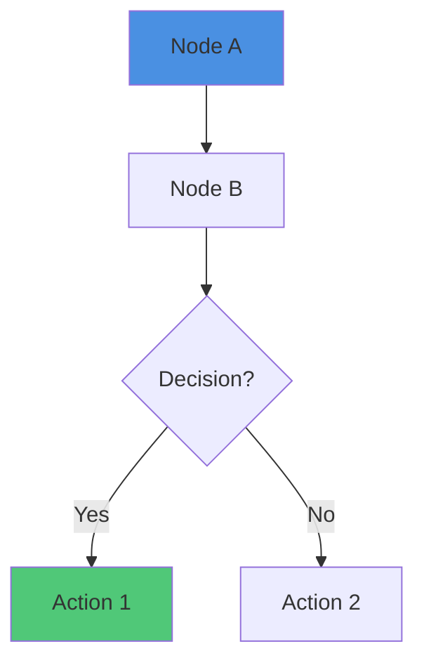
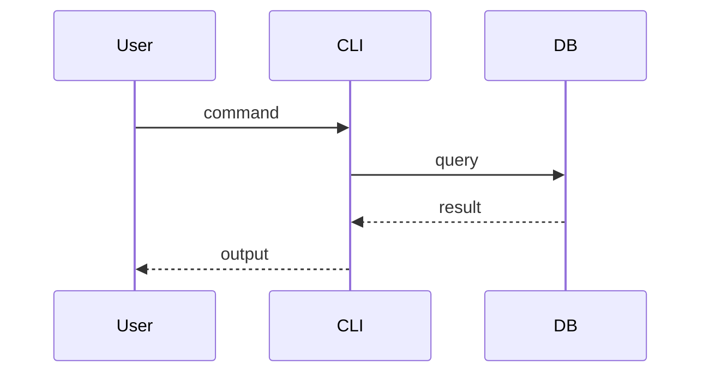
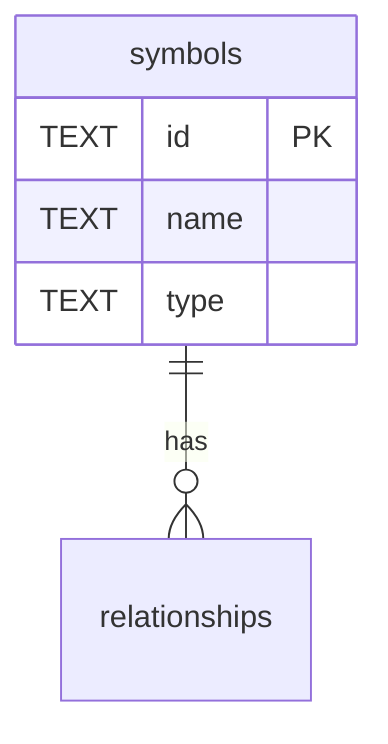

# [[Mermaid Diagram Validation Workflow]]

**Document Type**: Optional Workflow Guide
**Status**: Reference Only
**Last Updated**: 2025-11-07
**Primary Symbols**: [[DocumentSymbolRegistry]]

## Purpose

문서 내 Mermaid 다이어그램의 품질 관리 가이드입니다. **다이어그램 검증은 필수가 아니며**, push 전 포맷 다듬을 때 선택적으로 체크합니다. **중요한 것은 다이어그램의 내용과 표현력**이며, 문법 검증은 부차적입니다.

---

## Priority: Content First, Format Second

1. **다이어그램 내용**: 시스템 구조, 데이터 흐름, 관계를 명확히 표현
2. **가독성**: 노드 배치, 레이블 명명, 색상 코딩으로 이해 돕기
3. **문법 정확성**: Push 전 최종 확인 단계에서 선택적 체크

---

## Quick Validation (Optional)

### Visual Check (Primary)

GitHub/VS Code에서 미리보기로 렌더링 확인:
- VS Code: Mermaid Preview 플러그인
- GitHub: PR에서 자동 렌더링
- Mermaid Live Editor: https://mermaid.live/

### CLI Check (Secondary)

```bash
# Push 전 포맷 정리할 때만 실행 (선택사항)
tsdoc-edge validate-mermaid managed
```

현재는 구현되지 않았으며, 필요시 CLI 명령어로 추가 가능합니다.

---

## Common Patterns & Best Practices

### Diagram Types Used in TSDoc Edge

| 타입 | 사용 사례 | 예시 위치 |
|------|---------|----------|
| `graph TB/LR` | 시스템 구조, 컴포넌트 관계 | system-architecture.md |
| `sequenceDiagram` | 데이터 흐름, 시간 순서 | database-relationships.md |
| `erDiagram` | 데이터베이스 스키마 | database-relationships.md |

### Common Syntax Patterns

렌더링 오류가 발생하면 다음을 체크:

1. **Quotes in Labels**: 특수 문자 포함 시 인용 부호 사용
   ```mermaid
   A["Label with <br/> tag"]
   ```

2. **Subgraph Names**: 공백 포함 시 인용 부호 사용
   ```mermaid
   subgraph "Storage Layer"
   ```

3. **Arrow Types**: 다이어그램 타입별 화살표 문법
   - Graph: `-->`, `---`, `-.->`, `==>`
   - Sequence: `->>`, `-->>`, `->>+`
   - ER: `||--o{`, `}o--||`, `||--|{`

---

## Implementation (If Needed)

### CLI Command Template (Not Implemented)

필요시 다음과 같이 구현 가능:

```typescript
// src/cli.ts
if (command === 'validate-mermaid') {
  const targetPath = args[0] || 'managed';
  // ... validation logic
}
```

---

## Diagram Examples

### Graph/Flowchart Diagrams



**Rules**:
- Node IDs: alphanumeric + `-_`
- Labels: `[]` for rect, `()` for rounded, `{}` for decision
- Arrows: `-->`, `---`, `-.->`, `==>`, etc.

### Sequence Diagrams



**Rules**:
- Arrows: `->>`, `-->>`, `->>+`, `-->>-`
- Participant names: no spaces or use quotes
- Notes: `Note over A,B: text`

### ER Diagrams



**Rules**:
- Relationships: `||--o{`, `}o--||`, `||--|{`, etc.
- Cardinality: `||` (one), `|o` (zero or one), `}o` (zero or many)
- Attributes: inside `{}`


---

## References

**Related Documents**:
- [[TSDoc Edge System Architecture]] - 시스템 구조 다이어그램
- [[Enhanced Database Schema & Type System]] - ERDiagram 예시

**External Resources**:
- [Mermaid Official Docs](https://mermaid.js.org/)
- [Mermaid Live Editor](https://mermaid.live/) - 온라인 미리보기

---

**Document Owner**: Documentation Team
**Last Review**: 2025-11-07
**Status**: ✅ Reference Guide

---

## Backlinks

### Referenced By

- [[TSDoc Edge System Architecture]] → /home/user/tsdoc-edge/managed/architecture/system-architecture-2025-11-07.md:386
- [[DocumentSymbolRegistry]] → /home/user/tsdoc-edge/managed/doc-symbols/DocumentSymbolRegistry.md:163

