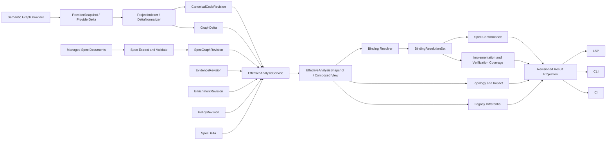

# [[Semantic Graph Analysis and Relationship Model]]

> TSDoc Edge가 최종적으로 수행할 분석 방식, revision 기반 그래프 구조, 관계 방향과
> 저장 경계를 정의하는 목표 아키텍처 계약

**Status**: Target contract for implementation
**Reference provider**: `ttsc` + `@ttsc/graph`
**Compatibility target**: TypeScript 7 semantics; actual compiler version is artifact-reported provenance
**Related roadmap**: [[Semantic Graph Spec Governance Roadmap]]
**Last reviewed**: 2026-07-12

## 결정

최종 결과는 모든 관계를 한 테이블에 넣은 단일 knowledge graph가 아니다. 다음
revision과 relation plane을 결합한 **federated effective view**다.

1. compiler가 생산한 raw code fact는 `CanonicalCodeRevision`에 원형 그대로 저장한다.
2. spec 내부 구조는 독립 `SpecGraphRevision`으로 versioning한다.
3. spec과 code/test를 잇는 선언과 실제 해석 결과를 분리한다.
4. derived semantic relation과 conformance finding은 입력 revision과 rule version을
   가진 재계산 가능한 결과다.
5. 미저장 code/spec 변경은 `GraphDelta`와 `SpecDelta`로만 합성한다.
6. CLI, LSP, CI는 동일한 `EffectiveAnalysisStamp`를 가진 결과를 소비한다.
7. `EffectiveAnalysisService`가 code/spec/evidence/enrichment/policy/overlay를 먼저
   합성하고, binding resolver와 모든 analyzer는 이 effective view만 소비한다.

핵심 원칙은 다음과 같다.

> Compiler fact는 원형을 보존하고, derived 관계는 재계산 가능하게 만들며, spec
> binding은 사람이 선언한 의무로 versioning하고, verification은 그 의무나 code
> interaction을 검증한 증거로 연결한다.

## 범위

이 문서는 다음을 정의한다.

- 분석 입력과 단계
- 분석 결과에 필요한 revision context
- canonical code graph와 spec graph의 논리·물리 구조
- raw fact, spec edge, binding, derived result의 구분
- 관계 방향, endpoint 역할, impact traversal 규칙
- 기존 28개 활성 relationship type의 목표 배치
- saved revision과 unsaved overlay의 합성 규칙
- v1의 최소 node, edge, binding, query 범위

이 문서는 개별 analyzer 알고리즘이나 UI 레이아웃을 고정하지 않는다.

## 용어

| 용어 | 의미 |
| --- | --- |
| Code fact | compiler/provider가 source evidence와 함께 직접 생산한 사실 |
| Derived structure | raw fact 위에 producer/router가 합성한 file, containment, export 등 |
| Spec node | lifecycle과 안정 ID를 가진 requirement, invariant, decision, contract |
| Spec edge | spec node 사이의 durable authored relation |
| Binding declaration | spec node와 외부 code/test 대상을 연결하려는 authored selector |
| Binding resolution | composed effective view에서 selector를 role별 endpoint ref로 해석한 결과 |
| Derived relation | fact/spec/binding에서 rule로 계산한 revision-scoped 관계 |
| Finding | 위반, 누락, 순환, stale 상태와 같은 분석 결과 |
| Effective view | saved revision에 evidence/enrichment/policy와 unsaved delta를 합성한 query view |
| Fact occurrence | provider가 특정 source location에서 관찰한 개별 compiler 사실 |
| Topology edge | 하나 이상의 fact occurrence를 endpoint와 의미별로 집계한 query edge |
| API surface | export/package boundary에서 계산한 revision-scoped public API endpoint |

## 결과적인 분석 방식



### 1. Provider ingestion

Provider는 compiler AST 객체가 아니라 JSON-shaped raw node, edge, diagnostic,
capability, provenance를 제공한다. `@ttsc/graph`는 code fact 생산을 소유하고,
graph-router는 repo routing, cache, checkpoint, artifact 검증을 소유한다.

Provider boundary는 canonical graph 타입을 직접 반환하지 않는다. Saved 입력은
`ProviderSnapshot`, incremental 입력은 `ProviderDelta`이며, producer node ID와 설정을
그대로 보존한다. TypeScript의 `tsconfigPath`는 `TypeScriptProviderConfig`에 속하고
canonical code graph의 필수 필드가 아니다.

```typescript
interface ProviderIdentity {
  providerId: string;
  providerVersion: string;
  providerInstanceId: string;
  contractId: 'tsdoc-edge/semantic-graph-provider';
  contractVersion: string;
}

interface ProviderSnapshot {
  contractId: 'tsdoc-edge/semantic-graph-provider';
  contractVersion: '1.0';
  snapshotId: string;
  workspaceId: string;
  graphNamespace: string;
  identity: ProviderIdentity;
  capabilities: GraphCapabilities;
  nodes: readonly ProviderNode[];
  facts: readonly ProviderFactOccurrence[];
  diagnostics: readonly ProviderDiagnostic[];
  provenance: ProviderProvenance;
}

interface ProviderDelta {
  contractId: 'tsdoc-edge/semantic-graph-provider';
  contractVersion: '1.0';
  deltaId: string;
  baseSnapshotId: string;
  workspaceId: string;
  graphNamespace: string;
  identity: ProviderIdentity;
  documentPath: string;
  contentDigest: string;
  changes: readonly ProviderChange[];
  diagnostics: readonly ProviderDiagnostic[];
  capabilities: GraphCapabilities;
}

interface TypeScriptProviderConfig {
  tsconfigPath: string;
  routerConfigPath?: string;
}
```

`providerInstanceId + providerNodeId`는 producer namespace에서만 유일하다.
`ProjectIndexer`는 `ProviderSnapshot`을 canonical revision으로 만들고,
`DeltaNormalizer`는 `ProviderDelta`를 `GraphDelta`로 만든다. Provider가 canonical ID나
`GraphDelta`를 직접 결정하지 않는다. Delta envelope는 base snapshot과 동일한
workspace/namespace를 명시하고 단일 document path와 exact buffer content digest를
포함한다. Normalizer는 이 pin이 정확히 일치할 때만 delta를 적용한다.

현재 전환 구현은 `src/provider/`가 이 경계를 소유한다.
`TtscSemanticGraphProvider`는 기존 saved router artifact를 raw snapshot으로 감싸며,
artifact가 반복 call-site를 이미 축약했을 가능성이 있으므로 occurrence capability를
`partial`로 고정한다. `ProviderSnapshotNormalizer`가
`workspaceId + graphNamespace + source identity` canonical ID를 할당하고,
`DeltaNormalizer`는 stale snapshot을 `rebase-required`, 문서 범위 밖 변경을
`fallback-required`로 반환한다. Provider가 incremental delta를 지원하지 않을 때 실제
whole-project refresh를 실행하는 orchestration은 아직 상위 제품 계층의 책임이다.

현재 `CanonicalProjectGraph` v1이 `tsconfigPath`를 요구하므로 normalizer는
`compatibilityTsconfigPath`를 전환 인자로 받는다. contract v2 검토에서 `tsconfigPath`가 계속
필요하면 이 값과 router/provider 설정을 `TypeScriptProviderConfig`의 단일 owner로 병합한다.
`ProjectIndexer`/normalizer가 별도 설정 source를 author하거나 reconcile하지 않는다. v1 field의
제거 여부는 packed canary의 migration proof 뒤 결정하며, 필요하면 동일 config에서 파생한
compatibility field로 유지한다.

TypeScript 7은 semantic compatibility와 fixture의 목표다. Artifact가
`compilerVersion: null` 또는 `compilerVersionReported: false`를 제공하면 결과는
`unreported` provenance로 남기며 TypeScript 7 실행으로 추론하거나 승격하지 않는다.

### 2. Canonical normalization

`ProjectIndexer`가 다음을 수행한다.

- workspace, provider contract, capability와 provider-specific config 검증
- provider namespace와 `providerNodeId`를 보존한 canonical ID 생성
- node/edge endpoint 무결성 검증
- evidence 좌표와 unknown producer field 보존
- deterministic ordering과 fingerprint 생성
- diagnostic 정규화

`DeltaNormalizer`는 같은 ID, evidence, edge semantic registry를 사용해 provider delta를
canonical `GraphDelta`로 변환한다. Saved와 unsaved normalization이 별도 ID 문법을
갖지 않는다.

Normalization은 raw kind를 legacy relationship type으로 덮어쓰지 않는다.

### 3. Spec extraction과 구조 검증

Frontmatter, 명시적 obligation ID, `[[Symbol]]`, contract/decision tag에서 spec node,
internal edge, binding declaration을 만든다. 다음 오류는 binding resolution 이전에
검출한다.

- duplicate/provisional ID
- dangling spec edge
- kind별로 허용되지 않은 endpoint
- `contains` cycle
- 잘못된 `supersedes` 계보
- active spec의 불완전 source anchor

### 4. Effective composition과 binding resolution

목표 `EffectiveAnalysisService`는 다음 순서를 단일 application contract로 소유한다.

1. active code/spec revision과 요청한 evidence/enrichment/policy revision을 검증한다.
2. `GraphDelta`와 `SpecDelta`를 각각의 base revision에 적용하거나
   `rebase-required`로 반환한다.
3. capability와 producer-derived topology를 합성해 `ComposedEffectiveView`를 만든다.
4. Authored binding selector를 이 composed view에서만 해석한다.
5. pre-binding `EffectiveAnalysisSnapshot`과 binding 결과인 `BindingResolutionSet`을
   분리하고, resolution set에 최종 stamp를 고정한다.

현재 구현은 caller가 이미 조립한 code/spec view를 검증해 pre-binding snapshot과
layered stamp를 만들고, 그 snapshot 이후에만 resolver를 호출하는 ordering kernel이다.
Code graph의 canonical ID/sourceId/order/duplicate/dangling endpoint와 persisted/effective
fingerprint를 재검증하고, spec/policy/evidence/enrichment/rule-set content identity도 각
factory로 다시 계산한다. 이 경계가 생성한 process-local snapshot만 binding set을 만들 수
있으며 clone 또는 임의 구조체는 trust root로 승격되지 않는다.
`GraphDelta`/`SpecDelta` apply, rebase와 capability composition 자체를 아직 수행하지
않는다. 이 실제 composition이 연결되기 전까지 caller가 saved view에서 binding한 뒤
overlay를 추가하는 것을 API 밖에서 막는 제품 gate가 별도로 필요하다.

Binding resolver가 saved revision을 먼저 해석한 뒤 overlay를 덧붙이는 경로는 허용하지
않는다. 미저장 rename/add/delete와 spec binding edit가 같은 resolution에 반영되어야
한다. 결과는 반드시 다음 중 하나다.

- `resolved`
- `ambiguous`
- `missing`
- `stale`

이름이 같은 첫 node를 선택하거나 missing으로 축약하지 않는다.

### 5. Revision-scoped analysis

같은 final effective snapshot에서 다음 분석을 수행한다.

- identity resolution과 direct topology
- dependency/dependent traversal
- change impact
- implementation/verification coverage
- lifecycle 및 API contract conformance
- architecture policy conformance
- legacy/canonical differential comparison

### 6. Projection

분석 결과는 LSP, CLI, CI 형식으로 변환되지만 동일한 stamp, diagnostic ID, evidence
path를 유지한다. UI projection이 graph identity를 변경하지 않는다.

## 분석 모드

| 모드 | 입력 | 결과 |
| --- | --- | --- |
| Fact query | code view, edge family/filter | exact node, fact occurrence, evidence |
| Topology | code view, root node | topology edge, dependencies, dependents, path, metrics |
| Change impact | revision diff 또는 GraphDelta | affected code와 spec path |
| Spec context | code/spec subject | obligation, decision, binding, finding |
| Conformance | effective analysis snapshot | pass/fail/incomplete와 findings |
| Coverage | resolved binding + evidence revision | implementation/verification gap |
| Differential | legacy baseline + canonical revision | exact, normalized, legacy-only, compiler-only |

모든 분석은 단순 count뿐 아니라 result를 만든 fact/edge/binding path를 반환해야 한다.

## 공통 분석 결과 stamp

Code-only query와 cross-plane analysis의 identity를 분리한다. Digest는 정렬된 semantic
payload의 hash이며 머신별 절대 경로, 실행 시각, cache 위치를 포함하지 않는다.

```typescript
interface CodeViewStamp {
  codeRevisionId: string;
  codeGraphFingerprint: string;
  providerIdentityDigest: string;
  capabilityDigest: string;
  observedKindsDigest: string;
  relationSemanticRegistryVersion: string;
  producerDerivedDigest: string;
  routerDerivedDigest: string;
  codeOverlayDigest: string;
  effectiveCodeViewId: string;
}

interface EffectiveAnalysisInputStamp {
  code: CodeViewStamp;
  specRevisionId: string;
  specOverlayDigest: string;
  evidenceRevisionId: string;
  evidenceDigest: string;
  enrichmentRevisionId: string;
  enrichmentDigest: string;
  policyRevisionId: string;
  policyDigest: string;
  ruleSetRevisionId: string;
  ruleSetDigest: string;
  derivedModelDigest: string;
  effectiveViewId: string;
}

interface EffectiveAnalysisStamp extends EffectiveAnalysisInputStamp {
  bindingResolutionSetId: string;
}

interface RevisionedResult<T> {
  stamp: EffectiveAnalysisStamp;
  query: {
    edgeFamilies?: readonly string[];
    externalPolicy?: 'include' | 'exclude' | 'boundary';
    maxDepth?: number;
    truncated?: boolean;
  };
  value: T;
  diagnostics: readonly AnalysisDiagnostic[];
}
```

`codeOverlayDigest`와 `specOverlayDigest`는 overlay가 없을 때도 고정된 empty digest를
사용한다. Fact/topology 같은 code-only query는 `CodeViewStamp`만 사용한다. Cross-plane
analysis에서 선택 기능이 비어 있으면 `spec:none`, `evidence:none`, `enrichment:none`,
`policy:default` 같은 canonical empty revision을 사용해 실행 surface마다 identity가
달라지지 않게 한다. `ruleSetDigest`는 적용 rule과 suppression을,
`derivedModelDigest`는 edge registry, analyzer와 projection algorithm version을
식별한다. `effectiveViewId`는 binding 전 composed input identity이고
`bindingResolutionSetId`는 그 view에서 계산한 resolution identity다. 두 값을 서로의
hash 입력으로 넣지 않으며, 최종 result identity가 둘을 함께 포함한다.

## Convention pack composition boundary

`ConventionPackManifest`는 code/spec graph 위에 추가되는 새 graph가 아니다. 하나의
workspace scope에서 이미 독립적으로 content-addressed된 `SpecGraphRevision`,
`PolicyRevision`, `RuleSetRevision`을 exact-pin하고, 실행 전에 필요한 provider capability와
graph namespace를 선언하는 composition descriptor다.

```text
ConventionPackSource (authored JSON v1)
  -> ConventionPackCompiler
     ├── SpecGraphRevision
     ├── PolicyRevision
     ├── RuleSetRevision
     └── ConventionPackManifest
         ├── workspace scope / graph namespace
         ├── exact capability requirements
         └── exact revision pins
```

현재 `ConventionPackSource` JSON은 standalone convention loop를 실행하기 위한 bootstrap
authored input이다. Spec node와 binding을 포함하지만 project spec의 장기 authored SSOT는
아니다. Managed-document extraction이 연결되기 전까지만 이 canary 경계를 유지하며, 같은
spec node와 binding을 JSON과 Markdown에서 동시에 독립 authoring하지 않는다.

목표 상태에서는 managed spec document가 project spec과 binding을 소유한다. Convention
source는 policy/rule과 compiled spec revision을 조합하거나 managed source에서 생성되고,
`ConventionPackManifest`가 exact revision을 pin한다. Portable convention definition이 자체
spec을 제공하려면 project spec과 다른 namespace 및 installation 계약을 먼저 가져야 한다.

현재 v1 source compiler는 source anchor와 provenance를 pack file의 workspace-relative real
path와 exact byte digest에서 생성한다. Pack symlink가 workspace 밖으로 벗어나면 거부한다.
Manifest self-hash는 content integrity이며 publisher authenticity가 아니다. 보호된 CI는
`expectedManifestId`를 별도 lock으로 제공해 같은 `packId@packVersion` 아래의 policy 또는
capability downgrade를 거부한다.
CLI의 `--code-revision`은 retained `GraphRepository` revision을 직접 선택해 active pointer와
독립적인 replay를 제공한다.

`ConventionCheckResult.checkId`는 exact analysis 결과를 식별한다. `failureThreshold`는 분석
입력이 아니라 소비자 gate 정책이므로 별도 `ConventionGateDecision.gateId`가 threshold,
blocking finding ID와 pass/fail을 묶는다. 같은 conformance report라도 gate threshold가
다르면 gate identity와 CLI exit decision이 달라진다. gate identity에는 gate contract와
evaluator version도 포함해 향후 blocking semantics 변경이 기존 ID를 재사용하지 않게 한다.

## 예상 그래프의 물리 구조

```text
EffectiveAnalysisSnapshot
├── CanonicalCodeRevision
│   ├── canonicalNodes
│   ├── factOccurrences
│   ├── topologyEdges
│   │   ├── compilerFact
│   │   └── producerDerived
│   ├── aliases
│   ├── diagnostics
│   └── provenance
├── SpecGraphRevision
│   ├── specNodes
│   ├── internalSpecEdges
│   ├── bindingDeclarations
│   └── provenance
├── EvidenceRevision
├── EnrichmentRevision
├── PolicyRevision
├── RuleSetRevision
├── ProviderAnalysisIdentity
└── EffectiveAnalysisInputStamp

EffectiveAnalysisService.resolveBindings(snapshot)
└── BindingResolutionSet
    ├── resolutionSetId / snapshotId
    ├── inputStamp / final EffectiveAnalysisStamp
    ├── resolver identity
    └── resolutions against that exact effective view

Overlay inputs
    ├── GraphDelta[]
    └── SpecDelta[]

Future optional DerivedAnalysisCache (keyed by EffectiveAnalysisStamp)
├── derivedRelations
└── findings
```

Code와 spec revision은 독립적으로 바뀐다. 전역 통합 revision을 만들지 않는다.
Effective stamp가 code/spec/evidence/enrichment/policy/capability/rule/overlay 조합을
식별한다.

## Canonical code graph

### Node 구조

```typescript
interface CanonicalCodeNodeRef {
  workspaceId: string;
  graphNamespace: string;
  id: string;
}
```

```text
CanonicalCodeNode
├── Equality
│   ├── workspaceId
│   ├── graphNamespace
│   ├── id
│   └── kind
├── Producer identity
│   ├── providerInstanceId
│   └── providerNodeId
├── Display and resolution
│   ├── name
│   └── qualifiedName
├── Ownership and location
│   ├── file
│   └── evidence
├── Boundary
│   ├── external
│   ├── ignored
│   └── exported
└── Preserved provider fields
    ├── modifiers
    ├── decorators
    ├── annotations
    └── unknown fields
```

현재 local ID 기준은 `path#qualifiedName:kind`다. 전체 identity는
`workspaceId + graphNamespace + localId` tuple이며 external package는 package identity가
포함된 별도 namespace를 사용한다. Provider의 `providerNodeId`는 canonical local ID와
같다고 가정하지 않는다. line/column은 evidence이며 identity가 아니다. rename과 file
move는 ID 변경이므로 revision 간 alias lineage와 binding migration으로 다룬다.

`providerNodeId`는 producer-local provenance이며 canonical ID collision suffix가 아니다.
서로 다른 provider node가 같은
`workspaceId + graphNamespace + path + qualifiedName + kind` tuple을 주장하면 normalizer는
입력 순서 기반 suffix를 만들지 않고 snapshot을 거부한다. Provider는 같은 semantic
declaration을 하나의 node로 collapse하고, 실제로 다른 overload/entity는 stable
`qualifiedName` 또는 kind로 구분해야 한다. 반복 source observation은 node 복제가 아니라
`FactOccurrence`로 표현한다.

Node 규칙은 다음과 같다.

- raw `kind`를 presentation 의미 때문에 변경하지 않는다.
- 같은 이름은 `found | ambiguous | missing` resolution을 반환한다.
- external node는 `include | exclude | boundary` 정책을 가진다.
- unknown kind와 provider field를 손실 없이 보존한다.
- derived kind가 필요하면 raw kind를 바꾸지 않고 별도 annotation/plane에 둔다.

### Fact occurrence와 topology edge

같은 caller가 같은 callee를 여러 source location에서 호출할 수 있으므로 raw 사실의
identity를 `(kind, from, to)`로 축약하지 않는다. Provider가 보고한 각 관찰은
`FactOccurrence`로 보존하고 query topology는 별도 edge로 집계한다.

```typescript
interface FactOccurrence {
  id: string;
  plane: 'compiler-fact';
  kind: string;
  from: string;
  to: string;
  provider: FactProviderInstance;
  providerLocalFactId: string;
  sourceAnchor: ProjectGraphEvidence;
  confidence: number | null;
  capabilities: Readonly<Record<string, unknown>>;
  provenance: Readonly<Record<string, unknown>>;
  producerFields: Readonly<Record<string, unknown>>;
}

interface TopologyEdge {
  id: string;
  plane: 'compiler-fact' | 'producer-derived' | 'router-derived';
  kind: string;
  from: CanonicalCodeNodeRef;
  to: CanonicalCodeNodeRef;
  semanticQualifier?: string;
  occurrenceIds: readonly string[];
  occurrenceCount: number;
  confidence: TopologyConfidenceSummary;
  contributions: readonly TopologyOccurrenceContribution[];
  derivation?: {
    owner: string;
    version: string;
    capability: string;
    inputFactIds: readonly string[];
  };
}
```

Fact occurrence ID는 provider instance, provider-local fact ID, raw kind, endpoint와
normalized source anchor의 deterministic hash다. Compiler-fact topology ID는
`(plane, kind, from, to, semanticQualifier)`로 계산한다. `producer-derived`와
`router-derived` topology ID에는 동일 endpoint의 서로 다른 derivation owner가 덮어쓰지
않도록 `derivation.owner + version + capability`를 추가한다. `inputFactIds`는 정렬된
provenance로 보존하지만 topology identity에는 넣지 않는다. Raw kind를 canonical
storage에서 legacy type으로 바꾸지 않으며, occurrence와 contribution을 정렬해 보존한다.
Semantic provider의 `providerFactId`는 incremental remove/replace가 가능한 stable local
identity로 필수다. Saved artifact에 ID가 없으면 provider facade가 deterministic ID를
부여하며 anonymous occurrence를 dirty delta에 누적하지 않는다.

`compiler-fact` topology는 하나 이상의 occurrence ID를 가져야 하고 `derivation`을
갖지 않는다. `producer-derived` topology는 occurrence가 없을 수 있지만 `derivation`은
필수다.

구현 계약은 `src/semantic-graph/fact-topology.ts`에 있다. `router-derived`도
versioned derivation owner를 요구하는 derived topology plane으로 취급한다. Authoritative
query identity는 `FactOccurrence`와 `TopologyEdge`이며, 현재
`CanonicalProjectGraph.edges`는 기존 CLI/LSP 호환을 위한 topology projection이다.
`ProviderSnapshotNormalizer`는 두 occurrence를 하나의 compatibility edge로 투영하더라도
authoritative occurrence 배열과 topology contribution을 별도로 보존한다. DB schema와
GraphDelta v2의 별도 fact/topology table 적용은 아직 남아 있다.

Provider가 이미 collapse된 edge 하나만 제공하면 normalizer는 관찰된 evidence로 단일
occurrence를 만들고 `fact-occurrence-completeness: partial` capability/diagnostic을
기록한다. 제공되지 않은 call-site를 추론해 만들거나 completeness를 `complete`로
표시하지 않는다.

### Edge 의미 registry

현재 `from → to` dependency edge는 `from`이 `to`를 사용하거나 의존한다. 하지만
`contains`, `exports`처럼 dependency가 아닌 edge가 추가되므로 모든 raw edge에 같은
traversal 규칙을 적용하지 않는다.

```typescript
interface EdgeSemantic {
  family: 'execution' | 'type' | 'ownership' | 'module' | 'verification' | 'metadata';
  sourceRole: string;
  targetRole: string;
  queryPolicies: {
    dependency: boolean;
    impact: 'reverse' | 'forward' | 'none';
    containment: boolean;
  };
  legacyProjection?: RelationshipType;
}
```

`projectable edge`와 `dependency traversal edge`는 별도 집합이어야 한다.

### Raw edge 방향

| Raw kind | 방향 | Family | Dependency impact | 상태 |
| --- | --- | --- | --- | --- |
| `calls` | caller → callee | execution | reverse | current fact |
| `accesses` | accessor → accessed symbol | execution | reverse | current fact |
| `instantiates` | creator → constructed target | execution | reverse | current fact |
| `type_ref` | referring symbol → referenced type | type | reverse | current fact |
| `extends` | subtype → base type | type | reverse | current fact |
| `implements` | implementation → interface | type | reverse | current fact |
| `overrides` | overriding member → base member | type | reverse | capability-gated |
| `renders` | renderer → rendered component | execution | reverse | capability-gated |
| `imports` | importer → imported target | module | registry policy | capability-gated |
| `tests` | test → tested subject | verification | subject change: reverse | capability-gated |
| `contains` | container → member | ownership | none | producer-derived |
| `exports` | file/module → exported symbol | module | none | producer-derived |
| `decorates` | provider contract로 결정 | metadata | none | unresolved capability |

`current fact`는 현재 raw saved-file artifact에서 확인된 kind다. 다른 kind는 실제
provider fixture와 capability가 있을 때만 활성화한다.

### Raw와 producer-derived 구조

GraphMemory는 raw graph 위에 file node, `contains`, `exports`, property refinement,
member-level `implements/overrides`를 합성할 수 있다. 이 구조를 raw fact로 위장하지
않는다.

- raw artifact를 compiler fact plane의 기본 입력으로 유지한다.
- GraphMemory/router 합성은 `producer-derived` plane으로 표시한다.
- 모든 producer-derived topology에 derivation owner, version, capability, input fact ID를
  기록한다.
- file/package container는 별도 canonical namespace를 사용한다.
- `variable → property` refinement는 raw ID/kind를 조용히 바꾸지 않는다.
- upstream resolved snapshot이 안정되면 capability로 승격한다.

## Spec graph v1

### Node 종류

초기 spec graph는 다섯 node만 저장한다.

| Kind | 의미 |
| --- | --- |
| `spec` | lifecycle과 version을 가진 관리 대상 aggregate root |
| `requirement` | 구현되어야 할 요구와 acceptance criteria |
| `invariant` | 항상 보존해야 하는 조건 |
| `decision` | 선택, 근거, 대안, 결과를 가진 설계 결정 |
| `api-contract` | public API pre/postcondition과 compatibility 의무 |

`DocumentSymbol`은 node ID가 아니라 source anchor와 navigation alias다. `TestEvidence`는
v1 node가 아니라 binding/verification evidence다. 독립 lifecycle이 필요해질 때만
후속 node로 승격한다.

### Spec node와 source anchor

```typescript
interface SpecNodeBase {
  id: string;
  kind: 'spec' | 'requirement' | 'invariant' | 'decision' | 'api-contract';
  title: string;
  lifecycle:
    | { mode: 'inherited'; aggregateSpecId: string }
    | { mode: 'independent'; status: SpecStatus; version?: string };
  source: SpecSourceAnchor;
  tags: readonly string[];
}

interface SpecSourceAnchor {
  documentId: string;
  file: string;
  symbol?: string;
  section?: string;
  range?: SourceRange;
  contentDigest: string;
}
```

`spec` aggregate는 항상 independent lifecycle을 가진다. 하위 obligation/decision은
aggregate lifecycle을 상속하거나 명시적으로 독립 lifecycle을 선택한다.

`[[Symbol]]` 이름과 file path를 stable spec ID로 사용하지 않는다. `REQ-001`, `INV-001`,
`ADR-007` 같은 explicit ID를 우선한다. 기존 문서는 provisional ID로 가져올 수 있지만
`active` 전환 전에 explicit ID를 요구한다.

### Durable internal SpecEdge

| Kind | 허용 endpoint | 방향과 의미 |
| --- | --- | --- |
| `contains` | `spec → obligation/decision` | aggregate가 구성요소를 포함 |
| `refines` | `obligation → obligation` | 구체 의무 → 일반 의무 |
| `requires` | `obligation → obligation` | 의존 의무 → prerequisite |
| `establishes` | `decision → obligation` | 결정이 의무를 성립시킴 |
| `supersedes` | 새 node → 이전 compatible node | 새 lifecycle node가 이전 node를 대체 |

`obligation`은 `requirement | invariant | api-contract`다.

```typescript
interface SpecEdge {
  id: string;
  kind: 'contains' | 'refines' | 'requires' | 'establishes' | 'supersedes';
  from: string;
  to: string;
  semanticQualifier?: string;
  evidence: readonly SpecEvidence[];
  provenance: SpecProvenance;
}
```

SpecEdge ID는 kind, from, to, semantic qualifier의 deterministic hash다. Authored
timestamp는 identity에 포함하지 않는다.

## Cross-plane binding

Spec node와 code/test/enrichment target을 연결하는 관계는 `SpecEdge`가 아니다.
Declaration과 resolution을 분리한다.

### Binding 종류와 participant 역할

Binding은 고정된 `specNodeId + codeNodeId` pair가 아니라 역할이 있는 participant
관계다. v1은 네 kind를 유지하되 endpoint 종류는 code edge, test evidence와 API
surface를 포함한다.

| Kind | 필수 역할 | 허용 endpoint | Logical direction |
| --- | --- | --- | --- |
| `implementation` | `implementer`, `obligation` | code-node/API → spec-node | 구현 → 의무 |
| `verification` | `verifier`, `subject` | test-evidence → spec-node/code-node/code-edge/API | 증거 → 검증 대상 |
| `constraint` | `constraint`, `subject` | spec-node → spec-node/code-node/code-edge/API | 제약 → 적용 대상 |
| `governance` | `contract`, `api` | api-contract → API surface | 계약 → 공개 API |

Document navigation은 v1에서 source anchor/enrichment index로 처리한다. `documents`
binding은 외부 library pilot에서 독립 lifecycle 필요성이 확인되면 추가한다.

### Declaration과 resolution

```typescript
type EndpointRef =
  | {
      type: 'spec-node';
      specRevisionId: string;
      id: string;
    }
  | {
      type: 'code-node';
      effectiveCodeViewId: string;
      workspaceId: string;
      graphNamespace: string;
      id: string;
    }
  | {
      type: 'code-edge';
      effectiveCodeViewId: string;
      edgeId: string;
    }
  | {
      type: 'test-evidence';
      evidenceRevisionId: string;
      evidenceId: string;
    }
  | {
      type: 'api-surface';
      effectiveCodeViewId: string;
      surfaceId: string;
    };

type EndpointSelector =
  | { type: 'spec-node'; specNodeId: string }
  | ({
      type: 'code-node';
      workspaceId?: string;
      graphNamespace?: string;
      canonicalNodeId?: string;
      providerNodeId?: string;
    } & CodeSymbolSelector)
  | {
      type: 'code-edge';
      canonicalEdgeId?: string;
      kind?: string;
      from?: CodeSymbolSelector;
      to?: CodeSymbolSelector;
      semanticQualifier?: string;
    }
  | {
      type: 'test-evidence';
      evidenceId?: string;
      file?: string;
      qualifiedName?: string;
      runner?: string;
    }
  | {
      type: 'api-surface';
      packageName?: string;
      exportPath?: string;
      exportedName?: string;
    };

interface CodeSymbolSelector {
  packageName?: string;
  file?: string;
  qualifiedName?: string;
  kind?: string;
  sourceAnchor?: SourceRange;
}

interface SpecBindingDeclaration {
  id: string;
  kind: 'implementation' | 'verification' | 'constraint' | 'governance';
  participants: readonly {
    role: BindingParticipantRole;
    selector: EndpointSelector;
  }[];
  declarationDigest: string;
  source: SpecSourceAnchor;
  provenance: SpecProvenance;
}

interface ResolvedSpecBinding {
  resolutionId: string;
  declarationId: string;
  specRevisionId: string;
  declarationDigest: string;
  effectiveViewId: string;
  codeRevisionId: string;
  evidenceRevisionId?: string;
  resolver: BindingResolverIdentity;
  status: 'resolved' | 'ambiguous' | 'missing' | 'stale';
  participants: readonly {
    role: BindingParticipantRole;
    status: 'resolved' | 'ambiguous' | 'missing' | 'stale';
    refs: readonly EndpointRef[];
  }[];
  confidence: number;
  evidence: readonly SpecEvidence[];
}

type BindingParticipantRole =
  | 'implementer'
  | 'obligation'
  | 'verifier'
  | 'subject'
  | 'constraint'
  | 'contract'
  | 'api';

interface BindingResolutionSet {
  resolutionSetId: string;
  snapshotId: string;
  inputStamp: EffectiveAnalysisInputStamp;
  stamp: EffectiveAnalysisStamp;
  resolver: BindingResolverIdentity;
  resolutions: readonly ResolvedSpecBinding[];
}
```

Declaration에는 stable selector를 저장하고, composed effective view의 endpoint ref는
resolution에 저장한다. Resolution ID는 `declarationId + declarationDigest +
specRevisionId + effectiveViewId + exact codeRevisionId + resolver identity + aggregate status,
canonical participant/ref`의 deterministic hash다. Verification resolution은 exact
`evidenceRevisionId`도 추가로 pin한다. 비-verification resolution은 별도 evidence pin을
싣지 않지만 effective view stamp가 evidence revision을 포함한다. Code refresh가 authored
spec revision을 불필요하게 변경하지 않는다. API surface는 export topology와 package
metadata로 계산되는 endpoint이며 별도 v1 spec node가 아니다.

`BindingResolutionSet`은 durable authored data가 아니라 process-local transient derived
value다. `EffectiveAnalysisService.resolveBindings`가 concrete snapshot을 기준으로
declaration completeness, revision pin, participant order/cardinality, selector 일치와 content
identity를 검증한 동일 객체만 validated set으로 등록한다. `ConformanceEngine`은 clone,
deserialize 또는 service를 거치지 않은 set을 거부한다. 향후 cache payload도 trusted
input으로 취급하지 않고 snapshot 기준 재검증 후에만 conformance에 전달한다.

Selector resolution은 exact namespaced canonical/evidence ID, package export/API selector,
provider-scoped ID, structural selector 순으로 시도한다. Structural selector의 필드는
모두 AND 조건이다. Provider ID는 같은 provider instance/contract 안에서만 사용할 수
있고 첫 이름 일치를 선택하지 않는다. 후보 0개는 `missing`, 1개는 `resolved`, 2개
이상은 `ambiguous`다. API surface ID는 package identity, export path, exported name과
effective code view에서 결정적으로 계산한다.

`stale`은 같은 declaration의 직전 resolution이 존재하지만 identity remap 또는 revision
변화로 그 endpoint를 더 이상 동일 대상으로 확정할 수 있는 경우다. 처음부터 후보가
없는 `missing`과 구분한다.

## Verification claim

정적 import, naming match, test file 위치는 `mapped`이지 `verified`가 아니다.
실행 증거가 있는 claim은 최소 다음 정보를 가진다.

```typescript
interface VerificationClaim {
  bindingDeclarationId: string;
  verifier: Extract<EndpointRef, { type: 'test-evidence' }>;
  subject: EndpointRef;
  mappingKind: 'declared' | 'static-match' | 'executed';
  run?: {
    runId: string;
    sourceRevision: string;
    runner: string;
    runnerVersion?: string;
    environment?: string;
    result: 'passed' | 'failed' | 'skipped' | 'unknown';
    executedAt?: string;
  };
  evidence: readonly SpecEvidence[];
}
```

Artifact가 제공한 execution timestamp는 evidence이며 graph relation identity가 아니다.
Artifact에 timestamp가 없으면 현재 clock으로 채우지 않는다.

## Policy revision

Policy는 analyzer 내부 상수나 CLI별 설정으로 숨기지 않는다. Managed policy document와
workspace config가 authored source이고 현재 shared `AnalysisInputRevisionRepository`에는
검증된 compiled policy revision을 exact pin으로 저장한다. 별도 `PolicyRepository`는 현재
구조에 필요하지 않다.

```typescript
interface PolicyRevision {
  contractVersion: '1.0';
  revisionId: string;
  contentDigest: string;
  ruleSetDigest: string;
  relationSemanticRegistryVersion: string;
  lifecycleGateVersion: string;
  rules: readonly PolicyRule[];
  suppressions: readonly PolicySuppression[];
  provenance: PolicyProvenance;
}
```

Rule은 ID, version, 적용 endpoint/edge family, severity와 parameter를 가진다.
Suppression은 rule ID, 대상 selector, 근거와 만료 조건을 가진다. 동일
`EffectiveAnalysisStamp`에서는 policy, rule, suppression의 해석이 CLI/LSP/CI에 따라
달라지지 않는다. 정책을 사용하지 않는 query도 canonical `policy:default` revision을
명시한다.

## Derived relation과 finding

Derived 결과는 base code/spec edge와 다른 plane에 둔다.

```typescript
interface DerivedRelation {
  id: string;
  kind: string;
  participants: readonly { role: string; ref: EndpointRef }[];
  sourceRevisions: EffectiveAnalysisStamp;
  rule: { id: string; version: string };
  inputFactIds: readonly string[];
  confidence: number;
}

interface ConformanceFinding {
  id: string;
  category:
    | 'unimplemented'
    | 'unverified'
    | 'stale-binding'
    | 'contract-violation'
    | 'architecture-violation'
    | 'cycle';
  severity: 'error' | 'warning' | 'info';
  subject: EndpointRef;
  evidencePath: readonly RelationHop[];
  stamp: EffectiveAnalysisStamp;
}
```

`impacts`, `violates`, `circular-dependency`, missing implementation/verification은 durable
base edge가 아니다. 특정 revision/policy 조합에서 계산되는 path 또는 finding이다.
Derived relation을 materialize할 때도 source revision, rule ID/version, input fact ID를
필수로 저장한다.

## Logical relation view

물리 저장은 분리하지만 query layer는 공통 read model을 제공할 수 있다.

```typescript
interface RelationView {
  id: string;
  plane: 'compiler-fact' | 'producer-derived' | 'spec' | 'binding' | 'derived';
  kind: string;
  participants: readonly { role: string; ref: EndpointRef }[];
  semanticFamily: string;
  direction: 'directed' | 'symmetric';
  evidence: readonly RelationEvidence[];
  provenance: RelationProvenance;
  sourceRevisionIds: readonly string[];
  rule?: { id: string; version: string };
  confidence?: number;
}
```

Binary relation projection은 `source`와 `target` participant를 사용한다. Collaboration,
verification처럼 둘 이상의 역할이 필요한 관계를 pairwise clique로 변환하지 않는다.
Synthetic relation node가 필요한 UI는 relation ID에서 결정적으로 projection하되 저장
identity를 새 node ID로 바꾸지 않는다.

`UnifiedRelationship`은 이 저장 계약으로 재사용하지 않는다. Legacy presentation과
differential input DTO로 유지한다. 현재 타입에는 plane, revision, participant role,
resolution state, deterministic identity가 없고 timestamp와 `Record<string, any>`가
identity와 payload를 혼합하기 때문이다.

## 관계 방향 규칙

1. 모든 canonical stored edge는 명시적인 `from`, `to`를 가진다.
2. Code dependency family는 `dependent/usage → dependency`다.
3. Change impact는 dependency family의 incoming edge를 역방향으로 탐색한다.
4. `contains`는 container → member이며 dependency impact에서 제외한다.
5. `exports`는 exporter → exported target이며 API exposure query에 사용한다.
6. Spec `requires`는 dependent obligation → prerequisite다.
7. Spec `refines`는 specific → general이다.
8. Spec `supersedes`는 new → old다.
9. Binding의 logical direction은 kind registry가 정한다.
10. Symmetric relation은 두 개의 반대 edge로 복제하지 않고 ordered endpoint와
    `symmetric` semantics를 사용한다.
11. Unknown edge는 query할 수 있지만 impact나 ontology로 임의 투영하지 않는다.

## 기존 활성 relationship 28개의 목표 배치

현재 TypeScript union은 deprecated `conceptual-relation`을 포함해 29개다. 이를 제외한
28개를 목표 기준으로 사용한다. 기존 문서의 type 수와 `pipeline`, `mutual-exclusion`
포함 여부는 별도 정합성 수정 대상이다.

### Compiler fact 또는 projection — 6개

| 기존 type | 목표 처리 |
| --- | --- |
| `code-dependency` | raw import/access/instantiation을 묶는 presentation roll-up |
| `inheritance` | raw `extends` fact projection |
| `implementation` | raw `implements` fact projection |
| `calls` | raw `calls` fact projection |
| `type-dependency` | raw `type_ref` fact projection |
| `generic-constraint` | producer evidence가 생길 때까지 `unsupported`/differential |

`accesses`와 `instantiates`를 `code-dependency`로 보여줄 수 있지만 raw kind는 반드시
보존한다.

### Derived semantic — 12개

| 기존 type | 목표 모델 |
| --- | --- |
| `io-dependency` | producer → consumer derived relation |
| `event-flow` | emitter/publisher → handler/subscriber |
| `callback` | registration/caller → callback target, role 필수 |
| `collaboration` | participant → collaboration relation node, pairwise clique 금지 |
| `composition` | whole/owner → part |
| `temporal-order` | predecessor → successor |
| `substitution` | candidate → contract/group |
| `fallback` | primary → fallback |
| `circular-dependency` | ordered cycle result/finding, base edge 금지 |
| `naming-pattern-relation` | member → pattern group, low-confidence derived |
| `layer-dependency` | code fact + layer classifier의 derived relation |
| `module-boundary` | code fact + module classifier의 derived relation |

Layer/module 관계와 허용/위반 판정을 분리한다. 위반 여부는 PolicyRevision을 포함한
finding이다.

### Spec binding/enrichment — 5개

| 기존 type | 목표 모델 |
| --- | --- |
| `co-requirement` | explicit이면 SpecEdge `requires`, inferred이면 candidate |
| `explicit-semantic-relation` | explicit relation node 또는 authored spec edge |
| `feature-grouping` | member → Feature/spec aggregate, pairwise edge 금지 |
| `doc-reference` | Document source anchor → code/spec navigation |
| `enhancement` | enhancer → enhanced target authored/derived provenance 구분 |

Deprecated `conceptual-relation`은 evidence에 따라 naming-pattern 또는 explicit semantic
관계로 migration한다.

### Verification — 5개

| 기존 type | 목표 모델 |
| --- | --- |
| `test-coverage` | test → code mapping; execution coverage와 구분 |
| `integration-verification` | evidence → code edge/interaction/spec claim |
| `contains` | test suite → child suite/test case |
| `covers-scenario` | test case → requirement/scenario |
| `test-as-example` | test case → code/spec navigation relation |

Union 밖의 `pipeline`은 path/query 결과로 유지한다. `mutual-exclusion`은 explicit spec
constraint로 이동하고 branch 분석은 candidate evidence로만 사용한다.

## 주요 query 의미

### Code dependency

- “A가 무엇에 의존하는가?”: A의 dependency-family outgoing edge
- “무엇이 B에 의존하는가?”: B의 dependency-family incoming edge
- “B를 바꾸면 무엇이 영향받는가?”: B에서 incoming reverse BFS
- external policy `boundary`는 external node를 결과에 포함하되 그 너머로 진행하지 않음

### Spec context

- “이 code가 무엇을 구현하는가?”: resolved `implementation` binding
- “이 code에 어떤 constraint가 적용되는가?”: incoming logical `constraint` binding
- “이 requirement를 무엇이 검증하는가?”: incoming logical `verification` binding/claim
- “이 decision이 무엇을 만들었는가?”: outgoing `establishes`
- “이 obligation의 prerequisite는?”: outgoing `requires`

### Cross-plane impact

```text
Changed code/GraphDelta
  → dependency-family code impact traversal
  → resolved implementation/constraint/governance binding
  → spec contains/refines/requires/establishes traversal
  → impacted spec path with evidence
```

각 affected spec에는 최소 다음 reason 중 하나와 전체 path를 반환한다.

- `direct-binding`
- `code-dependent`
- `spec-dependent`
- `governed-api`
- `verification-target`

## GraphDelta와 SpecDelta

### GraphDelta

```typescript
interface GraphDelta {
  deltaId: string;
  deltaDigest: string;
  contentDigest: string;
  filePath: string;
  baseRevisionId: string;
  baseGraphFingerprint: string;
  extractor: GraphDeltaExtractorIdentity;
  sourceContext?: GraphDeltaProviderSourceContext;
  nodes: { upsert: readonly CanonicalCodeNode[]; remove: readonly string[] };
  edges: { upsert: readonly CanonicalGraphEdge[]; remove: readonly GraphDeltaEdgeKey[] };
  identityRemap: readonly GraphDeltaIdentityRemap[];
  diagnostics: readonly AnalysisDiagnostic[];
}

interface GraphDeltaProviderSourceContext {
  kind: 'semantic-provider-delta';
  baseProviderSnapshotId: string;
  nextProviderSnapshotId: string;
  providerDeltaId: string;
  baseProviderIdentityDigest: string;
  baseCapabilityDigest: string;
  providerIdentityDigest: string;
  capabilityDigest: string;
}
```

현재 `GraphDelta` v1은 compatibility node/edge overlay다. Provider-origin delta는
`sourceContext`를 필수로 전달하며 이 값도 delta content identity에 참여한다. Apply 시 base
graph provenance의 provider snapshot, provider identity digest와 capability digest가 exact
base pin과 다르면 fail closed한다. Syntax-only LSP delta는 source context가 없고 extractor
identity와 제한된 relationship coverage로 구별한다.
Delta digest는 signature가 아니므로 apply 시 filePath/root 일치, file-scoped node/edge
ownership, endpoint와 identity-remap invariant를 다시 검증한다. Builder를 우회해 올바른
digest만 붙인 구조체도 이 검증을 통과하지 못하면 적용하지 않는다.

`dirty | rebase-required | fallback-required` state와 authoritative fact/topology diff는 현재
`NormalizedProviderDelta` wrapper가 소유한다. Fact/topology를 `GraphDelta` 본체와 별도 DB
plane에 연결하는 것은 v2 작업이다. `pending-refresh | committed`는 아직 제품 orchestration
상태이지 v1 delta 자체의 필드가 아니다.

목표 규칙은 다음과 같다.

- Provider normalization에서 stale revision/fingerprint/provider pin은 `rebase-required`로
  반환한다. 만들어진 `GraphDelta`를 apply할 때 base revision/fingerprint 또는 provider
  source-context pin이 다르면 즉시 거부한다.
- Saved provider가 incremental delta를 지원하지 않으면 별도 syntax/incremental provider를
  사용할 수 있지만 그 provider identity, 낮아진 capability와 confidence를 delta와
  `CodeViewStamp`에 반영한다. TS7 saved fact와 같은 provenance로 위장하지 않는다.
- Rebase는 기존 canonical upsert를 새 base에 기계적으로 덧붙이지 않고 현재 buffer를
  provider에 다시 요청한 뒤 `DeltaNormalizer`로 재생성한다.
- effective graph는 persisted fingerprint를 재사용하지 않고 `effectiveViewId`를 만든다.
- `effectiveViewId`는 base revision, 정렬된 delta fingerprint, capability,
  producer-derived digest의 hash다.
- dirty file이 소유한 execution/type edge는 재추출 결과로 교체한다.
- 다른 saved file에서 들어오는 incoming edge는 target identity가 유지되는 동안 보존한다.
- rename/move/delete는 `identityRemap`으로 binding resolver에 전달하고 incident edge를
  제거하거나 새 endpoint로 재해석한다. Remap은 save 전 provisional lineage이며
  durable alias가 아니다.
- cross-file target은 canonical workspace index에서 해석한다.
- 여러 delta는 normalized file path 순으로 합성한다.
- save 요청 시 `dirty → pending-refresh`로 전이한다. Whole-project provider refresh와
  active pointer 교체가 성공하면 `committed`로 기록한 뒤 delta를 제거한다.
- refresh 실패 시 마지막 active revision을 유지하고 current buffer로 delta를 다시
  생성한다. 실패한 delta를 새 base에 암묵 적용하지 않는다.
- overlay diagnostic은 provisional임을 표시한다.

Edge 배열의 존재만으로 완료로 판정하지 않는다. Dirty file이 소유한 call/access/type
edge를 실제로 재계산하고 saved graph와 같은 query semantics를 제공해야 한다.

### SpecDelta

SpecDelta는 code delta와 별도 base revision을 가진다.

```text
SpecDelta
├── documentPath
├── baseSpecRevisionId
├── state: dirty / rebase-required / pending-refresh / committed
├── deltaFingerprint
├── nodes.upsert / nodes.remove
├── edges.upsert / edges.remove
├── bindingDeclarations.upsert / remove
└── diagnostics
```

Code와 spec delta를 합성한 effective view는 두 base revision과 delta fingerprint를 모두
포함한다. 미저장 spec을 `SpecGraphRepository`에 직접 쓰지 않는다.

## Revision과 persistence

### Code revision

- node, fact occurrence, topology edge, alias, diagnostic을 transaction으로 기록한다.
- active pointer를 마지막에 갱신한다.
- CAS로 stale writer를 차단한다.
- rename/delete는 whole snapshot replacement로 정리한다.
- raw graph fingerprint와 semantic revision identity를 구분한다.
- revision은 immutable하며 새 refresh가 이전 row를 즉시 삭제하지 않는다.
- binding resolution, evidence, conformance report 또는 baseline이 참조하는 revision은
  pin한다.
- GC는 unpinned inactive revision만 workspace retention policy 이후 삭제하며 revision ID,
  fingerprint, provenance tombstone은 유지한다.
- 과거 결과 재현에 필요한 pinned revision을 읽지 못하면 cache miss가 아니라
  `historical-input-missing` diagnostic을 반환한다.

### Spec revision

```typescript
interface SpecGraphRevision {
  contractVersion: '1.0';
  revisionId: string;
  contentFingerprint: string;
  workspaceId: string;
  nodes: readonly SpecNodeBase[];
  edges: readonly SpecEdge[];
  bindings: readonly SpecBindingDeclaration[];
  provenance: SpecGraphProvenance;
}
```

Spec revision identity는 node, internal edge, binding declaration, semantic provenance를
포함한다. 사람이 보는 semver/lifecycle version과 repository snapshot revision을
동일 개념으로 합치지 않는다.

목표 상태에서 managed spec document가 project spec과 binding의 유일한 authored SSOT다.
현재 v1 JSON convention source는 managed-document extraction이 연결되기 전의 bootstrap
입력이다. `SpecGraphRepository`는 어느 authored source에서 왔든 검증된 compiled projection과
revision index일 뿐이며 사람이 row를 직접 편집하지 않는다. CodeAction도 repository가 아니라
managed document를 수정한 뒤 새 spec revision을 추출한다.

### Evidence와 enrichment revision

Test discovery/execution 결과는 `EvidenceRevision`, TSDoc·document symbol·ownership·endpoint
index는 `EnrichmentRevision`으로 고정한다. 둘 다 source store의 immutable compiled
projection이며 effective analysis에 사용된 revision ID가 stamp에 포함된다. Artifact가 제공한
test 실행 시각은 item/declaration ID에는 포함하지 않지만 evidence revision content와 그
revision을 소비하는 derived result ID에는 포함한다. 현재 clock으로 누락값을 채우지 않는다.

Evidence 입력은 revision ID만 비교하지 않고 canonical content fingerprint를 재계산해
검증한다. Evidence/API resolver index는 snapshot에 고정된 동일
`revisionId + contentFingerprint`에서만 materialize한다. Test-evidence endpoint는 exact
evidence revision과 producer/file/testName/runner metadata가 현재 evidence item과 일치해야
한다. Verification resolution은 이 revision을 명시적으로 pin하며 stale 또는 forged
evidence ref는 conformance 전에 거부한다.

Test endpoint의 구조적 해석과 실행 결과는 섞지 않는다. Exact endpoint가 resolve된 뒤
`passed`는 `satisfied`, `failed`는 `violated`, `skipped`와 `unknown`은 `indeterminate`로
평가한다. 필수 obligation/verifier/subject 중 하나라도 ambiguous 또는 stale이면 우선
`indeterminate`다. 그런 participant가 없고 하나라도 missing이면 `violated`다. Status는 endpoint
ref에 보존하고 snapshot의 exact evidence item과 다시 대조한다.

이 의미 변경은 resolver, conformance engine, `binding.verification` rule contract와 convention
pack compiler identity를 `2.0.0`으로 올린다. Compiler는 지원하는 `(ruleId, version)` 조합만
허용한다. `EvidenceRevision` source contract에는 status가 이미 있으므로 `1.0`을 유지하고,
gate threshold 알고리즘도 바뀌지 않으므로 gate evaluator version은 유지한다.

첫 Jest evidence slice는 artifact에서 `EvidenceRevision`을 메모리로 만들어 check에 직접
전달한다. 별도 import workflow나 active evidence pointer를 만들지 않는다. 절대 경로를 제거한
test result, loader version, source-map mapping과 authored source digest로 `sourceFingerprint`를
만든다. `AnalysisInputRevisionRepository` kernel은 이미 존재하지만 첫 slice의 product path에는
연결하지 않는다. P4.5 durable history에서 retained input으로 연결해도 effective analysis와
conformance 계약은 바뀌지 않는다.

Jest raw status는 `pending`/`todo`/`disabled`/`skipped`를 `skipped`, `focused`를 `unknown`으로
정규화한다. 다른 새 문자열과 incomplete aggregate는 input error다. 동일 authored source와
full test name의 중복은 순서나 clock으로 구분하지 않고 거부한다. Jest artifact에 subject
mapping이 없으면 `subjectFiles: []`를 사용한다. Runner version이 미보고면 item provenance의
producer version은 `unreported`로 두고 설치 dependency에서 추론하지 않는다. Revision
provenance는 loader ID/version을 별도로 가진다. Artifact clock이 epoch millisecond라면 유효한
finite value인지 확인한 뒤 UTC RFC3339/ISO string으로 정규화한다.

Spec/evidence/enrichment/policy revision에도 code revision과 같은 pin/retention/GC 원칙을
적용한다. 하나의 `EffectiveAnalysisStamp`가 참조하는 입력 중 하나만 선택적으로
삭제하지 않는다.

### 저장소 경계

| Store | 저장 대상 | 권위 |
| --- | --- | --- |
| `GraphRepository` | canonical code revision, aliases, diagnostics | canonical code projection SSOT |
| Managed spec documents | spec, obligation, decision, binding declaration | target authored spec SSOT; 현재 v1 bootstrap은 workspace JSON |
| `SpecGraphRepository` | spec node, internal edge, binding declaration revision | compiled projection/index |
| `AnalysisInputRevisionRepository` | evidence, enrichment, policy exact revision | 구현된 shared store kernel; P4.1 check에는 미연결, P4.5 retained input에 사용 |
| Process-local effective view | overlay, snapshot, binding resolution set | 비영속 derived value; pinned input에서 재계산 |
| append-only result history | replay bundle, check/report/gate envelope와 exact input pin | P4.5 precursor는 wired; complete는 retained bundle에서 resolver/conformance를 재계산 |
| Legacy DB | differential baseline 및 migration 중 enrichment | 신규 kernel SSOT 아님 |

모든 plane을 `unified_relationships` 하나에 다시 합치지 않는다.

## 무결성 규칙

### Code graph

- duplicate node ID 0건
- duplicate fact occurrence ID 0건
- duplicate topology `(plane, kind, from, to, semanticQualifier)` 0건
- dangling endpoint 0건
- fingerprint mismatch 0건
- unknown field loss 0건
- producer capability와 실제 observed kind drift 보고
- producer-derived topology의 owner/version/capability/input fact 누락 0건

### Spec graph

- duplicate spec ID 0건
- dangling internal edge 0건
- endpoint kind matrix 위반 0건
- `contains` cycle 0건
- active provisional ID 0건
- invalid `supersedes` lineage 0건

### Binding

- ambiguous/missing/stale를 임의 resolution하지 않음
- declaration과 revision-specific resolution 분리
- every resolution에 spec revision, declaration digest, effective view, resolver version과
  evidence 존재
- kind별 participant role과 endpoint matrix 위반 0건
- rename migration은 alias 또는 explicit rebind로 기록

현재 `ExactBindingResolver`는 code node/edge, spec node, test evidence, API surface를
revision-tagged index에서 exact match하며 0/1/N 후보를 각각
missing/resolved/ambiguous로 반환한다. 과거 revision 후보만 있으면 stale로 유지하고
임의 후보를 선택하지 않는다. `ConformanceEngine`은 네 binding obligation을
revision-bound derived finding으로 평가하며 durable graph edge를 생성하지 않는다.
Managed document extraction, evidence/API surface collector와 lifecycle gate 연결은 별도 제품
경계로 남는다. Evidence/API/TSDoc 입력 자체는 content-addressed
`EvidenceRevision`/`EnrichmentRevision`으로 구조화되고
`AnalysisInputRevisionRepository`가 evidence/enrichment/policy를
`plane + workspaceId + revisionId` exact pin으로 보존한다. Active pointer는 두지 않으며
`EffectiveAnalysisStamp`가 선택한 revision만 사용한다. Collector adapter와 revision
list/GC는 아직 남아 있다.

### Analysis

- 모든 derived result에 code/spec/evidence/enrichment/policy revision과 capability/overlay/
  rule/derived-model digest 존재
- 모든 materialized derived relation에 rule ID/version과 input fact 존재
- CLI/LSP/CI diagnostic ID와 evidence path 일치
- deterministic ordering과 truncation metadata 제공

## 최소 v1 범위

첫 reference library pilot은 다음 범위로 제한한다.

### Node 5개

- `spec`
- `requirement`
- `invariant`
- `decision`
- `api-contract`

### Internal SpecEdge 5개

- `contains`
- `refines`
- `requires`
- `establishes`
- `supersedes`

### Binding 4개

- `implementation`
- `verification`
- `constraint`
- `governance`

### 핵심 분석 결과 4개

- `SpecContextResult`
- `SpecImpactResult`
- `SpecCoverageResult`
- `ConformanceReport`

Document node, runtime evidence node, `documents` binding, conflict/hyperedge는 실제 pilot에서
독립 lifecycle과 query 필요성이 증명된 뒤 추가한다.

`code-edge`, `test-evidence`, `api-surface`는 binding endpoint reference이며 SpecGraph node
kind나 다섯 번째 binding kind가 아니다. Provider/analysis 계약 고도화가 이 최소 v1
ontology를 암묵적으로 확장하지 않는다.

## 결과 타입

```typescript
interface SpecContextResult {
  subject: SpecNodeRef | CanonicalCodeNodeRef;
  obligations: readonly SpecNodeRef[];
  decisions: readonly SpecNodeRef[];
  bindings: readonly ResolvedSpecBinding[];
  findings: readonly ConformanceFinding[];
}

interface SpecImpactResult {
  changedCodeNodes: readonly string[];
  affectedSpecs: readonly {
    specNodeId: string;
    reason:
      | 'direct-binding'
      | 'code-dependent'
      | 'spec-dependent'
      | 'governed-api'
      | 'verification-target';
    path: readonly RelationHop[];
  }[];
}

interface SpecCoverageResult {
  implementation: CoverageSummary;
  verification: CoverageSummary;
  gaps: readonly CoverageGap[];
}

interface ConformanceReport {
  status: 'pass' | 'fail' | 'incomplete';
  findings: readonly ConformanceFinding[];
}
```

네 결과는 모두 `RevisionedResult<T>`로 감싼다.

## 구현 완료 조건

1. Raw code fact, producer-derived structure, SpecEdge, binding, derived result가 물리적으로
   구분된다.
2. Edge registry가 kind별 direction, family, traversal, projection 정책을 정의한다.
3. Legacy 활성 28개 type이 목표 relation plane과 disposition을 가진다.
4. Code/spec/evidence/enrichment/policy revision과 capability/rule/derived/overlay digest를
   포함한 effective stamp가 모든 결과에 존재한다.
5. `impacts`, `violates`, cycle, coverage gap이 base edge로 저장되지 않는다.
6. Binding ambiguity와 stale 상태가 query와 diagnostic에 노출된다.
7. CLI, LSP, CI가 같은 stamp에서 같은 result와 diagnostic ID를 반환한다.
8. Dirty code가 소유한 execution/type edge를 재계산하고 cross-file endpoint를 해석한다.
9. SpecDelta가 saved spec revision을 변경하지 않고 LSP query에 반영된다.
10. 외부 TypeScript library pilot에서 code → spec → test evidence path를 재현한다.
11. Binding은 overlay 합성이 끝난 effective view에서만 resolve된다.
12. 반복 call-site가 하나의 topology edge로 집계돼도 모든 fact occurrence evidence가
    보존된다.

## 관련 문서

- [[Semantic Graph Spec Governance Roadmap]] — 구현 순서와 phase gate
- [[ProjectIndexer]] — canonical code graph assembly와 persistence
- [[LSP Integration]] — saved/unsaved effective view
- [[Spec Management System]] — 기존 lifecycle과 completeness 기능
- [[Symbol Graph System]] — legacy graph 기준선
- [[Unified Relationship Taxonomy]] — legacy relation 분류
- [[Document Symbol System]] — source anchor와 navigation alias
- [[Work Context Workflow]] — 주요 context consumer

## 변경 기록

### 2026-07-11

- 목표 분석 pipeline과 revision stamp를 정의했다.
- code fact, SpecEdge, binding, derived result를 분리했다.
- Spec Graph v1 node/edge/binding 최소 범위를 정의했다.
- 기존 활성 relationship 28개의 목표 배치를 정리했다.
- GraphDelta와 SpecDelta의 effective view 규칙을 정의했다.
- EffectiveAnalysisService, layered stamp, participant binding과 revision retention 계약을
  닫았다.
- ProviderSnapshot/ProviderDelta normalization과 fact occurrence/topology edge 분리를
  정의했다.
- public provider 계약, ttsc saved-lane facade, snapshot/delta normalizer를 구현했다.
- authoritative FactOccurrence/TopologyEdge kernel과 compatibility edge projection을
  구현했다.
- exact binding resolver와 revision-bound minimal conformance engine을 구현했다.
- evidence/enrichment typed revision과 evidence/enrichment/policy exact-pin repository를
  구현했다.
