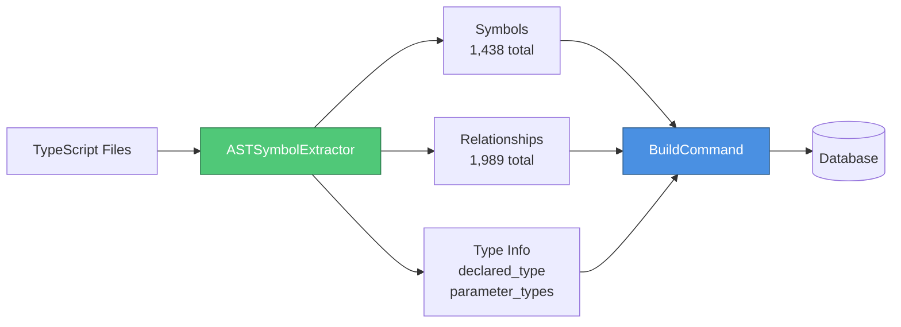
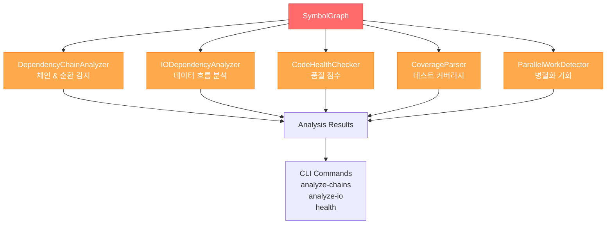
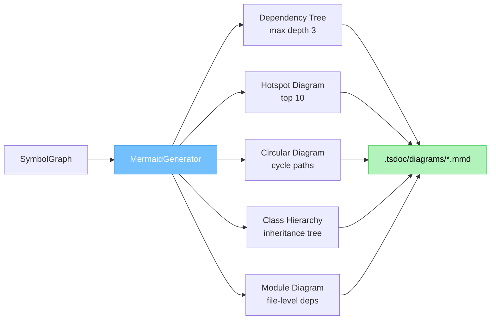
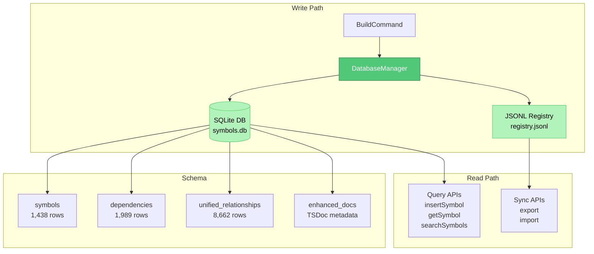
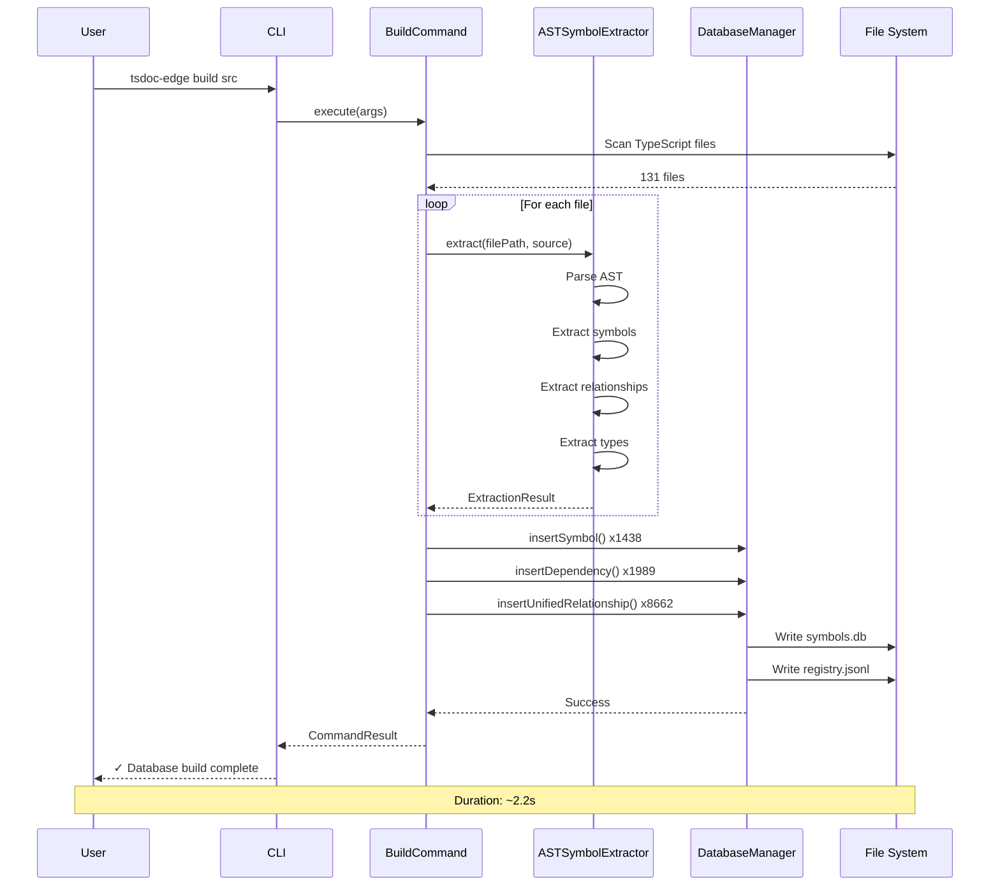
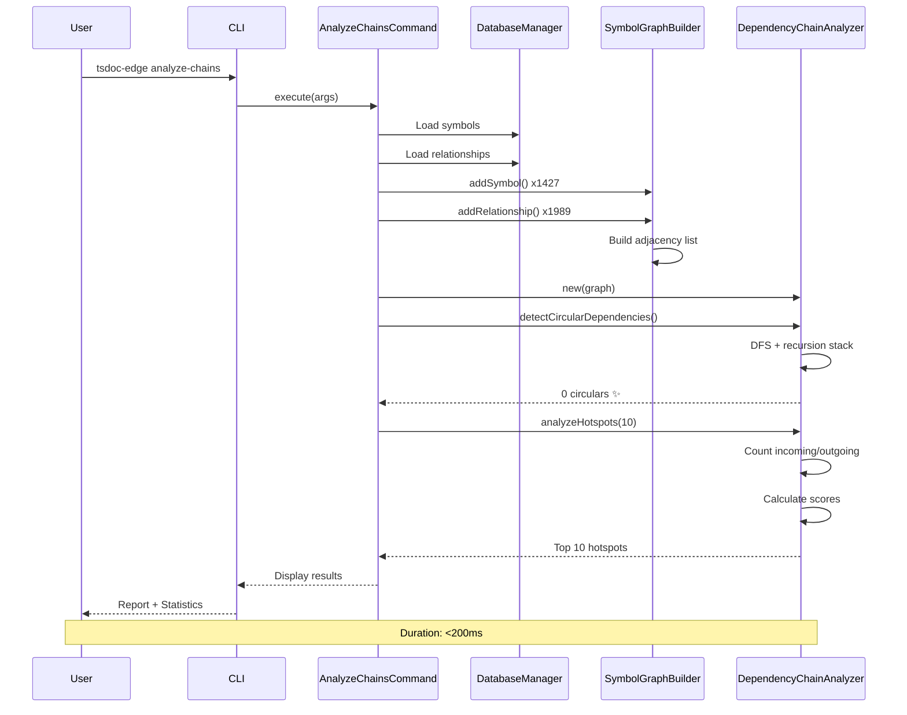
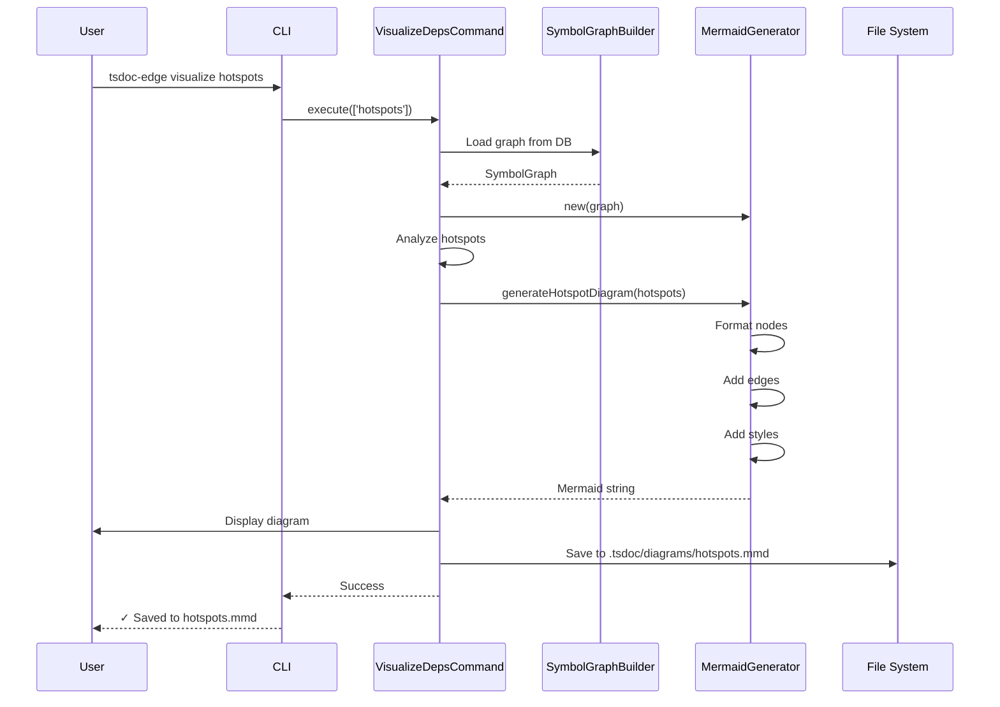

# [[TSDoc Edge System Architecture]]

**Document Type**: Architecture Documentation (SSOT)
**Status**: Current Implementation
**Last Updated**: 2025-11-07
**Version**: 1.0.0

## Purpose

이 문서는 TSDoc Edge의 전체 시스템 아키텍처를 정의하는 **Single Source of Truth (SSOT)**입니다. 모든 서브시스템, 컴포넌트 간 관계, 데이터 흐름을 시각화하고 설명합니다.

---

## System Overview

```mermaid
graph TB
    subgraph "User Interface Layer"
        CLI[CLI Commands<br/>40+ commands]
    end

    subgraph "Core Systems"
        EXTRACT[Symbol Extraction<br/>ASTSymbolExtractor]
        GRAPH[Graph System<br/>SymbolGraphBuilder]
        ANALYZE[Analysis System<br/>5+ Analyzers]
        VIZ[Visualization<br/>MermaidGenerator]
    end

    subgraph "Storage Layer"
        DB[(SQLite Database<br/>symbols.db)]
        JSONL[JSONL Registry<br/>Git-friendly]
    end

    subgraph "Documentation Layer"
        PARSER[TSDoc Parser<br/>Standard + Custom]
        LINKER[Doc-Code Linker<br/>[[Symbol]] refs]
        VALIDATOR[Validators<br/>Convention + SSOT]
    end

    CLI --> EXTRACT
    CLI --> ANALYZE
    CLI --> VIZ

    EXTRACT --> GRAPH
    GRAPH --> DB
    GRAPH --> JSONL

    ANALYZE --> GRAPH
    VIZ --> GRAPH

    PARSER --> LINKER
    LINKER --> VALIDATOR
    VALIDATOR --> DB

    style CLI fill:#4a90e2,stroke:#2e5c8a,color:#fff
    style EXTRACT fill:#50c878,stroke:#2e7d4e,color:#fff
    style GRAPH fill:#ff6b6b,stroke:#c92a2a,color:#fff
    style ANALYZE fill:#ffa94d,stroke:#fd7e14,color:#fff
    style VIZ fill:#74c0fc,stroke:#339af0,color:#fff
    style DB fill:#b2f2bb,stroke:#51cf66,color:#000
    style JSONL fill:#b2f2bb,stroke:#51cf66,color:#000
```

---

## Subsystem Architecture

### 1. Symbol Extraction System

**Purpose**: TypeScript AST 기반 심볼 추출 및 관계 분석



**Key Components**:
- [[ASTSymbolExtractor]] - AST visitor pattern으로 심볼 추출
- [[BuildCommand]] - CLI 진입점, 전체 빌드 오케스트레이션
- [[DatabaseManager]] - SQLite + JSONL 하이브리드 저장

**Data Flow**:
1. TypeScript 파일 스캔 (129개 파일)
2. AST 파싱 및 심볼 추출
3. 관계 추출 (imports, extends, implements, dependsOn)
4. 타입 정보 추출 (return types, parameter types)
5. Database + JSONL 동시 저장

**Performance**:
- 빌드 시간: ~2.2초 (131 파일)
- 처리 속도: ~59 파일/초
- 메모리: ~50MB

---

### 2. Graph System

**Purpose**: 심볼 간 관계를 그래프로 모델링하고 탐색 지원

```mermaid
graph TB
    subgraph "Graph Builder"
        SGB[SymbolGraphBuilder]
        SGB --> NODES[Symbols<br/>Map<id, Symbol>]
        SGB --> EDGES[Adjacency List<br/>Map<from, to[]>]
    end

    subgraph "Graph Operations"
        SEARCH[SymbolSearchEngine<br/>필터링 & 검색]
        TRAVERSE[DepthTraverser<br/>DFS/BFS]
        CHAINS[DependencyChainAnalyzer<br/>체인 & 순환 감지]
    end

    NODES --> SEARCH
    EDGES --> SEARCH
    NODES --> TRAVERSE
    EDGES --> TRAVERSE
    NODES --> CHAINS
    EDGES --> CHAINS

    style SGB fill:#ff6b6b,stroke:#c92a2a,color:#fff
    style SEARCH fill:#74c0fc,stroke:#339af0,color:#fff
    style TRAVERSE fill:#74c0fc,stroke:#339af0,color:#fff
    style CHAINS fill:#74c0fc,stroke:#339af0,color:#fff
```

**Key Components**:
- [[SymbolGraphBuilder]] - 그래프 구축 (symbols + adjacency list)
- [[SymbolSearchEngine]] - 다양한 필터로 심볼 검색
- [[DepthTraverser]] - 깊이/너비 우선 탐색
- [[DependencyChainAnalyzer]] - 의존성 체인 및 순환 감지

**Graph Properties**:
- Nodes: 1,427 symbols
- Edges: 1,989 relationships
- Circular dependencies: 0
- Max depth: ~10 levels

---

### 3. Analysis System

**Purpose**: 다양한 관점에서 코드베이스 분석 및 인사이트 생성



**Key Analyzers**:

1. **[[DependencyChainAnalyzer]]** - 의존성 체인 분석
   - Circular dependency detection (0 found ✨)
   - Hotspot analysis (top 10 bottlenecks)
   - Chain complexity scoring

2. **[[IODependencyAnalyzer]]** - 데이터 흐름 분석
   - Type matching (return → parameter)
   - 7,446 I/O dependencies detected
   - 25,809 pipelines discovered
   - Confidence scoring (0.5-0.7)

3. **[[CodeHealthChecker]]** - 코드 건강도 분석
   - Coverage percentage
   - Documentation completeness
   - Complexity metrics

4. **[[ParallelWorkDetector]]** - 병렬화 기회 탐지
   - Independent work detection
   - Barrier analysis
   - Parallel zone suggestions

5. **[[TestCoverageAnalyzer]]** - 테스트 커버리지 매핑
   - Symbol → Test mapping
   - Coverage sync with Istanbul format

**Analysis Results**:
- Circular dependencies: 0 (100% clean)
- I/O dependencies: 7,446
- Pipelines: 25,809
- Critical hotspots: 10 identified

---

### 4. Visualization System

**Purpose**: Mermaid 다이어그램으로 의존성 시각화



**Key Component**:
- [[MermaidGenerator]] - 5가지 다이어그램 타입 생성

**Diagram Types**:
1. **Dependency Tree**: 특정 심볼로부터 의존성 트리
2. **Hotspot Diagram**: 핵심 병목 지점 시각화
3. **Circular Diagram**: 순환 의존성 경로 (현재 0개)
4. **Class Hierarchy**: 상속 관계 트리
5. **Module Diagram**: 파일 레벨 의존성

**CLI Commands**:
```bash
tsdoc-edge visualize tree <symbol-id>
tsdoc-edge visualize hotspots
tsdoc-edge visualize circular [index]
tsdoc-edge visualize hierarchy <class-id>
tsdoc-edge visualize modules [max]
```

**Output**: `.tsdoc/diagrams/*.mmd` (Mermaid 파일)

---

### 5. Storage System

**Purpose**: SQLite (성능) + JSONL (버전 관리) 하이브리드 저장



**Key Component**:
- [[DatabaseManager]] - 하이브리드 저장소 관리자

**Storage Strategy**:
1. **SQLite** (`.tsdoc/symbols.db`)
   - Fast O(log n) lookups
   - FTS5 full-text search
   - Complex queries (JOIN, GROUP BY)
   - Local development performance

2. **JSONL** (`.tsdoc/registry.jsonl`)
   - Git-friendly (line-based diffs)
   - Human-readable
   - Version control friendly
   - Merge-friendly

**Schema Tables**:
- `symbols`: Core symbol information (1,438 rows)
- `dependencies`: Legacy relationship table (1,989 rows)
- `unified_relationships`: 17 relationship types (8,662 rows)
  - code-dependency: 1,902
  - inheritance: 55
  - io-dependency: 6,705
- `enhanced_docs`: TSDoc metadata
- `test_mappings`: Symbol → Test mapping
- `contracts`, `responsibilities`: Design by Contract

**Indexes**:
- B-Tree: `idx_symbols_name`, `idx_symbols_type`, `idx_symbols_file`
- FTS5: `symbols_fts` (name + summary)
- JSON: `idx_ur_from_first`, `idx_ur_to_first`

---

### 6. Documentation System

**Purpose**: TSDoc 파싱, 문서-코드 링킹, SSOT 검증

```mermaid
graph TB
    subgraph "Parsing"
        TSDoc[TypeScript Files<br/>with JSDoc] --> PARSER[TSDocParser<br/>Standard Tags]
        TSDoc --> ENHANCED[EnhancedDocExtractor<br/>12 Custom Tags]
    end

    subgraph "Linking"
        PARSER --> LINKER[DocCodeLinker<br/>[[Symbol]] refs]
        ENHANCED --> LINKER
        LINKER --> BACKLINK[BacklinkGenerator<br/>Bidirectional links]
    end

    subgraph "Validation"
        BACKLINK --> CONV[ConventionValidator<br/>TSDoc rules]
        BACKLINK --> CONN[ConnectivityValidator<br/>SSOT completeness]
        BACKLINK --> STRICT[StrictModeValidator<br/>6-category system]
    end

    CONV --> REPORT[Validation Report]
    CONN --> REPORT
    STRICT --> REPORT

    style PARSER fill:#4a90e2,stroke:#2e5c8a,color:#fff
    style ENHANCED fill:#4a90e2,stroke:#2e5c8a,color:#fff
    style LINKER fill:#74c0fc,stroke:#339af0,color:#fff
    style CONV fill:#ffa94d,stroke:#fd7e14,color:#fff
    style CONN fill:#ffa94d,stroke:#fd7e14,color:#fff
    style STRICT fill:#ffa94d,stroke:#fd7e14,color:#fff
```

**Key Components**:

1. **[[TSDocParser]]** - 표준 TSDoc 태그 파싱
   - `@public`, `@param`, `@returns`
   - `@internal`, `@deprecated`

2. **[[EnhancedDocExtractor]]** - 12개 커스텀 태그
   - `@problem`, `@solves`, `@context`
   - `@functionality`, `@decision`, `@rationale`
   - `@errorExp`, `@dependency`, `@plan`

3. **[[DocCodeLinker]]** - `[[Symbol]]` 참조 연결
   - Wiki-style linking
   - Bidirectional references
   - Automatic backlink generation

4. **Validators**:
   - [[ConventionValidator]] - TSDoc 컨벤션 준수
   - [[ConnectivityValidator]] - SSOT 연결성 점수
   - [[StrictModeValidator]] - 6-카테고리 완성도

---

## Data Flow: End-to-End

### Build Flow



### Analysis Flow



### Visualization Flow



---

## Key Relationships Explained

### 1. ASTSymbolExtractor → DatabaseManager

**Relationship Type**: Producer-Consumer (Data Flow)

**Data Transferred**:
- `ExtractedSymbol[]`: 1,438 symbols with metadata
- `SymbolRelationship[]`: 2,303 relationships
- Type information: declared_type, parameter_types

**Why Important**:
- 전체 시스템의 데이터 소스
- 모든 분석의 기반이 되는 심볼 그래프 구축
- 타입 정보가 I/O dependency detection을 가능하게 함

**Performance Impact**:
- Bulk insert (1,438 symbols) → ~100ms
- Relationship insert (1,989 deps) → ~50ms
- 병목이 아님 (전체 빌드의 <10%)

---

### 2. SymbolGraph → Analyzers

**Relationship Type**: Service Provider (Read-only)

**Consumers**:
- DependencyChainAnalyzer
- IODependencyAnalyzer
- ParallelWorkDetector
- CodeHealthChecker
- MermaidGenerator

**Why Important**:
- 단일 그래프 표현으로 다양한 분석 지원
- Immutable 구조로 동시 접근 안전
- Adjacency list로 O(1) 의존성 조회

**Design Decision**:
- Graph는 read-only snapshot
- 각 분석은 독립적으로 실행
- 결과는 별도 저장 (unified_relationships 테이블)

---

### 3. IODependencyAnalyzer → Unified Relationships

**Relationship Type**: Analysis Result Storage

**Data Created**:
- 6,705 io-dependency relationships
- Confidence scores (0.5-0.7)
- Evidence trail (type matching)

**Why Important**:
- 명시적 코드 의존성 (import) 외에 데이터 흐름 파악
- 파이프라인 패턴 자동 감지 (25,809 pipelines)
- 리팩토링 시 영향 범위 분석

**Example**:
```typescript
// Producer
class CodeHealthChecker {
  analyze(): AnalysisReport { ... }
}

// Consumer
class AnalyzeCommand {
  printAnalysisReport(report: AnalysisReport) { ... }
}

// I/O Dependency: CodeHealthChecker → AnalysisReport → AnalyzeCommand
```

---

### 4. MermaidGenerator → File System

**Relationship Type**: Output Generator

**Files Created**:
- `.tsdoc/diagrams/hotspots.mmd`
- `.tsdoc/diagrams/tree-{symbol}.mmd`
- `.tsdoc/diagrams/circular-{n}.mmd`
- `.tsdoc/diagrams/hierarchy-{class}.mmd`
- `.tsdoc/diagrams/modules.mmd`

**Why Important**:
- 영구 저장 (Git version control)
- VSCode/GitHub preview 지원
- 문서화 자동화 (README에 embed 가능)

**Integration**:
```bash
# Generate diagram
tsdoc-edge visualize hotspots

# Include in docs
# managed/architecture/diagrams.md

```

---

## System Metrics

### Current State (2025-11-07)

| Metric | Value | Status |
|--------|-------|--------|
| **Files Scanned** | 131 | ✅ |
| **Symbols Total** | 1,438 | ✅ |
| **Methods** | 882 (61%) | ✅ |
| **Interfaces** | 205 (14%) | ✅ |
| **Classes** | 123 (9%) | ✅ |
| **Relationships** | 1,989 (legacy) | ✅ |
| **Unified Relationships** | 8,662 | ✅ |
| **- code-dependency** | 1,902 | ✅ |
| **- inheritance** | 55 | ✅ |
| **- io-dependency** | 6,705 | ✅ |
| **Circular Dependencies** | 0 | ✨ |
| **I/O Pipelines** | 25,809 | ✅ |
| **Build Time** | 2.2s | ✅ |
| **Database Size** | ~5MB | ✅ |

### Performance Benchmarks

| Operation | Duration | Complexity |
|-----------|----------|------------|
| Build (131 files) | 2,237ms | O(n) |
| Symbol extraction | ~17ms/file | O(AST nodes) |
| Relationship insert | ~50ms | O(n) |
| Graph loading | <200ms | O(n + e) |
| Circular detection | <100ms | O(n + e) |
| Hotspot analysis | <50ms | O(n × degree) |
| I/O dependency | ~3s | O(n²) |
| Mermaid generation | <100ms | O(n) |

---

## Extension Points

### Adding New Analyzers

1. Implement analyzer class:
```typescript
export class NewAnalyzer {
  constructor(private graph: SymbolGraph) {}

  analyze(): NewAnalysisResult {
    // Use graph.symbols, graph.adjacencyList
  }
}
```

2. Create CLI command:
```typescript
export class AnalyzeNewCommand extends BaseCommand {
  async execute(args: string[]) {
    const graph = this.loadGraph();
    const analyzer = new NewAnalyzer(graph);
    const results = analyzer.analyze();
    // Display results
  }
}
```

3. Register command in `cli.ts`

### Adding New Relationship Types

1. Define in unified taxonomy (17 types supported)
2. Extract in ASTSymbolExtractor
3. Map to unified type in BuildCommand
4. Query in analyzers

### Adding New Diagram Types

1. Add method to MermaidGenerator:
```typescript
generateNewDiagram(...): string {
  const lines = ['graph TD'];
  // Generate Mermaid syntax
  return lines.join('\n');
}
```

2. Add subcommand to VisualizeDepsCommand

---

## Related Documents

- [[Implementation Progress - 2025-11-07]] - 세션 완료 리포트
- [[System Review - 2025-11-06]] - 초기 상태 분석
- [[Enhanced Database Schema]] - 데이터베이스 스키마 상세
- [[UnifiedRelationships]] - 17가지 관계 타입

---

**Document Owner**: System Architecture Team
**Last Review**: 2025-11-07
**Next Review**: After major feature addition
**Status**: ✅ Production Ready

---

## Backlinks

### Referenced By

- [[ASTSymbolExtractor]] → /home/user/tsdoc-edge/managed/analyzers/ASTSymbolExtractor.md:194
- [[CodeHealthChecker]] → /home/user/tsdoc-edge/managed/analyzers/CodeHealthChecker.md:224
- [[DependencyChainAnalyzer]] → /home/user/tsdoc-edge/managed/analyzers/DependencyChainAnalyzer.md:33
- [[DependencyChainAnalyzer]] → /home/user/tsdoc-edge/managed/analyzers/DependencyChainAnalyzer.md:34
- [[IODependencyAnalyzer]] → /home/user/tsdoc-edge/managed/analyzers/IODependencyAnalyzer.md:29
- [[ParallelWorkDetector]] → /home/user/tsdoc-edge/managed/analyzers/ParallelWorkDetector.md:33
- [[StrictModeValidator]] → /home/user/tsdoc-edge/managed/analyzers/StrictModeValidator.md:266
- [[TestCoverageAnalyzer]] → /home/user/tsdoc-edge/managed/analyzers/TestCoverageAnalyzer.md:37
- [[Mermaid Diagram Validation Workflow]] → /home/user/tsdoc-edge/managed/architecture/mermaid-validation-workflow.md:111
- [[Mermaid Diagram Validation Workflow]] → /home/user/tsdoc-edge/managed/architecture/mermaid-validation-workflow.md:130
- [[BuildCommand]] → /home/user/tsdoc-edge/managed/commands/BuildCommand.md:68
- [[Enhanced Database Schema]] → /home/user/tsdoc-edge/managed/concepts/enhanced-database-schema.md:201
- [[DatabaseManager]] → /home/user/tsdoc-edge/managed/core-components/DatabaseManager.md:217
- [[DatabaseManager]] → /home/user/tsdoc-edge/managed/core-components/DatabaseManager.md:218
- [[DepthTraverser]] → /home/user/tsdoc-edge/managed/graph/DepthTraverser.md:152
- [[EnhancedDocExtractor]] → /home/user/tsdoc-edge/managed/parser/EnhancedDocExtractor.md:252
- [[TSDocParser]] → /home/user/tsdoc-edge/managed/parser/TSDocParser.md:33
- [[UnifiedRelationships]] → /home/user/tsdoc-edge/managed/types/UnifiedRelationships.md:126
- [[ConnectivityValidator]] → /home/user/tsdoc-edge/managed/utilities/ConnectivityValidator.md:113
- [[ConventionValidator]] → /home/user/tsdoc-edge/managed/utilities/ConventionValidator.md:185
- [[DocCodeLinker]] → /home/user/tsdoc-edge/managed/utilities/DocCodeLinker.md:61
- [[MermaidGenerator]] → /home/user/tsdoc-edge/managed/utilities/MermaidGenerator.md:101
- [[SymbolGraphBuilder]] → /home/user/tsdoc-edge/managed/utilities/SymbolGraphBuilder.md:102
- [[SymbolSearchEngine]] → /home/user/tsdoc-edge/managed/utilities/SymbolSearchEngine.md:97

