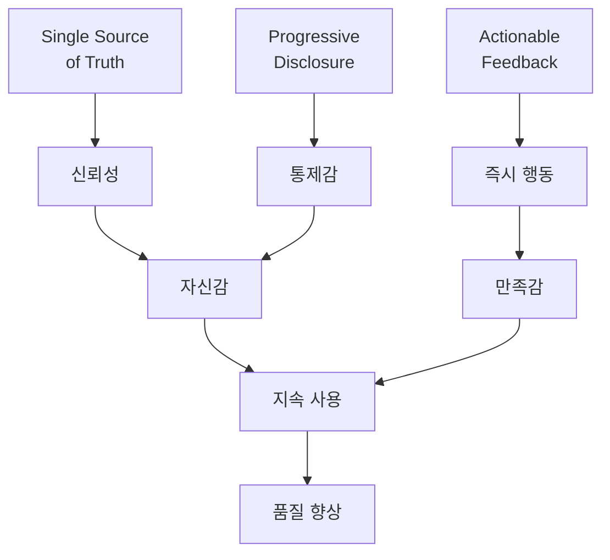

# [[Purpose Refinement]]

**Document Type**: Conceptual Framework

## Purpose

TSDoc Edge의 각 기능과 Phase가 **왜 존재하는지**, **사용자에게 무엇을 제공하는지** 개념적으로 정제합니다.

## Core Philosophy

### Single Source of Truth (SSOT)
**개념:** 하나의 진실된 정보 출처

**적용:**
- 코드 = 심볼 정의의 SSOT
- 문서 = 의도와 맥락의 SSOT
- DB = 현재 상태의 SSOT

**Why it matters:**
> 정보가 여러 곳에 흩어지면 **불일치**가 발생하고, 불일치는 **신뢰 상실**로 이어진다.

---

### Progressive Disclosure
**개념:** 정보를 점진적으로 공개

**계층:**
```
Level 1: health       (단일 숫자: 72)
Level 2: stats        (범주별: Doc 87%, Test 60%)
Level 3: undocumented (개별 항목: 153개 리스트)
Level 4: source code  (실제 코드: 파일:라인)
```

**Why it matters:**
> 모든 정보를 한번에 보여주면 **압도**당한다. 필요한 만큼만 보여주면 **통제감**을 느낀다.

---

### Actionable Feedback
**개념:** 실행 가능한 피드백

**나쁜 예:**
```
"Documentation quality is suboptimal"
(그래서 뭘 하라는거지? 🤔)
```

**좋은 예:**
```
"UserService.config at src/analytics/UsageTracker.ts:44"
(→ 정확히 어디를 고쳐야 하는지 알려줌 ✅)
```

**Why it matters:**
> 추상적 피드백은 **무력감**을 준다. 구체적 위치는 **즉시 행동**을 유도한다.

---

## Purpose Hierarchy

### Level 1: Existential Purpose (존재 목적)
> "왜 이 시스템이 필요한가?"

**문제:**
- 코드와 문서가 따로 놀면 불일치
- 문서 품질을 측정할 수단 없음
- 개선 방향을 알 수 없음

**해결:**
- 코드-문서 자동 연결
- 품질 정량화
- 개선 가이드 제공

---

### Level 2: Functional Purpose (기능 목적)
> "각 기능이 무엇을 하는가?"

| 기능 | 기능 목적 |
|-----|----------|
| `build` | 코드베이스의 현재 상태를 DB로 고정 |
| `health` | 품질을 단일 숫자로 요약 |
| `stats` | 품질을 범주별로 분해 |
| `undocumented` | 미문서화 심볼을 파일:라인으로 특정 |
| `orphans` | 고립된 심볼을 레지스트리에서 탐지 |
| `validate-spec` | 명세서 완성도를 Design/Implementation으로 측정 |
| `index-docs` | 문서 네트워크를 [[Symbol]] 기반으로 구축 |

---

### Level 3: Cognitive Purpose (인지적 목적)
> "사용자의 어떤 질문에 답하는가?"

| 사용자 질문 | 인지적 필요 | 시스템 응답 |
|------------|-------------|-------------|
| "품질이 어때?" | 현황 파악 | `health` → 72/100 |
| "뭐가 문제야?" | 문제 특정 | `undocumented` → 153개 |
| "어디를 고쳐?" | 위치 특정 | 파일:44 |
| "고쳐졌나?" | 피드백 | 72 → 73 ✅ |
| "커밋해도 돼?" | 안전 확인 | `validate-spec` → 86% ✅ |

---

### Level 4: Emotional Purpose (감정적 목적)
> "사용자에게 어떤 느낌을 주는가?"

| Phase | 감정 상태 | 설계 의도 |
|-------|----------|----------|
| health | 궁금함 → **안심** | "72점이면 괜찮네" |
| undocumented | 막막함 → **명확함** | "아, 여기구나" |
| build 후 health | 노력 → **보상** | "점수 올랐다!" |
| validate-spec | 불안 → **확신** | "커밋해도 돼" |

**Why it matters:**
> 도구는 **감정**을 다뤄야 한다. 불안을 해소하고, 성취감을 주고, 자신감을 심어줘야 **지속적으로 사용**된다.

---

## Refined Purpose Definitions

### Phase 1-3: Data Collection
**System Purpose:** 코드베이스를 DB로 변환
**User Purpose:** "현재 상태를 객관적으로 파악할 수 있게"
**Cognitive Purpose:** 신뢰할 수 있는 기준점 제공
**Emotional Purpose:** "이제 뭘 해야 할지 알 수 있겠어" (방향성)

---

### Phase 4: Quality Measurement
**System Purpose:** DB 데이터를 메트릭으로 변환
**User Purpose:** "전체적으로 괜찮은지 나쁜지 판단하고 싶어"
**Cognitive Purpose:** 복잡한 정보를 단일 판단으로 압축
**Emotional Purpose:** "아, 72점이면 괜찮네" (안심) 또는 "45점? 문제네" (경각심)

---

### Phase 5: Issue Detection
**System Purpose:** 메트릭을 개별 항목으로 분해
**User Purpose:** "정확히 뭐가 문제인지 알고 싶어"
**Cognitive Purpose:** 추상 → 구체로 전환
**Emotional Purpose:** "막막함" → "명확함"

---

### Phase 6: Fix Decision
**System Purpose:** 수정 경로 제공
**User Purpose:** "코드를 고칠까, 문서를 쓸까?"
**Cognitive Purpose:** 선택지와 결과 예측
**Emotional Purpose:** "내가 컨트롤하고 있어" (통제감)

---

### Phase 8-11: Document Management
**System Purpose:** 문서 SSOT 검증
**User Purpose:** "문서가 일관되고 완전한지 확인하고 싶어"
**Cognitive Purpose:** 체크리스트 완료감
**Emotional Purpose:** "빠진 게 없어" (완결성)

---

### Phase 12-13: Quality Gate
**System Purpose:** 품질 임계값 검증
**User Purpose:** "커밋해도 괜찮은지 확인하고 싶어"
**Cognitive Purpose:** 최종 승인
**Emotional Purpose:** "불안" → "확신"

---

### Phase 14-15: History Tracking
**System Purpose:** 시계열 데이터 축적
**User Purpose:** "시간이 지나면서 나아지고 있는지 보고 싶어"
**Cognitive Purpose:** 장기 트렌드 파악
**Emotional Purpose:** "계속 발전하고 있어" (성장감)

---

## Cognitive Transformation Map

```
Vague Feeling (막연한 느낌)
  ↓ health
Quantified State (정량화된 상태)
  ↓ stats
Categorized Issues (범주화된 이슈)
  ↓ undocumented
Localized Problems (위치 특정된 문제)
  ↓ [Fix]
Verified Improvement (검증된 개선)
  ↓ validate-spec
Confident Commit (확신 있는 커밋)
```

**Transformation Journey:**
```
😟 "뭔가 불안해"
  → 🔍 "72점이구나"
  → 🎯 "153개 미문서화"
  → 📍 "UserService.ts:44"
  → ✏️ [주석 추가]
  → ✅ "73점!"
  → 😊 "좋아졌어"
```

---

## Design Patterns Applied

### 1. Funnel Pattern (깔때기 패턴)
```
Wide (넓게 시작)
  health: 전체 시스템 한눈에
    ↓
Narrow (좁게 집중)
  undocumented: 특정 파일 특정 라인
    ↓
Action (행동)
  [Fix specific location]
```

### 2. Feedback Loop Pattern
```
Measure → Act → Measure
  72 → [Fix] → 73
  73 → [Fix] → 74
  ...
```

### 3. Safety Net Pattern
```
Try → Validate → Commit
[Doc write] → validate-spec → git commit
                    ↓ Fail
              [Improve more]
```

### 4. Progressive Enhancement Pattern
```
Core: health (필수, 3초)
Enhanced: stats (선택, 10초)
Advanced: undocumented | head (필요시, 30초)
```

---

## Purpose Validation Questions

각 기능을 평가할 때 물어야 할 질문:

### 1. Does it answer a real user question?
**Bad:** "데이터를 JSON으로 출력한다"
**Good:** "커밋해도 괜찮은지 확인한다"

### 2. Is the output actionable?
**Bad:** "Score: 72.3456789"
**Good:** "UserService.ts:44 needs documentation"

### 3. Does it fit the cognitive flow?
**Bad:** 갑자기 복잡한 그래프
**Good:** 숫자 → 범주 → 개별 항목 (점진적)

### 4. Does it provide emotional closure?
**Bad:** "Analysis complete." (그래서?)
**Good:** "72 → 73 ✅" (성취!)

### 5. Can it fail gracefully?
**Bad:** ERROR: NullPointerException
**Good:** "⚠️ 0 documents found. Run build first."

---

## Concept Relationships



---

## Anti-Patterns to Avoid

### ❌ Information Overload
```
tsdoc-edge analyze
[10000 lines of output]
```
**Why bad:** 압도됨, 무엇부터 봐야 할지 모름

### ❌ Abstract Feedback
```
"Quality could be improved"
```
**Why bad:** 어디를? 어떻게?

### ❌ No Intermediate Feedback
```
[Fix 100 files]
...long time...
tsdoc-edge health
"Still 72"
```
**Why bad:** 노력이 헛수고처럼 느껴짐

### ❌ Unclear Next Steps
```
"Analysis complete."
```
**Why bad:** 그 다음은?

---

## Related Concepts

- [[Cognitive User Flow]] - 인지적 사용 흐름
- [[CLI Feedback Cycle]] - 시스템 피드백 사이클
- [[User Mental Model]] - 사용자 멘탈 모델
- [[Progressive Disclosure]] - 점진적 정보 공개 패턴
- [[Immediate Feedback Design]] - 즉각적 피드백 설계 원칙

## References

- Nielsen Norman Group: Progressive Disclosure
- Don Norman: The Design of Everyday Things
- Steve Krug: Don't Make Me Think
- Indi Young: Mental Models
