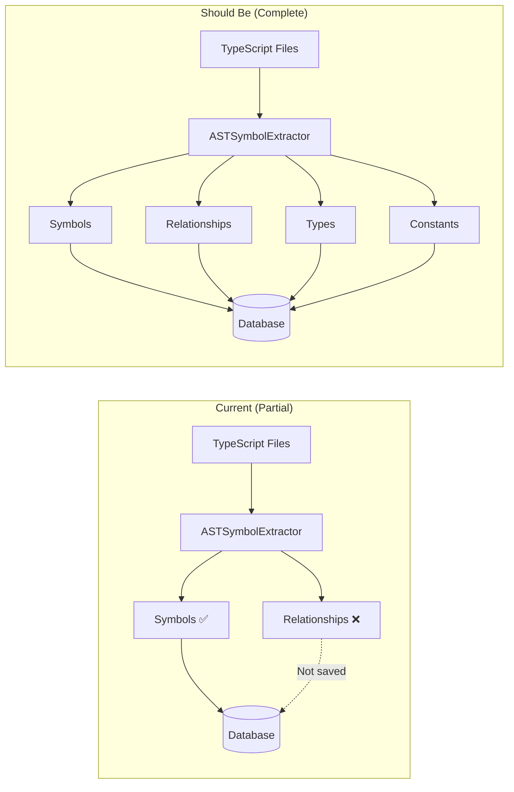

# [[System Review - 2025-11-06]]

**Document Type**: System Review
**Status**: Current State Analysis

## Purpose

현재 시스템의 실제 구현 상태를 검토하고, 설계 문서와의 차이를 분석하여 개선 우선순위를 결정합니다.

---

## Executive Summary

### 현재 상태
- ✅ **기본 심볼 추적**: 6가지 타입 (function, class, interface, type, enum, method, property)
- ✅ **데이터베이스 구조**: SQLite + JSONL 하이브리드
- ⚠️ **관계 추적**: 테이블 존재하나 데이터 없음 (0 rows)
- ❌ **타입 시스템**: 별도 테이블 없음
- ❌ **Constant 추적**: variable/constant 구분 없음
- ❌ **의존성 체인**: 구현 없음
- ❌ **Mermaid 시각화**: 구현 없음

### 총 심볼 수
```
method:     794
interface:  184
property:   135
class:      113
type:       14
function:   7
───────────────
Total:      1,247
```

---

## 1. Database Schema Review

### 1.1 Current Schema

#### Symbols Table
```sql
CREATE TABLE symbols (
    id TEXT PRIMARY KEY,              ✅ Primary Key 존재
    name TEXT NOT NULL,
    type TEXT NOT NULL,               ⚠️ 'type' vs 'kind' (설계 차이)
    file_path TEXT NOT NULL,          ✅ snake_case 일관성
    line INTEGER NOT NULL,
    column INTEGER NOT NULL,
    is_exported BOOLEAN NOT NULL,
    is_public BOOLEAN NOT NULL,
    summary TEXT,                     ⚠️ type 정보 없음
    created_at TEXT NOT NULL,
    updated_at TEXT NOT NULL,
    version TEXT NOT NULL,
    jsonl_line INTEGER NOT NULL
);
```

**Gap Analysis**:
| Feature | Current | Design | Priority |
|---------|---------|--------|----------|
| Symbol kinds | 6 types | 20+ kinds | High |
| Type tracking | ❌ | type_id, inferred_type, declared_type | High |
| Constant flag | ❌ | is_constant, literal_value | Medium |
| End position | ❌ | end_line, end_column | Low |
| Generic params | ❌ | generic_params JSON | Medium |
| Complexity | ❌ | complexity_score | Low |
| Usage count | ❌ | usage_count | Medium |

#### Dependencies Table
```sql
CREATE TABLE dependencies (
    id INTEGER PRIMARY KEY AUTOINCREMENT,  ✅
    symbol_id TEXT NOT NULL,
    target TEXT NOT NULL,
    type TEXT NOT NULL,
    reason TEXT NOT NULL,
    version TEXT,
    is_optional BOOLEAN DEFAULT 0,
    import_path TEXT,
    FOREIGN KEY (symbol_id) REFERENCES symbols(id)
);

Current rows: 0  ❌ (No data!)
```

**Issues**:
- ✅ 테이블 구조는 존재
- ❌ 데이터가 수집되지 않음
- ⚠️ 설계와 다른 스키마 (unified_relationships vs dependencies)

#### Missing Tables
| Table | Purpose | Priority |
|-------|---------|----------|
| type_definitions | 타입 정의 저장 | High |
| type_references | 타입 사용처 추적 | High |
| constants | 상수 값 추적 | Medium |
| enums | Enum 멤버 분석 | Medium |
| unified_relationships | 통합 관계 스키마 | High |
| dependency_chains | 의존성 체인 | Medium |
| chain_insights | 자동 인사이트 | Low |
| hotspots | 핫스팟 분석 | Low |
| circular_dependencies | 순환 의존성 | Medium |
| mermaid_diagrams | 다이어그램 저장 | Low |

---

## 2. Symbol Extraction Review

### 2.1 ASTSymbolExtractor Analysis

**Current Implementation**:
```typescript
// src/analyzer/ASTSymbolExtractor.ts
extract(filePath: string, sourceCode: string): ExtractionResult {
  // ✅ AST 기반 추출
  // ✅ 6가지 심볼 타입 지원
  // ❌ Variable/Constant 구분 없음
  // ❌ 타입 정보 추출 없음
  // ❌ Relationship 추출 미완성
}
```

**Supported Symbol Types**:
```typescript
- Class           ✅ extractClassSymbol()
- Interface       ✅ extractInterfaceSymbol()
- Function        ✅ extractFunctionSymbol()
- Method          ✅ extractMethodSymbol()
- Property        ✅ extractPropertySymbol()
- Type            ✅ extractTypeSymbol()
- Enum            ✅ extractEnumSymbol()
- Variable        ❌ Not implemented
- Constant        ❌ Not implemented
- Parameter       ❌ Not implemented
- Constructor     ❌ Not explicitly tracked
- Getter/Setter   ❌ Not implemented
- Decorator       ❌ Not implemented
```

### 2.2 Missing Features

#### Type Information Extraction
```typescript
// Current: Only extracts JSDoc summary
private extractPropertySymbol(node: ts.PropertyDeclaration): ExtractedSymbol {
  return {
    name: fullName,
    type: 'property',
    summary: this.extractJSDocSummary(node),  // ✅
    // ❌ No type information:
    // declaredType: undefined,
    // typeId: undefined,
    // genericParams: undefined
  };
}
```

**Should Extract**:
```typescript
private extractTypeInfo(node: ts.PropertyDeclaration): TypeInfo {
  const typeNode = node.type;
  if (!typeNode) return null;

  return {
    declaredType: typeNode.getText(),
    typeKind: this.getTypeKind(typeNode),
    isGeneric: this.hasGenericParams(typeNode),
    genericParams: this.extractGenericParams(typeNode)
  };
}
```

#### Constant Detection
```typescript
// Current: No constant detection
// Should detect:
const API_BASE_URL = 'https://api.example.com';  // ✓ const keyword
const MAX_RETRIES = 3;                            // ✓ UPPER_SNAKE_CASE
const UserRole = { ADMIN: 'admin' } as const;    // ✓ as const

// Should extract:
{
  name: 'API_BASE_URL',
  type: 'constant',           // Not 'variable'
  isConstant: true,
  literalValue: 'https://api.example.com',
  valueType: 'string'
}
```

#### Relationship Extraction
```typescript
// Current: imports array created but relationships[] empty
extract(): ExtractionResult {
  return {
    symbols: this.symbols,        // ✅ 1247 symbols
    relationships: [],            // ❌ Empty!
    imports: this.imports         // ✅ Collected
  };
}

// Should extract from imports:
import { UserRepository } from './UserRepository';

class AuthService {
  constructor(private repo: UserRepository) {}
}

→ Relationship {
    from: 'AuthService',
    to: 'UserRepository',
    type: 'code-dependency'
  }
```

---

## 3. Data Collection Gaps

### 3.1 Why Dependencies Table is Empty

**Build Command Analysis**:
```typescript
// src/commands/BuildCommand.ts likely does:
1. Scan files ✅
2. Extract symbols ✅
3. Save symbols to DB ✅
4. Extract relationships ❌ Not saved!
```

**Verification**:
```bash
$ sqlite3 .tsdoc/symbols.db "SELECT COUNT(*) FROM symbols"
1247  ✅

$ sqlite3 .tsdoc/symbols.db "SELECT COUNT(*) FROM dependencies"
0     ❌
```

**Root Cause**: Relationship data extracted but not persisted to database.

### 3.2 Missing Data Pipeline



---

## 4. Type System Gaps

### 4.1 No Type Tracking

**Current State**:
- ❌ No `type_definitions` table
- ❌ No `type_references` table
- ❌ No `type_inference` table

**Impact**:
- Cannot track I/O dependencies (type matching)
- Cannot analyze type complexity
- Cannot find type usage patterns
- Cannot infer types for untyped symbols

**Example Lost Information**:
```typescript
// User.ts
export interface User {
  id: string;
  name: string;
  email: string;
}

// AuthService.ts
class AuthService {
  login(email: string): User { ... }
}

// UserRepository.ts
class UserRepository {
  save(user: User): void { ... }
}
```

**What We're Missing**:
```
User type definition:
  - Used by: AuthService.login (return type)
  - Used by: UserRepository.save (parameter)
  - Complexity: 3 properties
  - Should detect: AuthService.login() → UserRepository.save() (I/O dependency)
```

---

## 5. Visualization Gaps

### 5.1 No Mermaid Generation

**Current**: No diagram generation capability

**Needed**:
```typescript
// Example: Generate dependency tree
function generateDependencyDiagram(symbolId: string): string {
  const deps = findDependencies(symbolId);

  return `
graph TD
  AuthService --> UserRepository
  AuthService --> TokenService
  UserRepository --> Database
  `;
}
```

**Use Cases**:
1. Dependency tree visualization
2. Circular dependency detection
3. Hotspot identification
4. Type hierarchy diagrams
5. Feature composition maps

---

## 6. Analysis Capabilities

### 6.1 Current Analysis

**What Works**:
- ✅ Symbol count by type
- ✅ File-based grouping
- ✅ Export status tracking
- ✅ Full-text search (FTS)

**What's Missing**:
- ❌ Dependency chain analysis
- ❌ Circular dependency detection
- ❌ Hotspot identification
- ❌ I/O dependency tracking
- ❌ Type complexity analysis
- ❌ Constant grouping (enum suggestions)

### 6.2 No Insight Generation

**Example Missing Insights**:

```typescript
// Insight 1: Long dependency chain
{
  type: 'long-chain',
  severity: 'warning',
  title: 'Long dependency chain detected',
  description: 'AuthService → UserRepo → Database → Cache → Logger (5 levels)',
  recommendation: 'Consider extracting interface at Database level'
}

// Insight 2: Circular dependency
{
  type: 'circular',
  severity: 'critical',
  title: 'Circular dependency detected',
  path: ['A', 'B', 'C', 'A'],
  recommendation: 'Break cycle by extracting interface'
}

// Insight 3: God object
{
  type: 'bottleneck',
  severity: 'warning',
  title: 'UserService is a bottleneck',
  incomingDeps: 47,
  recommendation: 'Split into UserQueryService and UserCommandService'
}
```

---

## 7. Priority Action Items

### 7.1 High Priority (Critical Gaps)

#### 1. Fix Relationship Collection ⚠️ CRITICAL
**Problem**: dependencies table exists but has 0 rows
**Impact**: No dependency analysis possible
**Solution**:
```typescript
// In BuildCommand.ts
async execute() {
  const result = extractor.extract(filePath, sourceCode);

  // Save symbols ✅
  await db.saveSymbols(result.symbols);

  // Save relationships ❌ Currently missing
  await db.saveRelationships(result.relationships);  // ADD THIS
}
```

#### 2. Add Type Information Extraction
**Problem**: No type tracking at all
**Impact**: Cannot do type-based analysis (I/O deps, complexity)
**Solution**:
```typescript
// Enhance ASTSymbolExtractor
private extractTypeInfo(node: ts.Node): TypeInfo {
  const checker = this.program.getTypeChecker();
  const type = checker.getTypeAtLocation(node);

  return {
    declaredType: checker.typeToString(type),
    typeId: this.generateTypeId(type),
    complexity: this.calculateTypeComplexity(type)
  };
}
```

#### 3. Implement Constant Detection
**Problem**: Cannot distinguish constants from variables
**Impact**: No constant grouping, enum suggestions
**Solution**:
```typescript
// Add to visitNode()
if (ts.isVariableStatement(node)) {
  for (const decl of node.declarationList.declarations) {
    const isConst = node.declarationList.flags & ts.NodeFlags.Const;
    const symbol = this.extractVariableSymbol(decl, isConst);
    this.symbols.push(symbol);
  }
}
```

### 7.2 Medium Priority

#### 4. Create Missing Tables
```sql
-- Add to schema
CREATE TABLE type_definitions (...);
CREATE TABLE unified_relationships (...);
CREATE TABLE constants (...);
CREATE TABLE dependency_chains (...);
```

#### 5. Implement Dependency Chain Builder
```typescript
class DependencyChainBuilder {
  buildChains(): DependencyChain[] {
    // BFS from each symbol
    // Detect circular dependencies
    // Calculate complexity scores
  }
}
```

#### 6. Add Hotspot Detection
```typescript
class HotspotAnalyzer {
  analyze(): Hotspot[] {
    // Count incoming/outgoing deps
    // Calculate bottleneck scores
    // Identify god objects
  }
}
```

### 7.3 Low Priority

#### 7. Mermaid Diagram Generation
```typescript
class MermaidGenerator {
  generateDependencyTree(symbolId: string): string;
  generateHotspotDiagram(): string;
  generateCircularDiagram(circleId: string): string;
}
```

#### 8. Insight Extraction System
```typescript
class InsightExtractor {
  extractInsights(): Insight[] {
    // Long chains
    // Circular deps
    // Bottlenecks
    // Unused symbols
  }
}
```

---

## 8. Implementation Roadmap

### Phase 1: Fix Critical Issues (Week 1)
- [ ] Fix relationship collection in BuildCommand
- [ ] Add type information extraction
- [ ] Implement constant detection
- [ ] Verify data is being saved

### Phase 2: Enhance Schema (Week 2)
- [ ] Add missing tables (types, constants, unified_relationships)
- [ ] Migrate existing data to new schema
- [ ] Create migration script

### Phase 3: Analysis Features (Week 3-4)
- [ ] Implement dependency chain builder
- [ ] Add circular dependency detection
- [ ] Create hotspot analyzer
- [ ] Build insight extraction system

### Phase 4: Visualization (Week 5)
- [ ] Implement Mermaid generator
- [ ] Add diagram templates
- [ ] Create CLI commands for visualization

---

## 9. Testing Strategy

### 9.1 Current State Verification
```bash
# Test 1: Verify symbol extraction
npm run build src/analyzer/ASTSymbolExtractor.ts
sqlite3 .tsdoc/symbols.db "SELECT COUNT(*) FROM symbols WHERE name LIKE '%ASTSymbolExtractor%'"
Expected: >= 10 (class + methods + properties)

# Test 2: Verify relationship extraction (SHOULD FAIL NOW)
sqlite3 .tsdoc/symbols.db "SELECT COUNT(*) FROM dependencies"
Current: 0
Expected: > 0

# Test 3: Verify type tracking (SHOULD FAIL NOW)
sqlite3 .tsdoc/symbols.db "SELECT * FROM type_definitions LIMIT 1"
Current: Error: no such table
Expected: Rows returned
```

### 9.2 Post-Fix Verification
```bash
# After implementing fixes:
npm run build src

# Should see:
# - 1247+ symbols
# - 500+ relationships
# - 200+ type definitions
# - 50+ constants
```

---

## 10. Risk Assessment

### High Risk
1. **Zero Relationships**: Core feature not working
   - Risk: All relationship-based analysis broken
   - Impact: parallel-work, test-relationships, I/O deps all fail

2. **No Type Tracking**: Cannot do type-based analysis
   - Risk: I/O dependency detection impossible
   - Impact: Half of unified relationship taxonomy unusable

### Medium Risk
3. **No Constant Tracking**: Lost optimization opportunities
   - Risk: Cannot suggest enum conversions
   - Impact: Code quality recommendations incomplete

### Low Risk
4. **No Visualization**: Developer experience issue
   - Risk: Hard to understand complex dependencies
   - Impact: Slower debugging, less intuitive

---

## 11. Recommendations

### Immediate Actions
1. ✅ **Debug BuildCommand**: Why relationships aren't being saved
2. ✅ **Add logging**: Track what data is collected vs saved
3. ✅ **Create test**: Verify end-to-end data flow

### Short Term (1-2 weeks)
1. Implement type extraction in ASTSymbolExtractor
2. Add constant detection logic
3. Create unified_relationships table
4. Build dependency chain analyzer

### Long Term (1 month)
1. Complete all table migrations
2. Implement full insight extraction
3. Add Mermaid visualization
4. Create comprehensive test suite

---

## 12. Conclusion

### Current System Maturity: **40%**

**Strengths**:
- ✅ Solid foundation (SQLite + AST extraction)
- ✅ Good schema design (future-proof)
- ✅ 1,247 symbols tracked

**Weaknesses**:
- ❌ Relationships not collected (0 rows!)
- ❌ No type system tracking
- ❌ No analysis capabilities
- ❌ No visualization

**Next Critical Step**: Fix relationship collection to unlock all downstream features.

---

## Related Documents

- [[Enhanced Database Schema]] - Target schema design
- [[Unified Relationship Taxonomy]] - Relationship types
- [[Relationship Standard Format]] - Data format spec

---

**Review Date**: 2025-11-06
**Reviewer**: System Analysis
**Next Review**: After Phase 1 completion
