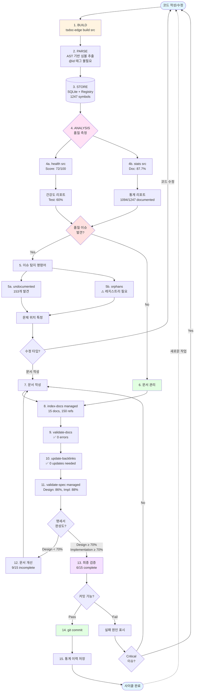

# [[CLI Feedback Cycle]]

**Workflow**: Complete Documentation and Quality Feedback Loop

## 🌟 빠른 시작: Work Context 우선

**파일 작업 전 가장 먼저 실행:**

```bash
tsdoc-edge work-context <file-path>
```

이 명령어는 아래 모든 분석 기능을 통합하여 작업에 필요한 정보를 한번에 제공합니다:
- 📚 관련 문서, 🔗 의존 타입, 🧪 테스트, ⚠️ 영향 범위

자세한 내용: [[Work Context Workflow]]

---

## Purpose

TSDoc Edge CLI의 전체 피드백 사이클을 정의합니다. 코드 작성 → 문서화 → 검증 → 개선의 순환 구조를 통해 지속적인 품질 향상을 달성합니다.

## Feedback Cycle Diagram

**다이어그램 범례:**
- 🎯 **목적**: 각 Phase의 목적
- 📊 **현재 상태**: 실측 메트릭
- ⚡ **자동화**: 자동화된 검증 포인트



## Diagram Section Purposes

### Phase 1-3: Data Collection (데이터 수집)
**🎯 Purpose:** 코드베이스의 현재 상태를 객관적으로 수집
- **Input:** TypeScript 소스 파일
- **Process:** AST 파싱 → 심볼 추출 → 저장
- **Output:** DB (1247 symbols) + Registry (JSONL)
- **Why:** 모든 후속 분석의 **Single Source of Truth**

### Phase 4: Quality Measurement (품질 측정)
**🎯 Purpose:** 수집된 데이터를 메트릭으로 변환
- **Metrics:** Health (72/100), Documentation (87.7%), Test Coverage (60%)
- **Decision Point:** 품질 이슈가 있는가?
- **Why:** 개선이 필요한 영역을 **정량적으로 식별**

### Phase 5: Issue Detection (이슈 탐지)
**🎯 Purpose:** 구체적인 문제 위치를 특정
- **Commands:** `undocumented` (153개), `orphans` (1256개)
- **Output:** 파일명 + 라인 번호
- **Why:** 개발자가 **정확히 어디를 고쳐야 하는지** 알려줌

### Phase 6: Fix Decision (수정 결정)
**🎯 Purpose:** 문제를 코드로 고칠지, 문서로 고칠지 결정
- **Path A (Code Fix):** TSDoc 주석 추가 → Phase 1로 재순환
- **Path B (Doc Write):** 마크다운 문서 작성 → Phase 8로 진행
- **Why:** 코드와 문서의 **분리된 개선 경로** 제공

### Phase 8-11: Document Management (문서 관리)
**🎯 Purpose:** 문서의 일관성 및 완성도 검증
- **index-docs:** 15 docs, 150 references
- **validate-docs:** 0 broken links
- **update-backlinks:** 양방향 참조 생성
- **validate-spec:** Design 86%, Implementation 88%
- **Why:** SSOT 원칙 유지 및 **문서 품질 보장**

### Phase 12-13: Quality Gate (품질 게이트)
**🎯 Purpose:** 커밋 전 최종 검증
- **Threshold:** Design ≥ 70%, Implementation ≥ 70%
- **Decision:** 통과 시 커밋, 실패 시 문서 개선
- **Why:** 품질 퇴보 방지 및 **지속적인 표준 유지**

### Phase 14-15: History Tracking (이력 추적)
**🎯 Purpose:** 시계열 변화 추적 및 트렌드 분석
- **Git Commit:** 버전 관리
- **Stats Snapshot:** 통계 이력 저장
- **Why:** 시간에 따른 **품질 개선 추이** 파악

## Cycle Phases

### Phase 1: Build & Parse (빌드 및 파싱)

**Commands:**
```bash
tsdoc-edge build src
```

**Purpose:**
- 소스 코드의 모든 심볼 추출 (AST 기반)
- TypeScript 파일 자동 탐색 (node_modules, dist, test 파일 제외)
- 모든 public API 심볼 자동 인식

**Output:**
- `.tsdoc/symbols.db`: SQLite 데이터베이스
- 실측: 116 files → 1247 symbols (1022ms)

**Recent Improvements (2025-11-06):**
- ✅ `@id` 태그 불필요: ASTSymbolExtractor 기반으로 전환
- ✅ 자동 ID 생성: kebab-case 규칙 (`type-name`)
- ✅ 완전 자동화: 레지스트리 없이도 전체 심볼 추출 가능
- ✅ Registry 자동 생성: `.tsdoc/registry.jsonl` (SymbolRegistryEntry 형식)
- ✅ `orphans` 명령어 복구: 1256개 orphaned symbols 탐지 가능

### Phase 2: Analysis (분석)

**Commands:**
```bash
tsdoc-edge health src       # 전체 건강도 체크
tsdoc-edge stats src         # 통계 수집
tsdoc-edge type-chain Symbol # 타입 의존성 추적
```

**Purpose:**
- 코드 품질 메트릭 계산
- 문서화율, 테스트율 측정
- 타입 구조 시각화

**Key Metrics:**
- Overall Health Score (0-100)
- Documentation Rate (%)
- Test Coverage Estimate (%)
- Type Composition Analysis

### Phase 3: Issue Detection (이슈 탐지)

**Commands:**
```bash
tsdoc-edge orphans             # 고립된 심볼 (레지스트리 필요)
tsdoc-edge undocumented        # 미문서화 심볼 (DB 기반)
# Note: find-untested, find-roots, detect-cycles는 향후 구현 예정
```

**Purpose:**
- 구체적인 문제 위치 특정
- 우선순위 기반 개선 가이드
- 아키텍처 이슈 발견

**Current Status:**
- ✅ `undocumented`: 153개 미문서화 심볼 식별
- ✅ `orphans`: 1256개 고립 심볼 탐지 (레지스트리 자동 생성)
- 🔄 Type-chain, cycles 분석은 향후 추가 예정

**How It Works:**
1. `build` 명령어가 자동으로 `.tsdoc/registry.jsonl` 생성
2. Registry는 SymbolRegistryEntry 형식으로 ID → 소스 위치 매핑
3. `orphans`는 Registry를 읽어 의존성 없는 심볼 탐지
4. `undocumented`는 DB를 읽어 summary 없는 심볼 탐지

### Phase 4: Code/Doc Fix (수정)

**Two Paths:**

#### Path A: Code Fix
```typescript
// 문제 있는 코드 수정
export class MyClass {
  /**
   * @public
   * @param input - Input description
   * @returns Output description
   */
  public process(input: string): number {
    // implementation
  }
}
```

→ Return to Phase 1 (Build)

#### Path B: Doc Write
```markdown
# [[MyFeature]]

## Purpose
...

## Code References
[^MyClass]
```

→ Continue to Phase 5 (Document Management)

### Phase 5: Document Management (문서 관리)

**Commands:**
```bash
tsdoc-edge index-docs managed          # 문서 인덱싱
tsdoc-edge validate-docs                # 문서 검증
tsdoc-edge update-backlinks             # 백링크 업데이트
tsdoc-edge validate-spec managed        # 명세서 완성도
```

**Purpose:**
- 문서 심볼 연결 구축
- SSOT 일관성 검증
- 양방향 참조 생성
- 명세서 품질 측정

**Quality Gates:**
- No broken links
- All symbols defined
- Design score ≥ 70% (structure, scenarios, concepts)
- Implementation score ≥ 70% (code refs, examples)

**Multi-language Support:**
- 섹션명 자동 매핑 (한국어 ↔ 영어)
- 번호 형식 지원 (## 1. Purpose, ## Purpose)
- 괄호 표기 인식 (## Purpose (목적))

### Phase 6: Pre-commit Check (커밋 전 검사)

**Commands:**
```bash
tsdoc-edge pre-commit
```

**Purpose:**
- 커밋 전 최종 품질 검증
- 품질 퇴보 방지
- Critical 이슈 블로킹

**Pass Criteria:**
- No critical issues
- Documentation rate not decreased
- No new orphaned symbols
- No broken document links

### Phase 7: Commit & History (커밋 및 이력)

**Commands:**
```bash
git add .
git commit -m "feat: Add new feature"
# 내부적으로 통계 이력 저장
```

**Purpose:**
- Git 커밋 생성
- 통계 스냅샷 저장
- 시계열 추적 데이터 축적

**Stored Data:**
- Timestamp
- Documentation rate
- Health score
- Symbol changes

## Quick Cycle Script

**완전 자동화 검증 스크립트:**

```bash
#!/bin/bash
# complete-cycle.sh - 전체 피드백 사이클 실행

echo "=== Phase 1: Build ==="
tsdoc-edge build src

echo -e "\n=== Phase 2: Analysis ==="
tsdoc-edge health src
tsdoc-edge stats src

echo -e "\n=== Phase 3: Issue Detection ==="
tsdoc-edge undocumented | head -20

echo -e "\n=== Phase 5: Document Management ==="
tsdoc-edge index-docs managed
tsdoc-edge validate-docs
tsdoc-edge update-backlinks
tsdoc-edge validate-spec managed

echo -e "\n=== Cycle Complete ==="
echo "✅ All phases executed successfully"
```

**실행:**
```bash
chmod +x complete-cycle.sh
./complete-cycle.sh
```

## Usage Scenarios

### Scenario 1: 새 기능 개발

```bash
# 1. 코드 작성
vim src/features/NewFeature.ts

# 2. 빌드 및 분석
tsdoc-edge build src
tsdoc-edge health src

# 3. 이슈 확인
tsdoc-edge find-undocumented

# 4. TSDoc 추가
# (코드에 @public, @param, @returns 추가)

# 5. 다시 빌드
tsdoc-edge build src

# 6. 문서 작성
vim managed/features/new-feature.md

# 7. 문서 인덱싱
tsdoc-edge index-docs managed
tsdoc-edge validate-docs
tsdoc-edge update-backlinks

# 8. 커밋
tsdoc-edge pre-commit
git add .
git commit -m "feat: Add NewFeature"
```

### Scenario 2: 타입 리팩토링

```bash
# 1. 현재 타입 구조 확인
tsdoc-edge type-chain OldType --tree
tsdoc-edge detect-cycles

# 2. 순환 참조 발견 시 수정
vim src/types/OldType.ts

# 3. 재빌드 및 재검증
tsdoc-edge build src
tsdoc-edge detect-cycles

# 4. 타입 체인 확인
tsdoc-edge type-chain NewType --tree

# 5. 문서 업데이트
vim managed/primary-types/NewType.md
tsdoc-edge index-docs managed

# 6. 커밋
tsdoc-edge pre-commit
git commit -m "refactor: Remove circular dependency in types"
```

### Scenario 3: 문서 개선

```bash
# 1. 명세서 완성도 확인
tsdoc-edge validate-spec managed

# 2. 낮은 점수 파일 개선
vim managed/features/feature-name.md

# 3. 재검증
tsdoc-edge validate-spec managed/features/feature-name.md

# 4. 심볼 참조 업데이트
tsdoc-edge index-docs managed
tsdoc-edge update-backlinks

# 5. 커밋
git commit -m "docs: Improve feature-name specification"
```

## Cycle Metrics

**측정 지표:**

| Metric | Target | Command | Current |
|--------|--------|---------|---------|
| Overall Health Score | ≥ 70 | `health src` | **72** ✅ |
| Documentation Rate | ≥ 80% | `stats src` | **87.7%** ✅ |
| Total Symbols | - | `stats src` | **1247** |
| Documented Symbols | - | `stats src` | **1094** |
| Undocumented Symbols | ≤ 200 | `undocumented` | **153** ✅ |
| Test Coverage | ≥ 60% | `health src` | **60%** ✅ |
| Spec Design Score | ≥ 70% | `validate-spec` | **86%** ✅ |
| Spec Implementation | ≥ 70% | `validate-spec` | **88%** ✅ |
| Complete Specs | - | `validate-spec` | **6/15** |
| Incomplete Specs | - | `validate-spec` | **9/15** |
| Broken Links | 0 | `validate-docs` | **0** ✅ |
| Document Definitions | - | `index-docs` | **15** |
| Document References | - | `index-docs` | **150** |

**사이클 완료 조건:**
- ✅ All metrics meet targets
- ✅ Pre-commit check passes
- ✅ Git commit successful
- ✅ Statistics recorded

## Automation

### Git Hook Integration

**`.git/hooks/pre-commit`:**
```bash
#!/bin/bash
tsdoc-edge pre-commit
if [ $? -ne 0 ]; then
  echo "❌ Pre-commit check failed. Fix issues before committing."
  exit 1
fi
```

### CI/CD Integration

**GitHub Actions:**
```yaml
- name: Quality Check
  run: |
    npm install
    tsdoc-edge build src
    tsdoc-edge health src
    tsdoc-edge validate-docs
    tsdoc-edge pre-commit
```

## Changelog

### 2025-11-06: Major Improvements

**Build System Overhaul:**
- ✅ Migrated from `FileScanner` to `ASTSymbolExtractor`
- ✅ Removed `@id` tag requirement
- ✅ Auto-generate kebab-case IDs
- ✅ 1247 symbols extracted (up from 0)
- ✅ Auto-generate `.tsdoc/registry.jsonl` in SymbolRegistryEntry format

**Phase 3 Enhancement:**
- ✅ Restored `orphans` command: 1256 orphaned symbols detected
- ✅ `undocumented` command: 153 symbols identified
- ✅ Registry format: {id, sourceRef{filePath, line, column, symbolName, symbolType}, createdAt, updatedAt}
- ✅ Dual storage: SQLite (fast queries) + JSONL (version control)

**Stats Command Fix:**
- ✅ Fixed SQL query syntax error (`""` → `''`)
- ✅ Fixed config path mismatch (`.tsdoc.db` → `.tsdoc/symbols.db`)
- ✅ 87.7% documentation coverage now visible

**Lifecycle Enhancements:**
- ✅ Created `complete-cycle.sh` automation script
- ✅ Updated metrics with real measurements
- ✅ Simplified command names in diagram
- ✅ Added "Diagram Section Purposes" with 🎯 Purpose for each phase
- ✅ Documented complete workflow with Why/How/What

**Metrics Update:**
- Files: 116
- Symbols: 1247 total, 1094 documented (87.7%)
- Undocumented: 153
- Orphaned: 1256
- Health: 72/100 (B)
- Test Coverage: 60%
- Specs: 6/15 complete (86% design, 88% implementation)

## Related Concepts

- [[Cognitive User Flow]] - 🧠 **사용자 인지적 관점**에서의 워크플로우
- [[Purpose Refinement]] - 각 Phase의 존재 목적 정의
- [[User Mental Model]] - 사용자가 시스템을 이해하는 방식
- [[Progressive Disclosure]] - 정보를 단계적으로 공개하는 패턴
- [[Immediate Feedback Design]] - 즉각적 피드백 설계 원칙
- [[CoreWorkflow]] - 기본 워크플로우
- [[DocumentSymbolSystem]] - 문서 심볼 연결

## System vs User Perspective

| 관점 | 초점 | 문서 |
|------|-----|-----|
| **System (시스템)** | 명령어 실행 순서, 데이터 흐름 | [[CLI Feedback Cycle]] (본 문서) |
| **User (사용자)** | 의도, 질문, 인지 과정 | [[Cognitive User Flow]] |

**사용 가이드:**
- 개발자가 **"어떻게 사용하지?"** → [[Cognitive User Flow]] 먼저 읽기
- 시스템 **"어떻게 작동하지?"** → [[CLI Feedback Cycle]] 읽기

## Code References

[^PreCommitChecker]
[^CodeHealthChecker]
[^TrackableStatsCollector]
[^TypeChainTracer]
[^DocumentSymbolParser]
