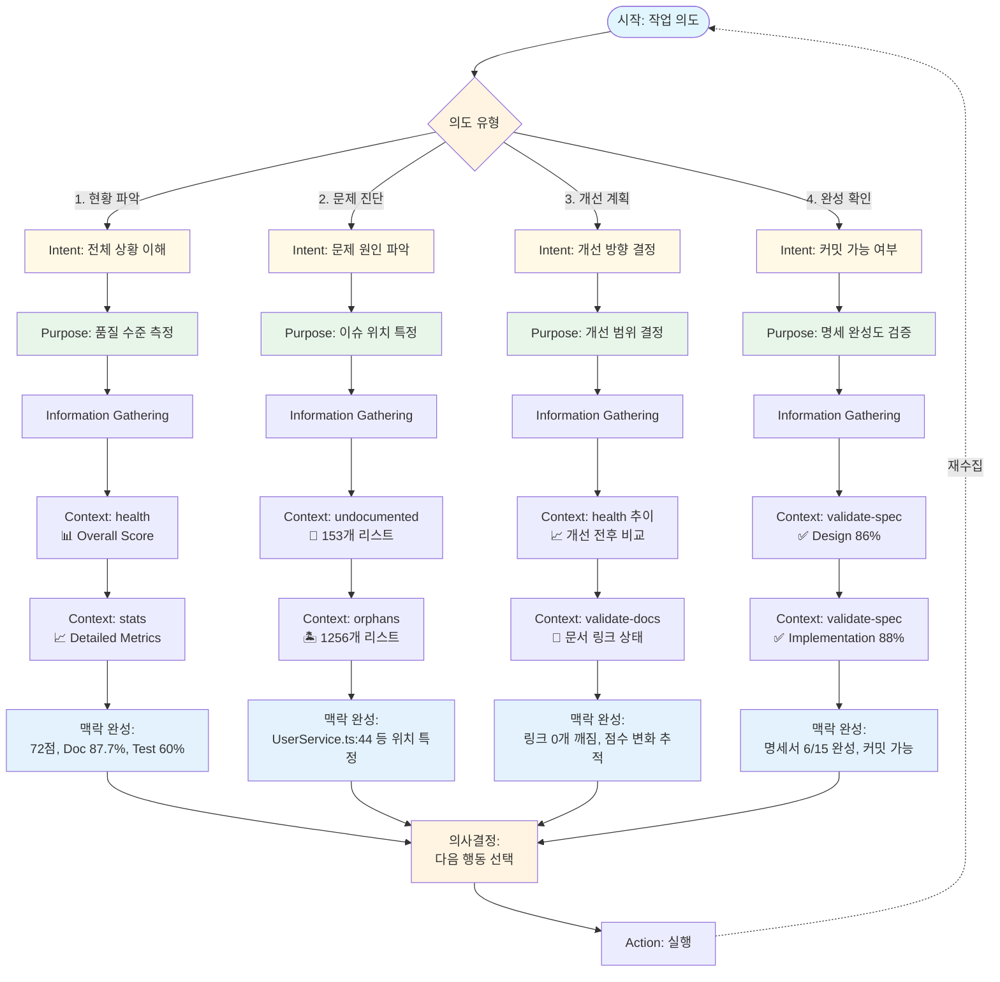

# [[Cognitive User Flow]]

**Document Type**: User Mental Model

## Purpose

개발자의 **인지적 관점**에서 TSDoc Edge CLI 사용 흐름을 정의합니다. 시스템 명령어가 아닌 **사용자의 의도, 질문, 행동**을 중심으로 워크플로우를 재구성합니다.

## Context Gathering Flow

**핵심 개념:** 사용자는 **맥락(Context)**을 수집하여 **의사결정(Decision)**을 내린다.



## Context Gathering Process Breakdown

### Layer 1: Intent Recognition (의도 파악)

**정의:** 사용자가 무엇을 이루고자 하는가?

**4가지 의도 유형:**

| Intent | Description | Example |
|--------|-------------|---------|
| **현황 파악** | 전체 상황 이해 | "지금 품질이 어느 정도지?" |
| **문제 진단** | 문제 원인 파악 | "뭐가 문제인거지?" |
| **개선 계획** | 개선 방향 결정 | "어떻게 고치지?" |
| **완성 확인** | 커밋 가능 여부 | "이제 커밋해도 돼?" |

**핵심 통찰:**
> 사용자는 명확한 의도를 가지고 시작하지 않을 수 있다. 시스템은 **의도를 발견하도록 도와야** 한다.

---

### Layer 2: Purpose Definition (목적 정의)

**정의:** 의도를 달성하기 위해 **무엇을 알아야** 하는가?

**Intent → Purpose 매핑:**

```
Intent: 현황 파악
  ↓
Purpose: 품질 수준 측정
  → "72/100" 같은 정량적 지표 필요

Intent: 문제 진단
  ↓
Purpose: 이슈 위치 특정
  → "UserService.ts:44" 같은 구체적 위치 필요

Intent: 개선 계획
  ↓
Purpose: 개선 범위 결정
  → "점수 변화, 링크 상태" 같은 영향 범위 필요

Intent: 완성 확인
  ↓
Purpose: 명세 완성도 검증
  → "Design 86%, Implementation 88%" 같은 완성도 필요
```

**핵심 통찰:**
> Purpose는 **측정 가능한 목표**로 변환되어야 한다.

---

### Layer 3: Information Gathering (정보 수집)

**정의:** 목적을 달성하기 위해 **어떤 정보를 수집**해야 하는가?

**Purpose → Information 매핑:**

#### 3.1 품질 수준 측정을 위한 정보 수집

```bash
# Step 1: 전체 점수
tsdoc-edge health src
→ Context 획득: "Overall: 72/100"

# Step 2: 범주별 분해
tsdoc-edge stats src
→ Context 확장: "Doc: 87.7%, Test: 60%"

# 맥락 완성
Context = {
  overall: 72,
  documentation: 87.7,
  test: 60,
  gap: "테스트 커버리지가 약점"
}
```

#### 3.2 이슈 위치 특정을 위한 정보 수집

```bash
# Step 1: 미문서화 목록
tsdoc-edge undocumented
→ Context 획득: "153개 리스트"

# Step 2: 고립 심볼 목록
tsdoc-edge orphans
→ Context 확장: "1256개 리스트"

# 맥락 완성
Context = {
  undocumented: [
    {file: "UserService.ts", line: 44, symbol: "config"},
    {file: "UserService.ts", line: 45, symbol: "eventsPath"},
    ...
  ],
  orphans: [...],
  priority: "UserService.ts가 가장 많음"
}
```

#### 3.3 개선 범위 결정을 위한 정보 수집

```bash
# Step 1: 개선 전후 비교
tsdoc-edge health src  # Before: 72
[Fix]
tsdoc-edge health src  # After: 73
→ Context 획득: "점수 +1"

# Step 2: 문서 링크 상태
tsdoc-edge validate-docs
→ Context 확장: "0개 깨진 링크"

# 맥락 완성
Context = {
  improvement: +1,
  broken_links: 0,
  safe_to_continue: true
}
```

#### 3.4 명세 완성도 검증을 위한 정보 수집

```bash
# Step 1: Design 완성도
tsdoc-edge validate-spec managed
→ Context 획득: "Design: 86%"

# Step 2: Implementation 완성도
tsdoc-edge validate-spec managed
→ Context 확장: "Implementation: 88%"

# 맥락 완성
Context = {
  design: 86,
  implementation: 88,
  threshold: 70,
  ready_to_commit: true,
  incomplete_specs: ["core-workflow.md", ...]
}
```

**핵심 통찰:**
> 정보 수집은 **점진적**이다. 한번에 모든 정보를 수집하는 것이 아니라, **필요한 만큼만** 수집한다.

---

### Layer 4: Context Completion (맥락 완성)

**정의:** 수집된 정보를 **의사결정 가능한 맥락**으로 통합

**Context Completion 기준:**

✅ **충분한 정보:** 다음 행동을 결정할 수 있는가?
✅ **명확한 근거:** 왜 그 행동을 해야 하는지 설명 가능한가?
✅ **실행 가능:** 구체적인 파일:라인까지 특정되었는가?

**예시: 맥락 완성 판단**

```
불충분한 맥락:
  "문서화율이 낮다"
  → 어디가? 얼마나? 무엇을?

충분한 맥락:
  "1247개 심볼 중 153개(12.3%)가 미문서화"
  "UserService.ts:44 config 프로퍼티 주석 없음"
  "전체 점수 72/100, 문서 87.7%, 테스트 60%"
  → 다음 행동: UserService.ts 열어서 44번 라인 주석 추가
```

---

### Layer 5: Decision Making (의사결정)

**정의:** 완성된 맥락을 기반으로 **다음 행동 선택**

**Decision Pattern:**

```
Context → Analysis → Decision → Action

Example 1:
Context: {overall: 72, doc: 87.7, test: 60}
Analysis: "테스트가 약점"
Decision: "테스트 추가 우선"
Action: [테스트 작성]

Example 2:
Context: {undocumented: 153, location: "UserService.ts:44"}
Analysis: "간단한 주석 추가로 개선 가능"
Decision: "TSDoc 주석 추가"
Action: [주석 작성]

Example 3:
Context: {design: 86, implementation: 88, threshold: 70}
Analysis: "두 지표 모두 임계값 초과"
Decision: "커밋 가능"
Action: [git commit]
```

**의사결정 유형:**

| Context Type | Decision | Confidence |
|--------------|----------|------------|
| 충분한 맥락 | 즉시 실행 | 높음 |
| 불충분한 맥락 | 추가 정보 수집 | 보통 |
| 모순된 맥락 | 재확인 필요 | 낮음 |

---

## Context Gathering Patterns

### Pattern 1: Funnel (깔때기)

**흐름:** 넓게 → 좁게

```
health (전체)
  ↓
stats (범주)
  ↓
undocumented (개별)
  ↓
UserService.ts:44 (위치)
```

**사용 시기:** 문제를 모르는 상태에서 시작

---

### Pattern 2: Direct (직접)

**흐름:** 바로 구체적으로

```
undocumented
  ↓
UserService.ts:44
```

**사용 시기:** 문제를 이미 알고 있는 상태

---

### Pattern 3: Validation (검증)

**흐름:** 확인 → 재확인

```
validate-spec (Design 86%)
  ↓
validate-spec (Implementation 88%)
  ↓
validate-docs (Links 0 broken)
```

**사용 시기:** 커밋 전 최종 확인

---

### Pattern 4: Iterative (반복)

**흐름:** 측정 → 개선 → 측정

```
health (72)
  ↓
[Fix]
  ↓
health (73)
  ↓
[Fix more]
  ↓
health (74)
```

**사용 시기:** 지속적 개선

---

## Context Gathering Support Mechanisms

### 1. Progressive Disclosure (점진적 정보 공개)

**목적:** 맥락을 **단계적으로** 수집할 수 있도록 정보 계층 제공

**적용:**
```
Level 1: health (단일 숫자) → 전체 맥락 파악
Level 2: stats (범주별) → 범주 맥락 확장
Level 3: undocumented (개별) → 구체적 맥락 완성
```

**Context Gathering에서의 역할:**
- Intent 파악 단계: Level 1로 빠른 방향 설정
- Purpose 정의 단계: Level 2로 구체화
- Information 수집 단계: Level 3로 실행 가능 정보 확보

---

### 2. Actionable Feedback (실행 가능한 피드백)

**목적:** 수집된 맥락이 **즉시 행동으로** 전환되도록 구체적 정보 제공

**나쁜 예 (맥락 불충분):**
```
❌ "Documentation score: 87.7%"
→ 다음 행동 불명확
```

**좋은 예 (맥락 충분):**
```
✅ "UsageTracker.config at src/analytics/UsageTracker.ts:44"
→ 파일:라인 특정 = Decision 가능
```

**Context Gathering에서의 역할:**
- Information → Context 전환 지점에서 핵심 역할
- 구체적 위치 = Context Completion 기준 충족

---

## User Journey Examples

### Journey 1: 탐색형 Context Gathering (Funnel Pattern)

**Intent:** "현황이 어떤지 알아보고 싶어"

```
Step 1: Intent Recognition
  tsdoc-edge health src → "72/100"

Step 2: Purpose Definition
  "72점은 좋은건가? 나쁜건가?" → Purpose: 범주별 확인 필요

Step 3: Information Gathering
  tsdoc-edge stats src → "Doc 87%, Test 60%"

Step 4: Context Completion
  Context = {overall: 72, doc: 87, test: 60, gap: "테스트 부족"}

Step 5: Decision Making
  Decision: "문서는 괜찮으니 테스트부터 개선"
```

**Context Gathering 패턴:** Funnel (넓게 → 좁게)

---

### Journey 2: 목표형 Context Gathering (Direct Pattern)

**Intent:** "PR 리뷰에서 문서 부족 지적받음 → 어디를 고쳐야 하지?"

```
Step 1: Intent Recognition (명확함)
  "문제 위치 특정" 의도 확실

Step 2: Purpose Definition
  Purpose: 미문서화 심볼 위치 특정

Step 3: Information Gathering (Direct)
  tsdoc-edge undocumented | grep "UserService"
  → "UserService.ts:44 config"

Step 4: Context Completion
  Context = {file: "UserService.ts", line: 44, symbol: "config"}

Step 5: Decision Making
  Decision: "UserService.ts:44 주석 추가"
  Action: [주석 추가] → git commit
```

**Context Gathering 패턴:** Direct (바로 구체적 정보)

---

### Journey 3: 검증형 Context Gathering (Validation Pattern)

**Intent:** "커밋해도 괜찮을까?"

```
Step 1: Intent Recognition
  "완성 확인" 의도

Step 2: Purpose Definition
  Purpose: 명세 완성도 검증 + 문서 링크 확인

Step 3: Information Gathering (Multiple)
  tsdoc-edge validate-spec managed → "Design 86%, Impl 88%"
  tsdoc-edge validate-docs → "0 broken links"

Step 4: Context Completion
  Context = {
    design: 86,
    implementation: 88,
    threshold: 70,
    links: 0,
    ready: true
  }

Step 5: Decision Making
  Decision: "커밋 가능" → git commit
```

**Context Gathering 패턴:** Validation (다각도 확인)

---

## Intent-Purpose-Information Mapping

| Intent (의도) | Purpose (목적) | Information (정보 수집) | Context (맥락 완성) | Decision (의사결정) |
|---------------|----------------|------------------------|--------------------|--------------------|
| 현황 파악 | 품질 수준 측정 | health → stats | {overall: 72, doc: 87, test: 60} | 개선 방향 결정 |
| 문제 진단 | 이슈 위치 특정 | undocumented → orphans | {file: "UserService.ts", line: 44} | 주석 추가 실행 |
| 개선 계획 | 개선 범위 결정 | health (전) → health (후) | {improvement: +1, links: 0} | 계속 개선 |
| 완성 확인 | 명세 완성도 검증 | validate-spec → validate-docs | {design: 86, impl: 88, ready: true} | git commit |

---

## Context Gathering Design Principles

### 1. Intent-First Approach
> 시스템 명령어가 아닌 사용자 의도로 시작

**원칙:**
```
사용자 생각: "품질이 어때?"
→ Intent: 현황 파악
→ Purpose: 품질 측정
→ Information: health, stats
→ Context: {overall: 72, ...}
```

### 2. Progressive Context Building
> 맥락을 점진적으로 구축

**원칙:**
```
Context Layer 1: health (전체 맥락)
Context Layer 2: stats (범주 맥락)
Context Layer 3: undocumented (구체 맥락)
→ 각 레이어는 이전 맥락 기반
```

### 3. Context Completeness Check
> 맥락이 충분한지 검증

**원칙:**
```
✅ 다음 행동 결정 가능?
✅ 명확한 근거 존재?
✅ 구체적 위치 특정?
→ 모두 Yes면 Context Complete
```

### 4. Multi-Path Context Gathering
> 여러 경로로 맥락 수집 가능

**원칙:**
```
Funnel: 넓게 → 좁게 (탐색형)
Direct: 바로 구체적으로 (목표형)
Validation: 다각도 확인 (검증형)
Iterative: 반복 측정 (개선형)
```

---

## Related Concepts

- [[CLI Feedback Cycle]] - 시스템 중심 워크플로우
- [[User Mental Model]] - 사용자 인지 모델
- [[Progressive Disclosure]] - 점진적 정보 공개 패턴
- [[Immediate Feedback Design]] - 즉각적 피드백 설계
- [[Purpose Refinement]] - 각 단계의 목적 정의

## Code References

[^CodeHealthChecker] - 인지적 진입점 (단일 점수 제공)
[^TrackableStatsCollector] - 호기심 충족 (세부 수치)
[^PreCommitChecker] - 안전망 (품질 게이트)
[^SpecCompletenessValidator] - 인지적 완결성 (명세 완성도)
