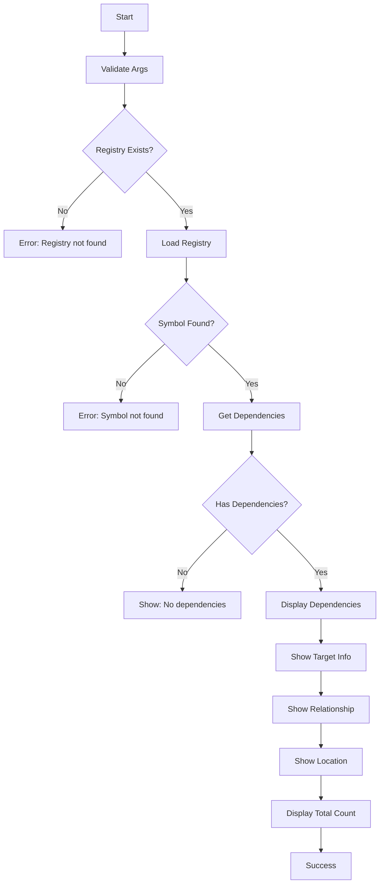

# [[DepsCommand]]

Show dependencies of a symbol from the registry.

## Purpose

Display all dependencies of a given symbol by its ID, showing what the symbol depends on with detailed relationship information.

## Responsibility

- Find symbol by ID in the registry
- Retrieve all dependencies of the symbol
- Display dependency relationships with type and reason
- Validate registry existence and symbol presence

## Input

**Command Syntax:**
```bash
tsdoc-edge deps <symbol-id>
```

**Parameters:**
- `symbol-id`: Unique identifier of the symbol to query

**Preconditions:**
- Registry must exist (`.tsdoc/registry.jsonl`)
- Symbol ID must be valid

## Output

**Success Case:**
```
Dependencies of <id> (<symbol-name>)
  target-id [type] → TargetSymbolName
    Reason: dependency reason
    Location: /path/to/file.ts

Total: N dependencies
```

**Empty Case:**
```
No dependencies
```

**Error Cases:**
- Registry not found: "No registry found. Run 'tsdoc-edge id new' first."
- Symbol not found: "Symbol not found: <id>"
- Missing symbol ID: "Symbol ID required"

## Context

### Dependencies

- **[[SymbolRegistryManager]]** (internal): Dependency data storage
- **[[BaseCommand]]**: Command infrastructure

### Used By

- Dependency analysis workflows
- Symbol graph exploration
- Impact analysis

## Logic



### Algorithm

1. **Validation Phase:**
   - Check for help flag
   - Validate symbol ID argument
   - Verify registry file exists

2. **Lookup Phase:**
   - Load SymbolRegistryManager
   - Find symbol entry by ID
   - Handle not found case

3. **Dependency Retrieval:**
   - Call `manager.getDependencies(id)`
   - Get list of dependency edges

4. **Display Phase:**
   - For each dependency:
     - Lookup target symbol
     - Display target ID and name
     - Show dependency type (if available)
     - Display reason for dependency
     - Show target file location
   - Display total count

## Effects

**Side Effects:**
- None (read-only query)

**Performance:**
- O(n) where n = number of dependencies
- Registry file loaded into memory

## Scope

**Public API:**
- Command name: `deps`
- Exported from Phase5Commands

**Usage:**
```bash
# Show dependencies of a specific symbol
tsdoc-edge deps class-user-service

# With help flag
tsdoc-edge deps --help
```

## Related

- [[WhoUsesCommand]]: Reverse dependencies (who uses this symbol)
- [[UsedByCommand]]: Registry-based reverse dependencies
- [[SymbolRegistryManager]]: Registry data access
- [[OrphansCommand]]: Find symbols with no dependencies or usages

## Implementation

Source: `src/commands/Phase5Commands.ts`

**Key Design Decisions:**
- Uses SymbolRegistryManager for dependency data
- Displays type and reason for each dependency
- Shows file location for context

**Alternatives Considered:**
- Database-based query: Registry is faster for ID-based lookups
- Graph traversal: Too complex for single-level dependencies

---

## Backlinks

### Referenced By

- [[Core Workflow]] → Features dependency analysis
- [[Symbol Graph]] → Part of graph query system
- [[QueryCommands]] → Listed in query command group
