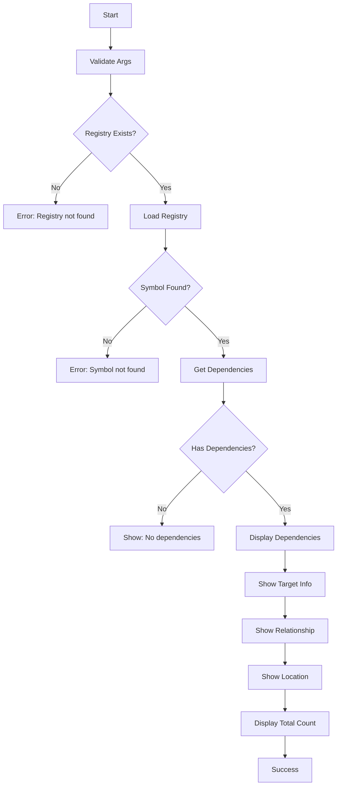

# [[DepsCommand]]

Show dependencies of a symbol from the registry.

## Purpose

Display all dependencies of a given symbol by its ID, showing what the symbol depends on with detailed relationship information.

## Responsibility

- Find symbol by ID in the registry
- Retrieve all dependencies of the symbol
- Display dependency relationships with type and reason
- Validate registry existence and symbol presence

## Input

**Command Syntax:**
```bash
tsdoc-edge deps <symbol-id>
```

**Parameters:**
- `symbol-id`: Unique identifier of the symbol to query

**Preconditions:**
- Registry must exist (`.tsdoc/registry.jsonl`)
- Symbol ID must be valid

## Output

**Success Case:**
```
Dependencies of <id> (<symbol-name>)
  target-id [type] → TargetSymbolName
    Reason: dependency reason
    Location: /path/to/file.ts

Total: N dependencies
```

**Empty Case:**
```
No dependencies
```

**Error Cases:**
- Registry not found: "No registry found. Run 'tsdoc-edge id new' first."
- Symbol not found: "Symbol not found: <id>"
- Missing symbol ID: "Symbol ID required"

## Context

### Dependencies

- **[[SymbolRegistryManager]]** (internal): Dependency data storage
- **[[BaseCommand]]**: Command infrastructure

### Used By

- Dependency analysis workflows
- Symbol graph exploration
- Impact analysis

## Logic



### Algorithm

1. **Validation Phase:**
   - Check for help flag
   - Validate symbol ID argument
   - Verify registry file exists

2. **Lookup Phase:**
   - Load SymbolRegistryManager
   - Find symbol entry by ID
   - Handle not found case

3. **Dependency Retrieval:**
   - Call `manager.getDependencies(id)`
   - Get list of dependency edges

4. **Display Phase:**
   - For each dependency:
     - Lookup target symbol
     - Display target ID and name
     - Show dependency type (if available)
     - Display reason for dependency
     - Show target file location
   - Display total count

## Effects

**Side Effects:**
- None (read-only query)

**Performance:**
- O(n) where n = number of dependencies
- Registry file loaded into memory

## Scope

**Public API:**
- Command name: `deps`
- Exported from Phase5Commands

**Usage:**
```bash
# Show dependencies of a specific symbol
tsdoc-edge deps class-user-service

# With help flag
tsdoc-edge deps --help
```

## Related

- [[WhoUsesCommand]]: Reverse dependencies (who uses this symbol)
- [[UsedByCommand]]: Registry-based reverse dependencies
- [[SymbolRegistryManager]]: Registry data access
- [[OrphansCommand]]: Find symbols with no dependencies or usages

## Implementation

Source: `src/commands/Phase5Commands.ts`

**Key Design Decisions:**
- Uses SymbolRegistryManager for dependency data
- Displays type and reason for each dependency
- Shows file location for context

**Alternatives Considered:**
- Database-based query: Registry is faster for ID-based lookups
- Graph traversal: Too complex for single-level dependencies

---

## Backlinks

### Referenced By

- [[TSDoc Edge Documentation]] → /home/user/tsdoc-edge/managed/README.md:56
- [[TSDoc Edge Documentation]] → /home/user/tsdoc-edge/managed/README.md:233
- [[TSDoc Edge Documentation]] → /home/user/tsdoc-edge/managed/README.md:384
- [[TSDoc Edge Documentation]] → /home/user/tsdoc-edge/managed/README.md:385
- [[BaseCommand]] → /home/user/tsdoc-edge/managed/commands/BaseCommand.md:56
- [[BaseCommand]] → /home/user/tsdoc-edge/managed/commands/BaseCommand.md:57
- [[OrphansCommand]] → /home/user/tsdoc-edge/managed/commands/OrphansCommand.md:126
- [[OrphansCommand]] → /home/user/tsdoc-edge/managed/commands/OrphansCommand.md:159
- [[OrphansCommand]] → /home/user/tsdoc-edge/managed/commands/OrphansCommand.md:160
- [[OrphansCommand]] → /home/user/tsdoc-edge/managed/commands/OrphansCommand.md:161
- [[OrphansCommand]] → /home/user/tsdoc-edge/managed/commands/OrphansCommand.md:162
- [[TreeCommand]] → /home/user/tsdoc-edge/managed/commands/TreeCommand.md:120
- [[TreeCommand]] → /home/user/tsdoc-edge/managed/commands/TreeCommand.md:204
- [[TreeCommand]] → /home/user/tsdoc-edge/managed/commands/TreeCommand.md:205
- [[UsedByCommand]] → /home/user/tsdoc-edge/managed/commands/UsedByCommand.md:83
- [[UsedByCommand]] → /home/user/tsdoc-edge/managed/commands/UsedByCommand.md:135
- [[UsedByCommand]] → /home/user/tsdoc-edge/managed/commands/UsedByCommand.md:136
- [[UsedByCommand]] → /home/user/tsdoc-edge/managed/commands/UsedByCommand.md:137
- [[UsedByCommand]] → /home/user/tsdoc-edge/managed/commands/UsedByCommand.md:138
- [[UsedByCommand]] → /home/user/tsdoc-edge/managed/commands/UsedByCommand.md:139
- [[WhoUsesCommand]] → /home/user/tsdoc-edge/managed/commands/WhoUsesCommand.md:113
- [[WhoUsesCommand]] → /home/user/tsdoc-edge/managed/commands/WhoUsesCommand.md:144
- [[WhoUsesCommand]] → /home/user/tsdoc-edge/managed/commands/WhoUsesCommand.md:145
- [[WhoUsesCommand]] → /home/user/tsdoc-edge/managed/commands/WhoUsesCommand.md:146
- [[WhoUsesCommand]] → /home/user/tsdoc-edge/managed/commands/WhoUsesCommand.md:147
- [[Parallel Work Theory]] → /home/user/tsdoc-edge/managed/concepts/parallel-work-theory.md:250
- [[Parallel Work Theory]] → /home/user/tsdoc-edge/managed/concepts/parallel-work-theory.md:265
- [[Parallel Work Theory]] → /home/user/tsdoc-edge/managed/concepts/parallel-work-theory.md:266
- [[CLI Runner]] → /home/user/tsdoc-edge/managed/core-components/CLIRunner.md:69
- [[CLI Runner]] → /home/user/tsdoc-edge/managed/core-components/CLIRunner.md:147
- [[CLI Runner]] → /home/user/tsdoc-edge/managed/core-components/CLIRunner.md:148
- [[DatabaseManager]] → /home/user/tsdoc-edge/managed/core-components/DatabaseManager.md:114
- [[DatabaseManager]] → /home/user/tsdoc-edge/managed/core-components/DatabaseManager.md:194
- [[DatabaseManager]] → /home/user/tsdoc-edge/managed/core-components/DatabaseManager.md:250
- [[DatabaseManager]] → /home/user/tsdoc-edge/managed/core-components/DatabaseManager.md:251
- [[DatabaseManager]] → /home/user/tsdoc-edge/managed/core-components/DatabaseManager.md:252
- [[DatabaseManager]] → /home/user/tsdoc-edge/managed/core-components/DatabaseManager.md:253
- [[Dependency Analysis]] → /home/user/tsdoc-edge/managed/features/DependencyAnalysis.md:85
- [[Dependency Analysis]] → /home/user/tsdoc-edge/managed/features/DependencyAnalysis.md:137
- [[Dependency Analysis]] → /home/user/tsdoc-edge/managed/features/DependencyAnalysis.md:154
- [[Dependency Analysis]] → /home/user/tsdoc-edge/managed/features/DependencyAnalysis.md:155
- [[Dependency Analysis]] → /home/user/tsdoc-edge/managed/features/DependencyAnalysis.md:156
- [[Dependency Analysis]] → /home/user/tsdoc-edge/managed/features/DependencyAnalysis.md:157
- [[Impact Analysis]] → /home/user/tsdoc-edge/managed/features/ImpactAnalysis.md:98
- [[Impact Analysis]] → /home/user/tsdoc-edge/managed/features/ImpactAnalysis.md:167
- [[Impact Analysis]] → /home/user/tsdoc-edge/managed/features/ImpactAnalysis.md:168
- [[QueryCommands]] → /home/user/tsdoc-edge/managed/features/QueryCommands.md:122
- [[AnalysisFeatures]] → /home/user/tsdoc-edge/managed/features/analysis-features.md:169
- [[AnalysisFeatures]] → /home/user/tsdoc-edge/managed/features/analysis-features.md:314
- [[AnalysisFeatures]] → /home/user/tsdoc-edge/managed/features/analysis-features.md:315
- [[SymbolGraphFeatures]] → /home/user/tsdoc-edge/managed/features/symbol-graph.md:173
- [[SymbolGraphFeatures]] → /home/user/tsdoc-edge/managed/features/symbol-graph.md:289
- [[SymbolGraphFeatures]] → /home/user/tsdoc-edge/managed/features/symbol-graph.md:290
- [[CLI Command Development Guide]] → /home/user/tsdoc-edge/managed/guides/command-development-guide.md:62
- [[CLI Command Development Guide]] → /home/user/tsdoc-edge/managed/guides/command-development-guide.md:236
- [[CLI Command Development Guide]] → /home/user/tsdoc-edge/managed/guides/command-development-guide.md:340
- [[Guides & Tutorials]] → /home/user/tsdoc-edge/managed/guides/index.md:103
- [[Guides & Tutorials]] → /home/user/tsdoc-edge/managed/guides/index.md:247
- [[Guides & Tutorials]] → /home/user/tsdoc-edge/managed/guides/index.md:429
- [[Guides & Tutorials]] → /home/user/tsdoc-edge/managed/guides/index.md:430
- [[Code Dependency]] → /home/user/tsdoc-edge/managed/relationships/code-dependency.md:25
- [[Code Dependency]] → /home/user/tsdoc-edge/managed/relationships/code-dependency.md:80
- [[Code Dependency]] → /home/user/tsdoc-edge/managed/relationships/code-dependency.md:81
- [[Relationship Types]] → /home/user/tsdoc-edge/managed/relationships/index.md:24
- [[Relationship Types]] → /home/user/tsdoc-edge/managed/relationships/index.md:256
- [[Relationship Types]] → /home/user/tsdoc-edge/managed/relationships/index.md:257
- [[SymbolRegistryManager]] → /home/user/tsdoc-edge/managed/storage/SymbolRegistryManager.md:282
- [[SymbolRegistryManager]] → /home/user/tsdoc-edge/managed/storage/SymbolRegistryManager.md:283
- [[SymbolRegistryManager]] → /home/user/tsdoc-edge/managed/storage/SymbolRegistryManager.md:284
- [[SymbolRegistryManager]] → /home/user/tsdoc-edge/managed/storage/SymbolRegistryManager.md:285
- [[InterfaceTypes]] → /home/user/tsdoc-edge/managed/types/InterfaceTypes.md:85
- [[InterfaceTypes]] → /home/user/tsdoc-edge/managed/types/InterfaceTypes.md:95
- [[InterfaceTypes]] → /home/user/tsdoc-edge/managed/types/InterfaceTypes.md:96

### Implemented By

- DepsCommand → /home/user/tsdoc-edge/src/commands/DepsCommand.ts:39

