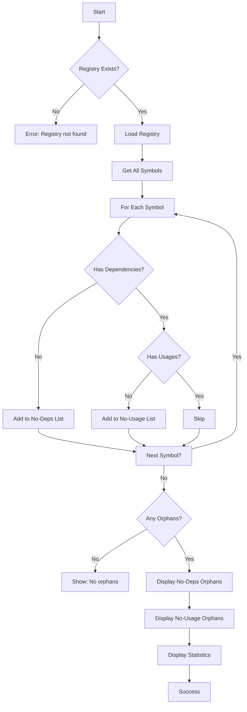

# [[OrphansCommand]]

Find orphaned symbols that have no dependencies or usages.

## Purpose

Identify symbols that are neither used by other symbols nor depend on other symbols, potentially indicating dead code or isolated components.

## Responsibility

- Scan all symbols in the registry
- Check for symbols with zero dependencies
- Check for symbols with zero usages
- Report both types of orphans
- Provide file locations for context

## Input

**Command Syntax:**
```bash
tsdoc-edge orphans
```

**Parameters:**
- None

**Preconditions:**
- Registry must exist (`.tsdoc/registry.jsonl`)

## Output

**Success Case:**
```
Orphaned Symbols

Symbols with no dependencies (not using anything):
  • symbol-id-1 (SymbolName) → /path/to/file.ts:10
  • symbol-id-2 (OtherSymbol) → /path/to/other.ts:50

Symbols with no usages (not used by anything):
  • symbol-id-3 (UnusedSymbol) → /path/to/unused.ts:100

Total: 3 orphaned symbols
  - 2 with no dependencies
  - 1 with no usages
```

**No Orphans:**
```
No orphaned symbols found
```

**Error Cases:**
- Registry not found: "No registry found."

## Context

### Dependencies

- **[[SymbolRegistryManager]]** (internal): Relationship data access
- **[[BaseCommand]]**: Command infrastructure

### Used By

- Dead code detection
- Refactoring analysis
- Code health assessment
- Entry point identification

### What are Orphaned Symbols?

**No Dependencies:**
- Symbols that don't use any other symbols
- Often entry points, constants, or isolated utilities
- Not necessarily bad - may be intentional

**No Usages:**
- Symbols not used by any other symbols
- Potential dead code candidates
- May be exported for external use

## Logic



### Algorithm

1. **Validation Phase:**
   - Check for help flag
   - Verify registry file exists

2. **Loading Phase:**
   - Load SymbolRegistryManager
   - Get all symbols from registry

3. **Analysis Phase:**
   - For each symbol:
     - Check `getDependencies(id).length`
     - Check `getUsedBy(id).length`
     - Categorize as orphan if either is zero

4. **Classification:**
   - **No Dependencies**: Symbols with `deps.length === 0`
   - **No Usages**: Symbols with `usages.length === 0`

5. **Display Phase:**
   - Group by category
   - Show symbol ID, name, file location
   - Display statistics

## Effects

**Side Effects:**
- None (read-only query)

**Performance:**
- O(n) where n = total symbols in registry
- Two passes: one for dependencies, one for usages

**Use Cases:**
- Dead code detection
- Find entry points (no usages = potential entry points)
- Code cleanup candidates
- Identify isolated utilities

## Scope

**Public API:**
- Command name: `orphans`
- Exported from Phase5Commands

**Usage:**
```bash
# Find all orphaned symbols
tsdoc-edge orphans

# With help flag
tsdoc-edge orphans --help
```

**Interpretation:**
- **No Dependencies + Public/Exported**: Likely entry points or constants
- **No Usages + Private**: Strong dead code candidate
- **No Usages + Exported**: May be used externally
- **Both No Deps and No Usages**: Completely isolated (dead code)

## Related

- [[DepsCommand]]: Show dependencies of a specific symbol
- [[WhoUsesCommand]]: Find usages of a specific symbol
- [[DetectDeadCodeCommand]]: Advanced dead code detection
- [[SymbolRegistryManager]]: Relationship data source

## Implementation

Source: `src/commands/Phase5Commands.ts`

**Key Design Decisions:**
- Two categories for different insights
- Uses registry for fast relationship queries
- Shows file locations for quick navigation
- Separates "no dependencies" from "no usages"

**Alternatives Considered:**
- Combined single list: Less actionable insights
- Only "no usages": Misses entry point detection
- Include transitive analysis: Too slow for quick checks

---

## Backlinks

### Referenced By

- [[CodeHealthChecker]] → Uses orphan detection
- [[QueryCommands]] → Listed in query command group
- [[Dead Code Detection]] → Related analysis
