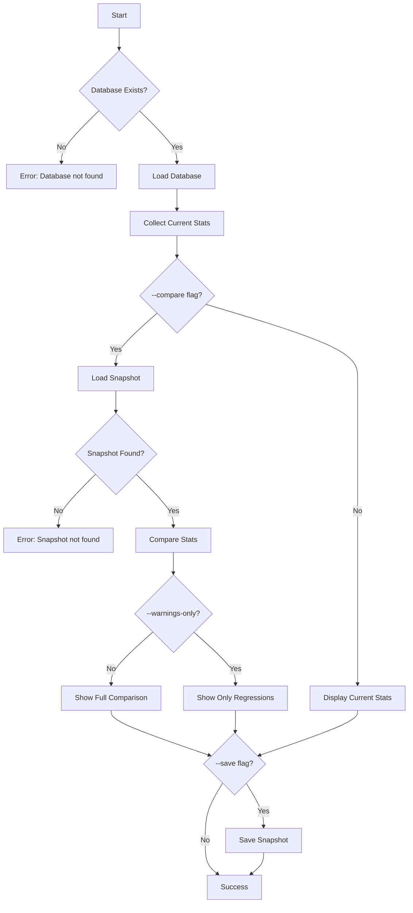

# [[StatsCommand]]

Show documentation statistics with optional historical comparison.

## Purpose

Track documentation quality metrics over time, enabling measurement of codebase health improvements and regressions.

## Responsibility

- Collect current documentation statistics
- Compare with historical snapshots
- Identify trends (improvements vs regressions)
- Save snapshots for future comparison
- Display warnings for quality decreases

## Input

**Command Syntax:**
```bash
tsdoc-edge stats [options]
```

**Options:**
- `--compare <snapshot-name>`: Compare with a previous snapshot
- `--save <snapshot-name>`: Save current stats as a snapshot
- `--warnings-only`: Show only regressions
- `--list-snapshots`: List all available snapshots

**Preconditions:**
- Database must be built (`.tsdoc/symbols.db`)

## Output

**Basic Stats:**
```
Documentation Statistics

Total Symbols: 1,127
Documented: 921 (82%)
Public Symbols: 450
Undocumented Public: 85 (19%)

Documentation Quality: 69/100
Test Coverage: 40/100
Overall Health: D (56/100)

Coverage by Type:
  Classes: 95%
  Functions: 78%
  Interfaces: 88%
  Types: 72%
```

**With Comparison:**
```
Documentation Statistics (comparing with baseline)

Total Symbols: 1,127 (+15 from baseline)
Documented: 921 (82%) [+2% ⬆]
Public Symbols: 450 (+8)
Undocumented Public: 85 (19%) [-1% ⬆]

Documentation Quality: 69/100 [+5 ⬆]
Test Coverage: 40/100 [-3 ⬇ WARNING]
Overall Health: D (56/100) [+2 ⬆]

Trends:
  ✅ Documentation coverage improved
  ⚠️  Test coverage decreased
  ✅ Overall health improved
```

**Warnings Only:**
```
Regressions Detected:

⚠️  Test Coverage: 40% (-3% from baseline)
⚠️  Undocumented Functions: 85 (+5 from baseline)
```

## Context

### Dependencies

- **[[DatabaseManager]]** (internal): Symbol data access
- **[[TrackableStatsCollector]]**: Stats collection
- **[[StatsHistoryManager]]**: Snapshot storage and retrieval
- **[[StatsComparator]]**: Historical comparison
- **[[BaseCommand]]**: Command infrastructure

### Used By

- Quality tracking workflows
- CI/CD quality gates
- Development metrics dashboards
- Regression detection

### Tracked Metrics

**Symbol Metrics:**
- Total symbols count
- Documented symbols
- Public symbols
- Undocumented public symbols

**Quality Scores:**
- Documentation quality (0-100)
- Test coverage percentage
- Overall health grade (A-F)

**Type Breakdown:**
- Classes coverage
- Functions coverage
- Interfaces coverage
- Types coverage
- Enums coverage

## Logic



### Algorithm

1. **Validation Phase:**
   - Check for help flag
   - Verify database file exists
   - Parse command options

2. **Collection Phase:**
   - Use TrackableStatsCollector
   - Query database for symbol counts
   - Calculate coverage percentages
   - Compute quality scores

3. **Comparison Phase (if --compare):**
   - Load StatsHistoryManager
   - Retrieve named snapshot
   - Use StatsComparator for diff
   - Calculate trends

4. **Display Phase:**
   - Show current metrics
   - Show comparison (if applicable)
   - Highlight improvements (⬆) and regressions (⬇)
   - Filter to warnings only (if --warnings-only)

5. **Save Phase (if --save):**
   - Store current stats with timestamp
   - Save to history file

## Effects

**Side Effects:**
- May write snapshot file if `--save` used
- Reads historical data from `.tsdoc/stats-history.jsonl`

**Performance:**
- O(n) where n = total symbols in database
- Snapshot operations: O(1) file write

**Storage:**
- Each snapshot: ~500 bytes
- History file grows with snapshots

## Scope

**Public API:**
- Command name: `stats`
- Exported from Phase7Commands

**Usage:**
```bash
# Show current stats
tsdoc-edge stats

# Save baseline snapshot
tsdoc-edge stats --save baseline

# Compare with baseline
tsdoc-edge stats --compare baseline

# CI mode: fail on regressions
tsdoc-edge stats --compare baseline --warnings-only

# List all snapshots
tsdoc-edge stats --list-snapshots

# Save and compare in one command
tsdoc-edge stats --compare baseline --save current
```

## Related

- [[HealthCommand]]: Overall codebase health check
- [[TrackableStatsCollector]]: Stats collection engine
- [[StatsHistoryManager]]: Snapshot management
- [[StatsComparator]]: Comparison logic
- [[ValidateCommand]]: Documentation validation

## Implementation

Source: `src/commands/Phase7Commands.ts`

**Key Design Decisions:**
- Snapshot-based comparison for flexibility
- Named snapshots for multiple baseline tracking
- Warnings-only mode for CI integration
- Trend indicators for quick insights

**Alternatives Considered:**
- Git-based comparison: Too coupled to version control
- Always auto-save: Pollutes history with every run
- Only latest comparison: Less flexible for multi-branch workflows

**CI Integration:**
```bash
# In CI pipeline
tsdoc-edge stats --compare main-branch --warnings-only
if [ $? -ne 0 ]; then
  echo "Quality regression detected"
  exit 1
fi
```

---

## Backlinks

### Referenced By

- [[Core Workflow]] → Quality tracking step
- [[TrackableStatsCollector]] → Data collection
- [[QueryCommands]] → Listed in query command group
