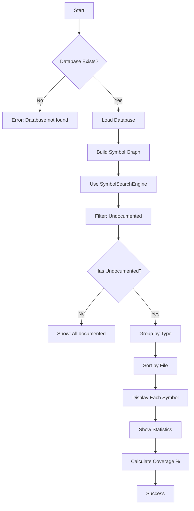

# [[UndocumentedCommand]]

Find symbols without documentation (no summary or TSDoc comments).

## Purpose

Identify symbols that lack TSDoc documentation, enabling systematic documentation coverage improvement.

## Responsibility

- Query database for all symbols
- Filter symbols without documentation
- Display undocumented symbols by type
- Show file locations for easy navigation
- Calculate documentation coverage metrics

## Input

**Command Syntax:**
```bash
tsdoc-edge undocumented [directory]
```

**Parameters:**
- `directory` (optional): Specific directory to check (default: all)

**Preconditions:**
- Database must be built (`.tsdoc/symbols.db`)

## Output

**Success Case:**
```
Undocumented Symbols

Found 206 undocumented symbols:

Classes (15):
  • UserService → src/services/UserService.ts:10
  • OrderProcessor → src/processors/OrderProcessor.ts:25

Functions (85):
  • calculateTotal → src/utils/calculations.ts:45
  • formatDate → src/utils/formatting.ts:12

Interfaces (42):
  • UserData → src/types/user.ts:5
  • OrderResult → src/types/order.ts:20

Total: 206/1,127 symbols undocumented (18%)
```

**No Undocumented:**
```
✅ All symbols are documented!
```

**Error Cases:**
- Database not found: "Database not found. Run 'build' first."

## Context

### Dependencies

- **[[DatabaseManager]]** (internal): Symbol data access
- **[[SymbolGraphBuilder]]**: Symbol graph construction
- **[[SymbolSearchEngine]]**: Undocumented symbol filtering
- **[[BaseCommand]]**: Command infrastructure

### Used By

- Documentation quality checks
- CI/CD gates
- Documentation improvement workflows
- Code review processes

### What is "Undocumented"?

A symbol is considered undocumented if:
- No TSDoc summary (`/** ... */`)
- No `@public` or `@internal` tag
- Empty or missing description

**Excludes:**
- Test files
- Internal/private symbols (optionally)
- Auto-generated code

## Logic



### Algorithm

1. **Validation Phase:**
   - Check for help flag
   - Verify database file exists

2. **Loading Phase:**
   - Load DatabaseManager
   - Build SymbolGraphBuilder
   - Initialize SymbolSearchEngine

3. **Search Phase:**
   - Use SearchEngine with filter: `undocumented`
   - Get all symbols without TSDoc comments

4. **Grouping Phase:**
   - Group by symbol type (class, function, interface, etc.)
   - Sort within each group by file path

5. **Display Phase:**
   - Show count per type
   - List symbol name and location
   - Calculate and display coverage percentage

## Effects

**Side Effects:**
- None (read-only query)

**Performance:**
- O(n) where n = total symbols in database
- Involves full symbol graph construction

## Scope

**Public API:**
- Command name: `undocumented`
- Exported from Phase5Commands

**Usage:**
```bash
# Find all undocumented symbols
tsdoc-edge undocumented

# Check specific directory
tsdoc-edge undocumented src/services

# With help flag
tsdoc-edge undocumented --help

# Use in CI
tsdoc-edge undocumented | tee undocumented.log
if [ $(grep -c "undocumented" undocumented.log) -gt 50 ]; then
  echo "Too many undocumented symbols"
  exit 1
fi
```

## Related

- [[UntestedCommand]]: Find symbols without test coverage
- [[HealthCommand]]: Overall documentation quality score
- [[ValidateCommand]]: TSDoc syntax validation
- [[SymbolSearchEngine]]: Search capabilities

## Implementation

Source: `src/commands/Phase5Commands.ts`

**Key Design Decisions:**
- Uses SymbolSearchEngine for filtering
- Groups by type for actionable insights
- Shows file locations for quick navigation
- Calculates coverage percentage

**Alternatives Considered:**
- AST-only analysis: Slower, less accurate
- Regex-based: Misses edge cases
- Only public symbols: Less comprehensive

---

## Backlinks

### Referenced By

- [[Core Workflow]] → Documentation quality check
- [[QueryCommands]] → Listed in query command group
- [[CI/CD Integration]] → Quality gates
