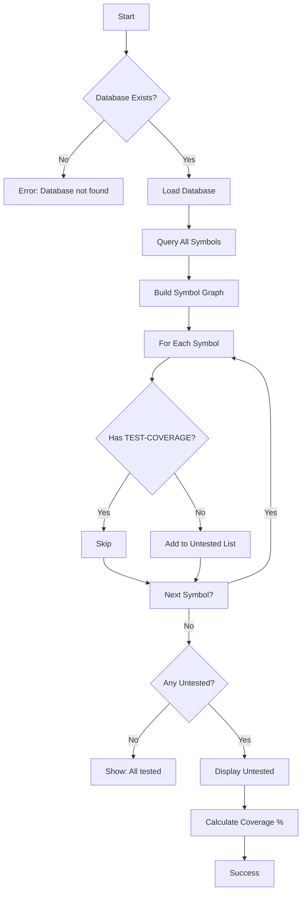

# [[UntestedCommand]]

Find symbols without test coverage.

## Purpose

Identify symbols that don't have associated test files or test relationships, enabling systematic improvement of test coverage.

## Responsibility

- Query database for all symbols
- Check for TEST-COVERAGE relationships
- Filter symbols without any test coverage
- Display untested symbols with locations
- Calculate test coverage percentage

## Input

**Command Syntax:**
```bash
tsdoc-edge untested [directory]
```

**Parameters:**
- `directory` (optional): Specific directory to check (default: src/)

**Options:**
- `--type <type>`: Filter by symbol type (class, function, etc.)
- `--public-only`: Only show public/exported symbols

**Preconditions:**
- Database must be built (`.tsdoc/symbols.db`)
- Symbol graph must be indexed

## Output

**Success Case:**
```
Untested Symbols

Found 1,722 untested symbols:

method-workcontextcommand-generatereliabilityreport → WorkContextCommand.generateReliabilityReport (method)
  Location: src/commands/WorkContextCommand.ts:306

class-usagetracker → UsageTracker (class)
  Location: src/analytics/UsageTracker.ts:43

property-usagetracker-config → UsageTracker.config (property)
  Location: src/analytics/UsageTracker.ts:44

Total: 1,722 untested symbols
Coverage: 40% (63/159 files have tests)
```

**All Tested:**
```
✅ All symbols have test coverage!
```

**Error Cases:**
- Database not found: "Database not found. Run 'build' first."

## Context

### Dependencies

- **[[DatabaseManager]]** (internal): Symbol and relationship data
- **[[SymbolGraphBuilder]]**: Dependency graph construction
- **[[BaseCommand]]**: Command infrastructure

### Used By

- Test coverage analysis
- CI/CD quality gates
- TDD workflows
- Code review processes

### What is "Untested"?

A symbol is considered untested if:
- No TEST-COVERAGE relationship exists
- No test file found with matching name pattern
- Not imported by any `*.test.ts` or `*.spec.ts` file

**Excludes:**
- Test files themselves
- Test utilities
- Mock implementations

## Logic



### Algorithm

1. **Validation Phase:**
   - Check for help flag
   - Verify database file exists
   - Parse command options

2. **Loading Phase:**
   - Load DatabaseManager
   - Build SymbolGraphBuilder
   - Query all symbols from database

3. **Analysis Phase:**
   - For each symbol:
     - Check for TEST-COVERAGE relationship
     - Check if file has matching test file
     - Mark as untested if no coverage found

4. **Filtering Phase (optional):**
   - Apply type filter if `--type` specified
   - Filter public symbols only if `--public-only` set

5. **Display Phase:**
   - Show symbol ID and name
   - Show symbol type (method, class, function, etc.)
   - Show file location
   - Calculate and display coverage percentage

## Effects

**Side Effects:**
- None (read-only query)

**Performance:**
- O(n) where n = total symbols
- Includes relationship lookups

**Use Cases:**
- Find critical untested code
- Prioritize test writing efforts
- Track test coverage improvements over time
- CI quality gates

## Scope

**Public API:**
- Command name: `untested`
- Exported from Phase8Commands

**Usage:**
```bash
# Find all untested symbols
tsdoc-edge untested

# Check specific directory
tsdoc-edge untested src/commands

# Only public symbols
tsdoc-edge untested --public-only

# Filter by type
tsdoc-edge untested --type class

# Use in CI
tsdoc-edge untested src | tee untested.log
UNTESTED_COUNT=$(grep -c "→" untested.log)
if [ $UNTESTED_COUNT -gt 100 ]; then
  echo "Too many untested symbols: $UNTESTED_COUNT"
  exit 1
fi
```

## Related

- [[UndocumentedCommand]]: Find symbols without documentation
- [[HealthCommand]]: Overall code health including test coverage
- [[TestRelationshipsCommand]]: Analyze test relationships
- [[CoverageReportCommand]]: Detailed coverage report

## Implementation

Source: `src/commands/Phase8Commands.ts`

**Key Design Decisions:**
- Relationship-based coverage detection
- Symbol-level granularity (not just file-level)
- Shows symbol type for prioritization
- Calculates percentage for tracking

**Alternatives Considered:**
- Istanbul integration: Too slow for quick checks
- File-level only: Less granular insights
- AST-based: Harder to maintain

**Prioritization Strategy:**
```
High Priority:
- Public classes
- Exported functions
- Entry points

Medium Priority:
- Public methods
- Internal utilities

Low Priority:
- Private methods
- Helper functions
- Generated code
```

---

## Backlinks

### Referenced By

- [[TSDoc Edge Documentation]] → /Users/junwoobang/workflow/tsdoc-edge/managed/README.md:303
- [[UndocumentedCommand]] → /Users/junwoobang/workflow/tsdoc-edge/managed/commands/UndocumentedCommand.md:115
- [[CI/CD Integration]] → /Users/junwoobang/workflow/tsdoc-edge/managed/features/CICDIntegration.md:79
- [[CI/CD Integration]] → /Users/junwoobang/workflow/tsdoc-edge/managed/features/CICDIntegration.md:101
- [[Dead Code Detection]] → /Users/junwoobang/workflow/tsdoc-edge/managed/features/DeadCodeDetection.md:77
- [[Dead Code Detection]] → /Users/junwoobang/workflow/tsdoc-edge/managed/features/DeadCodeDetection.md:116
- [[AnalysisFeatures]] → /Users/junwoobang/workflow/tsdoc-edge/managed/features/analysis-features.md:197
- [[Relationship Types]] → /Users/junwoobang/workflow/tsdoc-edge/managed/relationships/index.md:101

