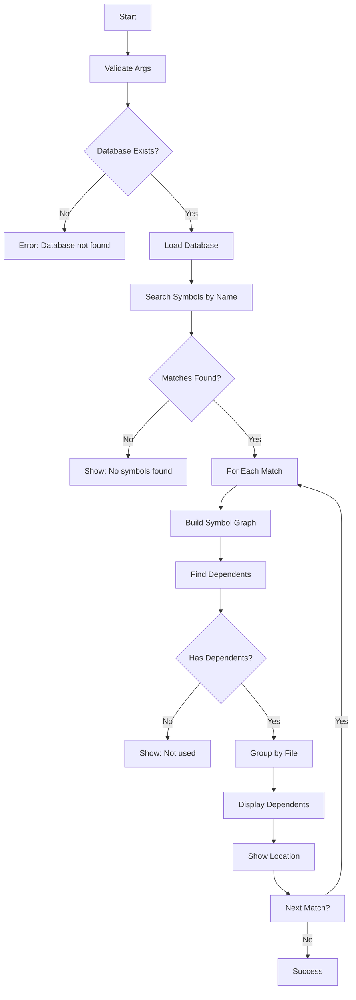

# [[WhoUsesCommand]]

Show who uses a symbol through database name search.

## Purpose

Find all symbols that use a given symbol by searching the database by name, enabling name-based reverse dependency analysis.

## Responsibility

- Search symbols by name (exact or prefix match)
- Handle multiple matching symbols
- Build dependency graph for matches
- Display all symbols that depend on each match
- Group results by file for clarity

## Input

**Command Syntax:**
```bash
tsdoc-edge who-uses <symbol-name>
```

**Parameters:**
- `symbol-name`: Name of the symbol to search (supports prefix matching)

**Preconditions:**
- Database must be built (`.tsdoc/symbols.db`)
- Symbol graph must be indexed

## Output

**Success Case:**
```
Who Uses: SymbolName

Found N matching symbol(s):

1. SymbolName (class) - /path/to/file.ts:10
   Exported: Yes

   Used by 3 symbol(s):
   • OtherSymbol (class)
     → /path/to/other.ts:50

   • AnotherSymbol (function)
     → /path/to/another.ts:100
```

**No Matches:**
```
No symbols found matching: symbol-name
```

**Error Cases:**
- Database not found: "No database found. Run 'tsdoc-edge build' first."
- Missing symbol name: "Symbol name required"

## Context

### Dependencies

- **[[DatabaseManager]]** (internal): Symbol data and name-based search
- **[[SymbolGraphBuilder]]**: Dependency graph construction
- **[[BaseCommand]]**: Command infrastructure

### Used By

- Name-based symbol search
- Cross-file usage analysis
- Refactoring impact assessment

### Difference from UsedByCommand

- **WhoUsesCommand**: Database-driven, searches by name, can find multiple matches
- **UsedByCommand**: Registry-driven, searches by ID, single symbol lookup

## Logic



### Algorithm

1. **Validation Phase:**
   - Check for help flag
   - Validate symbol name argument
   - Verify database file exists

2. **Search Phase:**
   - Load DatabaseManager
   - Search symbols by name (exact or prefix)
   - Handle no matches case

3. **Graph Building:**
   - For each matching symbol:
     - Build dependency graph using SymbolGraphBuilder
     - Extract file path from symbol

4. **Dependent Analysis:**
   - Find all symbols that depend on the match
   - Group dependents by file for clarity

5. **Display Phase:**
   - Show symbol info (name, type, location, export status)
   - List all dependent symbols with locations
   - Display count of dependencies

## Effects

**Side Effects:**
- None (read-only query)
- Builds temporary in-memory graph

**Performance:**
- O(n*m) where:
  - n = number of matching symbols
  - m = average dependents per symbol
- Database query + graph construction

## Scope

**Public API:**
- Command name: `who-uses`
- Exported from Phase5Commands

**Usage:**
```bash
# Find who uses a symbol by name
tsdoc-edge who-uses UserService

# Prefix matching
tsdoc-edge who-uses User

# With help flag
tsdoc-edge who-uses --help
```

## Related

- [[DepsCommand]]: Show what a symbol depends on
- [[UsedByCommand]]: Registry-based reverse dependencies by ID
- [[DatabaseManager]]: Symbol database and queries
- [[SymbolGraphBuilder]]: Dependency graph construction

## Implementation

Source: `src/commands/Phase5Commands.ts`

**Key Design Decisions:**
- Database-driven for name-based search
- Builds graph dynamically per query
- Groups results by file for readability
- Shows export status for import guidance

**Alternatives Considered:**
- Registry-only: No name-based search support
- Pre-built graph: Memory intensive for large codebases

---

## Backlinks

### Referenced By

- [[TSDoc Edge Documentation]] → /Users/junwoobang/workflow/tsdoc-edge/managed/README.md:76
- [[TSDoc Edge Documentation]] → /Users/junwoobang/workflow/tsdoc-edge/managed/README.md:288
- [[DepsCommand]] → /Users/junwoobang/workflow/tsdoc-edge/managed/commands/DepsCommand.md:103
- [[OrphansCommand]] → /Users/junwoobang/workflow/tsdoc-edge/managed/commands/OrphansCommand.md:127
- [[UsedByCommand]] → /Users/junwoobang/workflow/tsdoc-edge/managed/commands/UsedByCommand.md:44
- [[UsedByCommand]] → /Users/junwoobang/workflow/tsdoc-edge/managed/commands/UsedByCommand.md:84
- [[DatabaseManager]] → /Users/junwoobang/workflow/tsdoc-edge/managed/core-components/DatabaseManager.md:115
- [[Dependency Analysis]] → /Users/junwoobang/workflow/tsdoc-edge/managed/features/DependencyAnalysis.md:87
- [[Impact Analysis]] → /Users/junwoobang/workflow/tsdoc-edge/managed/features/ImpactAnalysis.md:99
- [[AnalysisFeatures]] → /Users/junwoobang/workflow/tsdoc-edge/managed/features/analysis-features.md:176
- [[SymbolGraphFeatures]] → /Users/junwoobang/workflow/tsdoc-edge/managed/features/symbol-graph.md:180
- [[CLI Command Development Guide]] → /Users/junwoobang/workflow/tsdoc-edge/managed/guides/command-development-guide.md:237
- [[Guides & Tutorials]] → /Users/junwoobang/workflow/tsdoc-edge/managed/guides/index.md:248
- [[Code Dependency]] → /Users/junwoobang/workflow/tsdoc-edge/managed/relationships/code-dependency.md:26
- [[Relationship Types]] → /Users/junwoobang/workflow/tsdoc-edge/managed/relationships/index.md:26

### Implemented By

- WhoUsesCommand → /Users/junwoobang/workflow/tsdoc-edge/src/commands/WhoUsesCommand.ts:37

