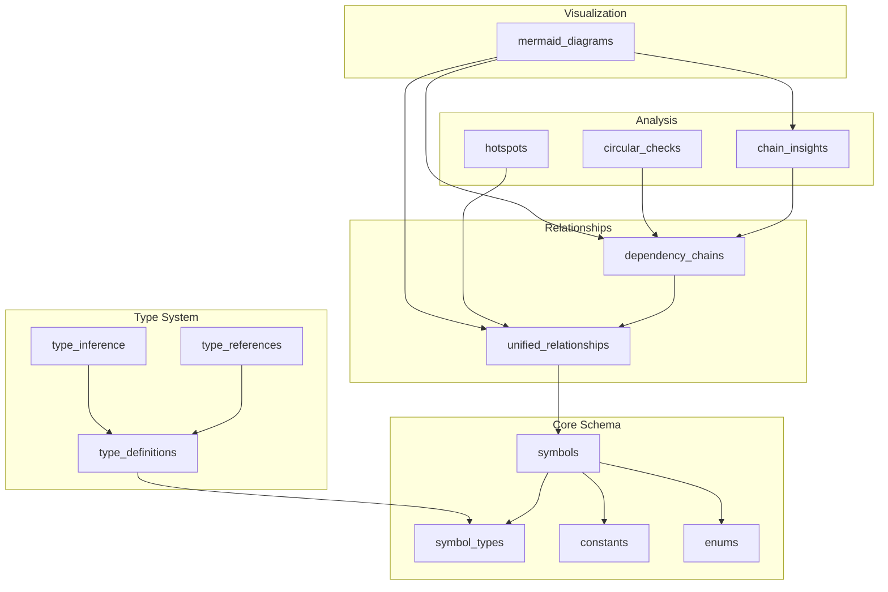

# [[Enhanced Database Schema]]

> **Enhanced database schema and type system design** for tracking symbols, relationships, and type information

**Document Type**: Technical Specification
**Also known as**: Enhanced Database Schema & Type System

## Purpose

SQLite 스키마를 개선하여 **Primary Keys, 타입 추적, constant 추적, 의존성 체인 분석**을 지원하고, Mermaid 다이어그램으로 인사이트를 시각화하는 통합 설계.

---

## Overview



---

## 1. Enhanced Symbols Table

### 1.1 Core Schema

```sql
-- ===== Primary Symbols Table =====
CREATE TABLE symbols (
  -- Identity (Primary Key)
  id TEXT PRIMARY KEY,
  name TEXT NOT NULL,
  kind TEXT NOT NULL,  -- 확장된 심볼 종류

  -- Location
  file_path TEXT NOT NULL,
  line INTEGER NOT NULL,
  column INTEGER NOT NULL,
  end_line INTEGER,
  end_column INTEGER,

  -- Visibility
  is_exported BOOLEAN NOT NULL DEFAULT 0,
  is_public BOOLEAN NOT NULL DEFAULT 0,
  export_name TEXT,  -- 다르게 export될 경우

  -- Type Information
  type_id TEXT,  -- FK to type_definitions
  inferred_type TEXT,  -- 추론된 타입
  declared_type TEXT,  -- 선언된 타입
  generic_params TEXT,  -- JSON: ["T", "K extends keyof T"]

  -- Value (for constants)
  literal_value TEXT,  -- 리터럴 값
  value_type TEXT,  -- 'string' | 'number' | 'boolean' | 'object' | 'array'
  is_constant BOOLEAN DEFAULT 0,

  -- Documentation
  summary TEXT,
  description TEXT,  -- 긴 설명

  -- Metadata
  complexity_score REAL,  -- 복잡도 (순환 복잡도 등)
  usage_count INTEGER DEFAULT 0,  -- 사용 빈도

  -- Timestamps
  created_at TEXT NOT NULL,
  updated_at TEXT NOT NULL,
  version TEXT NOT NULL,

  -- JSONL reference
  jsonl_line INTEGER NOT NULL,

  FOREIGN KEY (type_id) REFERENCES type_definitions(id)
);

-- ===== Symbol Kinds Enum =====
-- Expanded from current 8 types to comprehensive list
CREATE TABLE symbol_kinds (
  kind TEXT PRIMARY KEY,
  category TEXT NOT NULL,  -- 'declaration' | 'value' | 'type' | 'namespace'
  description TEXT
);

INSERT INTO symbol_kinds (kind, category, description) VALUES
  -- Declarations
  ('function', 'declaration', 'Function declaration'),
  ('class', 'declaration', 'Class declaration'),
  ('interface', 'type', 'Interface definition'),
  ('type', 'type', 'Type alias'),
  ('enum', 'type', 'Enum definition'),

  -- Values
  ('variable', 'value', 'Variable declaration'),
  ('constant', 'value', 'Constant value (const)'),
  ('parameter', 'value', 'Function parameter'),

  -- Class members
  ('method', 'declaration', 'Class method'),
  ('property', 'value', 'Class property'),
  ('getter', 'declaration', 'Getter method'),
  ('setter', 'declaration', 'Setter method'),
  ('constructor', 'declaration', 'Constructor'),

  -- Type members
  ('type-parameter', 'type', 'Generic type parameter'),
  ('type-property', 'type', 'Interface/type property'),
  ('type-method', 'type', 'Interface method signature'),

  -- Namespace
  ('namespace', 'namespace', 'Namespace declaration'),
  ('module', 'namespace', 'Module declaration'),

  -- Special
  ('decorator', 'declaration', 'Decorator'),
  ('import', 'namespace', 'Import statement'),
  ('export', 'namespace', 'Export statement');

-- Indexes
CREATE INDEX idx_symbols_kind ON symbols(kind);
CREATE INDEX idx_symbols_file ON symbols(file_path);
CREATE INDEX idx_symbols_name ON symbols(name);
CREATE INDEX idx_symbols_type ON symbols(type_id);
CREATE INDEX idx_symbols_is_constant ON symbols(is_constant);
CREATE INDEX idx_symbols_exported ON symbols(is_exported, is_public);
```

---

## 2. Type System Tables

### 2.1 Type Definitions

```sql
-- ===== Type Definitions =====
CREATE TABLE type_definitions (
  id TEXT PRIMARY KEY,  -- type-def-user-data
  name TEXT NOT NULL,

  -- Type classification
  kind TEXT NOT NULL,  -- 'primitive' | 'object' | 'union' | 'intersection' | 'generic' | 'literal' | 'tuple' | 'array'

  -- Type structure
  definition TEXT NOT NULL,  -- Full type definition
  signature TEXT,  -- Normalized signature for comparison

  -- Components (JSON)
  properties TEXT,  -- For object types: [{"name": "id", "type": "string"}]
  generic_params TEXT,  -- For generic types: ["T", "K"]
  constraints TEXT,  -- For constrained generics: {"T": "extends User"}

  -- Source
  source_symbol_id TEXT,  -- Symbol that defined this type
  source_file TEXT,
  source_line INTEGER,

  -- Metadata
  is_exported BOOLEAN DEFAULT 0,
  complexity INTEGER DEFAULT 0,  -- Nesting depth
  usage_count INTEGER DEFAULT 0,

  created_at TEXT NOT NULL,

  FOREIGN KEY (source_symbol_id) REFERENCES symbols(id)
);

-- ===== Type References =====
-- Track where types are used
CREATE TABLE type_references (
  id INTEGER PRIMARY KEY AUTOINCREMENT,

  type_id TEXT NOT NULL,
  referenced_by_symbol_id TEXT NOT NULL,

  -- Context
  context TEXT NOT NULL,  -- 'parameter' | 'return-type' | 'property' | 'variable'
  position INTEGER,  -- Parameter index, property order, etc.

  -- Location
  file_path TEXT NOT NULL,
  line INTEGER NOT NULL,

  created_at TEXT NOT NULL,

  FOREIGN KEY (type_id) REFERENCES type_definitions(id),
  FOREIGN KEY (referenced_by_symbol_id) REFERENCES symbols(id)
);

-- ===== Type Inference =====
-- Track inferred types for symbols without explicit types
CREATE TABLE type_inference (
  id INTEGER PRIMARY KEY AUTOINCREMENT,

  symbol_id TEXT NOT NULL UNIQUE,
  inferred_type_id TEXT,

  -- Inference details
  method TEXT NOT NULL,  -- 'return-analysis' | 'usage-analysis' | 'assignment-tracking'
  confidence REAL NOT NULL,  -- 0-1

  -- Evidence
  evidence TEXT,  -- JSON: [{"source": "file.ts:42", "type": "string", "confidence": 0.9}]

  created_at TEXT NOT NULL,
  updated_at TEXT NOT NULL,

  FOREIGN KEY (symbol_id) REFERENCES symbols(id),
  FOREIGN KEY (inferred_type_id) REFERENCES type_definitions(id)
);

CREATE INDEX idx_type_refs_type ON type_references(type_id);
CREATE INDEX idx_type_refs_symbol ON type_references(referenced_by_symbol_id);
CREATE INDEX idx_type_inference_symbol ON type_inference(symbol_id);
```

---

## 3. Constants & Enums

### 3.1 Constants

```sql
-- ===== Constants Table =====
CREATE TABLE constants (
  id TEXT PRIMARY KEY,  -- constant-api-base-url
  symbol_id TEXT NOT NULL UNIQUE,

  -- Value
  literal_value TEXT NOT NULL,
  value_type TEXT NOT NULL,  -- 'string' | 'number' | 'boolean' | 'object' | 'array' | 'bigint'

  -- Parsing
  parsed_value TEXT,  -- JSON representation if object/array

  -- Categorization
  category TEXT,  -- 'config' | 'magic-number' | 'api-endpoint' | 'error-code' | 'default-value'

  -- Usage tracking
  usage_count INTEGER DEFAULT 0,
  used_by TEXT,  -- JSON: ["symbol-id-1", "symbol-id-2"]

  -- Recommendations
  should_be_enum BOOLEAN DEFAULT 0,  -- Multiple related constants
  suggested_enum_name TEXT,

  created_at TEXT NOT NULL,

  FOREIGN KEY (symbol_id) REFERENCES symbols(id)
);

-- ===== Enums Table =====
CREATE TABLE enums (
  id TEXT PRIMARY KEY,  -- enum-user-role
  symbol_id TEXT NOT NULL UNIQUE,

  -- Members (JSON array)
  members TEXT NOT NULL,  -- [{"name": "ADMIN", "value": "admin", "numeric": 0}]
  member_count INTEGER NOT NULL,

  -- Type
  enum_type TEXT NOT NULL,  -- 'string' | 'numeric' | 'heterogeneous'

  -- Analysis
  is_const_enum BOOLEAN DEFAULT 0,
  is_exported BOOLEAN DEFAULT 0,

  created_at TEXT NOT NULL,

  FOREIGN KEY (symbol_id) REFERENCES symbols(id)
);

-- ===== Constant Groups =====
-- Group related constants that should be enums
CREATE TABLE constant_groups (
  id TEXT PRIMARY KEY,  -- group-http-status-codes

  name TEXT NOT NULL,
  suggested_enum_name TEXT,

  -- Members
  constant_ids TEXT NOT NULL,  -- JSON: ["const-1", "const-2"]
  member_count INTEGER NOT NULL,

  -- Pattern
  naming_pattern TEXT,  -- Regex pattern: "HTTP_STATUS_.*"
  value_pattern TEXT,  -- Common structure

  -- Recommendation
  confidence REAL NOT NULL,  -- How likely this should be an enum
  reason TEXT,

  created_at TEXT NOT NULL
);

CREATE INDEX idx_constants_category ON constants(category);
CREATE INDEX idx_constants_enum_flag ON constants(should_be_enum);
```

---

## 4. Enhanced Relationships

### 4.1 Unified Relationships (from previous design)

```sql
-- ===== Unified Relationships =====
CREATE TABLE unified_relationships (
  id TEXT PRIMARY KEY,
  type TEXT NOT NULL,
  category TEXT NOT NULL,

  -- Participants (JSON arrays)
  from_symbols TEXT NOT NULL,
  to_symbols TEXT NOT NULL,

  -- Properties
  direction TEXT NOT NULL,
  strength TEXT NOT NULL,

  -- Evidence (JSON array)
  evidence TEXT NOT NULL,

  discovered_by TEXT NOT NULL,
  confidence REAL NOT NULL,

  -- Location
  file_path TEXT,
  line INTEGER,

  -- Type-specific properties (JSON)
  properties TEXT,

  -- Metadata
  created_at TEXT NOT NULL,
  updated_at TEXT NOT NULL,
  description TEXT
);

CREATE INDEX idx_ur_type ON unified_relationships(type);
CREATE INDEX idx_ur_category ON unified_relationships(category);
CREATE INDEX idx_ur_strength ON unified_relationships(strength);
CREATE INDEX idx_ur_confidence ON unified_relationships(confidence);

-- JSON extraction indexes for fast queries
CREATE INDEX idx_ur_from_first ON unified_relationships(
  json_extract(from_symbols, '$[0]')
);
CREATE INDEX idx_ur_to_first ON unified_relationships(
  json_extract(to_symbols, '$[0]')
);
```

### 4.2 Dependency Chains

```sql
-- ===== Dependency Chains =====
-- Pre-computed dependency paths for fast analysis
CREATE TABLE dependency_chains (
  id TEXT PRIMARY KEY,  -- chain-auth-user-db-cache

  -- Chain definition
  chain_type TEXT NOT NULL,  -- 'linear' | 'fan-out' | 'fan-in' | 'diamond'
  start_symbol_id TEXT NOT NULL,
  end_symbol_id TEXT NOT NULL,

  -- Path
  path TEXT NOT NULL,  -- JSON: ["sym-1", "sym-2", "sym-3"]
  length INTEGER NOT NULL,

  -- Relationships involved
  relationship_ids TEXT NOT NULL,  -- JSON: ["rel-1", "rel-2"]

  -- Metrics
  complexity_score REAL,  -- Based on path length, branching
  risk_score REAL,  -- Circular deps, long chains

  -- Flags
  has_circular_dependency BOOLEAN DEFAULT 0,
  circular_path TEXT,  -- JSON if circular

  is_critical_path BOOLEAN DEFAULT 0,  -- Many symbols depend on this chain

  -- Analysis
  bottlenecks TEXT,  -- JSON: symbols that many paths go through

  created_at TEXT NOT NULL,
  updated_at TEXT NOT NULL,

  FOREIGN KEY (start_symbol_id) REFERENCES symbols(id),
  FOREIGN KEY (end_symbol_id) REFERENCES symbols(id)
);

CREATE INDEX idx_chains_start ON dependency_chains(start_symbol_id);
CREATE INDEX idx_chains_end ON dependency_chains(end_symbol_id);
CREATE INDEX idx_chains_length ON dependency_chains(length);
CREATE INDEX idx_chains_circular ON dependency_chains(has_circular_dependency);
CREATE INDEX idx_chains_critical ON dependency_chains(is_critical_path);
```

---

## 5. Insight Tables

### 5.1 Chain Insights

```sql
-- ===== Chain Insights =====
CREATE TABLE chain_insights (
  id TEXT PRIMARY KEY,

  insight_type TEXT NOT NULL,  -- 'circular' | 'long-chain' | 'bottleneck' | 'unused-chain' | 'critical-path'
  severity TEXT NOT NULL,  -- 'critical' | 'warning' | 'info'

  -- Affected chains
  chain_ids TEXT NOT NULL,  -- JSON
  symbol_ids TEXT NOT NULL,  -- JSON: affected symbols

  -- Description
  title TEXT NOT NULL,
  description TEXT NOT NULL,

  -- Metrics
  impact_score REAL,  -- 0-10
  affected_symbol_count INTEGER,

  -- Recommendations
  recommendation TEXT,
  action_items TEXT,  -- JSON: ["Break circular dep", "Extract interface"]

  -- Resolution
  is_resolved BOOLEAN DEFAULT 0,
  resolved_at TEXT,
  resolution_note TEXT,

  created_at TEXT NOT NULL,
  updated_at TEXT NOT NULL
);

CREATE INDEX idx_insights_type ON chain_insights(insight_type);
CREATE INDEX idx_insights_severity ON chain_insights(severity);
CREATE INDEX idx_insights_unresolved ON chain_insights(is_resolved) WHERE is_resolved = 0;
```

### 5.2 Hotspots

```sql
-- ===== Hotspot Analysis =====
-- Identify high-usage, high-dependency symbols
CREATE TABLE hotspots (
  id TEXT PRIMARY KEY,
  symbol_id TEXT NOT NULL UNIQUE,

  -- Usage metrics
  incoming_dependencies INTEGER DEFAULT 0,  -- How many depend on this
  outgoing_dependencies INTEGER DEFAULT 0,  -- How many this depends on
  total_relationships INTEGER DEFAULT 0,

  -- Chain metrics
  appears_in_chain_count INTEGER DEFAULT 0,
  critical_path_count INTEGER DEFAULT 0,
  bottleneck_score REAL DEFAULT 0,  -- 0-1

  -- Type metrics
  type_complexity INTEGER DEFAULT 0,
  type_references INTEGER DEFAULT 0,

  -- Risk metrics
  circular_dependency_count INTEGER DEFAULT 0,
  change_risk_score REAL DEFAULT 0,  -- Impact if changed

  -- Classification
  hotspot_type TEXT,  -- 'hub' | 'bottleneck' | 'god-object' | 'utility'

  -- Recommendations
  should_split BOOLEAN DEFAULT 0,
  should_extract_interface BOOLEAN DEFAULT 0,

  created_at TEXT NOT NULL,
  updated_at TEXT NOT NULL,

  FOREIGN KEY (symbol_id) REFERENCES symbols(id)
);

CREATE INDEX idx_hotspots_incoming ON hotspots(incoming_dependencies);
CREATE INDEX idx_hotspots_type ON hotspots(hotspot_type);
CREATE INDEX idx_hotspots_risk ON hotspots(change_risk_score);
```

### 5.3 Circular Dependency Checks

```sql
-- ===== Circular Dependencies =====
CREATE TABLE circular_dependencies (
  id TEXT PRIMARY KEY,

  -- Cycle definition
  cycle_path TEXT NOT NULL,  -- JSON: ["A", "B", "C", "A"]
  cycle_length INTEGER NOT NULL,

  -- Affected symbols
  symbol_ids TEXT NOT NULL,  -- JSON
  relationship_ids TEXT NOT NULL,  -- JSON

  -- Severity
  severity TEXT NOT NULL,  -- 'critical' | 'warning' | 'info'
  reason TEXT,  -- Why this is a problem

  -- Break suggestions
  suggested_breaks TEXT,  -- JSON: [{"between": ["A", "B"], "method": "extract-interface"}]

  -- Resolution
  is_resolved BOOLEAN DEFAULT 0,
  resolved_at TEXT,
  resolution_method TEXT,

  created_at TEXT NOT NULL,
  updated_at TEXT NOT NULL
);

CREATE INDEX idx_circular_length ON circular_dependencies(cycle_length);
CREATE INDEX idx_circular_unresolved ON circular_dependencies(is_resolved) WHERE is_resolved = 0;
```

---

## 6. Mermaid Diagram Storage

### 6.1 Diagram Definitions

```sql
-- ===== Mermaid Diagrams =====
CREATE TABLE mermaid_diagrams (
  id TEXT PRIMARY KEY,  -- diagram-auth-flow

  -- Metadata
  title TEXT NOT NULL,
  diagram_type TEXT NOT NULL,  -- 'graph' | 'sequence' | 'class' | 'er' | 'state' | 'gantt'

  -- Source
  source_type TEXT NOT NULL,  -- 'chain' | 'relationship' | 'type-hierarchy' | 'hotspot' | 'custom'
  source_ids TEXT,  -- JSON: IDs from source tables

  -- Content
  mermaid_code TEXT NOT NULL,

  -- Rendering options
  direction TEXT,  -- 'TB' | 'LR' | 'BT' | 'RL'
  theme TEXT DEFAULT 'default',

  -- Filters
  max_depth INTEGER,
  included_types TEXT,  -- JSON: relationship types to include
  excluded_symbols TEXT,  -- JSON: symbols to exclude

  -- Annotations
  annotations TEXT,  -- JSON: [{"node": "A", "note": "Critical"}]

  -- Metadata
  created_at TEXT NOT NULL,
  updated_at TEXT NOT NULL,
  access_count INTEGER DEFAULT 0,
  last_accessed_at TEXT
);

-- ===== Diagram Templates =====
CREATE TABLE diagram_templates (
  id TEXT PRIMARY KEY,

  name TEXT NOT NULL,
  description TEXT,
  diagram_type TEXT NOT NULL,

  -- Template definition
  template TEXT NOT NULL,  -- Mermaid template with placeholders
  parameters TEXT,  -- JSON: expected parameters

  -- Usage
  usage_count INTEGER DEFAULT 0,

  created_at TEXT NOT NULL
);

-- Insert default templates
INSERT INTO diagram_templates (id, name, description, diagram_type, template, parameters, usage_count, created_at) VALUES
  (
    'tmpl-dependency-tree',
    'Dependency Tree',
    'Show dependency tree from a root symbol',
    'graph',
    'graph {{direction}}\n{{#each nodes}}\n  {{this.id}}[{{this.name}}]\n{{/each}}\n{{#each edges}}\n  {{this.from}} -->|{{this.type}}| {{this.to}}\n{{/each}}',
    '{"direction": "TB", "rootSymbol": "symbol-id", "maxDepth": 3}',
    0,
    datetime('now')
  ),
  (
    'tmpl-hotspot-analysis',
    'Hotspot Analysis',
    'Visualize high-dependency symbols',
    'graph',
    'graph LR\n{{#each hotspots}}\n  {{this.id}}(({{this.name}}))\n  style {{this.id}} fill:#ff6b6b\n{{/each}}',
    '{"minDependencies": 5}',
    0,
    datetime('now')
  );

CREATE INDEX idx_diagrams_type ON mermaid_diagrams(diagram_type);
CREATE INDEX idx_diagrams_source ON mermaid_diagrams(source_type);
```

---

## 7. Query Views

### 7.1 Materialized Views

```sql
-- ===== Symbol Summary View =====
CREATE VIEW v_symbol_summary AS
SELECT
  s.id,
  s.name,
  s.kind,
  s.file_path,
  s.is_exported,
  s.is_constant,
  t.name AS type_name,
  (SELECT COUNT(*) FROM unified_relationships WHERE json_extract(from_symbols, '$[0]') = s.id) AS outgoing_deps,
  (SELECT COUNT(*) FROM unified_relationships WHERE json_extract(to_symbols, '$[0]') = s.id) AS incoming_deps,
  (SELECT COUNT(*) FROM dependency_chains WHERE start_symbol_id = s.id OR end_symbol_id = s.id) AS chain_count,
  h.hotspot_type,
  h.change_risk_score
FROM symbols s
LEFT JOIN type_definitions t ON s.type_id = t.id
LEFT JOIN hotspots h ON s.id = h.symbol_id;

-- ===== Circular Dependencies View =====
CREATE VIEW v_circular_summary AS
SELECT
  cd.id,
  cd.cycle_length,
  cd.severity,
  json_array_length(cd.symbol_ids) AS affected_symbol_count,
  cd.is_resolved,
  cd.created_at
FROM circular_dependencies cd
WHERE cd.is_resolved = 0;

-- ===== Type Usage View =====
CREATE VIEW v_type_usage AS
SELECT
  td.id,
  td.name,
  td.kind,
  COUNT(tr.id) AS reference_count,
  td.complexity,
  td.is_exported
FROM type_definitions td
LEFT JOIN type_references tr ON td.id = tr.type_id
GROUP BY td.id;

-- ===== Constant Recommendations View =====
CREATE VIEW v_constant_recommendations AS
SELECT
  cg.id,
  cg.suggested_enum_name,
  cg.member_count,
  cg.confidence,
  cg.reason
FROM constant_groups cg
WHERE cg.confidence > 0.7
ORDER BY cg.confidence DESC;
```

---

## 8. Migration from Current Schema

### 8.1 Migration Script

```sql
-- ===== Migration: Current -> Enhanced =====

-- Step 1: Migrate symbols table
INSERT INTO symbols (
  id, name, kind, file_path, line, column,
  is_exported, is_public, summary,
  created_at, updated_at, version, jsonl_line
)
SELECT
  id, name,
  CASE type
    WHEN 'function' THEN 'function'
    WHEN 'class' THEN 'class'
    WHEN 'interface' THEN 'interface'
    WHEN 'type' THEN 'type'
    WHEN 'enum' THEN 'enum'
    WHEN 'variable' THEN 'variable'
    WHEN 'method' THEN 'method'
    WHEN 'property' THEN 'property'
    ELSE 'unknown'
  END AS kind,
  file_path, line, column,
  is_exported, is_public, summary,
  created_at, updated_at, version, jsonl_line
FROM old_symbols;

-- Step 2: Identify constants
UPDATE symbols
SET is_constant = 1,
    literal_value = (SELECT value FROM old_metadata WHERE symbol_id = symbols.id)
WHERE kind = 'variable'
  AND name = UPPER(name);  -- Convention: UPPER_SNAKE_CASE

-- Step 3: Migrate relationships
INSERT INTO unified_relationships (
  id, type, category,
  from_symbols, to_symbols,
  direction, strength,
  evidence, discovered_by, confidence,
  file_path, line,
  properties,
  created_at, updated_at
)
SELECT
  'rel-' || symbol_id || '-' || target AS id,
  CASE type
    WHEN 'dependsOn' THEN 'code-dependency'
    WHEN 'usedBy' THEN 'code-dependency'
    WHEN 'implements' THEN 'implementation'
    WHEN 'extends' THEN 'inheritance'
    ELSE 'conceptual-relation'
  END AS type,
  CASE type
    WHEN 'dependsOn' THEN 'structural'
    WHEN 'usedBy' THEN 'structural'
    WHEN 'implements' THEN 'structural'
    WHEN 'extends' THEN 'structural'
    ELSE 'semantic'
  END AS category,
  json_array(symbol_id) AS from_symbols,
  json_array(target) AS to_symbols,
  'unidirectional' AS direction,
  'strong' AS strength,
  json_array(json_object(
    'type', 'code',
    'source', '',
    'confidence', 1.0
  )) AS evidence,
  'static-analysis' AS discovered_by,
  1.0 AS confidence,
  '' AS file_path,
  NULL AS line,
  '{}' AS properties,
  datetime('now') AS created_at,
  datetime('now') AS updated_at
FROM old_dependencies;
```

---

## 9. Analysis Queries

### 9.1 Find Hotspots

```sql
-- Find symbols with most dependencies
SELECT
  s.name,
  s.kind,
  COUNT(DISTINCT ur.id) AS total_relationships,
  SUM(CASE WHEN json_extract(ur.from_symbols, '$[0]') = s.id THEN 1 ELSE 0 END) AS outgoing,
  SUM(CASE WHEN json_extract(ur.to_symbols, '$[0]') = s.id THEN 1 ELSE 0 END) AS incoming
FROM symbols s
JOIN unified_relationships ur ON
  json_extract(ur.from_symbols, '$[0]') = s.id OR
  json_extract(ur.to_symbols, '$[0]') = s.id
GROUP BY s.id
HAVING total_relationships > 10
ORDER BY total_relationships DESC;
```

### 9.2 Find Long Dependency Chains

```sql
-- Find chains longer than 5 steps
SELECT
  dc.id,
  dc.start_symbol_id,
  dc.end_symbol_id,
  dc.length,
  dc.path,
  s1.name AS start_name,
  s2.name AS end_name
FROM dependency_chains dc
JOIN symbols s1 ON dc.start_symbol_id = s1.id
JOIN symbols s2 ON dc.end_symbol_id = s2.id
WHERE dc.length > 5
ORDER BY dc.length DESC;
```

### 9.3 Find Constants That Should Be Enums

```sql
-- Group constants by naming pattern
SELECT
  substr(c.name, 1, instr(c.name, '_')) AS prefix,
  COUNT(*) AS count,
  json_group_array(c.name) AS members,
  json_group_array(c.literal_value) AS values
FROM constants c
WHERE c.should_be_enum = 1
GROUP BY prefix
HAVING count >= 3
ORDER BY count DESC;
```

### 9.4 Type Complexity Analysis

```sql
-- Find complex types
SELECT
  td.name,
  td.kind,
  td.complexity,
  COUNT(tr.id) AS usage_count,
  json_extract(td.properties, '$.length') AS property_count
FROM type_definitions td
LEFT JOIN type_references tr ON td.id = tr.type_id
WHERE td.complexity > 3
GROUP BY td.id
ORDER BY td.complexity DESC, usage_count DESC;
```

---

## 10. Mermaid Generation Patterns

### 10.1 Dependency Tree

```typescript
// Generate dependency tree Mermaid
function generateDependencyTree(rootSymbolId: string, maxDepth: number): string {
  const chains = db.query(`
    SELECT * FROM dependency_chains
    WHERE start_symbol_id = ?
      AND length <= ?
  `, [rootSymbolId, maxDepth]);

  const nodes = new Set<string>();
  const edges = new Map<string, Set<string>>();

  for (const chain of chains) {
    const path = JSON.parse(chain.path);
    for (let i = 0; i < path.length - 1; i++) {
      nodes.add(path[i]);
      nodes.add(path[i + 1]);

      if (!edges.has(path[i])) {
        edges.set(path[i], new Set());
      }
      edges.get(path[i])!.add(path[i + 1]);
    }
  }

  // Build Mermaid
  let mermaid = 'graph TD\n';

  for (const node of nodes) {
    const symbol = getSymbol(node);
    mermaid += `  ${node}[${symbol.name}]\n`;
  }

  for (const [from, toSet] of edges) {
    for (const to of toSet) {
      mermaid += `  ${from} --> ${to}\n`;
    }
  }

  return mermaid;
}
```

### 10.2 Hotspot Visualization

```typescript
// Generate hotspot diagram
function generateHotspotDiagram(minDependencies: number = 5): string {
  const hotspots = db.query(`
    SELECT h.*, s.name
    FROM hotspots h
    JOIN symbols s ON h.symbol_id = s.id
    WHERE h.incoming_dependencies + h.outgoing_dependencies >= ?
    ORDER BY h.change_risk_score DESC
    LIMIT 20
  `, [minDependencies]);

  let mermaid = 'graph LR\n';

  for (const h of hotspots) {
    const color = h.change_risk_score > 0.7 ? '#ff6b6b' :
                  h.change_risk_score > 0.4 ? '#feca57' :
                  '#48dbfb';

    mermaid += `  ${h.symbol_id}((${h.name}))\n`;
    mermaid += `  style ${h.symbol_id} fill:${color}\n`;

    // Add dependency counts as labels
    mermaid += `  ${h.symbol_id}_in[" ↓ ${h.incoming_dependencies}"]\n`;
    mermaid += `  ${h.symbol_id}_out[" ↑ ${h.outgoing_dependencies}"]\n`;
    mermaid += `  ${h.symbol_id}_in -.-> ${h.symbol_id}\n`;
    mermaid += `  ${h.symbol_id} -.-> ${h.symbol_id}_out\n`;
  }

  return mermaid;
}
```

### 10.3 Circular Dependency Visualization

```typescript
// Generate circular dependency diagram
function generateCircularDiagram(circularDepId: string): string {
  const circular = db.query(`
    SELECT * FROM circular_dependencies WHERE id = ?
  `, [circularDepId])[0];

  const path = JSON.parse(circular.cycle_path);

  let mermaid = 'graph LR\n';

  for (let i = 0; i < path.length - 1; i++) {
    const from = path[i];
    const to = path[i + 1];
    const symbol = getSymbol(from);

    mermaid += `  ${from}[${symbol.name}]\n`;

    if (i === path.length - 2) {
      // Last edge (completing the cycle) - use red
      mermaid += `  ${from} -.->|CYCLE| ${to}\n`;
      mermaid += `  style ${from} fill:#ff6b6b\n`;
    } else {
      mermaid += `  ${from} --> ${to}\n`;
    }
  }

  return mermaid;
}
```

### 10.4 Type Hierarchy

```typescript
// Generate type hierarchy diagram
function generateTypeHierarchy(rootTypeId: string): string {
  const type = db.query(`
    SELECT * FROM type_definitions WHERE id = ?
  `, [rootTypeId])[0];

  let mermaid = 'classDiagram\n';

  if (type.kind === 'object') {
    const properties = JSON.parse(type.properties);

    mermaid += `  class ${type.name} {\n`;
    for (const prop of properties) {
      mermaid += `    ${prop.name}: ${prop.type}\n`;
    }
    mermaid += `  }\n`;

    // Find types that reference this type
    const references = db.query(`
      SELECT DISTINCT td.*
      FROM type_references tr
      JOIN type_definitions td ON tr.type_id = td.id
      WHERE tr.referenced_by_symbol_id IN (
        SELECT source_symbol_id FROM type_definitions WHERE id = ?
      )
    `, [rootTypeId]);

    for (const ref of references) {
      mermaid += `  ${type.name} --> ${ref.name}\n`;
    }
  }

  return mermaid;
}
```

---

## 11. Performance Optimization

### 11.1 Indexed JSON Extraction

```sql
-- Fast queries on JSON fields
CREATE INDEX idx_ur_from_json ON unified_relationships(
  json_extract(from_symbols, '$[0]')
) WHERE json_array_length(from_symbols) = 1;

CREATE INDEX idx_ur_to_json ON unified_relationships(
  json_extract(to_symbols, '$[0]')
) WHERE json_array_length(to_symbols) = 1;
```

### 11.2 Pre-computed Aggregates

```sql
-- Trigger to update hotspots on relationship changes
CREATE TRIGGER tr_update_hotspot_on_rel_insert
AFTER INSERT ON unified_relationships
BEGIN
  -- Update incoming dependencies
  UPDATE hotspots
  SET
    incoming_dependencies = incoming_dependencies + 1,
    total_relationships = total_relationships + 1,
    updated_at = datetime('now')
  WHERE symbol_id = json_extract(NEW.to_symbols, '$[0]');

  -- Update outgoing dependencies
  UPDATE hotspots
  SET
    outgoing_dependencies = outgoing_dependencies + 1,
    total_relationships = total_relationships + 1,
    updated_at = datetime('now')
  WHERE symbol_id = json_extract(NEW.from_symbols, '$[0]');
END;
```

---

## 12. Benefits Summary

### 12.1 Enhanced Symbol Tracking
- ✅ Expanded symbol kinds (20+ types)
- ✅ Primary key integrity
- ✅ Constant value tracking
- ✅ Type information embedded

### 12.2 Complete Type System
- ✅ Type definitions storage
- ✅ Type reference tracking
- ✅ Type inference with confidence
- ✅ Generic type support

### 12.3 Dependency Intelligence
- ✅ Pre-computed dependency chains
- ✅ Circular dependency detection
- ✅ Hotspot identification
- ✅ Risk scoring

### 12.4 Insight Generation
- ✅ Automatic insight extraction
- ✅ Severity classification
- ✅ Actionable recommendations
- ✅ Resolution tracking

### 12.5 Visualization
- ✅ Mermaid diagram storage
- ✅ Template system
- ✅ Multiple diagram types
- ✅ Dynamic generation

---

## Related Specifications

- [[UnifiedRelationships]] - Relationship types
- [[Relationship Standard Format]] - Relationship schema
- [[Integration Test Traceability]] - Test relationships

---

**Status**: Design Complete
**Implementation**: Pending
**Version**: 2.0.0
**Last Updated**: 2025-11-06
