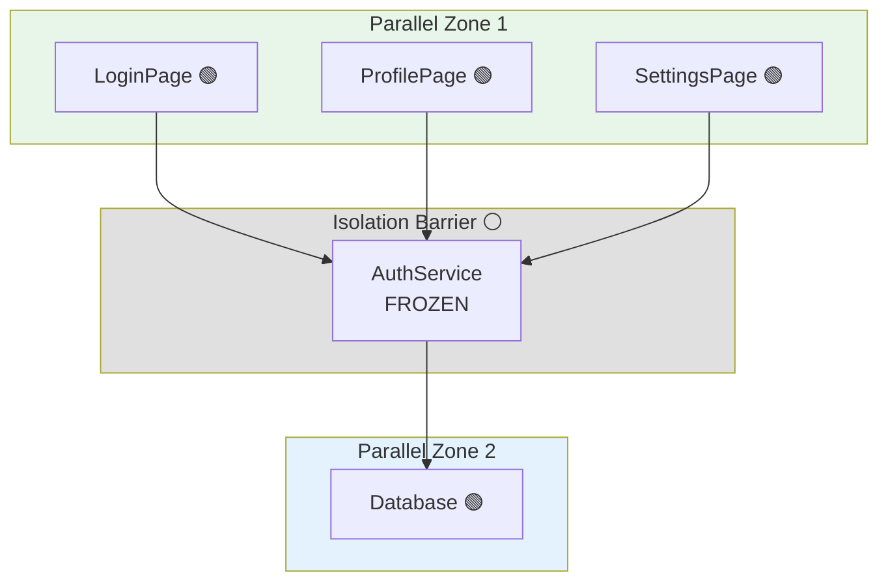

# [[Parallel Work Theory]]

**Document Type**: Architectural Concept

## Purpose

의존성 그래프를 기반으로 **병렬 개발 가능 영역**을 자동 탐지하여, 여러 개발자가 **충돌 없이** 동시에 작업할 수 있는 모듈을 식별합니다.

## Core Theory

### 기본 가정

```
모듈 A, B, C, D가 있고 의존성 관계가 다음과 같을 때:
A → B (A depends on B)
C → B (C depends on B)
D → B (D depends on B)

만약 B를 변경하지 않는다면:
→ A, C, D는 서로 독립적으로 개발 가능
→ A의 변경이 C, D에 영향 없음
→ C의 변경이 A, D에 영향 없음
→ D의 변경이 A, C에 영향 없음
```

**핵심**: 공통 의존성(B)가 **안정적 인터페이스**로 작동하면 **isolation barrier**가 됨

---

## Mathematical Definition

### Graph Theory 기반 정의

```
G = (V, E)  // Dependency Graph
V = {modules}
E = {dependencies}

For modules M1, M2:
  Parallel(M1, M2) ⟺ ¬(M1 → M2) ∧ ¬(M2 → M1)

  where:
    M1 → M2 means "M1 depends on M2" (direct or transitive)
```

### Working Set 개념

```
WorkingSet W = {m1, m2, ..., mn}  // 작업 중인 모듈들

Frozen Set F = V \ W  // 변경하지 않을 모듈들 (frozen interfaces)

Available Set A = {m ∈ V | ∀w ∈ W: ¬Conflicts(m, w)}
```

---

## Conflict Detection Rules

### Rule 1: Direct Dependency Conflict

```
M1과 M2가 충돌:
  M1 → M2  (M1이 M2에 직접 의존)
  또는
  M2 → M1  (M2가 M1에 직접 의존)
```

**Example:**
```
A → B (충돌)
B를 변경하면 A가 영향받음
```

---

### Rule 2: Transitive Dependency Conflict

```
M1과 M2가 충돌:
  M1 → ... → M2  (M1이 M2에 간접 의존)
```

**Example:**
```
A → B → C (충돌)
C를 변경하면 B를 통해 A가 영향받음
```

---

### Rule 3: Shared Mutable Dependency

```
M1과 M2가 충돌:
  M1 → S ∧ M2 → S ∧ S ∈ W
  (둘 다 S에 의존하고, S가 작업 중)
```

**Example:**
```
A → B ← C
B가 작업 중이면 A, C는 충돌 (B의 인터페이스 변경 가능)

A → B ← C
B가 frozen이면 A, C는 병렬 가능 ✅
```

---

### Rule 4: No Conflict (병렬 가능)

```
M1과 M2가 병렬 가능:
  ¬(M1 → M2) ∧ ¬(M2 → M1) ∧
  (M1과 M2의 모든 공통 의존성이 frozen)
```

**Example:**
```
A → B ← C
B가 frozen → A ∥ C (병렬 가능)

A → D, C → E, D ∥ E
→ A ∥ C (완전 독립)
```

---

## Isolation Barrier Pattern

### Definition

**Isolation Barrier**: 변경하지 않는 모듈로, 의존하는 모듈들을 서로 격리시킴

```
      A       C       D
      ↓       ↓       ↓
      ═══════B════════  (Barrier: 변경 안 함)
```

**Properties:**
1. **Stable Interface**: B의 API 변경 없음
2. **Decouples Consumers**: A, C, D가 서로 독립
3. **Enables Parallelism**: A ∥ C ∥ D

---

### Example: Service Layer as Barrier

```
UI Layer:
  - LoginPage (작업 중)
  - ProfilePage (작업 중)
  - SettingsPage (작업 중)

  ↓ depends on

Service Layer: (FROZEN - 인터페이스 변경 없음)
  - AuthService
  - UserService

  ↓ depends on

Data Layer: (작업 가능)
  - Database
```

**Result**: LoginPage ∥ ProfilePage ∥ SettingsPage (병렬 개발 가능)

---

## Algorithm: Parallel Work Detection

### Input
```typescript
interface ParallelWorkInput {
  dependencyGraph: Graph;
  workingModules: Set<string>;  // 현재 작업 중
  frozenModules: Set<string>;   // 변경하지 않음
}
```

### Output
```typescript
interface ParallelWorkOutput {
  availableModules: string[];      // 작업 가능한 모듈들
  conflicts: ConflictReport[];     // 충돌 목록
  parallelZones: ParallelZone[];   // 병렬 작업 영역들
}

interface ConflictReport {
  module1: string;
  module2: string;
  conflictType: 'direct' | 'transitive' | 'shared-mutable';
  path: string[];  // 의존성 경로
}

interface ParallelZone {
  id: string;
  modules: string[];
  isolationBarrier: string[];  // 이 영역을 격리시키는 frozen 모듈들
}
```

---

### Algorithm Pseudocode

```typescript
function detectParallelWork(input: ParallelWorkInput): ParallelWorkOutput {
  const { graph, workingModules, frozenModules } = input;

  // Step 1: 모든 모듈 중 작업 가능한 것 찾기
  const availableModules = [];
  for (const module of graph.nodes) {
    if (workingModules.has(module) || frozenModules.has(module)) {
      continue; // 이미 작업 중이거나 frozen
    }

    if (canWorkOnModule(module, workingModules, graph)) {
      availableModules.push(module);
    }
  }

  // Step 2: 충돌 감지
  const conflicts = detectConflicts(workingModules, graph);

  // Step 3: 병렬 영역 찾기
  const parallelZones = findParallelZones(availableModules, frozenModules, graph);

  return { availableModules, conflicts, parallelZones };
}

function canWorkOnModule(
  module: string,
  workingModules: Set<string>,
  graph: Graph
): boolean {
  // 작업 중인 모듈과 충돌 체크
  for (const working of workingModules) {
    if (hasConflict(module, working, graph)) {
      return false;
    }
  }
  return true;
}

function hasConflict(m1: string, m2: string, graph: Graph): boolean {
  // Rule 1: Direct dependency
  if (graph.hasEdge(m1, m2) || graph.hasEdge(m2, m1)) {
    return true;
  }

  // Rule 2: Transitive dependency
  if (graph.hasPath(m1, m2) || graph.hasPath(m2, m1)) {
    return true;
  }

  // Rule 3: Shared mutable dependency
  const deps1 = graph.getDependencies(m1);
  const deps2 = graph.getDependencies(m2);
  const sharedDeps = intersection(deps1, deps2);

  for (const shared of sharedDeps) {
    if (!isFrozen(shared)) {
      return true;  // Shared dependency가 변경 가능하면 충돌
    }
  }

  return false;
}
```

---

## Use Cases

### Use Case 1: Multi-Developer Workflow

**Scenario:**
- 3명 개발자가 동시 작업
- Developer A: UI 레이어
- Developer B: Service 레이어
- Developer C: Data 레이어

**Query:**
```typescript
const result = detectParallelWork({
  graph: projectGraph,
  workingModules: new Set(['ServiceLayer']),
  frozenModules: new Set(['ServiceLayer'])  // B가 인터페이스 확정
});

// Result:
// availableModules: ['UILayer', 'DataLayer']
// conflicts: []
// parallelZones: [
//   { modules: ['UILayer'], isolationBarrier: ['ServiceLayer'] },
//   { modules: ['DataLayer'], isolationBarrier: ['ServiceLayer'] }
// ]
```

---

### Use Case 2: Feature Branch Strategy

**Scenario:**
- Feature A: 결제 시스템
- Feature B: 알림 시스템
- 둘 다 UserService 의존

**Query:**
```typescript
const result = detectParallelWork({
  graph: projectGraph,
  workingModules: new Set(['PaymentFeature', 'NotificationFeature']),
  frozenModules: new Set(['UserService'])
});

// Result:
// availableModules: [...] (다른 독립 모듈들)
// conflicts: []  // UserService가 frozen이므로 충돌 없음
// parallelZones: [
//   {
//     modules: ['PaymentFeature', 'NotificationFeature'],
//     isolationBarrier: ['UserService']
//   }
// ]
```

---

### Use Case 3: Incremental Migration

**Scenario:**
- Legacy 시스템 → New 시스템 마이그레이션
- Adapter 레이어가 isolation barrier

**Query:**
```typescript
const result = detectParallelWork({
  graph: projectGraph,
  workingModules: new Set(['NewSystemV2']),
  frozenModules: new Set(['AdapterLayer'])
});

// Result:
// availableModules: ['LegacySystem']  // 동시 작업 가능
// conflicts: []
// parallelZones: [
//   { modules: ['NewSystemV2', 'LegacySystem'], isolationBarrier: ['AdapterLayer'] }
// ]
```

---

## Visualization

### Dependency Graph with Work Status

```
Legend:
🟢 Available (작업 가능)
🔵 Working (작업 중)
⚪ Frozen (변경 안 함)
🔴 Conflict (충돌)

Example:
    🟢A      🟢C      🟢D
     ↓        ↓        ↓
    ⚪═══════B═══════⚪  (Isolation Barrier)
     ↓
    🔵E  (작업 중 - A는 E와 충돌하므로 사용 불가)

Available: C, D (B가 barrier 역할)
Conflict: A ↔ E (A → B → E)
```

---

### Parallel Zone Visualization



---

## API Design

### Query API

```typescript
class ParallelWorkDetector {
  constructor(private graph: SymbolGraph) {}

  /**
   * 현재 작업 가능한 모듈 찾기
   */
  findAvailableModules(
    working: string[],
    frozen: string[]
  ): string[] {
    // Implementation
  }

  /**
   * 두 모듈 간 충돌 여부
   */
  hasConflict(
    module1: string,
    module2: string,
    frozen: string[]
  ): ConflictReport | null {
    // Implementation
  }

  /**
   * 병렬 작업 영역 탐지
   */
  findParallelZones(
    working: string[],
    frozen: string[]
  ): ParallelZone[] {
    // Implementation
  }

  /**
   * Isolation Barrier 후보 찾기
   */
  suggestIsolationBarriers(
    modules: string[]
  ): string[] {
    // 모듈들을 격리시킬 수 있는 공통 의존성 찾기
  }
}
```

---

### CLI Interface

```bash
# 작업 가능한 모듈 찾기
tsdoc-edge parallel-work \
  --working "UserService,AuthService" \
  --frozen "DatabaseManager"

# 출력:
Available Modules (8):
  ✓ LoginController
  ✓ ProfileController
  ✓ SettingsController
  ✓ NotificationService
  ✓ EmailService
  ✓ CacheManager
  ✓ LoggingService
  ✓ ConfigManager

Conflicts (2):
  ✗ SessionManager ↔ AuthService (direct dependency)
  ✗ PermissionChecker ↔ UserService (transitive: PermissionChecker → RoleService → UserService)

Parallel Zones (2):
  Zone 1: [LoginController, ProfileController, SettingsController]
    Barrier: [DatabaseManager]
  Zone 2: [NotificationService, EmailService]
    Barrier: [DatabaseManager]

---

# 충돌 상세 분석
tsdoc-edge parallel-work conflicts \
  --module1 "FeatureA" \
  --module2 "FeatureB"

# 출력:
Conflict Analysis: FeatureA ↔ FeatureB
  Type: shared-mutable-dependency
  Path: FeatureA → SharedService ← FeatureB
  Reason: SharedService is not frozen (working or available)

  Resolution Options:
  1. Freeze SharedService interface
  2. Work on FeatureA and FeatureB sequentially
  3. Extract interface from SharedService

---

# Isolation Barrier 제안
tsdoc-edge parallel-work suggest-barriers \
  --modules "FeatureA,FeatureB,FeatureC"

# 출력:
Suggested Isolation Barriers:
  1. SharedService (isolates 3 modules)
     - FeatureA → SharedService
     - FeatureB → SharedService
     - FeatureC → SharedService

  2. DatabaseLayer (isolates 2 modules)
     - FeatureA → DatabaseLayer
     - FeatureC → DatabaseLayer
```

---

## Implementation Strategy

### Phase 1: Core Algorithm
- [ ] Graph traversal utilities (BFS, DFS, path detection)
- [ ] Conflict detection (direct, transitive, shared)
- [ ] Available module calculation

### Phase 2: Zone Detection
- [ ] Parallel zone clustering
- [ ] Isolation barrier identification
- [ ] Barrier quality scoring

### Phase 3: CLI Integration
- [ ] `parallel-work` command
- [ ] `parallel-work conflicts` subcommand
- [ ] `parallel-work suggest-barriers` subcommand

### Phase 4: Visualization
- [ ] Mermaid diagram generation
- [ ] Interactive conflict explorer
- [ ] Zone highlighting in graph

---

## Benefits

### 1. Reduced Merge Conflicts
**Before:** 여러 개발자가 임의로 작업 → 충돌 발생
**After:** 시스템이 안전한 병렬 영역 제안 → 충돌 최소화

### 2. Optimized Team Workflow
**Before:** 순차적 작업 (bottleneck)
**After:** 병렬 작업 영역 명확 → 효율 증가

### 3. Architecture Insight
**Before:** 의존성 구조 불명확
**After:** Isolation barrier 후보 제안 → 아키텍처 개선 힌트

### 4. Safe Refactoring
**Before:** 리팩토링 영향 범위 불명확
**After:** Frozen zone 설정 → 안전한 병렬 리팩토링

---

## Limitations

### 1. Dynamic Dependencies
런타임에만 결정되는 의존성은 감지 불가
→ 정적 분석 한계

### 2. Semantic Conflicts
API는 유지되지만 동작이 변경되는 경우 감지 불가
→ 테스트 커버리지로 보완 필요

### 3. Granularity
파일/클래스 레벨 분석
→ 함수 레벨 충돌은 감지 못함

---

## Related Concepts

- [[SymbolGraphFeatures]] - 의존성 그래프 구축
- [[CoreWorkflow]] - 기본 워크플로우
- [[CLI Feedback Cycle]] - 시스템 피드백

## References

- Graph Theory: Topological Sort, Transitive Closure
- Conway's Law: 조직 구조 = 시스템 구조
- Microservices: Bounded Context, Service Independence

---

**Status**: Implemented
**Implementation**: [[ParallelWorkCommand]] (`src/commands/ParallelWorkCommand.ts`)
**Related Commands**: [[DepsCommand]], [[TestRelationshipsCommand]]
**Next Steps**: Integrate with test relationship verification
**Last Updated**: 2025-11-08

---

## Backlinks

### Referenced By

- [[TSDoc Edge Documentation]] → /home/user/tsdoc-edge/managed/README.md:209
- [[TSDoc Edge Documentation]] → /home/user/tsdoc-edge/managed/README.md:430
- [[ParallelWorkDetector]] → /home/user/tsdoc-edge/managed/analyzers/ParallelWorkDetector.md:23
- [[ParallelWorkDetector]] → /home/user/tsdoc-edge/managed/analyzers/ParallelWorkDetector.md:42
- [[ParallelWorkDetector]] → /home/user/tsdoc-edge/managed/analyzers/ParallelWorkDetector.md:43
- [[DepsCommand]] → /home/user/tsdoc-edge/managed/commands/DepsCommand.md:147
- [[DepsCommand]] → /home/user/tsdoc-edge/managed/commands/DepsCommand.md:148
- [[ParallelWorkCommand]] → /home/user/tsdoc-edge/managed/commands/ParallelWorkCommand.md:22
- [[ParallelWorkCommand]] → /home/user/tsdoc-edge/managed/commands/ParallelWorkCommand.md:35
- [[ParallelWorkCommand]] → /home/user/tsdoc-edge/managed/commands/ParallelWorkCommand.md:36
- [[ParallelWorkCommand]] → /home/user/tsdoc-edge/managed/commands/ParallelWorkCommand.md:37
- [[ParallelWorkCommand]] → /home/user/tsdoc-edge/managed/commands/ParallelWorkCommand.md:38
- [[ParallelWorkCommand]] → /home/user/tsdoc-edge/managed/commands/ParallelWorkCommand.md:39
- [[TestRelationshipsCommand]] → /home/user/tsdoc-edge/managed/commands/TestRelationshipsCommand.md:44
- [[TestRelationshipsCommand]] → /home/user/tsdoc-edge/managed/commands/TestRelationshipsCommand.md:45
- [[TestRelationshipsCommand]] → /home/user/tsdoc-edge/managed/commands/TestRelationshipsCommand.md:46
- [[Concepts Index]] → /home/user/tsdoc-edge/managed/concepts/index.md:229
- [[Concepts Index]] → /home/user/tsdoc-edge/managed/concepts/index.md:248
- [[Concepts Index]] → /home/user/tsdoc-edge/managed/concepts/index.md:273
- [[Concepts Index]] → /home/user/tsdoc-edge/managed/concepts/index.md:274
- [[Integration Test Traceability]] → /home/user/tsdoc-edge/managed/concepts/integration-test-traceability.md:151
- [[Integration Test Traceability]] → /home/user/tsdoc-edge/managed/concepts/integration-test-traceability.md:188
- [[Integration Test Traceability]] → /home/user/tsdoc-edge/managed/concepts/integration-test-traceability.md:189
- [[CoreWorkflow]] → /home/user/tsdoc-edge/managed/features/core-workflow.md:197
- [[CoreWorkflow]] → /home/user/tsdoc-edge/managed/features/core-workflow.md:198
- [[CoreWorkflow]] → /home/user/tsdoc-edge/managed/features/core-workflow.md:199
- [[SymbolGraphFeatures]] → /home/user/tsdoc-edge/managed/features/symbol-graph.md:299
- [[SymbolGraphFeatures]] → /home/user/tsdoc-edge/managed/features/symbol-graph.md:300
- [[SymbolGraphFeatures]] → /home/user/tsdoc-edge/managed/features/symbol-graph.md:301
- [[Guides & Tutorials]] → /home/user/tsdoc-edge/managed/guides/index.md:376
- [[Guides & Tutorials]] → /home/user/tsdoc-edge/managed/guides/index.md:453
- [[Guides & Tutorials]] → /home/user/tsdoc-edge/managed/guides/index.md:454

