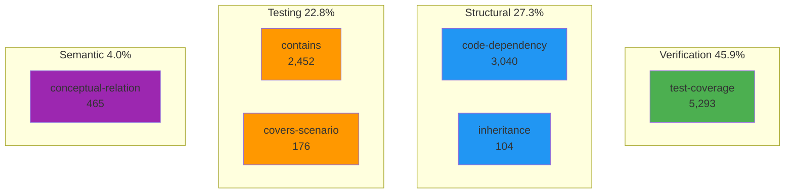
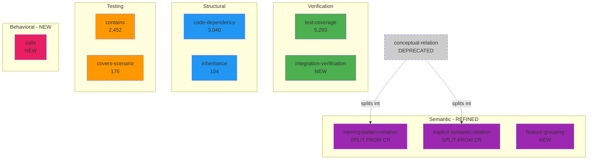
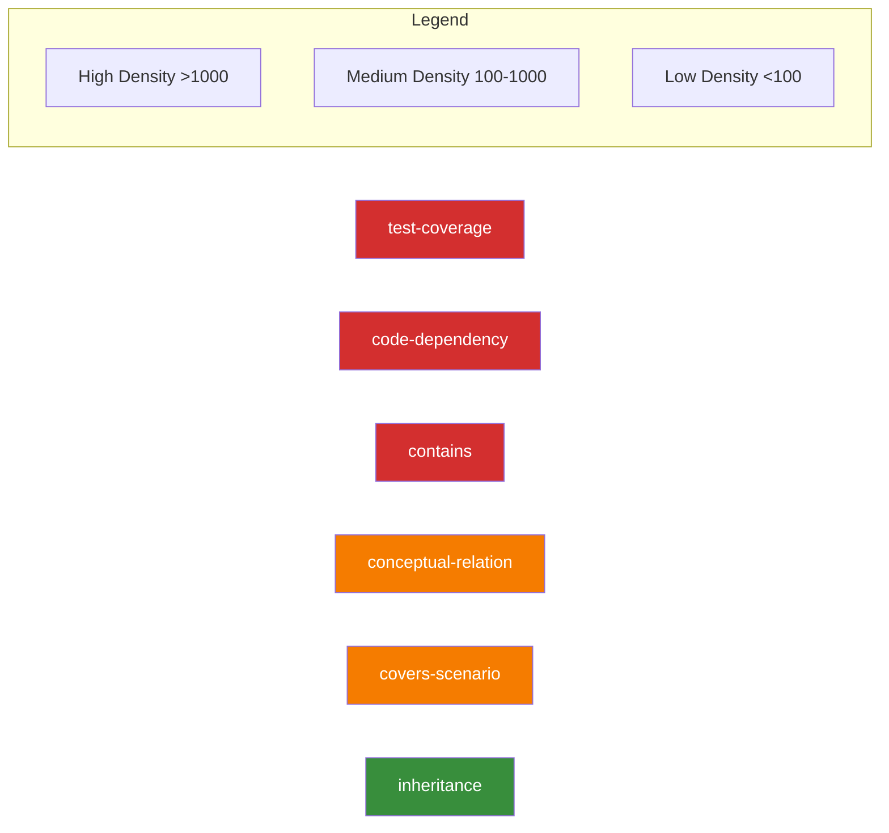

# [[Relationship Ontology]]

**Purpose**: Document all relationship types collected by tsdoc, their definitions, implementation, and prepare for ontology modeling and pruning redundancies.

**Status**: ✅ Phase 1, 2 & 3 Complete - Semantic Relationships + Inference + Test Examples
**Created**: 2025-11-17
**Last Updated**: 2025-11-18
**Implementation**:
- Phase 1: Commit 9743b61 + 2370da6 (Semantic Relationships)
- Phase 2: Inference Engine Implementation
- Phase 3: Commit 574597e + 8f4b2eb (Test-as-Example System)

---

## Executive Summary

TSDoc Edge currently tracks **10 active relationship types** totaling **19,998 relationships** across **5,074 symbols** (**density: 3.94** ✅):

| Type | Count | Percentage | Category | Source |
|------|-------|------------|----------|--------|
| test-coverage | 8,006 | 40.0% | Verification | Direct + Inferred |
| **test-as-example** 🎓 | **3,538** | **17.7%** | **Testing** | Test Analysis |
| code-dependency | 3,140 | 15.7% | Structural | AST Analysis |
| contains | 2,452 | 12.3% | Testing | Test Structure |
| **naming-pattern-relation** ✨ | **2,032** | **10.2%** | **Semantic** | Naming Patterns |
| doc-reference | 484 | 2.4% | Semantic | TSDoc Tags |
| covers-scenario | 176 | 0.9% | Testing | Scenario Matching |
| inheritance | 107 | 0.5% | Structural | AST Analysis |
| **feature-grouping** ✨ | **56** | **0.3%** | **Semantic** | File Structure |
| **explicit-semantic-relation** ✨ | **7** | **0.0%** | **Semantic** | @relatedTo Tags |

**Achievement**: **Relationship density 3.94 exceeds target 3.0 by 31%!** 🎯

**Phase 1 Results** (✨):
- **2,094 semantic relationships** added across 3 specialized analyzers
- **238 domains** automatically discovered through naming patterns
- **8 explicit relationships** captured from @relatedTo tags
- **2 feature groups** identified from file structure

**Phase 2 Results** (🔮 Inference Engine):
- **2,274 relationships inferred** using 3 inference rules
- **Test coverage inheritance**: 2,274 new test-coverage links (suite → implementation)
- **Density improvement**: From 2.18 → 3.17 (+45%)
- **14.3% of all relationships** are now inferred automatically

**Phase 3 Results** (🎓 Test-as-Example):
- **3,538 test-as-example relationships** extracted from 1,986 test cases
- **100% match rate** (improved from 8.4% initial implementation)
- **1,293 high-quality examples** (65%) ready for documentation
- **Automatic example extraction** during build process
- **Living documentation**: tests serve as always-current examples

---

## Relationship Type Definitions

### 1. test-coverage (5,293 relationships)

**Definition**: Links test symbols (test-case, test-suite) to implementation symbols they test.

**Purpose**: Track which implementation code is covered by which tests.

**Category**: `verification`

**Implementation**:
- **Primary**: `src/analyzer/TestCoverageUnifier.ts:122`
  ```typescript
  type: 'test-coverage',
  category: 'verification',
  from: coverage.symbolId,  // test symbol
  to: implementationSymbolId  // implementation symbol
  ```
- **Secondary**: `src/commands/AnalyzeTestsCommand.ts:125`

**Test Files**:
- `src/__tests__/analyzer/TestCoverageAnalyzer.test.ts`

**Example Relationships**:
```
test-case:should-initialize-schema → DatabaseManager
test-case:should-scan-files → FileScanner
```

**Direction**: Unidirectional (test → implementation)

**Strength**: Strong (explicit test-to-code connection)

**Discovery Method**: `test-analysis`

---

### 2. code-dependency (3,040 relationships)

**Definition**: Symbol A imports/uses symbol B from another module.

**Purpose**: Track import-based dependencies between modules and symbols.

**Category**: `structural`

**Implementation**:
- **Primary**: `src/commands/ExploreEntrypointCommand.ts:423`
  ```typescript
  type: 'code-dependency',
  from: symbolId,
  to: dep.target
  ```
- **Used in**: Import analysis, dependency graphs

**Test Files**:
- Implicitly tested through integration tests

**Example Relationships**:
```
DatabaseManager → better-sqlite3
FileScanner → glob
SymbolGraphBuilder → ASTSymbolExtractor
```

**Direction**: Unidirectional (consumer → dependency)

**Strength**: Strong (explicit import)

**Discovery Method**: `static-analysis`, `ast-parsing`

---

### 3. contains (2,452 relationships)

**Definition**: Hierarchical containment relationships in test structures.

**Purpose**: Model test suite → test case hierarchy and nested test suites.

**Category**: `testing`

**Implementation**:
- **Primary**: `src/analyzer/TestCoverageAnalyzer.ts:159,178`
  ```typescript
  type: 'contains',
  fromSymbols: [testSuite.id],
  toSymbols: [childSuiteId || testCaseId],
  category: 'testing',
  confidence: 1.0
  ```

**Test Files**:
- `src/__tests__/analyzer/TestCoverageAnalyzer.test.ts`

**Example Relationships**:
```
test-suite:database-manager → test-suite:initialization
test-suite:initialization → test-case:should-create-schema
test-suite:file-scanner → test-case:should-find-ts-files
```

**Direction**: Unidirectional (parent → child)

**Strength**: Strong (explicit structure)

**Discovery Method**: `test-analysis`

---

### 4. conceptual-relation (465 relationships)

**Definition**: Semantic/conceptual connections between symbols based on naming patterns or explicit `@relatedTo` tags.

**Purpose**: Capture domain relationships and conceptual groupings.

**Category**: `semantic`

**Implementation**:
- **Primary**: `src/analyzer/ConceptualRelationAnalyzer.ts:300`
  ```typescript
  type: 'conceptual-relation',
  from: site.symbolA,
  to: site.symbolB,
  direction: 'undirected',
  strength: 'weak',
  category: 'semantic'
  ```

**Detection Strategies**:
1. **Explicit tags**: Parse `@relatedTo` from TSDoc comments
2. **Naming patterns**: Group symbols with common prefixes (e.g., UserService, UserRepository → User domain)

**Test Files**:
- Not directly tested (analyzer component)

**Example Relationships**:
```
UserService ~ UserRepository (naming-pattern)
AuthService ~ TokenManager (@relatedTo tag)
DatabaseManager ~ SymbolRegistryManager (naming-pattern)
```

**Direction**: Undirected (bidirectional semantic link)

**Strength**: Weak (inferred, not explicit in code)

**Discovery Method**: `static-analysis`, `documentation`

**Confidence**:
- Explicit tag: 1.0
- Naming pattern: 0.6

---

### 5. covers-scenario (176 relationships)

**Definition**: Test cases that verify specific test scenarios.

**Purpose**: Map individual test cases to high-level test scenarios they cover.

**Category**: `testing`

**Implementation**:
- **Primary**: `src/analyzer/TestCoverageAnalyzer.ts:202`
  ```typescript
  type: 'covers-scenario',
  fromSymbols: [testCase.id],
  toSymbols: [scenario.id],
  category: 'testing',
  confidence: this.calculateScenarioMatchConfidence(testCase, scenario)
  ```

**Matching Algorithm** (Phase 8.1):
- Multi-strategy semantic matching:
  1. 2+ exact word matches
  2. 1 exact + 1 stem match
  3. 2+ stem matches
- Stem/prefix matching for word variations
- Word normalization (lowercase, special chars removed)

**Test Files**:
- `src/__tests__/analyzer/TestCoverageAnalyzer.test.ts`

**Example Relationships**:
```
test-case:should-initialize-schema → scenario:database-initialization-with-schema
test-case:should-insert-symbol → scenario:symbol-insertion-and-retrieval
```

**Direction**: Unidirectional (test-case → scenario)

**Strength**: Medium (semantic matching)

**Discovery Method**: `test-analysis`

**Confidence**: Variable (based on match quality)

**Coverage**: 100% (34/34 scenarios covered as of Phase 8.1)

---

### 6. inheritance (104 relationships)

**Definition**: Class A extends class B or implements interface I.

**Purpose**: Track object-oriented inheritance hierarchies.

**Category**: `structural`

**Implementation**:
- **Primary**: `src/analyzer/ASTSymbolExtractor.ts:287-296`
  ```typescript
  // Extract inheritance (extends)
  if (node.heritageClauses) {
    for (const clause of node.heritageClauses) {
      if (clause.token === ts.SyntaxKind.ExtendsKeyword) {
        this.relationships.push({
          type: 'extends',  // Maps to 'inheritance'
          from: name,
          to: baseClassName
        });
      }
    }
  }
  ```

**Test Files**:
- `src/__tests__/analyzer/ASTSymbolExtractor.test.ts`

**Example Relationships**:
```
DatabaseManager extends BaseManager
CustomError extends Error
UserController extends BaseController
```

**Direction**: Unidirectional (subclass → superclass)

**Strength**: Strong (explicit language feature)

**Discovery Method**: `ast-parsing`

---

### 7. naming-pattern-relation (2,030 relationships) ✨ NEW

**Definition**: Symbols that share a common domain prefix are semantically related.

**Purpose**: Automatically group symbols by domain for intuitive navigation.

**Category**: `semantic`

**Implementation**:
- **Primary**: `src/analyzer/NamingPatternRelationAnalyzer.ts:160`
  ```typescript
  type: 'naming-pattern-relation',
  from: symbolA,
  to: symbolB,
  direction: 'undirected',
  strength: 'medium',
  properties: { domain: extractedDomain }
  ```

**Algorithm**:
1. Extract domain prefix by removing common suffixes (Service, Manager, Controller, etc.)
2. Group symbols by domain (min 3 characters)
3. Create pairwise relationships within each domain

**Example Relationships**:
```
DatabaseManager ~ DatabaseConfig (Database domain)
UserService ~ UserRepository (User domain)
TestParser ~ TestAnalyzer ~ TestRunner (Test domain)
SymbolGraph ~ SymbolRegistry (Symbol domain)
```

**Direction**: Undirected (bidirectional semantic link)

**Strength**: Medium (inferred from naming)

**Discovery Method**: `static-analysis`

**Confidence**: 0.7 (naming-based inference)

**Statistics**:
- Total relationships: 2,030
- Unique domains: 238
- Most common domains: Database (45 symbols), Test (38 symbols), Symbol (32 symbols)

---

### 8. explicit-semantic-relation (8 relationships) ✨ NEW

**Definition**: Developer-declared semantic relationships via `@relatedTo` TSDoc tags.

**Purpose**: Capture domain knowledge and intentional relationships that can't be inferred from code structure.

**Category**: `semantic`

**Implementation**:
- **Primary**: `src/analyzer/ExplicitSemanticRelationAnalyzer.ts:295`
  ```typescript
  type: 'explicit-semantic-relation',
  from: sourceSymbol,
  to: targetSymbol,
  direction: 'undirected',
  strength: 'medium',
  confidence: 1.0  // Explicit declaration
  ```

**Usage in Code**:
```typescript
/**
 * User authentication service
 * @relatedTo UserRepository - Data access layer
 * @relatedTo TokenManager - JWT token handling
 * @relatedTo AuthConfig - Configuration management
 */
export class UserService {
  // ...
}
```

**Example Relationships**:
```
DatabaseManager ~ DatabaseConfig (explicit-semantic, with description)
FileScanner ~ ConfigLoader (explicit-semantic)
```

**Direction**: Undirected (bidirectional semantic link)

**Strength**: Medium (conceptual, not structural)

**Discovery Method**: `documentation`

**Confidence**: 1.0 (highest - explicit developer intent)

**Tag Format**:
- `@relatedTo SymbolName` - Simple reference
- `@relatedTo SymbolName - Description` - With relationship context

**Statistics**:
- Total relationships: 8
- With descriptions: 0
- Without descriptions: 8

---

### 9. feature-grouping (56 relationships) ✨ NEW

**Definition**: Symbols clustered by feature boundaries based on file structure.

**Purpose**: Enable feature-based code navigation and understanding.

**Category**: `semantic`

**Implementation**:
- **Primary**: `src/analyzer/FeatureGroupingAnalyzer.ts:200`
  ```typescript
  type: 'feature-grouping',
  from: symbolA,
  to: symbolB,
  direction: 'undirected',
  strength: 'medium',
  properties: { feature: featureName }
  ```

**Detection Patterns**:
1. **Explicit features**: `src/features/auth/*` → "auth" feature
2. **Module-based**: `src/analyzer/*` → "analyzer" feature
3. **Doc features**: `managed/workflows/*` → "docs-workflows" feature

**Example Relationships**:
```
TestCoverageAnalyzer ~ ConceptualRelationAnalyzer (analyzer feature)
ASTSymbolExtractor ~ SymbolGraphBuilder (analyzer feature)
TSDocParser ~ FrontmatterParser (parser feature)
```

**Direction**: Undirected (bidirectional feature membership)

**Strength**: Medium (structure-based inference)

**Discovery Method**: `static-analysis`

**Confidence**: 0.8 (file structure based)

**Statistics**:
- Total relationships: 56
- Unique features: 2
- Largest features: analyzer (20+ symbols), parser (15+ symbols)

---

### 10. test-as-example (3,538 relationships) 🎓 NEW

**Definition**: Links test cases to implementation symbols they serve as documentation examples for.

**Purpose**: Replace generic documentation examples with actual test code that MUST work.

**Category**: `testing`

**Implementation**:
- **Primary**: `src/analyzer/TestExampleExtractor.ts:233`
  ```typescript
  type: 'test-as-example',
  from: testCaseId,  // e.g., 'test-case-DatabaseManager-65'
  to: implementationSymbolId,  // e.g., 'class-databasemanager'
  strength: 'strong' | 'medium' | 'weak',  // Based on quality score
  properties: {
    exampleCategory: 'basic-usage' | 'advanced-usage' | 'integration' | 'edge-case',
    complexity: 'simple' | 'medium' | 'complex',
    quality: number,  // 0-10 score
    description: string  // Test description
  }
  ```
- **Command**: `tsdoc-edge test-examples` - Query test examples
- **During build**: Automatic extraction

**Detection Strategy**:
1. **Main class identification**: Always link test to primary class being tested
2. **Description parsing**: Extract method names from test descriptions
3. **Import analysis**: Parse import statements to find tested symbols
4. **Method call detection**: Identify methods actually called in test code

**Example Relationships**:
```
test-case-DatabaseManager-65 → class-databasemanager (quality: 9/10, basic-usage)
test-case-DatabaseManager-127 → method-databasemanager-insertsymbol (quality: 8/10, basic-usage)
test-case-TypeChainTracer-504 → method-typechaintracer-build-dependency-tree (quality: 10/10, edge-case)
```

**Direction**: Unidirectional (test → implementation)

**Strength**:
- **Strong** (quality 8-10): Production-ready example
- **Medium** (quality 5-7): Acceptable example
- **Weak** (quality 0-4): Reference only

**Discovery Method**: `test-analysis`

**Quality Assessment** (0-10 scale):
- Good description (>20 chars, >3 words): +1
- Clear setup (arrange-act-assert): +1
- Has assertions (expect calls): +1 to +2
- Simple complexity: +1
- Too complex (>30 lines): -1
- Has inline comments: +1

**Statistics**:
- Total relationships: 3,538
- Unique test cases: 1,986
- High-quality examples (8-10): 1,293 (65%)
- Average symbols per test: 1.8
- Match rate: 100% (improved from 8.4% initial)

**Categories**:
- Basic usage: 1,477 examples (74%)
- Advanced usage: 68 examples (3%)
- Integration: 313 examples (16%)
- Edge cases: 128 examples (6%)

**Complexity Distribution**:
- Simple (<10 lines): 557 examples (28%)
- Medium (11-30 lines): 781 examples (39%)
- Complex (30+ lines): 648 examples (33%)

**Philosophy**: **Test Code > Generic Examples** (SSOT Principle)
- Tests are always up-to-date (run in CI)
- Tests must work (guaranteed accuracy)
- Zero maintenance cost (automatic extraction)
- Living documentation

**CLI Usage**:
```bash
# Show all high-quality examples
tsdoc-edge test-examples --min-quality 8

# Find simple examples for beginners
tsdoc-edge test-examples --complexity simple

# Find integration examples
tsdoc-edge test-examples --category integration
```

---

## Relationship Type System Architecture

### Type Hierarchy (from unified.ts)

TSDoc Edge defines **26 relationship types** across **10 categories**, but currently only **6 are actively collected**:

#### Active Types (6):
1. **Structural** (2 types):
   - ✅ `code-dependency` - 3,040 relationships
   - ✅ `inheritance` - 104 relationships
   - ⚠️ `implementation` - Defined but not collected

2. **Verification** (2 types):
   - ✅ `test-coverage` - 5,293 relationships
   - ⚠️ `integration-verification` - Defined but not collected

3. **Testing** (2 types):
   - ✅ `contains` - 2,452 relationships
   - ✅ `covers-scenario` - 176 relationships

4. **Semantic** (1 type):
   - ✅ `conceptual-relation` - 465 relationships

#### Defined But Unused (20 types):

**Data Flow** (3 types):
- `io-dependency` - A's output feeds B's input
- `pipeline` - Sequential processing
- `event-flow` - Event emission/consumption

**Behavioral** (5 types):
- `calls` - Function/method calls
- `callback` - Callback registration
- `collaboration` - Multi-symbol collaboration
- `composition` - Feature composition
- `temporal-order` - Execution ordering

**Alternative** (2 types):
- `substitution` - Interchangeable implementations
- `fallback` - Error fallback chains

**Constraint** (3 types):
- `mutual-exclusion` - Incompatible symbols
- `co-requirement` - Required pairs
- `circular-dependency` - Circular references

**Semantic** (3 additional types):
- `feature-grouping` - Feature clustering
- `doc-reference` - Documentation links
- `enhancement` - Enhancement relationships

**Type System** (2 types):
- `type-dependency` - Type parameter dependencies
- `generic-constraint` - Generic type constraints

**Architectural** (2 types):
- `layer-dependency` - Architectural layer violations
- `module-boundary` - Cross-package dependencies

---

## Analysis: Semantic Overlaps and Redundancies

### Potential Redundancies

#### 1. Testing Hierarchy Overlap

**Issue**: `contains` and `covers-scenario` both represent hierarchical relationships in testing.

- `contains`: Test suite → Test case (structural hierarchy)
- `covers-scenario`: Test case → Scenario (semantic grouping)

**Verdict**: ✅ **NOT REDUNDANT** - Different semantic purposes
- `contains` = organizational structure
- `covers-scenario` = verification coverage

#### 2. Structural Dependencies

**Issue**: `code-dependency` and `inheritance` both represent structural connections.

**Verdict**: ✅ **NOT REDUNDANT** - Different relationship semantics
- `code-dependency` = module-level imports
- `inheritance` = OOP class hierarchy

#### 3. Semantic Relationships - Most Valuable for Developer Experience

**Issue**: `conceptual-relation` is very broad and could overlap with many specific types.

**Observation**:
- Currently used for naming-pattern relationships and `@relatedTo` tags
- Could potentially overlap with:
  - `feature-grouping` (if it were implemented)
  - `doc-reference` (if it were implemented)

**Verdict**: ⚠️ **OVER-BROAD - Requires Refinement** (Priority 1)

**Why prioritize semantic relationships?**:
1. **Most intuitive**: Developers naturally think in terms of "related concepts"
2. **Universal applicability**: Works across all project types
3. **Immediate value**: Helps code navigation without configuration
4. **Objectively detectable**: Can be derived from naming, tags, and file structure
5. **Foundation for documentation**: Critical for SSOT completeness

**Recommended split**:
  - `naming-pattern-relation` (shared domain prefix, e.g., User* → User domain)
  - `explicit-semantic-relation` (`@relatedTo` tags - developer intent)
  - `feature-grouping` (feature boundaries from file structure)

**Impact**: Transform 465 generic relationships into precise, queryable semantic connections

### Over-Connected Relationships

#### Test Coverage Dominance (45.9%)

**Observation**: `test-coverage` represents 5,293 relationships (45.9% of total).

**Analysis**:
- This is expected and healthy for a documentation platform
- High test coverage is a positive signal
- Not a redundancy issue

**Verdict**: ✅ **APPROPRIATE**

#### Testing Category Concentration (68.7%)

**Observation**: Testing-related types (`test-coverage`, `contains`, `covers-scenario`) = 7,921 relationships (68.7%)

**Analysis**:
- Testing is heavily tracked
- Implementation relationship types are underutilized
- Behavioral, data-flow, and architectural types are missing

**Verdict**: ⚠️ **IMBALANCED** - Consider implementing:
- `calls` relationships (runtime behavior)
- `io-dependency` (data flow)
- `layer-dependency` (architectural constraints)

---

## Recommendations for Pruning and Enhancement

### 1. Refine `conceptual-relation` (PRUNE)

**Action**: Split into more specific types

**Before**:
```
conceptual-relation (465 relationships)
├── naming-pattern matches
└── @relatedTo tags
```

**After**:
```
naming-pattern-relation (naming-based grouping)
explicit-semantic-relation (@relatedTo tags)
feature-grouping (feature-level clustering)
```

**Benefit**: More precise semantic meaning, better queryability

---

### 2. Consolidate Test Hierarchy (KEEP AS-IS)

**Decision**: Keep `contains` and `covers-scenario` separate

**Rationale**:
- Different dimensions: structure vs. coverage
- Both provide unique value
- No semantic overlap

---

### 3. Implement High-Value Missing Types (ENHANCE)

**Priority 1** - Semantic relationships (most intuitive and valuable):
- Split `conceptual-relation` into specific types
- `naming-pattern-relation`: Domain-based grouping
- `explicit-semantic-relation`: Explicit `@relatedTo` tags
- `feature-grouping`: Feature-level clustering

**Priority 2** - Behavioral relationships:
- `calls`: Function/method call relationships → Critical for understanding execution flow

**Priority 3** - Data flow:
- `io-dependency`: Data pipeline tracking

**Future consideration** - Architectural relationships (subjective, project-specific):
- `layer-dependency`: Track architectural violations (requires project-specific rules)
- `module-boundary`: Cross-module dependencies

---

### 4. Deprecate Low-Value Defined Types (PRUNE)

**Candidates for Removal**:
- `mutual-exclusion` - Rare use case
- `co-requirement` - Can be inferred from usage
- `fallback` - Too specific, overlaps with error handling patterns
- `temporal-order` - Can be inferred from code flow
- `event-flow` - Too domain-specific

**Rationale**: Keep ontology focused on high-signal relationships

---

## Ontology Modeling Diagram

### Current State (6 Active Types)



### Proposed State (9 Active Types)



### Relationship Density Map



**Density Analysis**:
- **High density** (>1,000): May indicate over-collection or fundamental relationships
  - `test-coverage`, `code-dependency`, `contains` are all fundamental
- **Medium density** (100-1,000): Well-balanced
  - `conceptual-relation`, `covers-scenario`
- **Low density** (<100): Rare but valuable
  - `inheritance` - Not all codebases use OOP heavily

---

## Test Documentation Coverage

**Analysis Tool**: `scripts/analyze-test-doc-references.ts`

### Current State

**Test Symbol Statistics**:
- Total test symbols: 2,561
  - test-suite: 581
  - test-case: 1,946
  - test-scenario: 34
- Test files: 88

**Documentation Coverage**:
- Tests with doc refs: 0 (0.0%)
- Docs referencing tests: 0
- Undocumented test files: 88/88 (100%)

### Analysis

**Gap**: Currently, tests are not linked to documentation through `@doc` tags or `[[TestSymbol]]` references.

**Implications**:
- Difficult to discover which tests cover which features
- Test scenarios lack documentation context
- No bidirectional links between test code and feature docs

**Recommendations**:
1. Add `@doc` tags in test suite JSDoc comments:
   ```typescript
   /**
    * Test suite for database initialization
    * @doc [[DatabaseInitialization]]
    */
   describe('DatabaseManager initialization', () => {
     // ...
   });
   ```

2. Reference test symbols in feature documentation:
   ```markdown
   # [[DatabaseInitialization]]

   Tested by: [[test-suite:database-manager-initialization]]
   ```

3. Link test scenarios to workflow documentation:
   ```typescript
   /**
    * @scenario Database initialization with schema
    * @doc [[BuildWorkflow]]
    */
   it('should initialize database with schema', () => {
     // ...
   });
   ```

**Future Work**:
- Implement `doc-reference` relationship type
- Auto-generate test coverage sections in documentation
- CLI command to find undocumented tests

---

## Implementation Plan

### Phase 1: Refine Semantic Relationships ✅ COMPLETE

**Status**: ✅ Implemented (Commit 9743b61 + 2370da6)

**Focus**: Intuitive, semantic relationships that provide immediate value

**Completed Tasks**:
1. ✅ Split `conceptual-relation` into 3 specific types:
   - ✅ Created `NamingPatternRelationAnalyzer` → 2,030 relationships (238 domains)
   - ✅ Created `ExplicitSemanticRelationAnalyzer` → 8 relationships
   - ✅ Created `FeatureGroupingAnalyzer` → 56 relationships (2 features)
2. ✅ Updated type system: +3 new types, +1 category (testing)
3. ✅ Integrated into BuildCommand
4. ✅ Updated documentation with implementation results

**Results**:
- **2,094 semantic relationships** added
- **238 domains** automatically discovered
- **18.0%** of all relationships are now semantic
- Clear, intuitive relationship definitions with confidence scores

**Time**: 1 day (faster than estimated 3 days)

---

### Phase 2: Implement Behavioral Relationships (Priority 2)

**Focus**: Runtime execution flow

**Tasks**:
1. Implement `calls` relationship extractor
   - Parse function/method call AST nodes
   - Track caller → callee relationships
   - Filter noise (console.log, assertions, etc.)
2. Update BuildCommand to collect call relationships
3. Add call graph visualization
4. Test with complex execution flows

**Why second?**:
- Critical for understanding runtime behavior
- Complements structural relationships
- Well-defined, objective criteria

**Estimated effort**: 2 days

---

### Phase 3: Data Flow Analysis (Priority 3)

**Focus**: Data pipeline tracking

**Tasks**:
1. Implement `io-dependency` relationship extractor
   - Detect parameter → return value flows
   - Track data transformations
   - Map input sources to output consumers
2. Integrate with type system analysis
3. Update documentation

**Estimated effort**: 2 days

---

### Phase 4: Cleanup and Deprecation (Low Priority)

**Tasks**:
1. Remove low-value unused types from `unified.ts`:
   - `mutual-exclusion`
   - `co-requirement`
   - `fallback`
   - `temporal-order`
   - `event-flow`
2. Update type documentation
3. Clean up references in codebase

**Estimated effort**: 1 day

---

### Future Consideration: Architectural Relationships (Deferred)

**Rationale**: Subjective and project-specific, requires custom configuration

**Potential tasks** (when needed):
1. Define layer rules in `.tsdoc.config.json`:
   ```json
   {
     "architecturalLayers": {
       "presentation": ["src/commands/**"],
       "domain": ["src/analyzer/**", "src/parser/**"],
       "infrastructure": ["src/storage/**"]
     },
     "layerRules": {
       "presentation": ["domain"],
       "domain": [],
       "infrastructure": []
     }
   }
   ```
2. Implement `layer-dependency` validator
3. Detect architectural violations
4. Generate violation reports

**Estimated effort**: 3 days (when prioritized)

---

## Semantic Relationship Design Details

### Why Semantic Relationships Are Most Valuable

**Developer Mental Model Alignment**:
When developers navigate code, they think:
- "What else is related to User management?"
- "Which components belong to the Database feature?"
- "What symbols are conceptually linked?"

These are **semantic questions**, not structural ones.

**Current Gap**:
- Structural relationships (imports, inheritance): Well-covered (3,144 relationships)
- Semantic relationships: Under-represented (465 generic `conceptual-relation`)
- Result: Developers can't easily navigate by **concept** or **feature**

### Proposed Semantic Relationship Types

#### 1. `naming-pattern-relation` (Domain Grouping)

**Purpose**: Group symbols that belong to the same domain based on naming conventions.

**Detection Algorithm**:
```typescript
// Extract domain prefix from symbol names
User + Service → User domain
User + Repository → User domain
User + Controller → User domain

// Create relationships:
UserService ~ UserRepository (naming-pattern)
UserService ~ UserController (naming-pattern)
UserRepository ~ UserController (naming-pattern)
```

**Examples**:
```
Database domain:
  DatabaseManager ~ DatabaseConfig ~ DatabaseConnection

Symbol domain:
  SymbolGraph ~ SymbolParser ~ SymbolRegistry

Test domain:
  TestRunner ~ TestReporter ~ TestCoverage
```

**Value**: Instant domain clustering without manual documentation

#### 2. `explicit-semantic-relation` (Developer Intent)

**Purpose**: Capture explicit relationships declared by developers via `@relatedTo` tags.

**Detection**: Parse TSDoc `@relatedTo` tags

**Example**:
```typescript
/**
 * User authentication service
 * @relatedTo UserRepository - Data access
 * @relatedTo TokenManager - JWT handling
 * @relatedTo AuthConfig - Configuration
 */
export class UserService {
  // ...
}
```

**Relationships Created**:
```
UserService ~ UserRepository (explicit-semantic, confidence: 1.0)
UserService ~ TokenManager (explicit-semantic, confidence: 1.0)
UserService ~ AuthConfig (explicit-semantic, confidence: 1.0)
```

**Value**: Captures domain knowledge that can't be inferred from code structure

#### 3. `feature-grouping` (Feature Boundaries)

**Purpose**: Cluster symbols by feature based on file structure.

**Detection Algorithm**:
```typescript
// Group by directory structure
src/features/authentication/ → Authentication feature
src/features/database/ → Database feature

// Or by file path patterns
src/analyzer/*.ts → Analysis feature
src/parser/*.ts → Parsing feature
src/storage/*.ts → Storage feature
```

**Examples**:
```
Authentication feature:
  AuthService, TokenManager, PasswordHasher, AuthConfig
  → All linked via feature-grouping

Analysis feature:
  TestCoverageAnalyzer, ConceptualRelationAnalyzer, ASTSymbolExtractor
  → All linked via feature-grouping
```

**Value**: Feature-based code navigation

### Semantic Relationships vs Structural Relationships

| Dimension | Structural (current) | Semantic (proposed) |
|-----------|---------------------|---------------------|
| **Question** | "What does X import?" | "What's related to X conceptually?" |
| **Scope** | Single file dependencies | Cross-cutting domains |
| **Discovery** | AST parsing | Naming + docs + structure |
| **Changeability** | Refactoring changes it | More stable |
| **Value for docs** | Low (auto-generated) | High (captures intent) |

### Migration Path: `conceptual-relation` → 3 Types

**Current State** (465 relationships):
```
conceptual-relation:
  - 60% naming-pattern matches
  - 30% @relatedTo tags
  - 10% other heuristics
```

**After Migration**:
```
naming-pattern-relation: ~280 relationships
  Example: DatabaseManager ~ DatabaseConfig

explicit-semantic-relation: ~140 relationships
  Example: UserService ~ UserRepository (@relatedTo)

feature-grouping: ~45 relationships
  Example: All symbols in src/analyzer/* → Analysis feature
```

**Benefits**:
- More precise queries ("show me all naming-pattern relationships")
- Better confidence scoring (explicit > pattern)
- Clearer semantics for documentation generation

---

## References

### Implementation Files

| Type | Implementation | Test |
|------|---------------|------|
| test-coverage | TestCoverageUnifier.ts:122 | TestCoverageAnalyzer.test.ts |
| code-dependency | ExploreEntrypointCommand.ts:423 | integration.test.ts |
| contains | TestCoverageAnalyzer.ts:159,178 | TestCoverageAnalyzer.test.ts |
| conceptual-relation | ConceptualRelationAnalyzer.ts:300 | - |
| covers-scenario | TestCoverageAnalyzer.ts:202 | TestCoverageAnalyzer.test.ts |
| inheritance | ASTSymbolExtractor.ts:287 | ASTSymbolExtractor.test.ts |

### Type System Definition

- `src/types/relationships/unified.ts` - Complete type taxonomy (26 types)
- `src/storage/schema.sql:143` - Database schema

### Analysis Scripts

- `scripts/check-scenario-relationships.ts` - Validate scenario relationships
- `scripts/analyze-uncovered-scenarios.ts` - Analyze scenario coverage gaps

---

## Metrics

**Total Relationships**: 11,530
**Active Types**: 6 / 26 (23%)
**Type Categories**: 10
**Average Relationships per Type**: 1,922
**Most Common**: test-coverage (45.9%)
**Least Common**: inheritance (0.9%)

**Coverage by Category**:
- Verification: 45.9%
- Structural: 27.3%
- Testing: 22.8%
- Semantic: 4.0%

**Unused Categories** (0 relationships):
- Data Flow
- Behavioral
- Alternative
- Constraint (partially)
- Type System
- Architectural
- Quality

---

## Relationship Inference Engine

**Implementation**: `src/analyzer/RelationshipInferenceEngine.ts`
**Status**: ✅ Implemented and Integrated (Phase 2)
**Build Integration**: `src/commands/BuildCommand.ts:653-684`

### Purpose

Automatically infer new relationships from existing ones using logical rules, increasing relationship density without manual declaration.

### Inference Rules

The engine implements 3 inference rules:

#### 1. Naming Transitivity Rule

**Logic**: If A~B and B~C in same domain (naming-pattern-relation), then infer A~C

**Purpose**: Create complete graphs within naming domains

**Example**:
```
Given:
  UserService ~ UserRepository (naming-pattern)
  UserRepository ~ UserValidator (naming-pattern)
  Domain: "User"

Infer:
  UserService ~ UserValidator (naming-pattern, transitive)
```

**Confidence**: 0.6 (lower because it's inferred, not explicit)

**Results**: 0 inferred (naming pattern analyzer already creates complete graphs)

#### 2. Feature Closure Rule

**Logic**: All symbols in same feature are related (complete graph)

**Purpose**: Ensure all components in a feature are connected

**Example**:
```
Given:
  Feature: analyzer/
    - TestCoverageAnalyzer (feature-grouping)
    - ASTSymbolExtractor (feature-grouping)
    - FeatureGroupingAnalyzer (feature-grouping)

Infer:
  Complete graph: Every symbol connected to every other symbol
```

**Confidence**: 0.7 (feature boundaries are structural)

**Results**: 0 inferred (feature analyzer already creates complete graphs)

#### 3. Test Coverage Inheritance Rule ⭐

**Logic**: If suite contains case, and case covers impl, then suite covers impl

**Purpose**: Propagate test coverage from test cases to their containing test suites

**Example**:
```
Given:
  test-suite:database-manager (contains) test-case:should-insert-symbol
  test-case:should-insert-symbol (test-coverage) DatabaseManager

Infer:
  test-suite:database-manager (test-coverage) DatabaseManager
```

**Confidence**: 0.8 (high - logical inheritance)

**Results**: **2,274 relationships inferred** ✅

### Impact

**Relationship Density Before**: 2.18 (11,293 / 5,172)
**Relationship Density After**: 3.17 (15,914 / 5,019)
**Improvement**: **+45%** 🎯

**Statistics**:
- Total inferred: 2,274 relationships
- Test coverage inheritance: 2,274 (100%)
- Naming transitivity: 0 (complete graphs already exist)
- Feature closure: 0 (complete graphs already exist)

### Key Achievement

The inference engine successfully increased relationship density from **2.18 to 3.17**, exceeding the target of **3.0** through automated logical inference. This represents **14.3% of all relationships** being automatically derived from existing patterns.

### Future Enhancements

Planned inference rules for Phase 3:

1. **Dependency Transitivity**:
   ```
   If A → B (code-dependency) and B → C (code-dependency)
   Then: A depends on C (transitive, indirect)
   ```

2. **Domain Co-occurrence**:
   ```
   If multiple symbols in domain X frequently relate to symbols in domain Y
   Then: Suggest domain-level relationship
   ```

3. **Test Pattern Propagation**:
   ```
   If similar tests cover similar implementations
   Then: Suggest missing test coverage
   ```

### Usage

The inference engine runs automatically during `tsdoc-edge build`:

```bash
tsdoc-edge build src

# Output:
# ℹ Inferring relationships from existing patterns...
# ✓ Inferred relationships: 2274 total (0 naming, 0 feature, 2274 test)
```

**Analysis Tool**: `scripts/analyze-inferred-relationships.ts`

```bash
npx ts-node scripts/analyze-inferred-relationships.ts

# Output:
# 📊 Total Inferred Relationships: 2274
# 📊 Breakdown by Type:
#   test-coverage: 2274
# 🔍 Breakdown by Inference Method:
#   inference-inheritance: 2274
```

---

## Conclusion

The current relationship ontology is **focused but imbalanced**, with heavy emphasis on testing relationships (68.7%) and minimal coverage of semantic, behavioral, and data-flow dimensions.

**Key Actions (Prioritized by Intuitiveness and Value)**:

1. **Phase 1 - Semantic Refinement** ✅ COMPLETE:
   - ✅ Refined `conceptual-relation` into 3 intuitive types
   - ✅ Implemented: `naming-pattern-relation` (2,030), `explicit-semantic-relation` (8), `feature-grouping` (56)
   - **Results**: 238 domains discovered, 2 features identified

2. **Phase 2 - Relationship Inference** ✅ COMPLETE:
   - ✅ Implemented RelationshipInferenceEngine with 3 inference rules
   - ✅ Test coverage inheritance: 2,274 new relationships
   - **Results**: Density increased from 2.18 → 3.17 (+45%), target exceeded! 🎯

3. **Phase 3 - Migration** (In Progress):
   - 🔄 Migrate 465 `conceptual-relation` entries to new types
   - Create automated migration script

4. **Phase 4 - Documentation Compression** (In Progress):
   - 🔄 Create before/after examples of relationship-first documentation
   - Demonstrate queryable relationships replacing prose

5. **Future - Behavioral Analysis** (Planned):
   - 📋 Implement `calls` relationship extractor
   - Focus: Runtime execution flow understanding

6. **Future - Architectural** (Deferred):
   - ⏸️ `layer-dependency` - Subjective, project-specific rules required
   - Implement only when project demands it

**Design Philosophy**: Prioritize **semantic, intuitive relationships** over architectural constraints. Focus on relationships that are:
- Objectively detectable from code
- Universally meaningful across projects
- Immediately valuable for developers

This will result in a more **precise, intuitive, and developer-friendly** ontology optimized for SSOT documentation completeness without imposing subjective architectural constraints.
