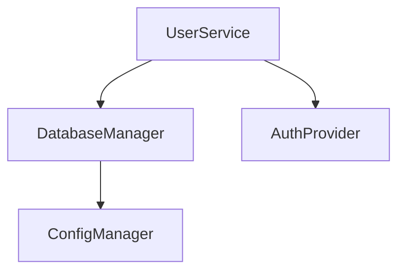

# [[Dependency Analysis]]

Analyze symbol dependencies and relationships to understand code structure.

## Purpose

Map and analyze dependencies between symbols, modules, and types to support refactoring, impact analysis, and architectural decisions.

## Analysis Types

### 1. Forward Dependencies
**What a symbol uses**:
```bash
tsdoc-edge deps <symbol-id>
```

**Output**:
```
Dependencies of 'user-service':
- database-manager (src/storage/DatabaseManager.ts)
- auth-provider (src/auth/AuthProvider.ts)
- logger (src/utils/Logger.ts)

Total: 3 dependencies
```

### 2. Reverse Dependencies
**What uses a symbol**:
```bash
# Registry-based (by ID)
tsdoc-edge used-by <symbol-id>

# Database-based (by name)
tsdoc-edge who-uses <symbol-name>
```

**Output**:
```
Symbols that use 'database-manager':
- user-service (src/services/UserService.ts)
- order-service (src/services/OrderService.ts)
- product-service (src/services/ProductService.ts)

Total: 3 dependents
```

### 3. Transitive Dependencies
**Full dependency chain**:
```bash
tsdoc-edge type-chain <type-name>
```

**Output**:
```
Type Chain for 'UserData':
  UserData
  ├─ PersonalInfo
  │  └─ Address
  │     └─ Country
  └─ Preferences
     └─ Theme
```

### 4. Circular Dependencies
**Detect dependency cycles**:
```bash
tsdoc-edge detect-cycles
```

**Output**:
```
Circular Dependencies Detected:

1. UserService ⟷ OrderService
   UserService → OrderService → UserService

2. ComponentA → ComponentB → ComponentC → ComponentA
```

## Dependency Patterns

### Healthy Patterns

#### Layered Dependencies
```
Presentation → Application → Domain
```
- Clear direction
- No reverse dependencies
- Clean separation

#### Tree Structure
```
Root
├─ Branch1
│  └─ Leaf1
└─ Branch2
   └─ Leaf2
```
- No cycles
- Clear hierarchy
- Easy to understand

### Anti-Patterns

#### Circular Dependencies
```
A → B → C → A
```
**Problems**: Tight coupling, difficult testing, order sensitivity

#### God Object
```
Many symbols → GodObject → Many symbols
```
**Problems**: Central bottleneck, high coupling

#### Dependency Spaghetti
```
Random connections between all modules
```
**Problems**: No clear structure, hard to maintain

## Metrics

### Dependency Count
```
Avg Dependencies = Total Dependencies / Total Symbols
```
**Target**: 2-5 dependencies per symbol

### Coupling Factor
```
Coupling = (Actual Dependencies / Possible Dependencies) × 100
```
**Target**: < 20%

### Depth
```
Max Dependency Depth = Longest chain from root to leaf
```
**Target**: < 6 levels

## Commands

- **[[DepsCommand]]**: Forward dependency lookup
- **[[UsedByCommand]]**: Reverse dependency lookup (registry)
- **[[WhoUsesCommand]]**: Reverse dependency lookup (database)
- **[[TypeChainCommand]]**: Transitive dependency chains
- **[[DetectCircularTypesCommand]]**: Circular dependency detection
- **[[OrphansCommand]]**: Find isolated symbols

## Workflows

### 1. Pre-Refactoring Analysis
```bash
# What does this symbol use?
tsdoc-edge deps user-service

# What uses this symbol?
tsdoc-edge used-by user-service

# Full impact assessment
tsdoc-edge analyze-impact user-service
```

### 2. Circular Dependency Resolution
```bash
# Detect cycles
tsdoc-edge detect-cycles

# Analyze problematic symbols
tsdoc-edge deps symbol-in-cycle
tsdoc-edge used-by symbol-in-cycle

# Break cycle by introducing interface
```

### 3. Module Boundary Validation
```bash
# Check module exports
tsdoc-edge deps module-a --filter external-only

# Verify no internal dependencies
tsdoc-edge validate-boundaries
```

## Visualization

### Dependency Graph
```bash
tsdoc-edge visualize-deps user-service --depth 2
```

Generates Mermaid diagram:


### Heat Map
```bash
tsdoc-edge dependency-heatmap
```

Shows coupling intensity across modules.

## Integration with Other Features

### Impact Analysis
Dependency data powers [[Impact Analysis]]:
- What breaks if I change this?
- Who needs to update imports?
- Test cascade requirements

### Dead Code Detection
Dependency data identifies [[Dead Code Detection]]:
- Symbols with zero usages
- Unreachable code
- Orphaned modules

### Architecture Validation
Enforce architectural rules:
```bash
tsdoc-edge validate-architecture \
  --rule "presentation can only depend on application"
```

## Related

- **[[Impact Analysis]]**: Uses dependency data for impact assessment
- **[[DepsCommand]]**: Forward dependency tool
- **[[UsedByCommand]]**: Reverse dependency tool
- **[[TypeChainCommand]]**: Chain analysis
- **[[QueryCommands]]**: Query tools group

---

**Status**: Active
**Automation**: High (commands available)
**Complexity**: Medium

---

## Backlinks

### Referenced By

- [[UsedByCommand]] → /Users/junwoobang/workflow/tsdoc-edge/managed/commands/UsedByCommand.md:88
- [[Impact Analysis]] → /Users/junwoobang/workflow/tsdoc-edge/managed/features/ImpactAnalysis.md:150
