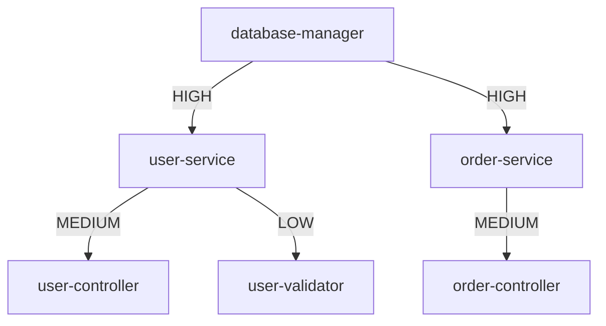

# [[Impact Analysis]]

Assess the impact of code changes before making them.

## Purpose

Predict and visualize the ripple effects of modifying a symbol, helping developers make informed decisions and avoid breaking changes.

## Core Questions

Before modifying code, answer:

1. **What depends on this?** → Reverse dependencies
2. **What does this depend on?** → Forward dependencies
3. **How deep is the impact?** → Transitive closure
4. **What tests are affected?** → Test coverage correlation
5. **Is this breaking?** → Public API surface analysis

## Analysis Methods

### 1. Direct Impact
**Immediate dependents**:
```bash
tsdoc-edge used-by <symbol-id>
```

**Output**:
```
Symbols that use 'database-manager':
✓ user-service (src/services/UserService.ts)
✓ order-service (src/services/OrderService.ts)
✓ product-service (src/services/ProductService.ts)

Direct impact: 3 symbols
```

### 2. Transitive Impact
**Full dependency tree**:
```bash
tsdoc-edge analyze-impact <symbol-id> --depth all
```

**Output**:
```
Impact Analysis for 'database-manager':

Direct dependents: 3
├─ user-service (3 dependents)
│  ├─ user-controller (2 dependents)
│  │  ├─ api-router
│  │  └─ admin-router
│  └─ user-validator
├─ order-service (2 dependents)
└─ product-service (1 dependent)

Total transitive impact: 11 symbols
```

### 3. Test Impact
**Affected test files**:
```bash
tsdoc-edge test-impact <symbol-id>
```

**Output**:
```
Tests affected by 'database-manager':
- test/services/UserService.test.ts
- test/services/OrderService.test.ts
- test/integration/database.test.ts

Estimated test time: 45 seconds
```

### 4. Breaking Change Detection
**Public API changes**:
```bash
tsdoc-edge breaking-changes <symbol-id>
```

**Output**:
```
Breaking Change Analysis:

Symbol: database-manager
Status: EXPORTED (used externally)

External dependents: 2
- @company/api-client
- @company/admin-dashboard

⚠️  WARNING: Changes may break external packages
```

## Impact Levels

### Level 1: Isolated
- **Direct impact**: 0-2 symbols
- **Test impact**: < 5 tests
- **Risk**: Low
- **Action**: Proceed confidently

### Level 2: Contained
- **Direct impact**: 3-10 symbols
- **Test impact**: 5-20 tests
- **Risk**: Medium
- **Action**: Review dependents, update tests

### Level 3: Widespread
- **Direct impact**: 10-50 symbols
- **Test impact**: 20-100 tests
- **Risk**: High
- **Action**: Coordinate with team, staged rollout

### Level 4: Critical
- **Direct impact**: 50+ symbols
- **Test impact**: 100+ tests
- **Risk**: Very High
- **Action**: Major refactoring, deprecation cycle

## Workflows

### Pre-Modification Workflow
```bash
# 1. Assess current state
tsdoc-edge deps <symbol-id>
tsdoc-edge used-by <symbol-id>

# 2. Analyze impact
tsdoc-edge analyze-impact <symbol-id>

# 3. Check tests
tsdoc-edge test-impact <symbol-id>

# 4. Review affected code
tsdoc-edge work-context <file-path>

# 5. Make changes
# 6. Run affected tests
# 7. Validate
```

### Breaking Change Workflow
```bash
# 1. Detect if breaking
tsdoc-edge breaking-changes <symbol-id>

# 2. If breaking, plan deprecation
- Add @deprecated tag
- Create new API
- Migration guide

# 3. Notify dependents
- Update CHANGELOG
- Send team notification
- Update documentation

# 4. Execute change
- Implement new API
- Mark old API deprecated
- Add migration path
```

## Visualization

### Impact Graph
```bash
tsdoc-edge visualize-impact <symbol-id> --format svg
```

Generates dependency tree with impact levels:


### Heat Map
Shows impact "hotspots" - heavily depended-upon symbols:
```bash
tsdoc-edge impact-heatmap
```

## Commands

- **[[UsedByCommand]]**: Direct reverse dependencies
- **[[DepsCommand]]**: Forward dependencies
- **[[WhoUsesCommand]]**: Name-based dependency search
- **[[TypeChainCommand]]**: Transitive dependency chains
- **[[WorkContextCommand]]**: Full context before editing

## Metrics

### Impact Score
```
Impact Score = (Direct Deps × 10) + (Transitive Deps × 1) + (Tests × 0.5)
```

Higher score = higher risk

### Change Velocity
```
Velocity = Impact Score / Developer Experience
```

Estimate how long the change will take based on impact and team skill.

## Integration

### IDE Integration
Show impact inline:
```typescript
class DatabaseManager {  // ⚠️ Used by 15 symbols
  connect() {  // ⚠️ Used by 8 symbols
    // ...
  }
}
```

### Pull Request Checks
```yaml
# .github/workflows/impact-check.yml
- name: Analyze Impact
  run: |
    CHANGED_FILES=$(git diff --name-only main...HEAD)
    for file in $CHANGED_FILES; do
      tsdoc-edge analyze-impact $file --json
    done
```

### Documentation
Auto-generate impact notes:
```markdown
## Impact

Changing `DatabaseManager.connect()` affects:
- 3 direct dependents
- 11 transitive dependents
- 25 test files

Estimated effort: 4 hours
Risk level: High
```

## Best Practices

### 1. Always Check Before Major Changes
```bash
tsdoc-edge used-by <symbol-id> | wc -l
```
If > 10, plan carefully.

### 2. Use Deprecation for Breaking Changes
Don't break things directly - deprecate first:
```typescript
/**
 * @deprecated Use newMethod() instead
 */
oldMethod() { }
```

### 3. Communicate Impact
Share impact analysis with team:
```bash
tsdoc-edge analyze-impact symbol-id > impact-report.md
```

### 4. Incremental Changes
Break large impacts into smaller steps:
- Step 1: Add new API
- Step 2: Migrate dependents
- Step 3: Remove old API

## Related

- **[[Dependency Analysis]]**: Provides dependency data
- **[[UsedByCommand]]**: Impact analysis tool
- **[[WorkContextCommand]]**: Context before editing
- **[[QueryCommands]]**: Analysis command group

---

**Status**: Active
**Automation**: Partial (analysis automated, decision manual)
**Critical for**: Refactoring, API changes, architecture evolution

---

## Backlinks

### Referenced By

- [[DepsCommand]] → /home/user/tsdoc-edge/managed/commands/DepsCommand.md:154
- [[DepsCommand]] → /home/user/tsdoc-edge/managed/commands/DepsCommand.md:155
- [[TypeChainCommand]] → /home/user/tsdoc-edge/managed/commands/TypeChainCommand.md:40
- [[TypeChainCommand]] → /home/user/tsdoc-edge/managed/commands/TypeChainCommand.md:41
- [[UsedByCommand]] → /home/user/tsdoc-edge/managed/commands/UsedByCommand.md:89
- [[UsedByCommand]] → /home/user/tsdoc-edge/managed/commands/UsedByCommand.md:151
- [[UsedByCommand]] → /home/user/tsdoc-edge/managed/commands/UsedByCommand.md:152
- [[UsedByCommand]] → /home/user/tsdoc-edge/managed/commands/UsedByCommand.md:153
- [[UsedByCommand]] → /home/user/tsdoc-edge/managed/commands/UsedByCommand.md:154
- [[UsedByCommand]] → /home/user/tsdoc-edge/managed/commands/UsedByCommand.md:155
- [[UsedByCommand]] → /home/user/tsdoc-edge/managed/commands/UsedByCommand.md:156
- [[WhoUsesCommand]] → /home/user/tsdoc-edge/managed/commands/WhoUsesCommand.md:160
- [[WhoUsesCommand]] → /home/user/tsdoc-edge/managed/commands/WhoUsesCommand.md:161
- [[WorkContextCommand]] → /home/user/tsdoc-edge/managed/commands/WorkContextCommand.md:96
- [[WorkContextCommand]] → /home/user/tsdoc-edge/managed/commands/WorkContextCommand.md:97
- [[WorkContextCommand]] → /home/user/tsdoc-edge/managed/commands/WorkContextCommand.md:98
- [[WorkContextCommand]] → /home/user/tsdoc-edge/managed/commands/WorkContextCommand.md:99
- [[Dead Code Detection]] → /home/user/tsdoc-edge/managed/features/DeadCodeDetection.md:117
- [[Dead Code Detection]] → /home/user/tsdoc-edge/managed/features/DeadCodeDetection.md:142
- [[Dependency Analysis]] → /home/user/tsdoc-edge/managed/features/DependencyAnalysis.md:119
- [[Dependency Analysis]] → /home/user/tsdoc-edge/managed/features/DependencyAnalysis.md:136
- [[Dependency Analysis]] → /home/user/tsdoc-edge/managed/features/DependencyAnalysis.md:166
- [[Dependency Analysis]] → /home/user/tsdoc-edge/managed/features/DependencyAnalysis.md:167
- [[Dependency Analysis]] → /home/user/tsdoc-edge/managed/features/DependencyAnalysis.md:168
- [[Dependency Analysis]] → /home/user/tsdoc-edge/managed/features/DependencyAnalysis.md:169
- [[QueryCommands]] → /home/user/tsdoc-edge/managed/features/QueryCommands.md:132
- [[QueryCommands]] → /home/user/tsdoc-edge/managed/features/QueryCommands.md:133

