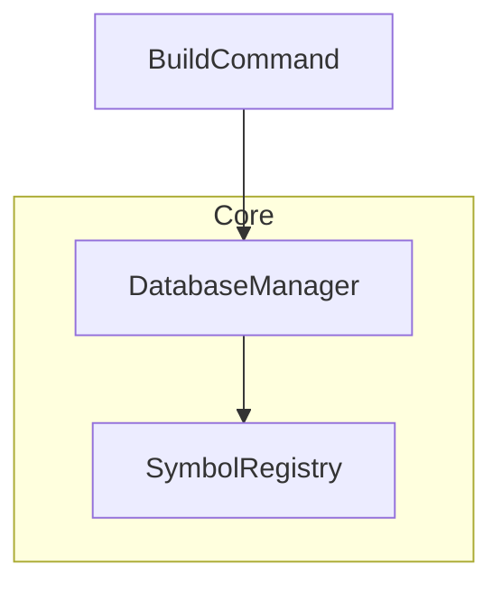

# [[Mermaid Symbol Extractor]]

**Source**: `src/doc-symbol/MermaidSymbolExtractor.ts`

## Purpose

Extract symbol references from Mermaid diagrams to enable diagram-driven documentation.

## Responsibility

Parse Mermaid diagram syntax and extract:
- Node labels as potential symbol names
- Relationships between nodes
- Diagram metadata (type, orientation, subgraphs)
- Symbol references for validation

## Core Functionality

### extract
```typescript
extract(content: string, filePath: string): MermaidExtractionResult
```

**Process**:
1. Extract Mermaid code blocks from markdown
2. Parse diagram type and orientation
3. Extract node definitions (e.g., `A[Label]`)
4. Clean and normalize node labels
5. Filter out non-symbol patterns (100+ patterns)
6. Extract relationships (arrows: `-->`, `-.->`, `==>`)
7. Detect subgraphs
8. Return symbols, relationships, and metadata

## Non-Symbol Filtering

Filters 100+ patterns to prevent false positives:
- **Node IDs**: A, B, CD, L1A, L2B
- **File patterns**: .mmd, .db, .jsonl
- **Workflow verbs**: Create, Parse, Generate
- **Technical terms**: Return Type, Parameter Type
- **Labels**: Linter:, Test:, Extract:
- **Operators**: ≥, ≤, =, ?
- **Categories**: Structural, Behavioral, Data Flow
- **Korean characters**: 한글

## Output Type

Returns [[MermaidExtractionResult]]:

**Structure**:
- `metadata`: Diagram metadata (type, orientation, title, subgraphs)
- `symbols`: Array of [[MermaidSymbol]]
- `relationships`: Array of [[MermaidRelationship]]
- `symbolReferences`: Symbol reference strings for validation

## Relationship Mapping

Maps relationship types to canonical names:
```typescript
{
  'code-dependency': 'Code Dependency',
  'io-dependency': 'IO Dependency',
  'calls': 'Call Relationships',
  'inheritance': 'Inheritance',
  // ... 17 total types
}
```

## Integration

Used by:
- [[ValidateSymbolRefsCommand]] - Validate diagram symbols
- [[ExploreEntrypointCommand]] - Explore from diagrams
- [[ParseMermaidCommand]] - Extract diagram metadata

## Example

**Input**:


**Output**:
```typescript
{
  metadata: {
    diagramType: "graph",
    orientation: "TD",
    subgraphs: [{ id: "Core", title: "Core" }]
  },
  symbols: [
    { symbolName: "BuildCommand", nodeId: "A" },
    { symbolName: "DatabaseManager", nodeId: "B", subgraph: "Core" },
    { symbolName: "SymbolRegistry", nodeId: "C", subgraph: "Core" }
  ],
  relationships: [
    { from: "A", to: "B", edgeType: "solid" },
    { from: "B", to: "C", edgeType: "solid" }
  ],
  symbolReferences: ["BuildCommand", "DatabaseManager", "SymbolRegistry"]
}
```

## Pattern Evolution

**v1.0**: Basic node extraction (581 errors)
**v2.0**: Added relationshipTypeMap (-71 errors)
**v3.0**: Added nonSymbolPatterns 40+ patterns (-54 errors)
**v4.0**: Comprehensive filtering 100+ patterns (-48 errors)
**v5.0**: Smart nodeId handling (-32 errors)

## Related

- [[TSDoc Symbol Parser]] - Code parser
- [[Document Symbol Parser]] - Markdown parser
- [[ValidateSymbolRefsCommand]] - Main consumer
- [[MermaidSymbol]] - Output type

---

**Category**: Parser
**Status**: Active - Highly Optimized

---

## Backlinks

### Referenced By

- [[ExploreEntrypointCommand]] → /home/user/tsdoc-edge/managed/commands/ExploreEntrypointCommand.md:51
- [[ExploreEntrypointCommand]] → /home/user/tsdoc-edge/managed/commands/ExploreEntrypointCommand.md:52
- [[ExploreEntrypointCommand]] → /home/user/tsdoc-edge/managed/commands/ExploreEntrypointCommand.md:53
- [[ParseMermaidCommand]] → /home/user/tsdoc-edge/managed/commands/ParseMermaidCommand.md:39
- [[ParseMermaidCommand]] → /home/user/tsdoc-edge/managed/commands/ParseMermaidCommand.md:73
- [[ParseMermaidCommand]] → /home/user/tsdoc-edge/managed/commands/ParseMermaidCommand.md:74
- [[ParseMermaidCommand]] → /home/user/tsdoc-edge/managed/commands/ParseMermaidCommand.md:75
- [[ParseMermaidCommand]] → /home/user/tsdoc-edge/managed/commands/ParseMermaidCommand.md:76
- [[ParseMermaidCommand]] → /home/user/tsdoc-edge/managed/commands/ParseMermaidCommand.md:77
- [[ValidateSymbolRefsCommand]] → /home/user/tsdoc-edge/managed/commands/ValidateSymbolRefsCommand.md:89
- [[ValidateSymbolRefsCommand]] → /home/user/tsdoc-edge/managed/commands/ValidateSymbolRefsCommand.md:90
- [[ValidateSymbolRefsCommand]] → /home/user/tsdoc-edge/managed/commands/ValidateSymbolRefsCommand.md:91
- [[ValidateSymbolRefsCommand]] → /home/user/tsdoc-edge/managed/commands/ValidateSymbolRefsCommand.md:92
- [[ValidateSymbolRefsCommand]] → /home/user/tsdoc-edge/managed/commands/ValidateSymbolRefsCommand.md:93
- [[ValidateSymbolRefsCommand]] → /home/user/tsdoc-edge/managed/commands/ValidateSymbolRefsCommand.md:94
- [[Document Symbol Parser]] → /home/user/tsdoc-edge/managed/parsers/DocumentSymbolParser.md:78
- [[Document Symbol Parser]] → /home/user/tsdoc-edge/managed/parsers/DocumentSymbolParser.md:104
- [[Document Symbol Parser]] → /home/user/tsdoc-edge/managed/parsers/DocumentSymbolParser.md:105
- [[Document Symbol Parser]] → /home/user/tsdoc-edge/managed/parsers/DocumentSymbolParser.md:106
- [[Document Symbol Parser]] → /home/user/tsdoc-edge/managed/parsers/DocumentSymbolParser.md:107
- [[Document Symbol Parser]] → /home/user/tsdoc-edge/managed/parsers/DocumentSymbolParser.md:108
- [[TSDoc Symbol Parser]] → /home/user/tsdoc-edge/managed/parsers/TSDocSymbolParser.md:99
- [[TSDoc Symbol Parser]] → /home/user/tsdoc-edge/managed/parsers/TSDocSymbolParser.md:100
- [[TSDoc Symbol Parser]] → /home/user/tsdoc-edge/managed/parsers/TSDocSymbolParser.md:101
- [[MermaidExtractionResult]] → /home/user/tsdoc-edge/managed/primary-types/MermaidExtractionResult.md:22
- [[MermaidExtractionResult]] → /home/user/tsdoc-edge/managed/primary-types/MermaidExtractionResult.md:28
- [[MermaidExtractionResult]] → /home/user/tsdoc-edge/managed/primary-types/MermaidExtractionResult.md:43
- [[MermaidExtractionResult]] → /home/user/tsdoc-edge/managed/primary-types/MermaidExtractionResult.md:44
- [[MermaidExtractionResult]] → /home/user/tsdoc-edge/managed/primary-types/MermaidExtractionResult.md:45
- [[MermaidExtractionResult]] → /home/user/tsdoc-edge/managed/primary-types/MermaidExtractionResult.md:46
- [[MermaidRelationship]] → /home/user/tsdoc-edge/managed/primary-types/MermaidRelationship.md:30
- [[MermaidRelationship]] → /home/user/tsdoc-edge/managed/primary-types/MermaidRelationship.md:43
- [[MermaidRelationship]] → /home/user/tsdoc-edge/managed/primary-types/MermaidRelationship.md:44
- [[MermaidSymbol]] → /home/user/tsdoc-edge/managed/primary-types/MermaidSymbol.md:25
- [[MermaidSymbol]] → /home/user/tsdoc-edge/managed/primary-types/MermaidSymbol.md:31
- [[MermaidSymbol]] → /home/user/tsdoc-edge/managed/primary-types/MermaidSymbol.md:46
- [[MermaidSymbol]] → /home/user/tsdoc-edge/managed/primary-types/MermaidSymbol.md:47
- [[MermaidSymbol]] → /home/user/tsdoc-edge/managed/primary-types/MermaidSymbol.md:48
- [[MermaidSymbol]] → /home/user/tsdoc-edge/managed/primary-types/MermaidSymbol.md:49
- [[MermaidSymbol]] → /home/user/tsdoc-edge/managed/primary-types/MermaidSymbol.md:50
- [[MermaidSymbol]] → /home/user/tsdoc-edge/managed/primary-types/MermaidSymbol.md:51
- [[MermaidSymbol]] → /home/user/tsdoc-edge/managed/primary-types/MermaidSymbol.md:52

