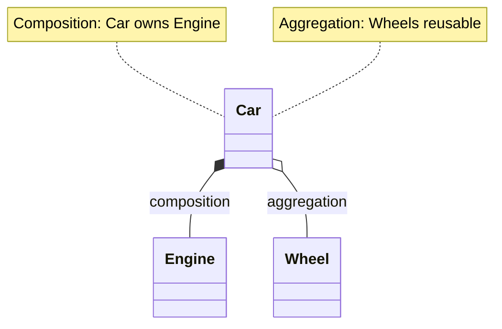

# [[Composition Relationship]]

> **Type**: `composition` | **Status**: =� Planned for v2.0

Track "has-a" relationships where one class contains instances of another class.

## Concept

**Composition** represents ownership relationships where a container object holds references to component objects.

**Examples**:
```typescript
class Engine {
  start() { ... }
}

class Car {
  private engine: Engine;  // � Composition: Car HAS-A Engine

  constructor() {
    this.engine = new Engine();  // Car owns Engine
  }
}
```

**Key Characteristics**:
- **Lifetime**: Component's lifetime tied to container
- **Ownership**: Strong ownership (container creates/destroys component)
- **Cardinality**: One-to-one or one-to-many

## Detection Strategy

### Field-Level Analysis

```typescript
class User {
  private profile: UserProfile;    // � Composition detected
  private posts: Post[];           // � Composition (array)
  private metadata?: Metadata;     // � Composition (optional)
}
```

**Detection Rules**:
1. Private/protected field with class type
2. Field initialized in constructor or declaration
3. No external assignment (owned by container)

### Constructor Initialization

```typescript
class Database {
  private connection: Connection;

  constructor(config: Config) {
    this.connection = new Connection(config);  // � Strong composition
  }
}
```

**Indicators**:
- `new` keyword in constructor
- Component not passed as parameter
- Lifetime managed by container

### Aggregation vs Composition

| Pattern | Ownership | Lifetime | Example |
|---------|-----------|----------|---------|
| **Composition** | Strong | Tied | `Car` owns `Engine` |
| **Aggregation** | Weak | Independent | `Department` has `Employee` |

```typescript
// Composition (strong ownership)
class Car {
  private engine = new Engine();  // Car creates and owns
}

// Aggregation (weak ownership)
class Department {
  constructor(private employees: Employee[]) {}  // External creation
}
```

## Planned Implementation

### Phase 1: Field Analysis (v2.0)

**Analyzer**: `CompositionAnalyzer` (planned)
- Scan class declarations for typed fields
- Detect initialization patterns
- Determine ownership strength

**Storage**:
```sql
INSERT INTO unified_relationships (
  from_symbol,
  to_symbol,
  type,
  metadata
) VALUES (
  'Car',
  'Engine',
  'composition',
  '{"field":"engine","ownership":"strong","cardinality":"1:1"}'
);
```

### Phase 2: Ownership Analysis (v2.1)

**Features**:
- Strong vs weak ownership detection
- Lifecycle coupling analysis
- Cascade deletion tracking

**Example**:
```typescript
// Strong composition (cascade delete)
class Order {
  private items: OrderItem[] = [];  // If Order deleted � items deleted
}

// Weak composition (independent lifecycle)
class ShoppingCart {
  constructor(private products: Product[]) {}  // Products exist independently
}
```

### Phase 3: UML Integration (v2.2)

**Visualization**:


**Legend**:
- `*--` Filled diamond (composition, strong)
- `o--` Empty diamond (aggregation, weak)

## Use Cases

### 1. Architecture Validation

```bash
# Find all compositions in domain layer
tsdoc-edge deps --type=composition --layer=domain

# Expected: Domain objects compose value objects, not services
```

### 2. Refactoring Safety

```bash
# Before deleting Engine class
tsdoc-edge who-uses Engine --type=composition

# Shows: Car strongly depends on Engine � cannot delete safely
```

### 3. Code Ownership Analysis

```bash
# Find classes with high composition (God objects)
tsdoc-edge analyze --composition-fan-out

# Output: Classes with >5 composed objects
```

### 4. Dependency Injection Candidates

```bash
# Find strong compositions that should be weak
tsdoc-edge detect-composition-smell

# Suggests: Replace `new Engine()` with DI
```

## Detection Algorithm

**Pseudocode**:
```
For each class C:
  For each field F in C:
    If F.type is class reference:
      If F is initialized with `new`:
        � Strong composition
      Else if F assigned from constructor param:
        � Weak composition (aggregation)
      Else if F is optional:
        � Weak composition
```

**Complexity**: O(n�m) where n=classes, m=avg fields per class

## Comparison with Other Relationships

| Relationship | Nature | Example |
|--------------|--------|---------|
| [[Inheritance]] | "is-a" | `Car extends Vehicle` |
| [[Interface Implementation]] | "can-do" | `Car implements Drivable` |
| **Composition** | "has-a" (strong) | `Car has Engine` |
| [[Code Dependency]] | "uses" | `Car imports Engine` |
| [[Call Relationships]] | "calls" | `Car.start() calls engine.start()` |

## Related

- [[Inheritance]]: Alternative to composition (prefer composition)
- [[Code Dependency]]: Composition requires import
- [[Type Dependency]]: Field type creates type dependency
- Layer Dependency: Composition should respect layers

## Benefits

### 1. Dead Code Detection

**Scenario**: Engine class only used by Car
```bash
tsdoc-edge who-uses Engine

# Output: Only Car (composition) � Safe to delete if Car deleted
```

### 2. Impact Analysis

**Scenario**: Changing Engine interface
```bash
tsdoc-edge deps Engine --reverse --type=composition

# Output: All classes that compose Engine � All need updates
```

### 3. Design Quality Metrics

**Metrics**:
- **Composition depth**: How many layers of composed objects?
- **Composition fan-out**: How many objects does a class compose?
- **Composition coupling**: How tightly are objects coupled?

## Implementation Roadmap

### v2.0 (Q2 2025)
-  Basic field detection
-  Constructor analysis
-  Storage in unified_relationships

### v2.1 (Q3 2025)
- � Ownership strength detection
- � Lifecycle analysis
- � Aggregation vs composition classification

### v2.2 (Q4 2025)
- � UML diagram generation
- � Design pattern detection (Composite, Decorator)
- � Dependency injection suggestions

## Status

**Current**: Design/Planning
**Priority**: High (core OOP relationship)
**Complexity**: Medium (requires AST field analysis)
**Estimated Effort**: 2-3 weeks

## References

- **Design Patterns** (GoF): Composite pattern relies on composition
- **Effective Java** (Bloch): "Favor composition over inheritance"
- **Clean Architecture** (Martin): Composition for layered boundaries

---

**Related Concepts**:
- Aggregation (weak ownership)
- Association (any relationship)
- Dependency (transient usage)

**Tracking**: See [[Unified Relationship Taxonomy]] for complete relationship catalog

---

## Backlinks

### Referenced By

- [[Unified Relationship Taxonomy]] → /Users/junwoobang/workflow/tsdoc-edge/managed/concepts/unified-relationship-taxonomy.md:390

