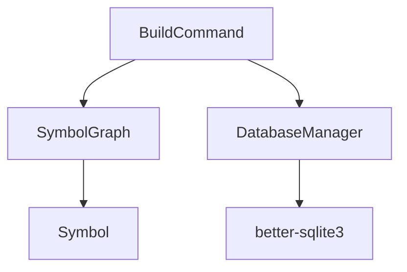
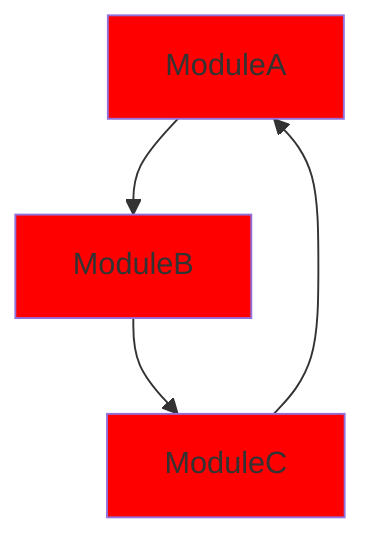
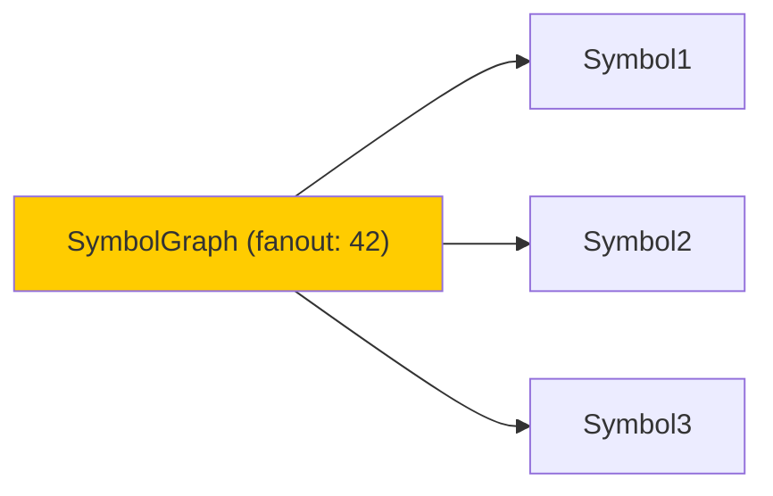

# [[MermaidGenerator]]

**Source**: `src/visualization/MermaidGenerator.ts`

## Purpose

Generate Mermaid diagrams for dependency visualization.

## Diagram Types

### Dependency Tree
- Shows symbol dependencies recursively
- Configurable max depth
- Top-down flow (graph TD)

### Circular Dependencies
- Highlights circular dependency cycles
- Red styling for problem areas
- Shows full cycle path

### Hotspot Analysis
- Visualizes high-fanin/fanout symbols
- Color-coded by impact
- Shows connection counts

### Call Graph
- Function/method call relationships
- Execution flow visualization
- Entry point identification

## Dependency Tree Example



## Circular Dependency Example



## Hotspot Example



## API

### generateDependencyTree
```typescript
generator.generateDependencyTree(symbolId, maxDepth);
// Returns: Mermaid diagram string
```

### generateCircularDeps
```typescript
generator.generateCircularDeps(cycles);
// Highlights circular dependencies
```

### generateHotspots
```typescript
generator.generateHotspots(hotspots, threshold);
// Shows symbols with high connectivity
```

## Formatting

### Node Labels
- Truncated to 30 chars
- Special chars escaped
- CamelCase preserved

### Edge Styles
- Solid: Normal dependency
- Dashed: Weak/optional
- Red: Circular reference
- Thick: High-weight

### Color Coding
- Green: Entry points
- Yellow: Hotspots
- Red: Problems
- Gray: Low activity

## Integration

### CLI Commands
```bash
# Visualize dependencies
tsdoc-edge visualize-deps SymbolName

# Show circular deps
tsdoc-edge detect-circular-types
```

### Output Formats
- Console (Mermaid code)
- Markdown (```mermaid blocks)
- SVG (via mermaid-cli)
- PNG (via mermaid-cli)

## Symbol Count

1 class

## Related

- [[VisualizeDepsCommand]]: CLI visualization
- [[DependencyChainAnalyzer]]: Detect patterns
- [[DetectCircularTypesCommand]]: Find cycles

---

## Backlinks

### Referenced By

- [[DependencyChainAnalyzer]] → /home/user/tsdoc-edge/managed/analyzers/DependencyChainAnalyzer.md:39
- [[TSDoc Edge System Architecture]] → /home/user/tsdoc-edge/managed/architecture/system-architecture-2025-11-07.md:115
- [[TSDoc Edge System Architecture]] → /home/user/tsdoc-edge/managed/architecture/system-architecture-2025-11-07.md:406
- [[DetectCircularTypesCommand]] → /home/user/tsdoc-edge/managed/commands/DetectCircularTypesCommand.md:72
- [[VisualizeDepsCommand]] → /home/user/tsdoc-edge/managed/commands/VisualizeDepsCommand.md:30

