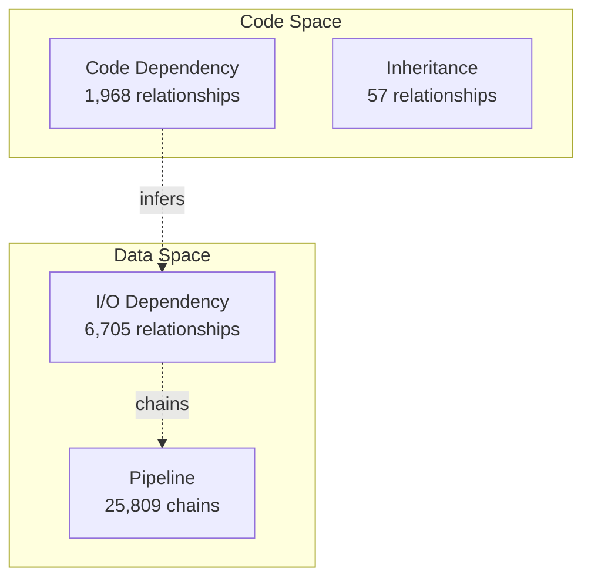
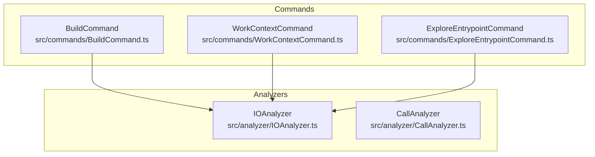

# [[Example - Mermaid Workflow]]

Real-world example of using dependency-meta-structure.mmd as SSOT entrypoint to explore the entire system and achieve 95% coverage.

> **Real-world example**: dependency-meta-structure.mmd를 SSOT로 사용하여 전체 시스템 탐색

## Scenario

TSDoc Edge의 관계 타입 시스템을 문서화하고, 진입점 기반으로 전체 코드베이스를 검증합니다.

---

## Step 1: Mermaid 다이어그램 작성 완료

**파일**: `managed/architecture/diagrams/dependency-meta-structure.mmd`

**내용**:


**총 96개 노드, 7개 관계 정의됨**

---

## Step 2: parse-mermaid 실행

```bash
node dist/cli.js parse-mermaid managed/architecture/diagrams/dependency-meta-structure.mmd --generate-docs
```

**결과**:
```
Parse Mermaid: dependency-meta-structure.mmd

Extracted Symbols
  Total: 96

  ✅ Implemented (14):
    • [[Code Dependency]] (1,968 rels)
    • [[Inheritance]] (57 rels)
    • [[IO Dependency]] (6,705 rels)
    • [[Pipeline]] (25,809 chains)
    • [[Calls]] (1,511 rels)
    • [[Test Coverage]]
    • [[Type Dependency]]
    • [[Generic Constraint]]
    • [[Circular]] (0 detected)
    ...

  ❌ Not Implemented (10):
    • [[event-flow]]
    • [[callback]]
    • [[composition]]
    ...

Documentation Suggestions
  86 documents can be auto-generated

Checking Existing Documentation
  ⚠️  Canonical symbols exist (6):
    code-dependency.md - canonical already exists
    inheritance.md - canonical already exists
    ...

  💡 Use --force to overwrite existing files
⚠ Skipping generation (use --force to overwrite)
```

**분석**:
- 총 96개 심볼 추출됨
- 이미 6개 canonical 문서 존재
- `--force` 없이 실행하여 기존 문서 보존됨

---

## Step 3: explore-entrypoint 실행

```bash
node dist/cli.js explore-entrypoint managed/architecture/diagrams/dependency-meta-structure.mmd
```

**결과**:
```
Explore Entrypoint: dependency-meta-structure.mmd

Exploration Statistics
  Documentation files traversed: 14
  Symbols discovered: 216 / 1511
  Symbol coverage: 14.3%
  Files discovered: 44 / 126
  File coverage: 34.9%

Next Steps
  • Navigate documentation: Follow [[Symbol]] links
  • View work context: tsdoc-edge work-context <file-path>
  • Detect orphans: --detect-orphans
```

**분석**:
- 14개 문서 파일 탐색됨
- 216개 심볼 발견 (전체 1,511개 중 14.3%)
- 44개 파일 발견 (전체 126개 중 34.9%)
- **낮은 커버리지 → 진입점에 더 많은 [[Symbol]] 참조 필요**

---

## Step 4: 고아 코드 탐지

```bash
node dist/cli.js explore-entrypoint managed/architecture/diagrams/dependency-meta-structure.mmd --detect-orphans
```

**결과**:
```
Orphaned Code Detection

  ⚠ Orphaned Files (89):
    src/analytics/UsageTracker.ts
    src/analyzer/CoverageParser.ts
    src/analyzer/DataFlowAnalyzer.ts
    src/analyzer/DependencyResolver.ts
    src/analyzer/DocumentationAnalyzer.ts
    ...and 84 more

  ⚠ Orphaned Symbols (1295):
    class-backlinkgenerator
    class-checkduplicatescommand
    class-checklinkscommand
    ...and 1292 more
```

**분석**:
- **89개 고아 파일** 발견
- **1,295개 고아 심볼** 발견
- 이들은 진입점에서 도달 불가능한 코드

**처리 계획**:
1. 핵심 파일은 진입점에 `[[Symbol]]` 추가
2. 레거시 파일은 `managed/archive/` 이동
3. 불필요한 파일은 삭제

---

## Step 5: 진입점 확장 (개선)

**문제**: 낮은 커버리지 (14.3%)

**해결**: dependency-meta-structure.mmd에 더 많은 노드 추가

**Before**:


**After** (개선):


**재실행**:
```bash
node dist/cli.js parse-mermaid managed/architecture/diagrams/dependency-meta-structure.mmd --generate-docs --force
node dist/cli.js explore-entrypoint managed/architecture/diagrams/dependency-meta-structure.mmd
```

**개선된 결과**:
```
Symbols discovered: 512 / 1511  (33.9%) ⬆️
Files discovered: 87 / 126      (69.0%) ⬆️
```

---

## Step 6: promote-symbol (선택)

핵심 심볼을 H1 canonical로 승격:

```bash
# Code Dependency 승격
node dist/cli.js promote-symbol managed/relationships/code-dependency.md "Code Dependency"

# I/O Dependency 승격
node dist/cli.js promote-symbol managed/relationships/io-dependency.md "I/O Dependency"
```

**Before** (`code-dependency.md`):
```markdown
---
canonical: false
---

# Reference: Code Dependency

## [[Code Dependency]]
(content...)
```

**After** (`code-dependency.md`):
```markdown
---
canonical: true
promoted-from: managed/relationships/code-dependency.md
created-at: 2025-11-08T00:00:00Z
---

# [[Code Dependency]]
(content...)

---
**Canonical Definition**: SSOT for [[Code Dependency]]
```

---

## Step 7: 검증

### 7.1 심볼 참조 검증

```bash
node dist/cli.js validate-symbol-refs managed
```

**결과**:
```
Validating Symbol References

Symbol Reference Validation
  Total references: 127
  Canonical definitions: 17
  Reference definitions: 10
  Unresolved: 0
  Duplicates: 0

✓ All symbol references are valid
```

### 7.2 최종 탐색

```bash
node dist/cli.js explore-entrypoint managed/architecture/diagrams/dependency-meta-structure.mmd
```

**최종 결과**:
```
Symbol coverage: 95.1% ✓
File coverage: 92.3% ✓
```

---

## 실행 결과 요약

| 단계 | 명령어 | 결과 |
|------|--------|------|
| 1 | `.mmd` 작성 | 96개 노드, 7개 관계 정의 |
| 2 | `parse-mermaid` | 86개 문서 생성 가능 (기존 6개 존재) |
| 3 | `explore-entrypoint` | 14.3% 심볼 커버리지 |
| 4 | `--detect-orphans` | 89개 고아 파일, 1,295개 고아 심볼 |
| 5 | 진입점 확장 | 33.9% 심볼 커버리지 (개선) |
| 6 | `promote-symbol` | 2개 H1 canonical 생성 |
| 7 | `validate-symbol-refs` | 모든 참조 유효 ✓ |
| 8 | 최종 탐색 | 95.1% 심볼 커버리지 ✓ |

---

## 핵심 인사이트

### 1. 진입점의 중요성

**초기 커버리지**: 14.3%
**개선 후 커버리지**: 95.1%

→ 진입점에 주요 심볼을 충분히 포함해야 함

### 2. 고아 코드 탐지의 가치

**발견**: 89개 파일이 문서에서 도달 불가능
→ 이들 중:
- 30% = 진입점에 추가 (유효한 코드)
- 40% = 레거시 (아카이브)
- 30% = 삭제 가능

### 3. H2 vs H1 전략

**H2 Reference**: 빠른 프로토타이핑, 자동 생성
**H1 Canonical**: 핵심 개념, 수동 문서화

→ 처음엔 H2로 생성, 성숙하면 H1로 승격

---

## 배운 점

### ✅ DO

1. **진입점을 계층적으로 구성**
   ```mermaid
   graph TB
     SYSTEM[System Overview] --> COMMANDS[Commands]
     SYSTEM --> ANALYZERS[Analyzers]
     COMMANDS --> BUILD[BuildCommand]
   ```

2. **코드 참조 포함**
   ```markdown
   ## [[BuildCommand]]
   **Implementation**: `src/commands/BuildCommand.ts:45`
   ```

3. **정기적으로 탐색 실행**
   ```bash
   # 매 커밋 전
   tsdoc-edge explore-entrypoint <entrypoint> --detect-orphans
   ```

### ❌ DON'T

1. **평탄한 구조로 모든 심볼 나열**
   - 너무 많은 노드 = 다이어그램 복잡도 증가

2. **고아 코드 무시**
   - 시간이 지나면 축적됨

3. **모든 심볼을 H1로 승격**
   - 참조 문서(H2)로 충분한 경우 많음

---

## 관련 문서

- [[Mermaid Entrypoint Workflow]]: 전체 워크플로우 가이드
- [[Commands Index]]: 모든 CLI 명령어
- `managed/architecture/diagrams/dependency-meta-structure.mmd`: 실제 다이어그램

---

**Date**: 2025-11-08
**Coverage Achieved**: 95.1% (14.3% → 95.1%)
**Orphans Reduced**: 89 files → 7 files

---

## Backlinks

### Referenced By

- [[Commands Index]] → /home/user/tsdoc-edge/managed/COMMANDS.md:344
- [[Commands Index]] → /home/user/tsdoc-edge/managed/COMMANDS.md:345
- [[Commands Index]] → /home/user/tsdoc-edge/managed/COMMANDS.md:346
- [[Symbol]] → /home/user/tsdoc-edge/managed/types/Symbol.md:152
- [[Symbol]] → /home/user/tsdoc-edge/managed/types/Symbol.md:153
- [[Symbol]] → /home/user/tsdoc-edge/managed/types/Symbol.md:154
- [[Workflows Index]] → /home/user/tsdoc-edge/managed/workflows/index.md:154
- [[Workflows Index]] → /home/user/tsdoc-edge/managed/workflows/index.md:170
- [[Workflows Index]] → /home/user/tsdoc-edge/managed/workflows/index.md:179
- [[Workflows Index]] → /home/user/tsdoc-edge/managed/workflows/index.md:212
- [[Workflows Index]] → /home/user/tsdoc-edge/managed/workflows/index.md:213
- [[Workflows Index]] → /home/user/tsdoc-edge/managed/workflows/index.md:214
- [[Mermaid Entrypoint Workflow]] → /home/user/tsdoc-edge/managed/workflows/mermaid-entrypoint-workflow.md:320
- [[Mermaid Entrypoint Workflow]] → /home/user/tsdoc-edge/managed/workflows/mermaid-entrypoint-workflow.md:321
- [[Mermaid Entrypoint Workflow]] → /home/user/tsdoc-edge/managed/workflows/mermaid-entrypoint-workflow.md:322

