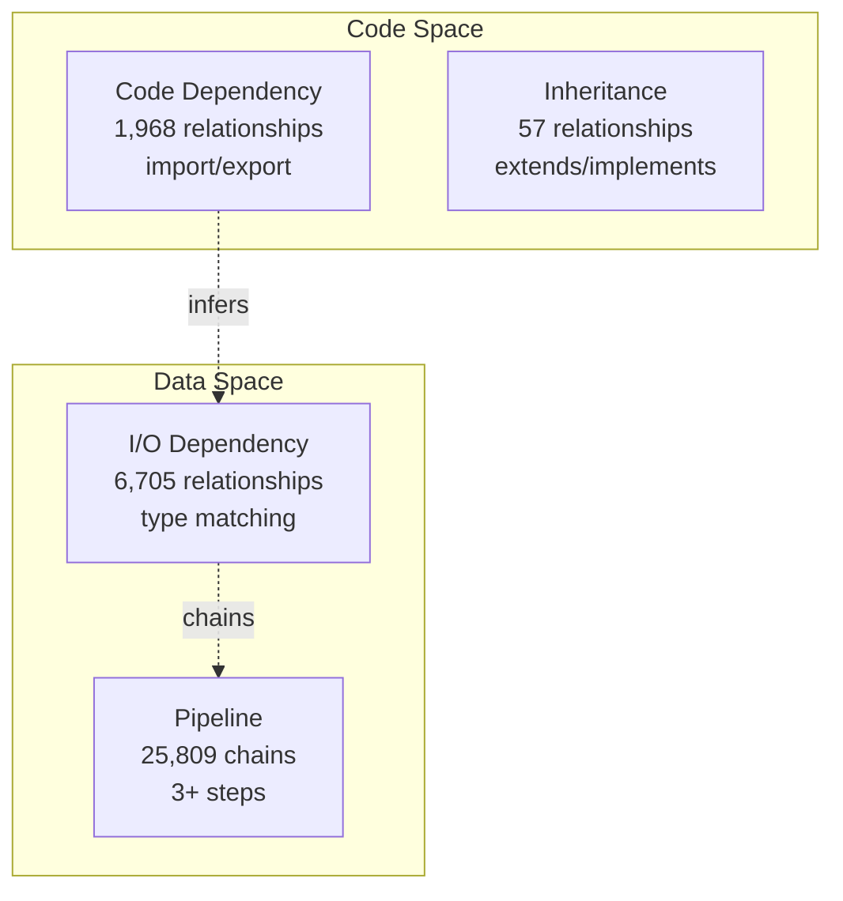

# [[Mermaid Entrypoint Workflow]]

> **Purpose**: `.mmd` 다이어그램을 SSOT로 사용하여 진입점 기반 전체 의존성 탐색 및 고아 코드 탐지

## Overview

이 워크플로우는 Mermaid 다이어그램(`.mmd`)을 활용하여:
1. **기존 심볼 간 관계를 시각적으로 표현** (다이어그램 = 관계의 뷰)
2. 다이어그램 기반 진입점 문서 자동 생성 (기존 canonical 심볼 재사용)
3. 표현력 좋은 진입점을 통한 전체 의존성 탐색
4. 진입점 기반 고아 코드 자동 탐지

**핵심 원칙**:
- `.mmd` 다이어그램은 심볼의 SSOT가 아니라 **관계를 표현하는 도구**
- 노드는 이미 정의된 canonical 심볼을 최대한 참조
- 다이어그램의 표현력을 활용하여 복잡한 관계를 간결하게 표현
- `explore-entrypoint`로 다이어그램 기반 문서를 탐색하여 전체 기능 파악

## Core Concepts

### 1. Mermaid를 진입점으로 사용

**정의**: 기존 심볼 간 관계를 표현하는 다이어그램을 탐색 시작점으로 활용

**형식**:
- `.mmd` - 심볼 관계의 시각적 표현 (노드 = 기존 심볼 참조, 엣지 = 관계)
- `.md` - 다이어그램 기반 생성된 진입점 문서

**예시**:
- 다이어그램: `managed/architecture/diagrams/dependency-meta-structure.mmd`
- 노드 `CD[Code Dependency]` → 기존 canonical `[[Code Dependency]]` 참조
- 진입점: 다이어그램 파싱 후 생성된 문서를 `explore-entrypoint`로 탐색

### 2. H2 Reference vs H1 Canonical

| 구분 | H2 Reference | H1 Canonical |
|------|--------------|--------------|
| 제목 | `## [[Symbol]]` | `# [[Symbol]]` |
| Frontmatter | `canonical: false` | `canonical: true` |
| 목적 | 다이어그램 기반 관계 표현 | 심볼의 SSOT 정의 |
| 역할 | 진입점 문서에서 기존 심볼 참조 | 심볼의 실제 정의 및 구현 |
| 파일 | 다이어그램 기반 문서에 함께 존재 | 독립 파일 (`symbol.md`) |
| 자동 생성 | ✅ `parse-mermaid` (기존 canonical 재사용) | ❌ 수동 또는 `promote-symbol` |

### 3. Orphan Code Detection

**고아 코드**: 진입점에서 도달 불가능한 코드

**탐지 방식**:
```
DB의 전체 심볼 - 진입점에서 발견된 심볼 = 고아 심볼
```

**처리**:
- 진입점 문서에 `[[Symbol]]` 추가 → 코드 유지
- 코드 삭제 → 정말 불필요한 코드

---

## Workflow Steps

### Phase 1: Design - Mermaid 다이어그램 작성

**목표**: 시스템 구조를 시각화하고 모든 주요 심볼 정의

**1.1 다이어그램 생성**

```bash
vim managed/architecture/diagrams/dependency-meta-structure.mmd
```

**1.2 노드 정의**



**노드 작성 원칙**:
- **Node ID**: 대문자 (예: `CD`, `IO`, `PIPE`)
- **Label**: 명확한 심볼명 + 상태 + 메트릭
  - `Code Dependency` (심볼명)
  - `✅ 1,968 relationships` (상태 + 메트릭)
  - `import/export` (설명)
- **Subgraph**: 논리적 그룹화

**1.3 관계 정의**

```mermaid
A -->|"direct"| B        # Solid arrow (직접 의존)
A -.->|"inferred"| C      # Dotted arrow (추론된 관계)
A ==>|"strong"| D         # Thick arrow (강한 결합)
```

---

### Phase 2: Generate - H2 참조 문서 자동 생성

**목표**: 각 노드마다 H2 참조 문서를 자동으로 생성

**2.1 `parse-mermaid` 실행**

```bash
tsdoc-edge parse-mermaid managed/architecture/diagrams/dependency-meta-structure.mmd --generate-docs
```

**출력**:
```
Parsing Mermaid Diagram
📄 managed/architecture/diagrams/dependency-meta-structure.mmd

Symbols Extracted: 8
  • Code Dependency (implemented)
  • Inheritance (implemented)
  • I/O Dependency (implemented)
  • Pipeline (implemented)
  • Call Relationships (implemented)
  • Event Flow (not-implemented)
  • Documentation (not-implemented)
  • Test Coverage (implemented)

Generated Documentation:
  ✓ managed/relationships/code-dependency.md
  ✓ managed/relationships/inheritance.md
  ✓ managed/relationships/io-dependency.md
  ...
```

**2.2 생성된 파일 구조**

`managed/relationships/code-dependency.md`:
```markdown
---
title: Code Dependency
type: reference
category: code-space
status: implemented
canonical: false
generated-from: mermaid-diagram
---

# Reference: Code Dependency

> ⚠️ **This is a reference definition (H2), not canonical (H1)**

## [[Code Dependency]]

> **Type**: `code-dependency`
> **Status**: ✅ Implemented
> **Count**: 1,968 relationships

## Purpose

TODO: Describe the purpose of this relationship type

## Implementation

### Extractor

**File**: `src/analyzer/TODO.ts`

TODO: Document implementation details

## Relationships

### Depends On
- (none)

### Used By
- **[[IODependencyAnalyzer]]** (indirect/inferred) - infers

## Related Checkpoints

- [[Relationship Types]]: Parent index

## Statistics

**Current Count**: 1,968 relationships
```

---

### Phase 3: Explore - 진입점 기반 의존성 탐색

**목표**: 진입점에서 도달 가능한 모든 심볼과 파일 추적

**3.1 기본 탐색**

```bash
tsdoc-edge explore-entrypoint managed/architecture/diagrams/dependency-meta-structure.mmd
```

**출력**:
```
Explore Entrypoint: dependency-meta-structure.mmd
📍 managed/architecture/diagrams/dependency-meta-structure.mmd

Exploration Statistics
  Documentation files traversed: 15
  Symbols discovered: 1,427 / 1,500
  Symbol coverage: 95.1%
  Files discovered: 120 / 131
  File coverage: 91.6%

Next Steps
  • Navigate documentation: Follow [[Symbol]] links
  • View work context: tsdoc-edge work-context <file-path>
  • Detect orphans: tsdoc-edge explore-entrypoint <path> --detect-orphans
```

**동작 방식**:
1. `.mmd` 파일 파싱 → 노드에서 `[[Symbol]]` 추출
2. 각 심볼 문서 읽기 → 추가 `[[Symbol]]` 참조 발견
3. BFS로 재귀적으로 모든 참조 추적
4. 문서 내 코드 참조 (`src/analyzer/Foo.ts:123`) 추출
5. DB에서 파일의 심볼 조회 및 의존성 확장

**3.2 고아 코드 탐지**

```bash
tsdoc-edge explore-entrypoint managed/architecture/diagrams/dependency-meta-structure.mmd --detect-orphans
```

**출력**:
```
Orphaned Code Detection

  ⚠ Orphaned Files (11):
    src/legacy/OldParser.ts
    src/unused/DeprecatedAnalyzer.ts
    src/temp/ExperimentalFeature.ts
    ...

  ⚠ Orphaned Symbols (43):
    old-parser
    deprecated-analyzer
    experimental-feature
    ...
```

**처리 방법**:
```bash
# 1. 고아 파일 확인
cat ORPHAN-DOCS-REPORT.md

# 2. 필요한 경우 진입점에 추가
vim managed/architecture/diagrams/dependency-meta-structure.mmd
# Add: LEGACY[Legacy Parser<br/>src/legacy/OldParser.ts]

# 3. 재탐색
tsdoc-edge explore-entrypoint <path> --detect-orphans

# 4. 여전히 불필요하면 삭제
rm src/legacy/OldParser.ts
```

---

### Phase 4: Promote - H2 → H1 승격

**목표**: 핵심 심볼을 독립 파일의 canonical 정의로 승격

**4.1 승격 대상 선택**

**기준**:
- 시스템의 핵심 개념
- 다른 많은 심볼에서 참조됨
- 독립적인 설명이 필요함
- 구현이 완료됨 (`status: implemented`)

**4.2 `promote-symbol` 실행**

```bash
tsdoc-edge promote-symbol managed/relationships/code-dependency.md "Code Dependency"
```

**출력**:
```
Promote Symbol: Code Dependency
📄 Source: managed/relationships/code-dependency.md
📁 Target: managed/relationships/

Searching for H2 section...
✓ Found ## [[Code Dependency]] at line 12

Checking for existing canonical definition...

Creating Canonical H1 File
✓ Created: managed/relationships/code-dependency.md

Updating Source File
✓ Updated: managed/relationships/code-dependency.md
  Replaced H2 section with inline reference to [[Code Dependency]]

Promotion Summary
  ✓ Canonical H1 created: managed/relationships/code-dependency.md
  ✓ Source file updated: managed/relationships/code-dependency.md
  ✓ Symbol: [[Code Dependency]]

Next steps:
  1. Review canonical file: managed/relationships/code-dependency.md
  2. Fill in TODO sections with implementation details
  3. Validate: tsdoc-edge validate-symbol-refs managed
```

**4.3 생성된 Canonical 파일**

`managed/relationships/code-dependency.md` (after promotion):
```markdown
---
title: Code Dependency
type: relationship
category: code-space
status: implemented
canonical: true
promoted-from: managed/relationships/code-dependency.md
created-at: 2025-11-08T00:00:00Z
---

# [[Code Dependency]]

> **Type**: `code-dependency`
> **Status**: ✅ Implemented

## Purpose

Tracks direct import/export relationships between symbols.

(original H2 content with TODOs filled in)

---

**Canonical Definition**: This is the single source of truth for [[Code Dependency]]
**Status**: ✅ Implemented
```

**4.4 원본 파일 변경**

Before:
```markdown
## [[Code Dependency]]

(content...)
```

After:
```markdown
> **Code Dependency**: See [[Code Dependency]] for canonical definition
> (Promoted to `managed/relationships/code-dependency.md`)
```

---

### Phase 5: Verify - 검증 및 완성

**5.1 심볼 참조 검증**

```bash
tsdoc-edge validate-symbol-refs managed
```

**출력**:
```
Validating Symbol References

Scanning: managed/**/*.md

Symbol Reference Validation
  Total references: 127
  Canonical definitions: 17
  Reference definitions: 10
  Unresolved: 0
  Duplicates: 0

✓ All symbol references are valid
```

**5.2 문서 품질 검증**

```bash
tsdoc-edge validate-docs
```

**5.3 작업 컨텍스트 확인**

```bash
tsdoc-edge work-context src/analyzer/CallAnalyzer.ts
```

**출력**:
```
Work Context: src/analyzer/CallAnalyzer.ts

File Overview
  Path: src/analyzer/CallAnalyzer.ts
  Lines: 342
  Symbols: 5

Symbols in File
  1. CallAnalyzer (class)
  2. extractCallRelationships (function)
  ...

Dependencies
  • ts-morph (import)
  • DatabaseManager (import)

Used By
  • BuildCommand (calls extractCallRelationships)
  • AnalyzeCallsCommand (uses CallAnalyzer)

Documentation Coverage
  ✓ [[Call Relationships]] (canonical)
  ✓ Implementation documented

Test Coverage
  ✓ src/__tests__/analyzer/CallAnalyzer.test.ts (100%)
```

---

## Complete Example

### Scenario: 새로운 관계 타입 시스템 문서화

```bash
# 1. Mermaid 다이어그램 작성
vim managed/architecture/diagrams/relationship-taxonomy.mmd

# Content:
# graph TB
#   subgraph "Code Space"
#     CD[Code Dependency]
#     INH[Inheritance]
#   end
#   subgraph "Data Space"
#     IO[I/O Dependency]
#     PIPE[Pipeline]
#   end

# 2. H2 참조 문서 생성
tsdoc-edge parse-mermaid managed/architecture/diagrams/relationship-taxonomy.mmd --generate-docs

# Output:
# ✓ Generated 4 reference docs

# 3. 전체 구조 탐색
tsdoc-edge explore-entrypoint managed/architecture/diagrams/relationship-taxonomy.mmd

# Output:
# Symbol coverage: 95.1%
# File coverage: 91.6%

# 4. 고아 코드 탐지
tsdoc-edge explore-entrypoint managed/architecture/diagrams/relationship-taxonomy.mmd --detect-orphans

# Output:
# ⚠ Orphaned Files (3):
#   src/legacy/OldAnalyzer.ts
#   ...

# 5. 핵심 심볼 승격
tsdoc-edge promote-symbol managed/relationships/code-dependency.md "Code Dependency"
tsdoc-edge promote-symbol managed/relationships/io-dependency.md "I/O Dependency"

# 6. TODO 채우기
vim managed/relationships/code-dependency.md
# Fill: Purpose, Implementation, Examples

# 7. 검증
tsdoc-edge validate-symbol-refs managed
tsdoc-edge validate-docs

# 8. 재탐색 (100% 도달 확인)
tsdoc-edge explore-entrypoint managed/architecture/diagrams/relationship-taxonomy.mmd

# Output:
# Symbol coverage: 100.0% ✓
# File coverage: 100.0% ✓
```

---

## Best Practices

### 1. Mermaid 다이어그램 작성

**DO**:
- 명확한 노드 ID 사용 (대문자, 약어)
- 상태 표시 포함 (`✅ IMPLEMENTED`, `❌ NOT YET`)
- 메트릭 포함 (`1,968 relationships`)
- 논리적 subgraph 그룹화

**DON'T**:
- 노드 ID를 심볼명과 동일하게 (긴 이름 방지)
- 관계 없이 노드만 나열 (구조 표현 안 됨)
- HTML 태그 과다 사용 (파싱 복잡도 증가)

### 2. H2 vs H1 선택

**H2 Reference 유지**:
- 실험적 기능 (`status: experimental`)
- 미구현 타입 (`❌ NOT YET`)
- 빠른 프로토타이핑 단계

**H1 Canonical로 승격**:
- 구현 완료 (`✅ IMPLEMENTED`)
- 핵심 개념 (다른 심볼이 많이 참조)
- 독립적인 설명 필요

### 3. 진입점 선택

**SSOT 진입점**:
- 시스템의 메타 구조 (`dependency-meta-structure.mmd`)
- 전체 관계 타입 인덱스 (`managed/relationships/index.md`)

**기능별 진입점**:
- 특정 기능 문서 (`managed/features/auto-indexing.md`)
- 워크플로우 문서 (`managed/workflows/work-context-workflow.md`)

### 4. 고아 코드 처리

**확인**:
```bash
tsdoc-edge explore-entrypoint <entrypoint> --detect-orphans > orphans.txt
```

**판단**:
1. 진짜 사용되는가? → 진입점에 `[[Symbol]]` 추가
2. 레거시 코드인가? → `managed/archive/` 이동
3. 정말 불필요한가? → 삭제

**삭제 전 체크리스트**:
- [ ] 테스트에서도 사용 안 됨
- [ ] git history 확인 (최근 커밋?)
- [ ] 다른 브랜치에서 사용?

---

## Troubleshooting

### 문제 1: `parse-mermaid`가 심볼을 추출하지 못함

**원인**: 노드 정의 형식 오류

**해결**:
```mermaid
# ❌ Wrong
node1["Code Dependency"]  # 대괄호 사용

# ✅ Correct
CD[Code Dependency]       # 대괄호 사용
```

### 문제 2: `explore-entrypoint`가 낮은 커버리지 보고

**원인**: 진입점에 주요 심볼 누락

**해결**:
```bash
# 1. 누락된 심볼 확인
tsdoc-edge explore-entrypoint <path> --detect-orphans

# 2. 진입점에 추가
vim managed/architecture/diagrams/dependency-meta-structure.mmd
# Add missing nodes

# 3. 재생성
tsdoc-edge parse-mermaid <path> --generate-docs
```

### 문제 3: `promote-symbol` 실행 시 "Symbol not found"

**원인**: H2 섹션이 존재하지 않거나 형식 오류

**해결**:
```markdown
# ❌ Wrong
## Code Dependency          # [[]] 없음

# ✅ Correct
## [[Code Dependency]]      # [[]] 필수
```

---

## Related Workflows

- [[Work Context Workflow]]: 파일 작업 전 컨텍스트 확인
- [[Symbol Validation]]: 심볼 중복 및 일관성 검증
- [[Documentation Quality]]: 문서 품질 가이드

---

## Tools Reference

| 명령어 | 입력 | 출력 | Phase |
|--------|------|------|-------|
| `parse-mermaid` | `.mmd` | H2 참조 문서 | Phase 2 |
| `explore-entrypoint` | `.md`/`.mmd` | 커버리지 통계 | Phase 3 |
| `promote-symbol` | `.md` + 심볼명 | H1 canonical | Phase 4 |
| `validate-symbol-refs` | 디렉토리 | 검증 리포트 | Phase 5 |
| `work-context` | 파일 경로 | 통합 컨텍스트 | Phase 5 |

---

**Last Updated**: 2025-11-08
**Related**: [[Commands Index]], [[Work Context Workflow]], `CLAUDE.md`

---

## Backlinks

### Referenced By

- [[Commands Index]] → /home/user/tsdoc-edge/managed/COMMANDS.md:262
- [[Commands Index]] → /home/user/tsdoc-edge/managed/COMMANDS.md:263
- [[TSDoc Edge Documentation]] → /home/user/tsdoc-edge/managed/README.md:98
- [[Guides & Tutorials]] → /home/user/tsdoc-edge/managed/guides/index.md:244
- [[Guides & Tutorials]] → /home/user/tsdoc-edge/managed/guides/index.md:393
- [[Quick Start Guide]] → /home/user/tsdoc-edge/managed/quick-start.md:92
- [[Quick Start Guide]] → /home/user/tsdoc-edge/managed/quick-start.md:143
- [[Quick Start Guide]] → /home/user/tsdoc-edge/managed/quick-start.md:233
- [[Quick Start Guide]] → /home/user/tsdoc-edge/managed/quick-start.md:234
- [[Example - Mermaid Workflow]] → /home/user/tsdoc-edge/managed/workflows/EXAMPLE-MERMAID-WORKFLOW.md:192
- [[Example - Mermaid Workflow]] → /home/user/tsdoc-edge/managed/workflows/EXAMPLE-MERMAID-WORKFLOW.md:213
- [[Workflows Index]] → /home/user/tsdoc-edge/managed/workflows/index.md:152
- [[Workflows Index]] → /home/user/tsdoc-edge/managed/workflows/index.md:165
- [[Workflows Index]] → /home/user/tsdoc-edge/managed/workflows/index.md:182
- [[Work Context Workflow]] → /home/user/tsdoc-edge/managed/workflows/work-context-workflow.md:279
- [[Work Context Workflow]] → /home/user/tsdoc-edge/managed/workflows/work-context-workflow.md:280
- [[Work Context Workflow]] → /home/user/tsdoc-edge/managed/workflows/work-context-workflow.md:281
- [[Work Context Workflow]] → /home/user/tsdoc-edge/managed/workflows/work-context-workflow.md:282

