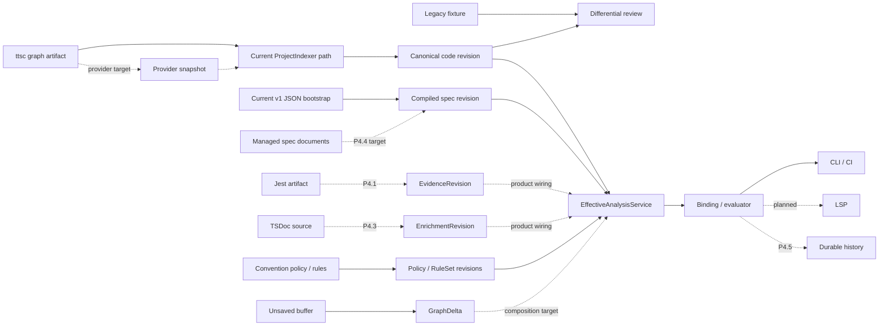

# [[Semantic Graph Spec Governance Roadmap]]

> 복원된 legacy 동작을 비교 기준선으로 유지하고, TypeScript 7 canonical graph를
> 구현 증거로 사용해 spec, code, test의 정합성을 검증하는 실행 로드맵

**Status**: Active implementation and stabilization
**Reference provider**: `ttsc` + `@ttsc/graph`
**Compatibility target**: TypeScript 7 semantics
**Primary consumers**: CLI, LSP, CI, `work-context`
**Last reviewed**: 2026-07-12

이 문서는 다음 항목의 실행 SSOT다.

- 유지할 제품 결정과 비목표
- 현재 maturity와 병렬 lane
- 지금 구현할 checkpoint와 완료 gate
- release 또는 다음 phase를 막는 join gate

상세 graph 계약은 [[Semantic Graph Analysis and Relationship Model]], CLI 동작은
[[Convention Pack Check]], test lane은 [[TS7 Test Compilation Lane]], LSP 동작은
[[LSP Integration]], indexing/provider 경계는 [[ProjectIndexer]]가 소유한다.

## 한 화면 상태

| 구분 | 현재 위치 |
| --- | --- |
| Now | P4.3 TSDoc loader와 consuming rule 하나 |
| Parallel | Node/package release qualification, legacy baseline 첫 vertical slice |
| Next | P4.4 managed-spec wiring |
| Then | saved LSP diagnostics, P4.5 history |
| Release | runtime/package qualification과 external canary 전까지 stable release NO-GO |
| Deferred | 두 번째 runner/provider, generic adapter/DSL, convention distribution registry |

## 1차 제품 목표 — M1: CLI/CI managed-spec conformance

M1은 project가 작성한 spec, code, test evidence와 TSDoc enrichment를 하나의 saved
CLI/CI check에서 정확한 revision pin으로 검증하는 첫 사용자 가치다. P4.1까지의 evidence
입력 위에 P4.2 naming, P4.3 TSDoc, P4.4 managed-spec vertical slice를 순서대로 닫는다.

M1 완료에는 다음이 필요하다.

- naming, TSDoc, implementation/verification binding finding이 동일 check/report/gate identity에
  들어간다.
- project spec/binding의 authored SSOT가 managed document가 되고, JSON bootstrap과 duplicate
  authoring하지 않는다.
- managed source 변경은 해당 `SpecGraphRevision`과 derived finding만 결정적으로 바꾸며,
  code/evidence revision은 바꾸지 않는다.
- CLI와 CI가 saved canonical graph에서 같은 pass/fail과 exact replay를 재현한다.

M1은 saved LSP diagnostics, retained result history, external packed pilot, Node 24 release
qualification, legacy production cleanup을 포함하지 않는다. 이들은 M1 이후의 promotion 또는
parallel release/comparison gate다.

P4.4 시작 전 계획 리뷰는 managed spec의 file layout, document-level identity와
machine-readable binding declaration schema를 결정한다. 그 정의는 roadmap에 쓰지 않고
`managed/`의 canonical spec document와 extraction contract에 기록한다.

## 제품 정의

> Compiler-resolved semantic graph를 구현 증거로 사용해 spec, code, test의 연결과
> 정합성을 CLI, CI, LSP에서 같은 규칙으로 지속 검증한다.

이를 위해 다음 결정을 유지한다.

1. 복원된 legacy AST/LSP/SQLite 동작은 read-only differential baseline이다. Production
   SSOT나 canonical graph와의 영구 dual-write 경로가 아니다.
2. `@ttsc/graph`와 graph-router는 compiler fact와 artifact 실행 경계를 소유한다.
   Provider는 raw snapshot/delta를 내고 `ProjectIndexer`와 normalizer가 canonical
   identity, revision과 `GraphDelta`를 만든다.
3. 저장 파일은 하나의 canonical code revision으로 읽는다. 미저장 편집은 별도
   persisted graph가 아니라 in-memory `GraphDelta`로 합성한다.
4. code, spec, evidence, enrichment, policy와 overlay는 의미와 revision이 다른 plane이다.
   이를 다시 하나의 무구분 relationship table로 합치지 않는다.
5. `EffectiveAnalysisService`가 모든 exact input을 합성한 뒤 binding과 evaluator를
   실행한다. Saved view에서 binding한 뒤 overlay를 덧붙이지 않는다.
6. LSP는 canonical/effective view의 소비자다. 별도 저장 그래프 producer가 아니다.
7. TypeScript 외 provider와 distribution registry는 external TypeScript pilot로 현재
   계약의 portability를 증명한 뒤 도입한다.
8. compiler version은 artifact provenance가 보고할 때만 표시한다. Build dependency
   버전으로 실행 provenance를 추론하지 않는다.
9. legacy production path는 C2 capability/owner 판정과 external full pilot 뒤 제거하거나
   canonical enrichment로 재배치한다. legacy는 그 전까지 read-only differential baseline일 뿐
   새 production 기능의 영구 owner가 아니다.

## 범위와 비범위

### 목표

- legacy 사용자 결과를 재현 가능한 fixture로 복원하고 canonical 결과와 비교한다.
- analyzer별 capability owner를 `superseded`, `retained`, `composed`,
  `deprecated`, `unsupported` 중 하나로 결정한다.
- saved canonical revision과 unsaved `GraphDelta`가 같은 query 의미를 제공한다.
- managed spec, code, test evidence를 양방향으로 연결하고 revision-bound conformance를
  계산한다.
- 같은 input에서 같은 graph, finding, report와 gate identity를 재현한다.
- 외부 TypeScript library에서 install, index, CLI, LSP와 CI workflow를 증명한다.

### 비목표

- legacy와 canonical graph의 영구 이중 SSOT
- graph-router 안의 spec lifecycle 또는 TSDoc parser 재구현
- 첫 release의 모든 언어, framework와 test runner 지원
- TS5 Compiler API consumer의 일괄 제거
- plane마다 별도 database/class를 먼저 만드는 물리적 분리
- external canary 전의 provider SDK 또는 convention distribution registry

## 작성 권위와 derived projection

현재 bootstrap 입력과 목표 authored SSOT를 구분한다.

| 관심사 | 현재/목표 작성 권위 | Derived projection | 편집 규칙 |
| --- | --- | --- | --- |
| Compiler fact | provider artifact | `ProviderSnapshot` → canonical `GraphRepository` revision | DB row 직접 편집 금지 |
| Project spec/binding | 목표: managed spec documents | `SpecGraphRevision`, `SpecGraphRepository` | managed document를 수정한 뒤 재추출 |
| Convention bootstrap | v1 workspace-local JSON | compiled spec/policy/rules + manifest | P4.4 전까지 canary 입력 |
| Test evidence | runner artifact | `EvidenceRevision` | P4.1은 in-memory, P4.5에서 retained input |
| TSDoc enrichment | authored TypeScript/TSDoc | `EnrichmentRevision` | canonical code identity를 변경하지 않음 |
| Policy/rule | convention source | `PolicyRevision`, `RuleSetRevision` | exact version과 digest로 pin |
| Unsaved edit | editor buffer | in-memory `GraphDelta` | canonical DB에 저장하지 않음 |
| Result/history | validated analysis inputs | finding/report/gate envelope | authored SSOT가 아니며 immutable ID로 조회 |

현재 v1 JSON pack은 spec node와 binding을 포함하는 operational bootstrap source다.
`ConventionPackManifest`만 compiled composition descriptor다. Managed document extraction이
연결된 뒤 project spec과 binding의 유일한 authored SSOT는 managed document가 된다.
같은 spec node를 Markdown과 JSON에서 동시에 독립 authoring하지 않는다. 그때 convention
source는 policy/rule과 compiled spec revision을 조합하거나 managed source에서 생성한다.

Portable convention definition이 자체 spec을 필요로 하는 경우 project spec과 다른
namespace와 installation 계약을 먼저 정의한다. Silent merge나 remote overwrite는 허용하지
않는다.

Plane은 의미, authority와 revision 경계다. Plane마다 별도 repository를 만들어야 한다는
배치 규칙은 아니다. 현재 물리 저장 kernel은 다음 세 가지다.

- `GraphRepository`: canonical code projection
- `SpecGraphRepository`: compiled spec projection
- `AnalysisInputRevisionRepository`: evidence, enrichment, policy exact revisions

Overlay와 binding set은 process-local이다. Conformance finding/report는 derived result다.

## Maturity 어휘

모든 상태는 다음 네 단계 중 하나로 기록한다.

| 상태 | 의미 |
| --- | --- |
| `planned` | 문서와 의도만 있고 실행 가능한 kernel이 없다 |
| `kernel` | 계약, 순수 로직과 focused test가 있으나 제품 경로에 연결되지 않았다 |
| `wired` | CLI/LSP/build 같은 실제 caller에서 도달하지만 대표 proof가 남았다 |
| `proven` | real artifact/checkout과 실패 canary, replay gate를 반복 통과했다 |

`proven`에는 범위를 붙인다. Source-checkout proof를 packed external proof로 확대 해석하지
않는다. 모호한 “구현됨” 대신 상태, proof와 남은 gate를 함께 기록한다.

## 현재 capability 상태

| Surface | Maturity | 현재 증거 | 다음 gate |
| --- | --- | --- | --- |
| Saved canonical graph | `proven` (source-checkout) | real router → indexer → repository와 convention PoC | packed external proof |
| GraphDelta workspace view | `wired` | content-addressed delta와 dirty/save composition | fact/topology v2 smoke |
| All-surface structural equivalence gate | `planned` | 일부 surface만 연결 | position/name/ID/impact equivalence |
| Legacy baseline/differential | `planned` | narrow AST parity helper만 존재 | versioned `work-context` fixture와 comparator |
| Public provider boundary | `kernel` | ttsc provider, snapshot/delta normalizer | coordinator wiring과 packed early canary |
| Spec repository | `kernel` | immutable CAS/history repository | production caller |
| Managed-doc extraction | `planned` | authored authority 결정만 존재 | extractor, binding syntax와 caller |
| Convention loop | `proven` (implementation binding) | saved graph, exact replay, exit 0/1/2 PoC | verification/naming/enrichment |
| P4.0 TS7 test lane | `proven` (repository-local) | TS7 typecheck → AOT → JavaScript Jest parity | Node/package release qualification |
| Evidence revision/store | `kernel` | revision, exact store, resolver index | retained-input product wiring |
| Jest evidence check | `proven` (source-checkout) | source-mapped TS7 Jest artifact → CLI check/replay, status and input-error canaries | retained-input history |
| Naming evaluator | `proven` (source-checkout) | location-aware Pascal/camel/snake/kebab evaluator, typed config, CLI exit/replay canaries | policy migration from warning to error |
| Enrichment revision/store | `kernel` | revision factory와 shared exact store | retained-input product wiring |
| TSDoc enrichment check | `planned` | loader/consumer 없음 | loader와 첫 consuming rule |
| Durable result history | `planned` | transient check result만 존재 | retained input과 append-only result store |
| LSP spec experience | `planned` | structural canonical/overlay LSP만 존재 | saved diagnostics와 read-only actions |
| External library pilot | `planned` | self-repository PoC만 존재 | packed early canary와 full pilot |

## 최소 아키텍처 — current와 target



### 결합 불변식

- Canonical code node를 spec/evidence store에 복제하지 않는다.
- 모든 cross-plane reference는 workspace, revision과 provenance를 exact-pin한다.
- Provider가 제공하지 않는 capability를 추론으로 위장하지 않는다.
- Overlay는 저장하지 않고 save 성공 후 새 whole-project revision으로 대체한다.
- Binding과 evaluator는 composed effective view 이후에만 실행한다.
- Serialized binding set은 신뢰해 복원하지 않고 pinned input에서 재계산한다.
- Derived cache나 history는 authored/code/spec SSOT가 될 수 없다.

## 병렬 실행 lane

```text
Comparison  C0 canonical safety + C1 legacy restore -> C2 capability/ownership decision
Product     P4.0 TS7 lane -> P4.1 evidence -> P4.2 naming -> P4.3 TSDoc
                       -> P4.4 managed spec -> saved LSP diagnostics
                       -> P4.5 history -> historical Explain/Open
Provider    provider kernel -> packed early canary -> external full pilot
Release     Node/package clean-install qualification
```

이 lane은 waterfall 구현 순서가 아니라 promotion gate다.

- Comparison lane은 P4.1을 막지 않지만 legacy analyzer 제거를 막는다.
- Release lane은 repository-local P4.x 구현을 막지 않지만 stable release와 external full
  pilot을 막는다.
- Managed-spec wiring은 saved LSP diagnostics의 선행 gate다. Durable history는 historical
  Explain/Open의 선행 gate다.
- Provider contract는 packed early canary 전까지 experimental이다.
- Product checkpoint 1~2개마다 comparison vertical slice 하나를 닫는다.

## Checkpoint 계획 리뷰와 커밋 단위

각 Product/LSP checkpoint는 구현을 시작하기 전에 짧은 계획 리뷰를 통과한다. 리뷰의 목적은
새 backlog를 만드는 것이 아니라, 이번 vertical slice의 authored SSOT, contract version,
영향받는 caller, proof와 명시적 비범위를 다시 고정하는 것이다.

1. 이 roadmap, 해당 contract 문서, 직전 handoff를 읽고 현재 maturity와 다음 join gate를
   대조한다.
2. 변경할 plane/revision identity, CLI/LSP entrypoint, fixture와 실패 canary를 한 checkpoint
   단위로 적는다. contract나 실행 순서가 바뀌면 이 roadmap과 관련 feature 문서를 먼저
   갱신한다.
3. 구현 중 발견한 독립 concern은 같은 커밋에 섞지 않는다. 다음 checkpoint 또는 병렬 lane으로
   route하고, 현재 checkpoint의 proof가 끝난 뒤에만 promotion한다.
4. closeout 때 staged file 목록, focused proof, broad regression, generated artifact 제외와
   `git diff --check`를 검토한다. 계획 리뷰 자체가 source-of-truth 변경을 만들지 않으면
   빈 문서 커밋을 만들지 않는다.

커밋은 checkpoint 전체를 하나로 뭉치지 않고 아래의 독립 review/proof 단위로 나눈다. 제목은
예시이며, 실제 변경이 inseparable하면 인접 단위를 하나의 커밋으로 합칠 수 있다. 반대로
문서만의 순서·authority 변경은 구현 커밋과 분리한다.

| Checkpoint | 계획 리뷰 초점 | 권장 커밋 단위 |
| --- | --- | --- |
| P4.2 naming | canonical node selector, finding identity, policy/rule version | `feat(naming): add canonical naming evaluator and tests` → `feat(convention): wire naming evaluator into check/gate` → `docs(roadmap): record P4.2 proof` |
| P4.3 TSDoc | authored source digest, enrichment revision pin, 첫 소비 rule | `feat(enrichment): load TSDoc into revision` → `feat(convention): evaluate first enrichment rule` → `docs(roadmap): record P4.3 proof` |
| P4.4 managed spec | Markdown authority 전환, JSON bootstrap coexistence/duplicate rejection | `feat(spec): extract managed spec revision and bindings` → `feat(convention): select managed spec inputs and guard provenance` → `docs(roadmap): record P4.4 authority transition proof` |
| LSP-current | saved diagnostic projection과 CLI finding identity 일치, read-only action | `feat(lsp): project saved conformance diagnostics` → `feat(lsp): add current Explain/Open actions` → `docs(lsp): record saved-view proof` |
| P4.5 history | retained input envelope, immutable result record, read-time canonical revalidation | `feat(history): retain exact analysis inputs` → `feat(history): add validated result history and replay` → `feat(cli): expose exact-id history lookup` → `docs(roadmap): record P4.5 replay/tamper proof` |
| LSP-history | retained pin replay, historical/current view 분리 | `feat(lsp): add historical Explain/Open replay` → `docs(lsp): record historical proof` |
| Comparison/Provider/Release lane | product checkpoint와 분리된 promotion gate | `test(comparison): add one differential vertical slice`, `test(provider): add packed canary`, `chore(runtime): declare Node 24 baseline`, `ci(release): add clean-install qualification`처럼 lane별로 별도 커밋 |

P4.0/P4.1은 이미 source-checkout proof를 닫은 checkpoint다. 이후 수정은 해당 checkpoint를
재개하는 broad commit이 아니라, 수정한 contract와 proof 범위에 맞는 위 단위로 route한다.

### Comparison lane

#### C0 — Canonical safety

- 실제 schema-v1 fixture의 guarded read/promotion
- alias collision/ambiguity와 revision identity proof
- legacy DB를 변경하지 않는 canonical refresh
- GraphDelta stale/rebase/save lifecycle과 CLI/LSP saved-view equivalence

현재 여러 kernel과 caller가 있으므로 미구현 목록이 아니라 product proof backlog로
관리한다.

#### C1 — Legacy baseline

첫 vertical slice는 `work-context` 하나로 제한한다.

```text
versioned source fixture
  -> restored legacy output
  -> canonical output
  -> exact/normalized/legacy-only/compiler-only comparison
  -> limitation과 owner 결정
```

Baseline runner는 read-only이며 canonical/legacy production DB를 변경하지 않는다. 알려진
false positive/negative도 삭제하지 않고 limitation으로 기록한다.

#### C2 — Capability와 owner 판정

각 capability는 producer declaration, raw observation, router-derived structure, canonical
mapping, legacy parity와 fixture를 가진다. 결과는 다음 중 하나다.

- `superseded`: compiler fact가 더 정확하므로 legacy production path 제거 후보
- `retained`: TSDoc Edge 고유의 spec/document 기능
- `composed`: compiler fact와 enrichment/spec 의미가 모두 필요
- `deprecated`: 중복 또는 제품 가치가 낮아 migration 후 제거
- `unsupported`: provider capability가 없어 limitation/backlog로 유지

C2 판정 전에는 legacy analyzer 제거를 확대하지 않는다. C2의 `retained`와 `composed`는
기능 의미를 보존한다는 뜻이지 legacy production implementation을 보존한다는 뜻이 아니다.
판정 후에는 canonical/enrichment owner로 이관하고, legacy 경로는 read-only comparator를
제외하고 제거한다.

## Active slice — P4.1 Jest evidence

`loadJestJsonEvidence`와 `--evidence` CLI wiring은 source-checkout proof까지 통과했다. 이
slice는 in-memory input만 사용하며, durable retention은 P4.5 gate로 남는다.

### 사용자 경로

```bash
tsdoc-edge convention check --pack <pack.json> --evidence <jest.json>
```

```text
Jest JSON
  -> loadJestJsonEvidence
  -> in-memory EvidenceRevision
  -> ConventionCheckService
  -> report / gate
```

CLI는 optional artifact를 load해 service에 넘긴다. `ConventionCheckService.run()`은 optional
`EvidenceRevision`을 받고, 생략 시 현재 canonical-empty revision을 사용한다.

### 판정

구조적 resolution과 test 실행 결과를 분리한다.

| Structural result | Test status | Conformance |
| --- | --- | --- |
| exact resolved | `passed` | `satisfied` |
| exact resolved | `failed` | `violated` |
| exact resolved | `skipped` / `unknown` | `indeterminate` |
| any required participant ambiguous / stale | 무관 | `indeterminate` |
| otherwise, any required participant missing | 무관 | `violated` |

Mixed structural state에서는 ambiguous/stale를 먼저 적용한다. 그런 participant가 없을 때만
missing을 `violated`로 평가한다.

Status는 test-evidence endpoint에 보존하고 pinned evidence item과 다시 대조한다. 이 의미
변경으로 resolver, conformance engine과 convention pack compiler version은 `2.0.0`으로
올린다. `binding.verification` rule contract도 `2.0.0`으로 올리고 compiler는 지원하는
`(ruleId, version)`만 허용한다. Evidence contract와 gate evaluator version은 유지한다.

### Loader 경계

`loadJestJsonEvidence({ artifactPath, workspaceRoot, workspaceId })` 하나만 추가한다.

- Jest와 `ts-jest` package를 runtime import하지 않는다.
- adjacent source map으로 `.test-dist/**/*.js`를 authored `src/**/*.ts(x)`로 복원한다.
- `sourcesContent`와 실제 source bytes가 다르거나 workspace 밖이면 거부한다.
- 모든 identity path는 workspace-relative POSIX path다.
- Item ID는 authored source file과 Jest full test name만 사용한다.
- 같은 artifact에 이 identity가 중복되면 ordinal을 붙이지 않고 exit `2`로 거부한다.
- status, duration과 artifact가 제공한 clock은 revision content지만 item ID는 아니다.
- 현재 clock은 넣지 않는다.
- Epoch millisecond clock은 유효성을 검사한 뒤 UTC RFC3339/ISO string으로 정규화한다.
- Jest가 subject mapping을 제공하지 않으므로 `subjectFiles: []`로 고정하고 추론하지 않는다.
- `pending`/`todo`/`disabled`/`skipped`는 `skipped`, `focused`는 `unknown`으로 정규화한다.
  그 밖의 새 status 문자열은 unsupported schema로 exit `2`다.
- 정규화한 test result, loader version, source-map mapping과 authored source digest로
  `sourceFingerprint`를 만든다.
- Artifact가 Jest version을 제공하지 않으면 설치 dependency에서 추론하지 않고
  `unreported`로 남긴다.
- Item provenance는 `producerId: jest`와 reported/unreported runner version, revision
  provenance는 loader ID/version을 가진다.
- malformed JSON, unsupported schema, interrupted/run-exec error, runtime-error suite, aggregate
  count mismatch, path escape, unmapped `.test-dist`와 source mismatch는 `unknown`으로 바꾸지
  않고 exit `2`로 거부한다.
- `--output`은 evidence artifact와 같은 파일을 가리킬 수 없다. Same-file이면 읽기 전에
  exit `2`로 거부한다.

Evidence status, normalized identity와 provenance의 상세 계약은
[[Semantic Graph Analysis and Relationship Model]]이 소유한다. 이 roadmap은 checkpoint와
완료 gate만 소유한다.

### 보류

- 별도 evidence import 명령과 product DB wiring
- active/latest evidence pointer
- generic adapter interface/registry와 mapping DSL
- JUnit/Vitest 또는 두 번째 runner
- shard/retry/flaky aggregation

`AnalysisInputRevisionRepository` kernel은 이미 존재하지만 P4.1 product path에는 연결하지
않는다. 같은 artifact가 있을 때 deterministic recomputation이 가능한 단계이며 historical
retention을 주장하지 않는다. Loader output의 repository store/read 호환성은 focused test로
검증할 수 있지만 제품 persistence로 분류하지 않는다.

### 완료 gate

- 실제 TS7 AOT Jest JSON의 passed case가 default gate exit `0`
- failed는 `violated`, skipped/unknown은 `indeterminate`, missing verifier/subject는 `violated`
- blocking finding은 default gate exit `1`
- malformed/schema/source-map/path/pin 오류는 exit `2`
- 동일 normalized evidence, exact code/spec/enrichment/policy/rule-set input, explicit
  `suppressionAsOf`와 failure threshold에서 evidence/check/report/gate ID가 동일
- evidence source anchor에 `.test-dist`와 절대 checkout path가 없음
- canonical/legacy DB, WAL/SHM/journal과 registry sidecar가 byte-for-byte 불변
- Jest runner package runtime import가 없음
- `--output`과 `--evidence` same-file canary가 exit `2`
- compiler v2로 바뀐 manifest lock과 implementation PoC expected IDs가 함께 갱신됨

Node runtime/package clean-install qualification은 병렬 release gate이며 P4.1 구현 자체를
막지 않는다.

## Product checkpoint

| Checkpoint | 한 기능 | 완료 증거 | 명시적 비범위 |
| --- | --- | --- | --- |
| P4.0 | TS7 typecheck → AOT → JavaScript-only Jest | parity, source-map/coverage, no `ts-jest` | production TS5 consumer 제거 |
| P4.1 | Jest evidence 한 입력 | 위 status/exit/replay/path/DB gate | import DB, second runner |
| P4.2 | canonical node를 읽는 naming evaluator 하나 | pass/fail과 deterministic finding/report/gate ID | DSL, registry, formatter, autofix |
| P4.3 | TSDoc loader와 consuming rule 하나 | `EnrichmentRevision` exact pin, source digest 변화, code graph 불변 | 범용 enrichment framework |
| P4.4 | managed document → SpecGraph/binding 한 vertical slice | code/evidence 불변, spec과 derived IDs의 결정적 변경, duplicate/provenance gate | LSP authoring 전체 |
| LSP-current | saved diagnostics와 current Explain/Open | CLI와 같은 stamp/finding/diagnostic | historical lookup, mutating action |
| P4.5 | retained input + validated append-only result history | exact-ID lookup/replay, tamper/collision reject | latest를 실행 input으로 선택 |
| LSP-history | historical Explain/Open | retained pin으로 동일 finding 재계산 | mutating CodeAction, unsaved spec authoring |

P4.5는 report JSON만 복사하는 기능이 아니다. 다음을 함께 보존한다.

- normalized evidence/enrichment/policy/rule-set canonical payload 또는 이를 byte-identical하게
  재생성할 immutable authored source와 compiled manifest
- 기존 repository의 code/spec exact pin과 retention
- `EffectiveAnalysisStamp`
- check/report/gate identity
- exact-ID lookup 시 canonical envelope 재검증

Binding resolution은 serialized object를 신뢰하지 않고 retained input에서 재계산한다.

### P4.5 closeout design — retained replay bundle

현재 `--history-db`는 canonical envelope append와 read-time tamper/collision rejection을
제공하는 `wired` precursor다. P4.5 complete는 그 stored `ConventionCheckResult`를 결과로
반환하는 것이 아니라, 아래 `ConventionReplayBundle`로 새 check를 실행해 ID를 비교하는 것이다.

```typescript
interface ConventionReplayBundle {
  contractVersion: '1.0';
  historyId: string;
  workspaceId: string;
  code: { revisionId: string; graphFingerprint: string };
  spec: { revisionId: string; contentFingerprint: string };
  compiledPack: {
    manifest: ConventionPackManifest;
    policy: PolicyRevision;
    ruleSet: RuleSetRevision;
  };
  inputs: {
    evidence: EvidenceRevision;
    enrichment: EnrichmentRevision;
  };
  evaluationConfig: {
    naming: NamingConventionConfig;
    tsdoc: TsdocConventionConfig;
    suppressionAsOf?: string;
    failureThreshold: ConventionFailureThreshold;
  };
  expected: {
    effectiveStamp: EffectiveAnalysisInputStamp;
    checkId: string;
    conformanceReportId: string;
    namingReportId: string;
    tsdocReportId: string;
    gateId: string;
  };
}
```

`compiledPack`에는 source JSON을 다시 해석해 현재 파일을 선택하지 않는다. 저장된 manifest,
policy, rule-set와 `SpecGraphRepository`의 exact spec revision을 canonical factory로 재검증해
process-local trusted compiled pack을 재구성한다. `GraphRepository`도 active pointer가 아니라
bundle의 `code.revisionId`를 exact lookup하고 graph fingerprint를 재검증한다. 둘 중 하나라도
없으면 `historical-input-missing` input error(exit `2`)이며 latest revision으로 대체하지 않는다.

Replay는 retained evidence/enrichment와 retained naming/TSDoc config를 `ConventionCheckService`에
명시 전달한다. 따라서 현재 `.tsdoc.config.json`, 현재 managed Markdown, 현재 pack file이나 현재
clock은 결과에 개입하지 않는다. service는 새 binding resolution과 conformance를 계산하고, 모든
expected ID가 일치할 때만 `reproduced`다. 과거 gate가 pass면 replay exit `0`, 과거 gate가 fail이면
exit `1`, input missing/tamper/ID divergence는 exit `2`다. serialized binding resolution, finding,
report는 비교용 evidence일 뿐 trusted execution input이 아니다.

저장은 하나의 history SQLite transaction에서 input revision rows, replay bundle, result envelope와
code/spec retention pin을 함께 append한다. 동일 `historyId`의 byte-identical 재요청은 idempotent
read, 다른 payload는 collision error다. retention GC는 history pin이 있는 code/spec/input revision을
제거하지 않으며, 삭제가 필요한 경우에는 tombstone과 `historical-input-missing`을 남긴다.

Closeout proof는 다음을 요구한다.

- pass와 fail history 각각이 active pointer/config/source 변경 뒤에도 같은 check/report/gate ID로
  재계산된다.
- retained source payload, code/spec/input pin, expected ID 각각의 one-byte/one-field tamper가 exit
  `2`로 거부된다.
- exact code/spec/input revision 하나를 제거한 fixture가 fallback 없이
  `historical-input-missing`을 반환한다.
- same bundle append는 row를 추가하지 않고, same history ID의 다른 bundle은 collision으로 거부된다.
- historical replay는 current CLI/CI check와 동일한 gate evaluator version을 명시적으로 비교한다.

## Provider와 external pilot

현재 `CanonicalProjectGraph` v1은 `tsconfigPath`를 필수로 가진다. contract v2 검토에서는
`tsconfigPath`가 계속 필요하면 `TypeScriptProviderConfig`의 단일 owner로 유지하고, router,
provider, normalizer가 각각 독립적인 경로를 설정하거나 reconcile하지 않게 병합한다.
v1 compatibility field는 그 단일 config에서 파생한다. packed canary가 이를 증명하기 전에는
canonical envelope에서 제거한다고 가정하지 않으며, config의 위치를 바꾸는 경우에는
compatibility와 migration을 함께 version한다.

### Packed early canary

- 다른 workspace에서도 namespaced canonical ID 충돌이 없음
- clean packed install에서 snapshot과 one-file delta 생성
- source occurrence와 package export surface 보존
- repository-specific absolute module/binary 경로가 identity에 없음
- unreported compiler version을 TS7-proven으로 표시하지 않음

### External full pilot

- public API와 test가 있는 TypeScript library 사용
- install → index → managed spec binding → evidence/enrichment check
- LSP code ↔ spec ↔ test 탐색
- save 후 CLI/CI가 같은 violation 재현
- Node/OS support matrix에서 packed dependency smoke

두 번째 provider와 legacy production cleanup은 이 full pilot 뒤에만 진행한다. cleanup은 C2의
owner 판정을 따라 legacy 구현을 제거하거나 canonical enrichment로 이관하는 작업이다.

## Join gate

| 승격 | 필수 gate |
| --- | --- |
| Saved LSP spec diagnostics | P4.1~P4.4 source-checkout proof |
| Historical Explain/Open | P4.5 durable history |
| Provider stable | packed early canary + release qualification |
| External full pilot | provider stable + saved LSP checkpoint + P4.1~P4.5 proof |
| Legacy production retirement | C2 ownership decision + external full pilot |
| Convention distribution registry | registry-independent packed install canary, authored ownership, portable/install split, publisher authenticity와 lock/upgrade/rollback |

### Portable convention distribution의 범위

현재 pack은 workspace-local JSON bootstrap이다. Portable distribution은 이를 다른 workspace에
그대로 복사하거나 remote package가 project spec을 덮어쓰게 만드는 기능이 아니다. 목적은
재사용 가능한 convention policy/rule과 선택적 portable spec을 **명시적으로 설치**하고, 각
project가 자신의 managed spec과 exact composition을 재현하게 만드는 것이다.

설치 모델에는 세 identity가 분리되어야 한다.

1. **Published package identity**: publisher, package name, immutable version과 content digest.
   digest는 내려받은 bytes의 integrity만 증명한다.
2. **Project authored identity**: workspace ID와 local managed-spec revision. 이것은 registry나
   package가 수정할 수 없다.
3. **Installed composition/lock identity**: 위 package pin, local spec revision, provider
   capability와 compiled manifest를 묶은 workspace-local lock. CI와 replay는 이 lock을
   읽으며 floating `latest`나 active remote state를 읽지 않는다.

Portable package가 자체 spec을 제공하면 local project spec과 다른 declared namespace를 써야
한다. 설치는 namespace collision, capability, contract version과 publisher trust를 검증한 뒤에만
local composition을 생성한다. 동일 ID를 silent merge하지 않고, remote update가 local authored
document를 overwrite하지 않으며, upgrade와 rollback은 새 exact lock을 만드는 별도 action이다.

Publisher authenticity는 content digest가 아니라 검증 가능한 publisher identity와 trust root로
증명해야 한다. 구체적인 signing/registry protocol은 registry implementation ADR에서 선택하되,
그 선택 전에도 installer가 요구할 불변식은 `publisher identity → signed package metadata →
immutable digest → local lock` 체인과 trust/revocation 검증이다.

따라서 registry 도입 전 gate는 registry-independent packed install canary다. 빈 외부 workspace에
pack을 설치해 namespace/authority guard, lock replay, tampered digest·untrusted publisher reject,
upgrade/rollback을 증명한 뒤에만 registry catalog와 publisher workflow를 추가한다.

## Release qualification

Repository-local P4.0/P4.1 proof와 package release 가능성을 구분한다.

- Node 24 line(`>=24 <25`)과 native dependency 지원 범위를 정렬
- Node 24/지원 OS clean install, build, typecheck와 worker/in-band 반복 test matrix
- provider/router package `files`, `prepack`, version compatibility 계약
- local `file:` dependency와 source-checkout-only binary resolution 제거
- absolute path 없이 packed external canary 재현

macOS Node 24 native crash가 간헐적으로 재현된 상태이므로, 이 gate를 통과하기 전에는
repository-local proof를 stable release로 표시하지 않는다.

## 검증 원칙

각 checkpoint는 test 수가 아니라 versioned input과 proof path를 남긴다.

```bash
npm run typecheck
npm run build
npm test -- --runInBand
npm run poc:convention
```

P4.0 세부 test 명령과 rollback은 [[TS7 Test Compilation Lane]], convention exit/report
계약은 [[Convention Pack Check]]가 소유한다. External proof는 packed artifact와 clean
temporary project를 사용한다.

`100%` 지표에는 versioned inventory라는 분모와 proof command가 있어야 한다. 분모 없는
coverage 주장은 완료 gate로 사용하지 않는다.

## 최종 promotion 조건

1. Legacy behavior와 limitation이 versioned baseline으로 재현되고 capability owner가
   결정된다.
2. Canonical saved graph와 GraphDelta가 provenance, exact identity와 replay gate를 통과한다.
3. Managed docs가 project spec/binding의 유일한 authored SSOT이고 모든 repository/history가
   derived projection으로 재생성 가능하다.
4. Evidence, enrichment, naming과 spec binding이 같은 check/report/gate pipeline을 사용한다.
5. CLI, CI와 LSP가 같은 saved `EffectiveAnalysisStamp`와 finding을 표시한다.
6. Retained input으로 과거 conformance를 exact lookup/recompute할 수 있다.
7. External TypeScript library가 repository-specific 예외 없이 install, index, LSP와 CI
   workflow를 통과한다.
8. Legacy production path는 C2 결과에 따라 제거되거나 enrichment로 재배치된다.

## 핵심 위험

| 위험 | 대응 |
| --- | --- |
| Managed docs와 JSON pack의 dual authored spec | P4.4에서 managed docs로 authority 전환, duplicate authoring 거부 |
| Kernel을 product proof로 오인 | maturity와 proof 범위를 함께 기록 |
| Legacy 비교가 product backlog에 밀림 | P4 checkpoint 1~2개마다 comparison slice 하나 완료 |
| Provider 일반화를 너무 빨리 고정 | packed early canary와 external full pilot 전 experimental 유지 |
| Status가 structural resolution에서 유실 | endpoint에 보존하고 pinned evidence와 재검증 |
| History가 검증되지 않은 blob store가 됨 | immutable envelope, exact pin, read-time canonical 검증 |
| Overlay와 saved view가 섞임 | compose-before-bind와 stale/rebase gate |
| Runtime/package 지원이 재현되지 않음 | clean-install matrix 전 stable release 금지 |

## 관련 문서와 소유권

| 문서 | 소유 범위 |
| --- | --- |
| [[Semantic Graph Analysis and Relationship Model]] | graph/spec/evidence identity, relation, direction과 revision 계약 |
| [[ProjectIndexer]] | router/provider/indexer/package 경계와 canonical projection |
| [[Convention Pack Check]] | current v1 pack, CLI, report/gate와 P4 evidence handoff |
| [[TS7 Test Compilation Lane]] | P4.0 test pipeline, parity, runtime qualification과 rollback |
| [[LSP Integration]] | saved/unsaved view, diagnostics와 CodeAction surface |
| [[Spec Management System]] | managed document lifecycle와 completeness |
| [[Work Context Workflow]] | legacy/canonical comparison의 첫 사용자 vertical slice |

## 변경 기록

### 2026-07-12

- Roadmap을 architecture spec과 세부 구현 목록에서 실행 SSOT 중심으로 축약했다.
- 선형 Phase를 Comparison, Product, Provider, Release 병렬 lane과 join gate로 바꿨다.
- 상태를 `planned → kernel → wired → proven`으로 통일했다.
- Current JSON bootstrap source와 target managed-document spec SSOT를 분리했다.
- P4.1을 one-command in-memory evidence loop로 고정하고 전체 status/exit/replay gate를
  추가했다.
- P4.2 location-aware naming evaluator를 config, convention check/gate와 source-checkout
  proof까지 연결했다. 기존 source symbol rule은 warning으로 시작하고, 새 managed spec
  location은 error-severity convention으로 관리한다.
- P4.3 TSDoc loader를 workspace-authored canonical node에만 투영하고, configured public-tag
  rule을 same check/report/gate path에 연결했다. source digest 변화는 enrichment revision을
  바꾸지만 code graph는 바꾸지 않는다.
- P4.4 `type: project-spec` Markdown의 explicit `tsdoc-spec` block을 `SpecGraphRevision`과
  binding으로 컴파일하고, `spec extract`가 derived repository revision으로 원자 승격한다.
- P4.5 `--history-db`는 evidence/enrichment/policy/rule-set canonical payload와 exact
  check/stamp를 append-only envelope으로 보존한다. read-time canonical envelope 검증과
  tamper/collision rejection은 구현됐고, retained source에서의 full conformance recompute와
  historical Explain/Open UI는 별도 P4.5 closeout/LSP-history gate로 남는다.
- Node 24를 package/CI baseline으로 선택하고, clean-install matrix와 native-crash 해소 전의
  stable release NO-GO를 명시했다.
- legacy production path는 C2와 external pilot 뒤 제거 또는 canonical enrichment 이관이라는
  cleanup 방향으로 고정했다.
- `tsconfigPath`는 필요 시 TypeScript provider의 단일 설정 owner에 남기고, v2에서 중복
  설정 책임을 병합 검토하도록 결정했다.
- portable convention distribution의 package, project, lock identity와 trust/install gate를
  구체화했다.
- 각 checkpoint의 사전 계획 리뷰, independent proof 기준의 커밋 단위, closeout staged-set
  검토 규칙을 실행 계획에 추가했다.
- Managed-spec wiring을 P4.4, durable history를 P4.5로 배치했다.
- Current saved LSP diagnostics와 P4.5 historical Explain/Open의 gate를 분리했다.
- Convention distribution registry를 external install canary 이후로 미뤘다.
