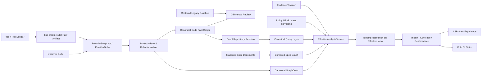

# [[Semantic Graph Spec Governance Roadmap]]

> 복원된 legacy 설계를 비교 기준선으로 사용하고, TypeScript 7 canonical graph를
> 첫 semantic graph provider로 삼아 TSDoc Edge를 LSP-first 스펙 거버넌스 계층으로
> 특화하는 구현 계획

**Status**: Active planning and stabilization
**Reference provider**: `ttsc` + `@ttsc/graph`
**Compatibility target**: TypeScript 7 semantics; compiler version must come from artifact provenance
**Primary consumers**: CLI, LSP, CI, `work-context`
**Last reviewed**: 2026-07-11

## 결정 요약

TSDoc Edge의 기존 AST/LSP/SQLite 설계를 복원한다. 다만 복원된 설계를 production
SSOT로 다시 지정하지 않는다. 기존 동작, 관계 범위, 사용자 경험을 보존한
**differential baseline**으로 고정하고, 동일한 fixture를 TypeScript 7 canonical
graph와 비교한다.

장기 production 구조는 다음 원칙을 따른다.

1. `@ttsc/graph`는 compiler-resolved code fact를 생산한다. TypeScript 7은 compatibility
   target이며 실제 compiler version은 artifact provenance가 증명할 때만 표시한다.
2. `ttsc-graph-router`는 설정, 실행, 캐시, artifact, review projection 경계를 소유한다.
3. Provider는 raw `ProviderSnapshot`/`ProviderDelta`를 제공하고 `ProjectIndexer`와
   `DeltaNormalizer`가 TSDoc Edge canonical revision/delta로 정규화한다.
4. code fact graph와 spec graph는 별도 plane으로 유지한다.
5. LSP는 별도 persisted graph producer가 아니라 canonical revision과 미저장
   `GraphDelta`의 실시간 소비자다.
6. 다른 라이브러리와 parser는 공통 provider 계약을 통해 추가한다.
7. `EffectiveAnalysisService`가 code/spec/evidence/enrichment/policy/overlay를 합성한 뒤
   binding과 analyzer를 실행한다.

이 계획의 최종 제품 정의는 다음과 같다.

> Compiler-resolved semantic graph를 구현 증거로 사용해 스펙, 코드, 테스트의
> 연결과 정합성을 지속적으로 검증하는 LSP-first spec governance platform.

## 목표

- 기존 TSDoc Edge 설계를 재현 가능한 fixture와 snapshot으로 복원한다.
- 기존 analyzer별 기능을 ttsc capability와 비교해 소유권을 다시 판정한다.
- 저장 파일의 구조 사실을 하나의 canonical revision으로 제공한다.
- 미저장 버퍼를 canonical ID와 edge를 갖는 `GraphDelta`로 표현한다.
- 반복 source occurrence와 query topology edge를 분리해 evidence를 보존한다.
- 문서 생명주기 중심의 기존 [[Spec Management System]]을 compiler evidence 기반
  spec graph로 확장한다.
- 코드, 스펙, 결정, invariant, 테스트를 LSP에서 양방향 탐색하고 검증한다.
- TypeScript 라이브러리에서 검증한 뒤 다른 semantic graph provider로 확장한다.
- 깨끗한 checkout과 명시적 package 계약만으로 동일 결과를 재현한다.

## 비목표

- 복원된 legacy graph와 canonical graph를 영구적인 이중 SSOT로 운영하지 않는다.
- graph-router 안에서 TypeScript parser나 spec lifecycle을 재구현하지 않는다.
- code fact, inferred relationship, spec obligation을 하나의 무구분 관계 테이블로
  합치지 않는다.
- 모든 언어와 프레임워크를 첫 릴리스에서 지원하지 않는다.
- TS5 runtime dependency를 canonical cutover와 동시에 제거하지 않는다. `ts-jest` test
  transformer는 P4.0에서 제거하되, 문서 파싱과 미저장 syntax extraction을 포함한 runtime
  Compiler API consumer는 별도 소유권 판정 후 이관한다.

## 현재 기준선

현재 구현은 canonical graph의 기본 수직 경로를 갖추었지만, spec governance와
legacy differential review는 아직 별도 기능으로 구성되지 않았다.

### 커밋된 기반

- [x] `ttsc@0.16.8`과 TypeScript Native 7.0.2 build/typecheck lane
- [x] graph-router raw artifact contract와 adapter 검증
- [x] TypeScript-version-neutral `CanonicalProjectGraph` 계약
- [x] deterministic `ProjectIndexer`와 graph fingerprint
- [x] canonical graph query, impact, metrics, ontology projection
- [x] 원자적 `GraphRepository` revision 교체와 CAS
- [x] Build와 LSP saved-file refresh의 coordinator 공유
- [x] alias, diagnostics, parity, canonical `GraphDelta`의 기본 타입과 구현

### 현재 안정화 작업

다음 항목은 현재 작업 트리에서 경계 처리가 진행 중이다. 구현 존재 여부가 아니라
실제 저장 데이터와 clean checkout gate를 통과한 뒤 완료로 판정한다.

- schema-v1 canonical DB의 schema-v2 읽기와 guarded promotion
- collision-aware legacy alias와 ambiguous identity 처리
- alias와 diagnostics를 포함하는 revision identity
- 기존 `unified_relationships` additive migration
- XML, LLM, Human `work-context`의 동일 canonical enrichment
- numeric compiler diagnostic code와 related node 보존
- qualified provisional ID와 edge를 포함하는 `GraphDelta`
- 모든 LSP name, ID, impact, related-symbol query의 overlay 적용
- 설정 기반 legacy DB 경로와 canonical fallback

이번 설계 고도화와 함께 다음 기반 계약은 구현됐다. 각 항목의 상위 제품 gate는 아래
phase 완료 조건으로 계속 추적한다.

- [x] `GraphRepository` historical revision retention, reactivation과 `readRevision`
- [x] content-addressed `GraphDelta`, stale base 검증과 `EffectiveCodeGraphView`
- [x] dependency/containment를 분리한 relation semantic registry v1
- [x] role/endpoint 기반 SpecGraph·binding·policy contract kernel
- [x] managed document를 authored SSOT로 두는 `SpecGraphRepository` compiled projection
- [x] public `SemanticGraphProvider`, `ProviderSnapshot`/`ProviderDelta` contract
- [x] ttsc saved-lane provider facade와 namespaced snapshot/delta normalizer kernel
- [x] authoritative `FactOccurrence`/`TopologyEdge` identity와 aggregation kernel
- [x] exact binding resolver와 revision-bound minimal conformance engine
- [x] content-addressed evidence/enrichment revisions와 exact-pin policy input repository
- [x] provider-origin `GraphDelta.sourceContext`와 base snapshot/identity/capability exact pin
- [x] service-validated transient binding set과 exact evidence metadata trust boundary
- [x] authored convention pack → exact spec/policy/rule-set → saved canonical graph binding →
  suppression-aware conformance report/CI exit code vertical loop

### 신규 kernel 구현과 남은 제품 계층

- [ ] versioned legacy baseline artifact
- [ ] analyzer별 ttsc capability matrix
- [ ] legacy/canonical differential report
- [x] `SemanticGraphProvider` 공개 계약
- [x] `ProviderSnapshot`/`ProviderDelta`와 canonical normalizer kernel
- [x] precomposed effective input stamp와 resolve-after-snapshot orchestration kernel
- [x] 독립 `SpecGraph` 계약과 compiled projection 저장소
- [x] evidence/enrichment/policy immutable exact-pin revision store kernel
- [x] exact spec-to-code binding과 minimal conformance kernel
- [x] strict JSON convention pack compiler와 `convention check` saved-revision CLI canary
- [ ] P4.0 TS7 test compilation → Jest JavaScript-only execution cutover
- [ ] LSP spec diagnostics와 CodeAction
- [ ] 외부 TypeScript library reference pilot
- [ ] provider SDK와 non-ttsc provider pilot

### 다음 선행 루프 — P4.0 TS7 test compilation

다음 product loop인 evidence collector를 시작하기 전에 test toolchain 자체가 TS7 source를
검증하도록 경계를 닫는다. 목표 경로는 `test:typecheck → test:compile → test:run`이며,
`ttsc`/TypeScript 7이 source와 test를 `.test-dist` JavaScript로 만들고 Jest는 생성된
JavaScript만 실행한다.

현재 `npm test`는 `ts-jest`와 TypeScript 5 transform을 사용하므로 TS7 test compatibility
proof가 아니다. P4.0은 기존 lane을 parity baseline으로 유지한 shadow AOT canary, module-mock
hoisting, setup/asset/path/source-map/coverage 검증, full-suite parity 순서로 진행하고 승인 후
`ts-jest`와 parity-only lane을 제거한다. AOT가 즉시 닫히지 않을 때만
`TS7 typecheck + @swc/jest transpile-only`를 exit condition이 있는 임시 fallback으로 허용한다.

세부 파일, 명령, canary, rollback과 완료 조건은 [[TS7 Test Compilation Lane]]이 소유한다.
이 루프는 `typescript@5` production runtime 제거와 runner artifact의 `EvidenceRevision` 변환을
포함하지 않는다. 다음 loop는 Jest/JUnit/Vitest artifact를 dependency-free adapter로 읽는다.

## 목표 아키텍처



## Plane별 책임

| Plane | 소유 데이터 | Source of truth | 주요 소비자 |
| --- | --- | --- | --- |
| Compiler fact | symbol, scope, reference, call, access, type, inheritance, implementation, source evidence | provider artifact | `ProjectIndexer` |
| Canonical code graph | namespaced ID, compatibility edge, alias, provenance, diagnostics, revision | `GraphRepository` | query, LSP, CLI |
| Spec graph | requirement, decision, invariant, API contract, lifecycle | managed spec documents | compiled `SpecGraphRepository`, conformance |
| Evidence | test mapping/execution and runner provenance | evidence source | `EvidenceStore`, coverage |
| Enrichment | TSDoc, document symbol, endpoint, ownership | authored/extracted sources | `EnrichmentRepository`, work-context |
| Policy | rules, suppressions, severity | managed policy/config | `PolicyRepository`, conformance |
| Overlay | unsaved node/edge/diagnostic changes | in-memory `GraphDelta` | LSP only |
| Legacy baseline | restored legacy output and behavior snapshot | versioned fixture artifact | differential review only |

현재 `GraphRepository`는 canonical node, compatibility edge, alias와 diagnostic revision을
저장한다. Authoritative fact occurrence/topology 배열은 normalizer kernel에 구현됐지만 별도
DB plane과 GraphDelta v2 persistence에는 아직 연결되지 않았다.

### Plane 결합 규칙

- Canonical code node를 spec repository에 복제하지 않는다. Authored binding은 역할이
  있는 endpoint selector를 저장하고 resolution은 effective view의 code node/edge,
  test evidence 또는 API surface를 참조한다.
- Compiler fact와 inferred semantic relationship을 provenance 없이 합치지 않는다.
- Spec validation은 code/spec/evidence/enrichment/policy revision과 capability/rule/overlay
  digest를 기록한다.
- 미저장 overlay는 SQLite에 쓰지 않으며 save 성공 후 새 whole-project revision으로
  대체한다.
- Provider가 제공하지 않는 capability를 추론으로 위장하지 않는다.
- Saved revision에서 binding을 먼저 해석한 뒤 overlay를 덧붙이지 않는다.

## 기능 소유권 판정

복원된 기능과 ttsc capability를 비교한 결과는 다음 다섯 상태 중 하나로 분류한다.

| 상태 | 의미 | 처리 |
| --- | --- | --- |
| `superseded` | ttsc가 같은 사실을 더 정확하게 제공 | legacy production path 제거, golden comparison 유지 |
| `retained` | TSDoc Edge 고유의 spec/document 기능 | canonical query 위에 유지·특화 |
| `composed` | compiler fact와 spec/enrichment 의미가 모두 필요 | 별도 composition service에서 결합 |
| `deprecated` | 중복이거나 신뢰도·제품 가치가 낮음 | migration notice 후 제거 |
| `unsupported` | 현재 provider가 필요한 사실을 제공하지 않음 | limitation과 upstream/provider backlog로 유지 |

판정은 analyzer 이름이 아니라 실제 사용자 결과를 기준으로 한다. 비교 대상에는
node/edge count뿐 아니라 `work-context`, impact, diagnostics, LSP navigation 결과가
포함된다.

### Raw fact와 derived structure

현재 graph-router의 raw artifact는 `GraphMemory` 합성을 제외한 saved-file fact다.
`GraphMemory`가 만드는 file node, containment, export, property refinement, member-level
override/implementation 같은 구조는 raw compiler fact와 구분해야 한다.

- raw artifact는 canonical compiler fact plane의 기본 입력으로 유지한다.
- GraphMemory 또는 router projection은 `derived-structural` capability로 표시한다.
- 동일 endpoint의 반복 call/access/type evidence는 개별 `FactOccurrence`로 보존하고
  `TopologyEdge`가 occurrence ID를 집계한다.
- producer-derived topology는 derivation owner, version, capability와 input fact ID를
  가진다.
- TSDoc Edge가 동일 합성 로직을 복제하지 않는다.
- upstream이 안정된 resolved snapshot API를 제공하면 별도 provider capability로
  승격한다.
- spec validator는 raw/derived/inferred provenance를 사용자에게 구분해 표시한다.

## Phase 0 — Canonical 안전선 유지 (Legacy 복원과 병행)

### 목적

Legacy 복원 중 현재 canonical 저장 데이터와 LSP를 손상시키지 않도록 진행 중인
migration, alias, diagnostics, GraphDelta 경계를 닫는다. 이 Phase는 Legacy 복원보다
먼저 끝내야 하는 선행 단계가 아니라 병행 safety track이다.

### 작업

- [ ] 실제 schema-v1 DDL과 artifact fixture로 v2 read/promotion을 검증한다.
- [ ] alias eligible set, collision suffix, ambiguous omission 규칙을 계약화한다.
- [ ] alias/diagnostics 변화가 revision 또는 별도 plane generation에 반영되게 한다.
- [ ] legacy DB path를 `.tsdoc.config.json`에서 단일하게 해석한다.
- [ ] 기존 symbols와 relationship schema의 additive migration을 검증한다.
- [ ] GraphDelta가 owner-qualified ID와 file-local/cross-file edge를 보존하게 한다.
- [x] Provider delta GraphDelta에 base/next provider snapshot, provider identity와 capability
  digest source context를 포함한다.
- [x] stale revision/fingerprint/provider pin은 `rebase-required` 또는 apply rejection으로,
  one-document 범위 밖 변경은 `fallback-required`로 처리한다.
- [ ] `dirty → pending-refresh → committed` lifecycle orchestration과 failed-refresh 재생성을
  연결한다.
- [ ] authoritative fact/topology delta를 GraphDelta v2와 별도 DB plane에 연결한다.
- [ ] LSP의 position, name, ID, impact, related query가 같은 overlay view를 사용하게 한다.
- [ ] 실제 router diagnostic fixture로 code, range, related node, unknown field를 검증한다.
- [ ] 현재 architecture 문서의 구현 상태를 코드와 동기화한다.

### 산출물

- 실제 v1 DB regression fixture
- collision/ambiguity alias fixture
- unchanged edit, rename, duplicate member, cross-file edge GraphDelta fixture
- stale-base rebase, pending-refresh failure, repeated call-site occurrence fixture
- 현재 프로젝트 canonical refresh proof
- canonical boundary closeout report

### 완료 조건

- 기존 DB 삭제 없이 canonical refresh가 성공한다.
- alias insert가 실제 프로젝트에서 rollback되지 않는다.
- XML, LLM, Human `work-context`가 같은 canonical revision을 표시한다.
- 저장 전후 unchanged relationship topology가 보존된다.
- stale delta가 새 active revision에 암묵 적용되지 않고 buffer에서 재생성된다.
- build, typecheck, full test와 실제 CLI/LSP smoke가 모두 통과한다.

## Phase 1 — Legacy baseline 복원과 동결

### 목적

ttsc 도입 이전 설계가 제공하던 기능과 사용자 결과를 재현 가능한 비교 artifact로
복원한다.

### 복원 범위

- AST symbol extraction과 legacy ID 충돌 규칙
- analyzer별 relationship output
- legacy SQLite schema와 query behavior
- `work-context`의 documentation, structural, verification section
- LSP hover, CodeLens, definition, diagnostics, impact 결과
- 대표 CLI의 human, XML, LLM output

### 구현 원칙

- 복원 코드는 production canonical DB에 쓰지 않는다.
- fixture source와 expected output을 같은 versioned baseline에 보관한다.
- 시간, 임시 경로, random UUID는 snapshot identity에서 제거한다.
- 알려진 legacy false positive와 false negative도 삭제하지 않고 limitation으로 기록한다.
- 제거된 analyzer를 production registry에 다시 등록할 필요는 없다. 독립 harness에서
  실행 가능하면 baseline 복원으로 인정한다.

### 제안 산출물

```text
src/indexer/differential/
  LegacyBaselineRunner.ts
  LegacyBaselineContract.ts
  LegacyCanonicalComparator.ts

src/__fixtures__/semantic-baseline/
  source/
  legacy-snapshot.json
  expected-command-output/
  limitations.md
```

### 완료 조건

- 같은 fixture에서 baseline artifact가 반복 실행해 동일하다.
- legacy graph와 command output의 provenance가 기록된다.
- baseline 생성은 canonical repository를 변경하지 않는다.
- 기존 핵심 기능마다 최소 한 개의 positive/negative fixture가 있다.

## Phase 2 — ttsc capability map과 differential review

### 목적

ttsc가 제공하는 세부 사실을 추측하지 않고 artifact, fixture, source evidence로 고정한
뒤 기존 기능의 소유권을 판정한다.

### Capability audit 범위

| Capability | 확인 항목 |
| --- | --- |
| Symbol and scope | qualified name, nested scope, overload, declaration kind |
| Reference and access | read/write/access kind, source/target, evidence |
| Call and construction | direct/indirect call, constructor, unresolved target |
| Type system | type reference, generic argument/constraint, alias |
| OO relation | extends, implements, override, interface member |
| Boundary | package, external node, module/file scope |
| Source evidence | file, range, one-based/zero-based policy |
| Fact occurrence | repeated call/access/type site, collapsed-edge completeness |
| Annotation | TSDoc annotation, semantic tag, unknown producer field |
| Diagnostics | severity, numeric/string code, related node, range |
| Incremental behavior | cache identity, refresh, rename/delete |
| Provenance | compiler reported/unreported, producer, router, binary, config, tsconfig |

각 capability는 `supported`, `partial`, `absent`, `unknown` 중 하나와 증명 fixture를
가져야 한다. `unknown`을 `absent`로 간주하지 않는다. Capability matrix는 최소 다음
열을 갖는다.

| 열 | 의미 |
| --- | --- |
| Upstream declared | producer가 공개 계약으로 선언한 지원 |
| Raw observed | 실제 raw artifact에서 관찰한 사실 |
| GraphMemory synthesized | producer memory layer의 합성 구조 |
| Router derived | router가 만든 review/cache projection |
| Canonical mapped | TSDoc Edge canonical contract 반영 여부 |
| Legacy parity | 복원 baseline과의 공통 지원 범위 |
| Ownership decision | `superseded`, `retained`, `composed`, `deprecated`, `unsupported` |
| Fixture | 판정을 재현하는 증거 |

초기 버전 비교는 설치된 `@ttsc/graph 0.16.8` baseline과 local nested source의 0.17.x
candidate를 분리한다. annotation과 `semanticTags`는 공식 baseline이 아니라
capability-gated producer extension으로 취급한다.

TypeScript 7 compatibility fixture 통과와 compiler provenance 증명은 별도 판정이다.
Artifact가 compiler version을 보고하지 않으면 compatibility 결과는 유지할 수 있지만
provenance에는 `unreported`를 기록하고 TS7 실행으로 표시하지 않는다.

### Differential report

비교기는 최소 다음 결과를 제공한다.

- exact node/edge match
- normalized kind/ID match
- legacy-only fact
- compiler-only fact
- semantic enrichment candidate
- direction/evidence mismatch
- command/LSP behavior mismatch
- performance and refresh difference

### 완료 조건

- 모든 legacy analyzer가 다섯 가지 소유권 상태 중 하나를 가진다.
- `superseded` 판정에는 compiler fixture가 있다.
- `retained`와 `composed` 판정에는 spec-management 사용자 가치가 명시된다.
- capability map의 각 행은 producer, router, TSDoc Edge 중 한 owner를 가진다.
- 차이가 graph count가 아니라 사용자 query 결과까지 추적된다.

## Phase 3 — Canonical kernel과 provider 계약 canary

### 목적

TS7 compatibility target provider와 TSDoc Edge 내부 canonical contract를 분리하고,
외부 canary로 검증한 뒤 다른 provider가 추가돼도 spec/LSP 계층이 바뀌지 않게 한다.

### Provider와 canonical normalization 계약

```typescript
interface SemanticGraphProvider {
  identity(): ProviderIdentity;
  capabilities(): GraphCapabilities;
  snapshot(input: ProviderProjectInput): Promise<ProviderSnapshot>;
  delta?(input: ProviderDocumentInput): Promise<ProviderDelta>;
  provenance(): ProviderProvenance;
}
```

첫 구현은 `TtscSemanticGraphProvider`다. 현재 `TtscGraphRouterArtifactAdapter`와
`ProjectIndexer`의 `load → normalize` 책임을 보존한다. Provider는 producer namespace의
raw snapshot/delta만 반환하며, `ProjectIndexer`와 `DeltaNormalizer`가
`workspaceId + graphNamespace + localId` identity, fact occurrence, topology edge와
canonical diagnostics를 생성한다. `tsconfigPath`는 TypeScript provider config에만 두고
공통 canonical contract에서는 제거한다.

### 작업

- [x] contract version과 capability negotiation kernel 정의
- [x] provider-specific raw field 보존 규칙 정의
- [x] `providerInstanceId + providerNodeId`와 namespaced canonical ID의 관계 정의
- [x] 같은 canonical semantic tuple을 서로 다른 provider node가 주장하면 suffix 없이
  deterministic hard failure하는 계약 정의
- [x] snapshot/delta provenance 및 confidence 정의
- [x] `FactOccurrence`와 `TopologyEdge` identity/aggregation 정의
- [x] `DeltaNormalizer`의 dirty/rebase-required/fallback-required outcome 정의
- [ ] provider delta 미지원 시 whole-project refresh fallback orchestration
- [ ] unsupported capability의 fail/diagnostic/fallback 정책 정의
- [ ] `private` workspace package 유지 또는 배포 package 전환을 결정한다.
- [ ] package `files` allowlist와 `prepack` build를 정의한다.
- [ ] local `file:` runtime dependency와 private binary resolver 의존을 제거하거나
  명시적 package contract로 만든다.
- [ ] clean package resolution과 version compatibility policy를 정의한다.
- [ ] GraphRepository schema/revision migration 정책 문서화

### Early external contract canary

Provider 계약을 내부 저장소에 맞춘 상태로 동결하지 않도록 Phase 3 안에서 작은 외부
TypeScript package 하나를 canary로 실행한다. 이 canary는 Phase 6의 전체 제품 pilot이
아니며 다음 경계만 검증한다.

- 다른 workspace/package namespace에서도 canonical ID가 충돌하지 않는다.
- 동일 workspace/namespace에서 canonical tuple collision은 명시적으로 거부된다.
- `tsconfigPath`와 router binary path가 canonical graph 필수 필드가 아니다.
- packed provider/router 설치로 snapshot과 one-file delta를 생성한다.
- 반복 call-site evidence와 package export API surface가 보존된다.
- compiler version이 보고되지 않은 artifact를 TS7 proven으로 오표시하지 않는다.

### 완료 조건

- CLI와 LSP가 provider 구현 타입을 직접 참조하지 않는다.
- 저장된 revision만으로 producer와 compiler provenance를 설명할 수 있다.
- 깨끗한 checkout에서 절대 module 경로 없이 reference provider를 실행할 수 있다.
- 임시 독립 프로젝트에 packed artifact를 설치해 config resolve, dump, validate,
  canonical refresh를 재현한다.
- provider version 변화가 silent semantic drift를 만들지 않는다.
- early external canary가 repository-specific 절대 경로나 ID 예외 없이 통과한다.

## Phase 4 — Spec graph와 conformance engine

### 목적

기존 문서 완성도·상태·버전 관리 기능을 canonical code evidence와 연결된 spec
governance로 확장한다.

상세 node, relation, direction, revision 계약은
[[Semantic Graph Analysis and Relationship Model]]을 따른다. v1은 다음 최소 범위로
시작한다.

- Spec node: `spec`, `requirement`, `invariant`, `decision`, `api-contract`
- Internal SpecEdge: `contains`, `refines`, `requires`, `establishes`, `supersedes`
- Cross-plane binding: `implementation`, `verification`, `constraint`, `governance`
- Analysis result: context, impact, coverage, conformance

`DocumentSymbol`은 source anchor/navigation alias로, test result는 verification evidence로
사용한다. `impacts`와 `violates`는 durable edge가 아니라 revision-bound 분석 결과다.

### 저장 경계

Managed spec document가 authored SSOT다. `SpecGraphRepository`는 extraction으로 만든
immutable compiled projection/index이며 canonical code node를 복제하거나 사람이 row를
직접 편집하지 않는다. Authored binding declaration은 역할이 있는 endpoint selector를
저장한다. CodeAction도 managed document를 수정한 뒤 새 spec revision을 추출한다.

목표적으로 `EffectiveAnalysisService`가 overlay composition까지 소유한다. 현재 kernel은
caller가 조립한 effective code/spec view와 exact evidence/enrichment/policy/rule-set revision의
content identity를 재검증해 pre-binding snapshot을 만들고 그 이후에만 resolver를 호출한다.
GraphDelta/SpecDelta apply·rebase orchestration은 아직 제품 계층에 남아 있다. Resolution은
code node뿐 아니라 code edge, test evidence, API surface를 반환하며 declaration/spec/effective
view/exact code revision/resolver/status/canonical participant identity를 가진다. Verification은
exact evidence revision도 추가로 pin한다.
Verification과 conformance는 layered `EffectiveAnalysisStamp`로 캐시한다.
Stamp는 code view의 provider/capability/producer-derived/code-overlay digest와
spec-overlay/evidence/enrichment/policy/rule-set/derived-model digest를 모두 포함한다.

### 작업

- [x] versioned `SpecGraph` contract 정의
- [x] internal SpecEdge와 cross-plane binding의 endpoint matrix 정의
- [x] spec edge identity, supersedes cycle, selector workspace/boundedness runtime validation
- [ ] managed docs → compiled SpecGraph revision extraction/transaction 구현
- [ ] managed document frontmatter와 `[[Symbol]]`에서 spec node 추출
- [ ] explicit code binding syntax 정의
- [x] exact role/endpoint binding resolver와 ambiguity/missing/stale diagnostic kernel 구현
- [ ] overlay identity remap과 historical binding re-resolution 연결
- [x] `EvidenceRevision`, `EnrichmentRevision` contract와 exact-pin store 구현
- [x] `PolicyRevision` contract/factory와 default empty policy 동작
- [x] `PolicyRevision` exact-pin store 구현
- [ ] P4.0 [[TS7 Test Compilation Lane]] 완료
- [ ] runner-neutral test evidence adapter와 exact revision input 구현
- [ ] TSDoc/API enrichment adapter를 첫 소비 규칙과 함께 구현
- [ ] evidence/enrichment revision list, retention과 GC 구현
- [ ] immutable convention check/gate history와 exact-ID report 조회 구현
- [x] precomposed input stamp와 resolve-after-snapshot ordering 구현
- [x] 네 binding obligation의 minimal conformance finding/report kernel 구현
- [x] verification resolution의 exact evidence revision과 evidence/API metadata 재검증
- [x] conformance 입력을 service-validated transient `BindingResolutionSet`으로 제한
- [x] workspace-installed convention pack의 explicit rule/vacuous gate/capability/clock 검증과
  revision-pinned CLI report 구현
- [ ] durable `BindingResolutionCache` restore/revalidation protocol
- [ ] immutable revision pin/retention/GC와 historical input diagnostic 구현
- [ ] code change → impacted spec query 구현
- [ ] spec obligation → implementation/test coverage query 구현
- [ ] lifecycle transition에 conformance gate 연결

### 완료 조건

- spec graph와 code graph를 독립적으로 versioning할 수 있다.
- authored managed docs와 compiled repository projection의 소유권이 분리된다.
- spec internal edge, binding declaration/resolution, derived finding이 분리된다.
- 모든 binding은 evidence와 provenance를 가진다.
- ambiguous binding은 임의로 선택되지 않는다.
- overlay rename과 spec edit가 같은 effective binding resolution에 반영된다.
- pinned historical input으로 과거 conformance report를 재현할 수 있다.
- spec status를 `active`로 전환할 때 implementation/verification policy를 적용할 수 있다.
- `work-context`가 관련 spec, decision, invariant, verification을 표시한다.

## Phase 5 — LSP-first spec experience

### 목적

Spec graph를 별도 보고서에만 두지 않고 코드 편집 흐름에서 직접 사용한다.

### 사용자 기능

| LSP surface | 목표 기능 |
| --- | --- |
| Hover | symbol의 spec obligation, decision, invariant, verification 상태 |
| CodeLens | related spec/test 수, downstream impact, stale binding |
| Definition | code → spec/decision/test 이동 |
| References | spec → implementation/verification 위치 탐색 |
| Diagnostics | missing implementation, stale spec, unverified invariant, boundary violation |
| CodeAction | spec 생성, binding 추가, implementation evidence 갱신, 영향 분석 |
| Rename | canonical ID/binding 영향 미리보기와 안전한 갱신 |
| Save | GraphDelta 제거 후 새 canonical revision으로 conformance 재검증 |

### Saved/unsaved 정책

- 저장된 사실은 `GraphRepository` active revision에서 읽는다.
- 미저장 TypeScript 변경은 `GraphDelta`에만 존재한다.
- 미저장 spec document는 code graph와 다른 base revision을 갖는 `SpecDelta`로
  모델링하고 spec repository에 직접 쓰지 않는다.
- overlay diagnostic은 provisional임을 표시한다.
- save 이후 producer refresh가 실패하면 기존 active revision을 유지한다.
- 여러 dirty file은 결정적인 순서로 하나의 workspace overlay view에 합성한다.
- stale base delta는 `rebase-required`가 되며 current buffer에서 다시 생성한다.
- delta state는 `dirty → pending-refresh → committed`로 전이하고 committed delta는 active
  revision 교체 후 제거한다.
- rename/move/delete의 `identityRemap`은 binding 해석에 사용하되 save 전 durable alias로
  저장하지 않는다.
- 모든 LSP surface는 `EffectiveAnalysisService`가 반환한 `effectiveViewId`만 소비한다.

### 완료 조건

- Hover, CodeLens, Definition, References, Diagnostics, CodeAction이 같은 effective
  revision을 사용한다.
- 동일 파일의 중복 member name이 충돌하지 않는다.
- 미저장 rename/add/delete에서 incident edge와 spec binding이 일관된다.
- stale-base rebase와 refresh failure에서 이전/새 topology가 혼합되지 않는다.
- canonical refresh 실패가 LSP 서버 전체 실패나 DB 손상으로 이어지지 않는다.
- LSP 결과와 CLI/CI conformance 결과가 같은 저장 revision에서 일치한다.

## Phase 6 — 외부 라이브러리 reference pilot

### 목적

TSDoc Edge 자체 분석에 맞춘 우연한 계약을 제거하고 다른 TypeScript 라이브러리에서
동일한 spec workflow가 동작함을 증명한다.

Phase 3 early canary가 provider/identity/package 경계를 빠르게 검증한다면, 이 Phase는
그 계약 위에서 LSP와 CI를 포함한 end-to-end 제품 workflow를 검증한다.

### Pilot 선정 기준

- package/export boundary가 명확한 TypeScript 라이브러리
- public API와 테스트가 존재하는 프로젝트
- generic, inheritance, callback 중 둘 이상을 사용하는 프로젝트
- 문서 또는 decision record를 최소 하나 연결할 수 있는 프로젝트
- clean checkout에서 재현 가능한 프로젝트

### 검증 시나리오

1. provider가 프로젝트 artifact를 생성한다.
2. canonical revision을 저장한다.
3. public API에 API contract와 invariant를 연결한다.
4. LSP에서 code ↔ spec ↔ test를 탐색한다.
5. breaking change를 미저장 overlay로 감지한다.
6. save 후 CI conformance gate가 같은 위반을 재현한다.

### 완료 조건

- TSDoc Edge repository 전용 절대 경로와 fixture 없이 실행된다.
- reference project의 설정은 provider와 spec 정책만 선언한다.
- 프로젝트별 예외가 canonical contract에 하드코딩되지 않는다.
- 설치, index, LSP, CI 재현 절차가 문서화된다.
- Git 저장소와 비-Git 프로젝트의 지원 범위가 명시된다.
- Node/OS 지원 행렬에서 package install과 graph binary smoke가 통과한다.

## Phase 7 — 확장 provider와 legacy production path 종료

### 목적

Reference provider에서 검증한 계약을 고정하고 필요할 때 제한적 provider를 추가한다.

### 후보 provider

- Tree-sitter syntax provider
- API schema/OpenAPI provider
- framework-specific metadata provider
- documentation/spec-only provider

Provider마다 capability, provenance, confidence를 명시한다. Tree-sitter 결과를
compiler-resolved fact와 같은 정확도로 취급하지 않는다.

### Legacy 종료 조건

- differential baseline은 test fixture로 유지한다.
- `superseded` analyzer는 production registry와 build path에서 제거한다.
- `retained`와 `composed` 기능은 canonical/spec query layer로 이동한다.
- legacy DB는 migration 또는 read-only compatibility 목적 외에는 쓰지 않는다.
- 사용자 명령과 문서가 canonical/spec terminology로 갱신된다.

## 구현 패키지 경계

| 책임 | 현재/제안 위치 |
| --- | --- |
| Raw TS7 artifact producer | `@ttsc/graph` |
| Router/cache/artifact/review projection | `ttsc-ex/packages/ttsc-graph-router` |
| Raw provider contracts and ttsc saved-lane facade | `src/provider/contracts.ts`, `src/provider/TtscSemanticGraphProvider.ts` |
| Saved canonical assembly (`ProjectIndexer`) | `src/indexer/` |
| Provider snapshot/delta normalization | `src/provider/ProviderSnapshotNormalizer.ts`, `src/provider/DeltaNormalizer.ts` |
| Fact occurrence/topology aggregation | `src/semantic-graph/fact-topology.ts` |
| Differential baseline/comparison | `src/indexer/differential/` |
| Canonical code query | `src/graph-analysis/` |
| Canonical revision storage | `src/storage/GraphRepository.ts` |
| Effective view composition | `src/semantic-graph/EffectiveAnalysisService.ts` |
| Edge semantics/API surface projection | `src/graph-analysis/edge-semantics.ts`, future `semantics/` split |
| Spec graph contract/extraction | `src/spec-graph/` |
| Binding resolver and endpoint registry | `src/spec-graph/BindingResolver.ts` |
| Revision-bound conformance | `src/spec-graph/ConformanceEngine.ts` |
| Spec graph storage | `src/storage/SpecGraphRepository.ts` |
| Evidence/enrichment/policy exact-pin storage | `src/storage/AnalysisInputRevisionRepository.ts` |
| Binding resolution cache | 제안 위치 `src/storage/BindingResolutionCache.ts`; 현재 미구현이며 restore payload 재검증 필수 |
| Derived analysis cache | `src/storage/DerivedAnalysisCache.ts` |
| Revision pin/retention/GC | `src/storage/RevisionRetentionService.ts` |
| Policy evaluation | `src/analysis/policy/` |
| LSP overlay | `src/lsp/overlay/` |
| LSP spec interaction | `src/lsp/spec/` |
| CLI/CI conformance | `src/commands/`, planned validation service |

경계 변경이 필요하면 구현 전에 [[ProjectIndexer]]와 이 roadmap의 책임 표를 함께
갱신한다.

## 품질 지표와 완료 정의

### Canonical 정확성

- 동일 source/config/provider에서 deterministic graph fingerprint
- 모든 node/fact occurrence/topology edge/diagnostic의 provenance와 source evidence 보존
- dangling endpoint와 duplicate identity 0건
- 동일 endpoint의 반복 source occurrence 유실 0건
- producer-derived edge의 derivation owner/version/capability/input 누락 0건
- alias eligible symbol의 deterministic mapping 100%
- ambiguous/unmatched alias의 명시적 diagnostic 100%

### Differential coverage

- 기존 핵심 analyzer와 사용자 command의 baseline fixture 보유율 100%
- `superseded`, `retained`, `composed`, `deprecated`, `unsupported` 미분류 기능 0건
- legacy-only/compiler-only 차이에 owner와 처리 결정 100%

### LSP 일관성

- saved revision 기준 CLI/LSP query equivalence
- dirty-buffer node/edge/spec binding regression coverage
- save/rename/delete 후 stale overlay 0건
- canonical refresh 실패 시 마지막 정상 revision 보존
- stale-base delta 암묵 apply 0건
- 모든 surface의 `effectiveViewId` 일치

### Spec governance

- active spec의 implementation binding coverage 측정 가능
- invariant의 verification evidence coverage 측정 가능
- stale spec/binding을 revision 차이로 탐지 가능
- code change에서 impacted spec을 query 가능
- binding participant role/endpoint matrix 위반 0건
- pinned revision 기반 historical conformance 재현 가능

### 재현성

- clean checkout build/typecheck/test 통과
- 절대 module path 없이 provider package resolution
- compiler/producer/router version provenance 존재
- reported/unreported compiler provenance와 TS7 compatibility 판정 분리
- 기존 DB를 삭제하지 않는 migration proof
- external canary와 full pilot 모두 packed dependency로 재현

## 검증 게이트

각 Phase는 단위 테스트만으로 닫지 않는다. 해당 범위에 맞는 fixture, 실제 저장소,
clean checkout proof를 함께 남긴다.

```bash
# Repository gates
npm run typecheck
npm run build
npm test -- --runInBand

# P4.0 target gates; these scripts become authoritative after cutover
npm run test:typecheck
npm run test:compile
npm run test:run -- --runInBand

# Canonical structural smoke
node dist/cli.js relationship analyze --type=structural \
  --router-module="$TSDOC_EDGE_GRAPH_ROUTER_MODULE" \
  --router-config=ttsc-graph-router.config.json \
  --graph-tsconfig=tsconfig.ttsc.json

# Consumer equivalence
node dist/cli.js work-context src/lsp/service.ts --human --category structural
node dist/cli.js work-context src/lsp/service.ts --llm --category structural
node dist/cli.js relationship query <legacy-or-canonical-id>
```

Router package 검증은 router repository가 소유한다. TSDoc Edge는 released/committed
artifact 계약과 consumer smoke를 검증하며 router 내부 lint 정책을 복제하지 않는다.

## 주요 위험과 대응

| 위험 | 대응 |
| --- | --- |
| legacy 복원이 production dual-write로 확장 | baseline runner를 독립 read-only harness로 제한 |
| ttsc capability를 추측해 중복 analyzer 유지 | capability마다 source/fixture evidence 요구 |
| code fact와 spec inference 혼합 | 별도 plane, provenance, binding contract 강제 |
| alias coverage 수치를 높이기 위한 임의 매칭 | eligible set과 ambiguous diagnostic을 별도 측정 |
| dirty cross-repository artifact 의존 | clean checkout/package resolution을 Phase gate로 사용 |
| LSP overlay와 saved graph query 분기 | effective revision/view 선택을 단일 서비스로 집중 |
| saved revision에서 binding 후 overlay 합성 | EffectiveAnalysisService에서 overlay 합성 후 binding만 허용 |
| 반복 call-site가 endpoint dedupe로 유실 | FactOccurrence와 TopologyEdge identity를 분리 |
| provider가 canonical ID/GraphDelta를 직접 결정 | raw ProviderSnapshot/Delta만 허용하고 normalizer가 canonicalize |
| 과거 revision 즉시 삭제로 결과 재현 불가 | pin/retention/GC와 historical-input-missing 계약 적용 |
| SpecGraphRepository가 authored SSOT로 오인 | managed docs를 authored SSOT, repository를 compiled projection으로 고정 |
| roadmap 상태가 코드보다 뒤처짐 | 각 checkpoint에서 상태 표와 proof link 동시 갱신 |
| provider 일반화가 너무 빨라짐 | TS7 reference pilot 완료 전 두 번째 provider 구현 금지 |
| `npm test`의 TS5 transform 성공을 TS7 test compatibility로 오인 | P4.0에서 TS7 no-emit/AOT/JS-only Jest gate를 분리하고 parity 후 `ts-jest` 제거 |

## 실행 순서

```text
Phase 0  Canonical safety and stabilization ─┐
                                            ├→
Phase 1  Legacy baseline restore and freeze ┘
   ↓
Phase 2  ttsc capability map and differential decisions
   ↓
Phase 3  Canonical kernel and provider contract canary
   ↓
Phase 4  Spec graph and conformance engine
   ↓
Phase 5  LSP-first spec experience
   ↓
Phase 6  External TypeScript library pilot
   ↓
Phase 7  Provider extension and legacy production retirement
```

Phase 0과 Phase 1은 병렬 foundation track이다. 비교를 시작하는 gate는 Phase 1의
legacy baseline 승인이고, Phase 0은 현재 사용 가능한 canonical 경로의 안전성을
보장한다. Phase 2의 소유권 판정 없이 legacy analyzer 제거를 확대하지 않는다.
Phase 3 provider 계약은 Phase 6 pilot 전까지 `experimental`로 유지한다.
Phase 3 안의 early external canary를 통과하기 전에는 provider ID, delta 또는 config
contract를 stable로 표시하지 않는다. Phase 6은 동일 계약의 end-to-end 제품 승인
gate다.

현재 다음 실행 slice는 Phase 4의 남은 evidence/report 제품 계층 앞에 P4.0을 삽입한다.

```text
P4.0  TS7 test compilation lane
  ↓
Runner-neutral evidence import and exact-pin convention check
  ↓
Durable convention result history
  ↓
Saved LSP diagnostics and Explain/Open CodeAction
```

## 최종 완료 조건

다음을 모두 충족하면 이 roadmap의 첫 제품 목표가 완료된 것으로 본다.

1. 복원된 legacy behavior가 versioned baseline으로 재현된다.
2. 모든 기존 핵심 기능의 ttsc capability와 소유권 판정이 기록된다.
3. TS7 compatibility target provider가 clean checkout에서 canonical revision을 생성하고,
   artifact가 보고한 compiler provenance를 별도로 표시한다.
4. 기존 DB가 삭제 없이 현재 schema로 migration된다.
5. CLI, LSP, CI가 같은 layered analysis stamp와 `effectiveViewId`를 사용한다.
6. 미저장 변경은 state/rebase/identity remap과 canonical fact/topology를 갖는
   `GraphDelta`로 표현된다.
7. code, spec, decision, invariant, test를 양방향 탐색할 수 있다.
8. spec-code drift와 verification gap을 LSP 및 CI에서 같은 규칙으로 검출한다.
9. 외부 TypeScript library pilot이 repository-specific 예외 없이 통과한다.
10. legacy production path는 판정 결과에 따라 제거되거나 enrichment로 재배치된다.
11. Managed docs가 authored spec SSOT이고 SpecGraphRepository는 compiled projection으로
    재생성 가능하다.
12. 과거 conformance 결과가 pinned code/spec/evidence/enrichment/policy revision에서
    재현된다.

## 관련 문서

- [[Semantic Graph Analysis and Relationship Model]]
- [[ProjectIndexer]] — canonical graph producer, adapter, persistence 결정
- [[LSP Integration]] — saved revision과 unsaved overlay 사용자 표면
- [[Spec Management System]] — 기존 spec lifecycle과 completeness 기능
- [[Symbol Graph System]] — 복원할 legacy graph 설계 기준선
- [[SSOT]] — 단일 진실 원천 원칙
- [[Module Specification Framework]] — module spec의 7개 관점
- [[Unified Relationship Taxonomy]] — 기존 관계 분류와 differential 대상
- [[Document Symbol System]] — `[[Symbol]]` 기반 spec/document binding 기반
- [[Work Context Workflow]] — 주요 consumer workflow
- [[Build Pipeline Guide]] — batch indexing과 migration 경계
- [[Relationship System Roadmap]] — 기존 relationship 기능 로드맵

## 변경 기록

### 2026-07-11

- 복원된 legacy 설계를 differential baseline으로 정의했다.
- TS7 canonical graph를 첫 reference provider로 정했다.
- code fact graph와 spec graph의 분리 원칙을 고정했다.
- canonical 안정화부터 외부 library pilot까지 gate 기반 Phase를 정의했다.
- effective composition-before-binding, provider normalization, revisioned evidence/policy와
  early external canary gate를 반영했다.
