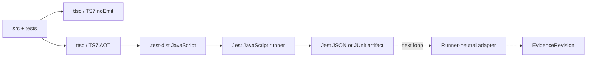

# [[TS7 Test Compilation Lane]]

> TypeScript 7로 source와 test를 함께 선컴파일하고, Jest는 JavaScript만 실행하게 만드는
> `ts-jest` 제거 선행 루프

**Status**: Implementation-ready plan
**Roadmap slot**: P4.0, evidence collector 이전
**Primary compiler**: `ttsc` + TypeScript Native 7
**Test runner**: Jest, JavaScript execution only
**Last reviewed**: 2026-07-11

## 결정

Authoritative test gate는 다음 한 경로로 수렴한다.

```text
test:typecheck  -> ttsc / TypeScript 7 / no emit
test:compile    -> ttsc / TypeScript 7 -> .test-dist/**/*.js
test:run        -> Jest -> compiled JavaScript only
```

- `ts-jest`는 parity gate가 통과한 뒤 제거한다.
- Jest는 test runner와 mock/assertion API만 소유하며 TypeScript를 컴파일하지 않는다.
- `@swc/jest`는 AOT 경로가 mock hoisting, watch mode 또는 source-map 문제로 즉시 닫히지
  않을 때만 사용하는 제한된 fallback이다. AOT와 SWC를 동등한 production gate로 영구
  병행하지 않는다.
- `typescript@5` production runtime 제거는 별도 작업이다. 이 루프는 test transformer의
  TS5 결합만 제거하며 legacy analyzer, 문서 변환기, source edit와 LSP syntax overlay를
  자동으로 이관하지 않는다.
- 다음 evidence loop는 Jest package에 의존하지 않고 runner artifact만 읽는다.

## 현재 경계

| Surface | 현재 상태 | P4.0 판정 |
| --- | --- | --- |
| Production build/typecheck | `ttsc@0.16.8` + TypeScript Native `7.0.2` | 유지 |
| Test source transform | Jest + `ts-jest` + `typescript@5.9.x` | 제거 대상 |
| Test TS7 project | base tsconfig가 test/spec를 제외 | 별도 project 추가 |
| Runtime Compiler API | source가 `typescript@5`를 직접 import | 이 루프의 비범위 |
| Test evidence | canonical-empty revision만 사용 | 다음 runner-neutral adapter loop |

현재 `npm test` 성공은 Jest regression proof이지만 TS7이 test source를 처리했다는 증거는
아니다. P4.0 완료 후에만 `npm test`를 TS7 test compatibility gate로 간주한다.

### 2026-07-11 spike evidence

- TS7 native compiler가 전체 source/test project를 no-emit 검사하고 JavaScript로 emit했다.
- 현재 기준 217 suite/2,978 test가 parity baseline이며 실제 baseline command output을 최종
  authority로 사용한다.
- emitted CommonJS에 `transform: {}`를 사용하면 static `jest.mock()` suite가 실패했고,
  `babel-jest`를 JavaScript-only mock-hoist transform으로 적용하면 해당 canary가 통과했다.
- parallel worker에서 일회성 native crash가 관찰됐고 같은 suite는 `--runInBand`에서
  통과했다. 따라서 serial 성공만으로 P4.0을 닫지 않고 병렬 반복 gate를 둔다.

## 목표 흐름



`.test-dist`는 disposable build output이다. production `dist`와 공유하지 않고 Git에
추적하지 않는다. Jest 결과 artifact도 evidence 자체가 아니며 다음 loop의 adapter가
정규화하기 전까지 runner-owned input으로 취급한다.

## 범위

### 포함

- 모든 source/test/setup 파일의 TS7 no-emit typecheck
- test 전용 TS7 project와 deterministic AOT output
- Jest JavaScript-only configuration
- `jest.mock` hoisting, setup file, `__dirname`/cwd와 SQLite asset canary
- source-map과 coverage의 원본 TypeScript 경로 검증
- legacy/current lane과 TS7 AOT lane의 full-suite parity
- package scripts와 lockfile cutover, `ts-jest` 제거
- 다음 evidence adapter가 읽을 runner artifact handoff 정의

### 제외

- Jest에서 Vitest 또는 Node test runner로 이전
- legacy analyzer와 source transformer의 `typescript@5` runtime 제거
- LSP 미저장 `GraphDelta` extractor 교체
- Jest/JUnit/Vitest artifact의 `EvidenceRevision` 변환 구현
- naming/style evaluator와 durable convention report history

## 계획 파일

| File | 계획 |
| --- | --- |
| `tsconfig.test.ttsc.json` | source와 test를 TS7으로 검사·emit하는 별도 project |
| `scripts/build-test-dist.cjs` | `.test-dist` 정리, ttsc 실행, runtime asset 복사 |
| `scripts/run-test-watch.cjs` | initial AOT 뒤 ttsc watch와 Jest output watch lifecycle 관리 |
| `jest.precompiled.config.cjs` | compiled JS 전용 root/test/setup/coverage 계약 |
| `.gitignore` | `.test-dist/`와 local parity artifact 제외 |
| `package.json` | canary script 추가 후 parity 승인 시 `npm test` cutover |
| `package-lock.json` | `ts-jest` 제거와 direct `babel-jest`/`@babel/core` pin 반영 |

`jest.precompiled.config.cjs`는 canary 동안 기존 `jest.config.js`와 분리한다. cutover 후
중복 config를 영구 유지하지 않고 precompiled config를 최종 Jest SSOT로 승격한다.

## 목표 설정

### `tsconfig.test.ttsc.json`

```json
{
  "extends": "./tsconfig.ttsc.json",
  "compilerOptions": {
    "rootDir": "./src",
    "outDir": "./.test-dist",
    "declaration": false,
    "declarationMap": false,
    "sourceMap": true,
    "inlineSources": true,
    "noEmitOnError": true,
    "types": ["node", "jest"]
  },
  "include": ["src/**/*"],
  "exclude": ["node_modules", "dist", ".test-dist"]
}
```

별도 project가 base config의 test/spec 제외를 명시적으로 덮어쓴다. module과
module-resolution 정책은 production `tsconfig.ttsc.json`을 상속하여 test만 다른 emit
semantics를 만들지 않는다. `rootDir`은 반드시 `./src`로 유지한다. 그래야
`src/cli.ts → .test-dist/cli.js`와 `src/__tests__/setup.ts → .test-dist/__tests__/setup.js`
구조가 보존되어 `__dirname`, repository `package.json` lookup과 cwd 복원 계약이 유지된다.

### 목표 package scripts

```json
{
  "test:typecheck": "node scripts/run-ttsc.cjs -p tsconfig.test.ttsc.json --noEmit",
  "test:compile": "node scripts/build-test-dist.cjs",
  "test:run": "jest --config jest.precompiled.config.cjs",
  "test:ts7": "npm run test:typecheck && npm run test:compile && npm run test:run",
  "test:legacy": "jest --config jest.config.js",
  "test:watch": "node scripts/run-test-watch.cjs",
  "test": "npm run test:ts7"
}
```

`test:legacy`는 parity 기간에만 존재한다. P4.0 완료 정의에는 legacy script와
`ts-jest`의 제거가 포함된다.

## 구현 절차

### Checkpoint 0 — Baseline 고정

1. 현재 `npm test -- --runInBand` 결과와 `jest --showConfig`를 capture한다.
2. suite/test pass 수, skipped 수와 실패 목록을 machine-readable JSON으로 남긴다.
3. 다음 canary 집합을 고정한다.
   - 순수 convention/spec unit test
   - `node:fs` mock과 relative-module automock test
   - SQLite `schema.sql`을 읽는 test
   - `setupFilesAfterEnv` singleton reset test
   - `__dirname`, fixture와 `process.cwd()` 의존 test
   - `typescript@5` Compiler API를 runtime으로 직접 사용하는 legacy analyzer test
4. baseline capture는 source, database와 generated registry를 변경하지 않아야 한다.

### Checkpoint 1 — TS7 test typecheck

1. `tsconfig.test.ttsc.json`을 추가한다.
2. `npm run test:typecheck`가 모든 test/spec/setup 파일을 포함하는지 `--listFiles` 또는
   equivalent compiler evidence로 확인한다.
3. 실패는 test를 TS7과 맞추는 방식으로 수정한다. test를 exclude하거나
   `skipLibCheck` 외의 broad suppression으로 숨기지 않는다.
4. 이 단계에서는 Jest config와 기본 `npm test`를 변경하지 않는다.

### Checkpoint 2 — Deterministic AOT output

1. `scripts/build-test-dist.cjs`가 repository root의 `.test-dist`만 정리한다.
2. 같은 script가 `run-ttsc.cjs -p tsconfig.test.ttsc.json`을 실행하고 non-zero exit를
   그대로 전달한다.
3. `src/storage/schema.sql`을 `.test-dist/storage/schema.sql`로 복사한다.
4. 추가 non-TypeScript runtime asset은 실패한 canary가 증명할 때만 explicit manifest에
   추가한다. source tree 전체를 암묵 복사하지 않는다.
5. 동일 source/config에서 emitted JS와 source-map file set이 동일한지 확인한다.

### Checkpoint 3 — Jest JavaScript-only canary

1. Jest root를 `.test-dist`로 제한하고 `*.test.js`/`*.spec.js`만 선택한다.
2. setup file은 `.test-dist/__tests__/setup.js`를 사용한다.
3. `jest.mock()` hoisting을 위해 emitted JavaScript에는 direct dev dependency로 pin한
   `babel-jest`를 명시한다. 이 transformer는 TypeScript를 입력으로 받지 않는다.
4. `transform: {}`로 mock hoisting을 우발적으로 제거하지 않는다.
5. Checkpoint 0의 canary를 먼저 통과한 뒤 전체 suite를 실행한다.

최소 transform 경계는 다음과 같다.

```js
transform: {
  '^.+\\.js$': 'babel-jest',
}
```

Jest root는 `.test-dist`, setup은 `.test-dist/__tests__/setup.js`, module extension은
`js/json/node`로 제한한다. coverage는 기존 Babel provider로 시작하고 source-map remap
gate를 통과한 경우에만 다른 provider 변경을 별도 결정한다.

### Checkpoint 4 — Full parity와 coverage

1. 같은 checkout에서 legacy lane과 TS7 AOT lane을 모두 `--runInBand`로 실행한다.
2. suite/test pass, fail, skip 집합이 동일해야 한다. 순서와 duration은 identity로 사용하지
   않는다.
3. stack trace가 원본 `.ts` 파일과 올바른 line을 가리키는지 고의 실패 canary로 확인한다.
4. coverage의 `SF:`가 `.test-dist/*.js`가 아니라 원본 `src/*.ts`를 가리켜야 한다.
5. production source 누락 0건을 확인하고 기존 threshold보다 낮아지는 변경은 별도 승인
   없이는 허용하지 않는다.
6. `--runInBand` full run 뒤 `maxWorkers=2` full run을 최소 두 번 반복한다. native worker
   crash 또는 비결정적 suite loss는 parity 성공으로 처리하지 않는다.

### Checkpoint 5 — Watch lane

1. `scripts/run-test-watch.cjs`는 initial `test:compile` 성공 후 두 child process를 시작한다.
2. 첫 child는 같은 test project를 `ttsc --watch`로 emit하고, 둘째 child는 `.test-dist`만
   대상으로 Jest watch를 실행한다.
3. SIGINT/SIGTERM을 두 child에 전달하고 한 child가 비정상 종료하면 다른 child도 닫는다.
4. source 수정 → JS emit → 관련 test 재실행을 smoke로 증명한다.
5. 이 lifecycle이 안정화되지 않으면 SWC watch fallback을 명시적으로 선택하거나 watch를
   P4.0 blocker로 유지한다. 기존 TS5 `jest --watch`를 조용히 남기지 않는다.

### Checkpoint 6 — Cutover

1. `npm test`를 `test:ts7` orchestration으로 교체한다.
2. `ts-jest`를 dev dependency와 lockfile에서 제거한다.
3. `npm ls ts-jest`가 비어 있고 `jest --showConfig`의 TS transform이 없는지 확인한다.
4. `typescript@5`가 남아 있다면 모든 잔존 reason이 runtime Compiler API consumer로
   설명돼야 한다. 이를 test toolchain 잔존으로 오인하지 않는다.
5. parity용 legacy script/config를 제거하고 문서 상태를 완료로 갱신한다.
6. Node 18, 20, 22의 clean install matrix에서 같은 test gate를 실행하고 `npm pack --dry-run`에
   `.test-dist`가 포함되지 않는지 확인한다.

### Checkpoint 7 — Evidence loop handoff

Cutover 이후 canonical test command는 필요할 때 Jest JSON 또는 JUnit artifact를 만든다.
다음 loop는 다음 경계만 구현한다.

```text
Jest JSON / JUnit / Vitest artifact
  -> runner-specific, dependency-free adapter
  -> common EvidenceRevision
```

Adapter는 Jest, Vitest 또는 `ts-jest` package를 import하지 않는다. artifact bytes와 adapter
config를 fingerprint하고 workspace-relative source identity로 정규화한다.

## SWC fallback decision

다음 중 하나가 AOT canary를 막고 해당 checkpoint 안에서 수정되지 않을 때만
`TS7 typecheck + @swc/jest transpile-only`를 임시 사용한다.

- Jest JS transform으로 보존할 수 없는 module-mock hoisting
- watch mode가 AOT output 변경을 안정적으로 추적하지 못함
- source-map chain이 coverage/stack trace gate를 충족하지 못함

Fallback에서도 `test:typecheck`는 TS7 gate이며 SWC는 type correctness의 authority가 아니다.
Fallback을 선택하면 blocker, owner, exit condition을 roadmap에 기록하고 AOT lane을 대체하는
단일 임시 경로로 사용한다. TS5나 `ts-jest`로 silent fallback하지 않는다.

## 실패 처리와 rollback

| Failure | 처리 |
| --- | --- |
| TS7 typecheck failure | test/source typing 수정; 파일 제외 금지 |
| `jest.mock` order regression | emitted JS의 Jest hoist transform 검증; 필요 시 해당 test를 explicit injection으로 변경 |
| missing runtime asset | explicit copy manifest에 증명된 asset만 추가 |
| `__dirname`/cwd drift | output tree shape 또는 test path expectation 수정; production cwd 변경 금지 |
| source-map/coverage drift | external/inline source-map과 coverage provider를 canary로 비교 |
| ttsc native compiler unavailable | hard failure; TS5로 fallback 금지 |

Cutover 전 rollback은 기본 `npm test`를 그대로 유지하는 것이다. Cutover 후 긴급 rollback이
필요하면 package script/config 변경만 되돌리고 P4.0을 완료로 표시하지 않는다. 두 lane을
장기간 release gate로 병행하는 상태는 완료가 아니다.

## 완료 조건

- 모든 test/spec/setup source가 TS7/ttsc no-emit gate를 통과한다.
- 모든 test 실행 JS는 TS7/ttsc가 생성한다.
- Jest config가 `.test-dist`의 JavaScript만 선택한다.
- full suite의 pass/fail/skip 집합이 legacy baseline과 일치한다.
- module mock, global setup, SQLite schema, fixture/cwd canary가 모두 통과한다.
- stack trace와 coverage가 원본 TypeScript source로 매핑된다.
- `maxWorkers=2` full suite가 최소 두 번 연속 안정적으로 통과한다.
- Node 18/20/22 clean install과 compiled-output watch smoke가 통과한다.
- `npm test`가 typecheck → compile → run 순서로 fail-fast 실행된다.
- `ts-jest`와 parity-only legacy lane이 dependency/config/script에서 제거된다.
- `.test-dist`와 local result artifact가 clean Git status를 오염시키지 않는다.
- 잔존 `typescript@5` consumer와 후속 제거 owner가 별도로 기록된다.
- 다음 evidence adapter가 runner package 없이 test result artifact를 읽을 수 있다.

## 구현 후 문서 동기화

P4.0 구현과 같은 변경에서 다음 현재상태 문서를 갱신한다.

- [[Semantic Graph Spec Governance Roadmap]]
- [[ProjectIndexer]]
- [[Build Pipeline Guide]]
- `README.md`

Evidence adapter가 실제로 구현되기 전에는 [[Convention Pack Check]]의 canonical-empty evidence
제한을 완료형으로 바꾸지 않는다.

## 외부 참고

- [Jest code transformation](https://jestjs.io/docs/29.7/code-transformation)
- [SWC Jest fallback](https://swc.rs/docs/usage/jest)
