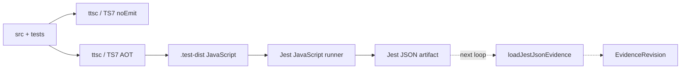

# [[TS7 Test Compilation Lane]]

> TypeScript 7로 source와 test를 함께 선컴파일하고, Jest는 JavaScript만 실행하게 만드는
> `ts-jest` 제거 선행 루프

**Status**: Repository wiring implemented; Node 24 clean-install matrix now requires two
in-band and two worker runs on both Ubuntu and macOS for PR and tag-release workflows; native-crash
qualification remains pending until that matrix is green
**Roadmap slot**: P4.0 handoff complete; P4.1 Jest JSON loader wired
**Primary compiler**: `ttsc` + TypeScript Native 7
**Test runner**: Jest, JavaScript execution only
**Last reviewed**: 2026-07-12

## 결정

Authoritative test gate는 다음 한 경로로 수렴한다.

```text
test:typecheck  -> ttsc / TypeScript 7 / no emit
test:compile    -> ttsc / TypeScript 7 -> .test-dist/**/*.js
test:run        -> Jest -> compiled JavaScript only
```

- `ts-jest`는 local parity gate 통과 후 dependency, lockfile과 Jest config에서 제거했다.
- Jest는 test runner와 mock/assertion API만 소유하며 TypeScript를 컴파일하지 않는다.
- `@swc/jest`는 AOT 경로가 mock hoisting, watch mode 또는 source-map 문제로 즉시 닫히지
  않을 때만 사용하는 제한된 fallback이다. AOT와 SWC를 동등한 production gate로 영구
  병행하지 않는다.
- `typescript@5` production runtime 제거는 별도 작업이다. 이 루프는 test transformer의
  TS5 결합만 제거하며 legacy analyzer, 문서 변환기, source edit와 LSP syntax overlay를
  자동으로 이관하지 않는다.
- 다음 evidence loop는 Jest package에 의존하지 않고 runner artifact만 읽는다.

## 현재 경계

| Surface | 현재 상태 | P4.0 판정 |
| --- | --- | --- |
| Production build/typecheck | `ttsc@0.18.4` + TypeScript Native `7.0.2` | 유지 |
| Test source transform | TS7 AOT emit + emitted-JS `babel-jest` mock hoist | 구현 |
| Test TS7 project | `tsconfig.test.ttsc.json`이 source/test/setup 전체 포함 | 구현 |
| Runtime Compiler API | source가 `typescript@5`를 직접 import | 이 루프의 비범위 |
| Test evidence | canonical-empty revision만 사용 | 다음 Jest JSON loader loop |

현재 `npm test`는 TS7 no-emit typecheck, deterministic AOT compile, JavaScript-only Jest를
순서대로 실행한다. 따라서 선택한 지원 runtime 안에서 repository-local test workflow
authority는 이 단일 경로다. 지원 runtime 자체의 qualification은 별도 미완료 gate다.

### 2026-07-11 implementation evidence

- TS7 native compiler가 전체 source/test project를 no-emit 검사하고 JavaScript로 emit했다.
- 현재 기준 217 suite/2,980 test가 parity baseline이며 실제 baseline command output을 최종
  authority로 사용한다.
- emitted CommonJS에 `transform: {}`를 사용하면 static `jest.mock()` suite가 실패했고,
  `babel-jest`를 JavaScript-only mock-hoist transform으로 적용하면 해당 canary가 통과했다.
- JS-only lane은 217 suite/2,980 test를 in-band에서 통과했고 `maxWorkers=2`도 두 번 연속
  같은 집합으로 통과했다. 그러나 Node 24에서는 두 실행 방식 모두 후속 native crash가
  재현됐으므로 이 결과는 기능 parity 증거이지 runtime 안정성 증거가 아니다.
- legacy `workerIdleMemoryLimit`는 `maxWorkers: 1`에서도 child worker를 만들 수 있어 제거했다.
  authoritative 기본은 실제 직렬 실행이며 `maxWorkers=2`는 별도 stress gate다.
- macOS의 Node 24.14/24.18(V8 13.6)에서는 worker와 in-band 실행 모두에서 간헐적인
  `ClearStaleLeftTrimmedPointerVisitor` mark-compact GC SIGSEGV가 재현됐다. `--no-compact`와
  optional `fsevents` 제거도 이를 해소하지 못했으므로 검증되지 않은 런타임 우회는
  repository에 넣지 않는다.
- 2026-07-13에 공식 Node 24 배포 목록과 대조한 Node 24.18.0(현행 최신 LTS)에서도
  `npm test -- --runInBand`가 같은 V8 GC `SIGSEGV`로 종료됐다. `NODE_OPTIONS=--jitless`는
  5분 동안 11 suite를 crash 없이 진행했지만 full-suite qualification에는 비현실적으로 느려
  중단했다. 이는 JIT/GC 계층의 진단 신호일 뿐 지원 runtime 또는 CI 기본값으로 채택하지 않는다.
- `--no-opt`는 `NODE_OPTIONS`로 허용되지 않아 현재 multi-process test lane 전체에 단순히 전달할
  수 없다. test launcher의 exec 인자를 바꾸어 우회하는 작업은 upstream runtime fix와 별도
  performance/support ADR 없이는 진행하지 않는다.
- coverage 283개 source의 LCOV `SF:`가 모두 `src/*.ts`이며 `.test-dist` 누출은 0건이다.
- Node 22 ABI에 맞게 `better-sqlite3`를 재빌드한 환경에서는 전체 217 suite/2,980 test가
  통과했다. 이는 historical functionality evidence일 뿐 현재 release baseline의 qualification은
  아니다. 검증 후 native addon은 현재 Node 24 ABI로 복원했다.
- package와 CI baseline은 Node `>=24.0.0 <25.0.0`이다. PR CI와 tag-release workflow는 clean
  `npm ci` 뒤 Ubuntu/macOS 각각에서 `--runInBand`와 `--maxWorkers=2`를 두 번씩 실행한다.
  tag release는 이 matrix가 모두 통과해야 publish job을 시작한다. release 전에는 packed tarball을
  별도 consumer directory에 설치해 `init → build → work-context` CLI도 실행한다. 이는 package file
  set과 installed runtime asset의 proof이며, macOS native-crash 해소를 대신하지 않는다. locked
  `better-sqlite3@12.4.1`은 Node 24를 지원한다. 2026-07-13 macOS ARM64 Node 24.18.0의
  `npm test -- --runInBand`는 V8 `ClearStaleLeftTrimmedPointerVisitor` mark-compact GC
  `SIGSEGV`로 다시 종료됐다. 이 matrix를 native crash 없이 통과하기 전에는 stable release를 선언하지
  않는다.
- `npm run test:watch`는 ttsc persistent watcher의 output-directory 감시 세부 동작에
  의존하지 않고 source/config 변경 뒤 one-shot compile과 one-shot Jest를 직렬 실행한다.
  실제 변경 감지, 재실행과 terminal SIGINT 종료를 smoke했다.
- `.test-dist`는 destructive rebuild output이므로 test/compile/run/watch 전체가 repository lock을
  공유한다. 두 번째 lane은 파일을 지우지 않고 active owner PID와 함께 즉시 실패하며,
  signal/kill 뒤 남은 lock은 다음 시작 시 dead owner를 확인한 후 회수한다. lock token은
  compile coordinator에만 전달하고 Jest/test subprocess에서는 제거한다.
- 성공한 compile은 source/config input digest와 emitted output digest/count를 completion
  manifest에 기록한다. `test:run`은 manifest가 없거나 stale/partial이면 Jest를 시작하지 않는다.

## 목표 흐름



`.test-dist`는 disposable build output이다. production `dist`와 공유하지 않고 Git에
추적하지 않는다. Jest 결과 artifact도 evidence 자체가 아니며 다음 loop의 loader가
정규화하기 전까지 runner-owned input으로 취급한다.

## 범위

### 포함

- 모든 source/test/setup 파일의 TS7 no-emit typecheck
- test 전용 TS7 project와 deterministic AOT output
- Jest JavaScript-only configuration
- `jest.mock` hoisting, setup file, `__dirname`/cwd와 SQLite asset canary
- source-map과 coverage의 원본 TypeScript 경로 검증
- legacy/current lane과 TS7 AOT lane의 full-suite parity
- package scripts와 lockfile cutover, `ts-jest` 제거
- 다음 evidence loader가 읽을 runner artifact handoff 정의

### 제외

- Jest에서 Vitest 또는 Node test runner로 이전
- legacy analyzer와 source transformer의 `typescript@5` runtime 제거
- LSP 미저장 `GraphDelta` extractor 교체
- 후속 JUnit/Vitest loader 구현과 multi-runner abstraction
- naming/style evaluator와 durable convention report history

## 구현 파일

| File | 책임 |
| --- | --- |
| `tsconfig.test.ttsc.json` | source와 test를 TS7으로 검사·emit하는 별도 project |
| `scripts/build-test-dist.cjs` | `.test-dist` 정리, ttsc 실행, runtime asset 복사 |
| `scripts/run-test-lane.cjs` | typecheck → compile → Jest orchestration과 CLI 인자 전달 |
| `scripts/run-test-js.cjs` | compiled output runner와 lane lock |
| `scripts/run-test-watch.cjs` | source/config polling 뒤 compile → Jest 직렬 재실행 |
| `scripts/test-dist-manifest.cjs` | input/output digest와 completion manifest 검증 |
| `scripts/test-lane-lock.cjs` | compile부터 Jest 종료까지 shared output의 single-writer 보장 |
| `scripts/normalize-jest-arguments.cjs` | source test path만 emitted path로 정규화 |
| `jest.config.js` | compiled JS 전용 root/test/setup/coverage SSOT |
| `.gitignore` | `.test-dist/`와 local parity artifact 제외 |
| `package.json` | authoritative `npm test`와 세부 gate script |
| `package-lock.json` | `ts-jest` 제거와 direct `babel-jest`/`@babel/core` pin 반영 |

Shadow parity 기간의 임시 precompiled config는 제거했고, 최종 `jest.config.js` 하나만
유지한다.

## 목표 설정

### `tsconfig.test.ttsc.json`

```json
{
  "extends": "./tsconfig.ttsc.json",
  "compilerOptions": {
    "rootDir": "./src",
    "outDir": "./.test-dist",
    "declaration": false,
    "declarationMap": false,
    "sourceMap": true,
    "inlineSources": true,
    "noEmitOnError": true,
    "types": ["node", "jest"]
  },
  "include": ["src/**/*"],
  "exclude": ["node_modules", "dist", ".test-dist"]
}
```

별도 project가 base config의 test/spec 제외를 명시적으로 덮어쓴다. module과
module-resolution 정책은 production `tsconfig.ttsc.json`을 상속하여 test만 다른 emit
semantics를 만들지 않는다. `rootDir`은 반드시 `./src`로 유지한다. 그래야
`src/cli.ts → .test-dist/cli.js`와 `src/__tests__/setup.ts → .test-dist/__tests__/setup.js`
구조가 보존되어 `__dirname`, repository `package.json` lookup과 cwd 복원 계약이 유지된다.

### 현재 package scripts

```json
{
  "test:typecheck": "node scripts/run-ttsc.cjs -p tsconfig.test.ttsc.json --noEmit",
  "test:compile": "node scripts/build-test-dist.cjs",
  "test:run": "node scripts/run-test-js.cjs",
  "test:ts7": "node scripts/run-test-lane.cjs",
  "test:watch": "node scripts/run-test-watch.cjs",
  "test": "node scripts/run-test-lane.cjs"
}
```

`run-test-lane.cjs`가 마지막 Jest process에만 `npm test -- ...` 인자를 전달하므로
`--runInBand`, `--coverage`, `--json`, `--runTestsByPath`의 의미가 중첩 npm script에서
손실되지 않는다. positional `src/**/*.test.ts`, `--runTestsByPath`와 `--findRelatedTests`
source 경로는 emitted `.js` 경로로 정규화한다. source Git graph를 잃는 `--onlyChanged`,
`--changedSince`, `--lastCommit`과 compiled output만 감시하게 되는 Jest watch flag는 명시적으로
거부한다. parity-only legacy script와 `ts-jest`는 제거됐다.

## 구현 절차

### Checkpoint 0 — Baseline 고정

1. 현재 `npm test -- --runInBand` 결과와 `jest --showConfig`를 capture한다.
2. suite/test pass 수, skipped 수와 실패 목록을 machine-readable JSON으로 남긴다.
3. 다음 canary 집합을 고정한다.
   - 순수 convention/spec unit test
   - `node:fs` mock과 relative-module automock test
   - SQLite `schema.sql`을 읽는 test
   - `setupFilesAfterEnv` singleton reset test
   - `__dirname`, fixture와 `process.cwd()` 의존 test
   - `typescript@5` Compiler API를 runtime으로 직접 사용하는 legacy analyzer test
4. baseline capture는 source, database와 generated registry를 변경하지 않아야 한다.

### Checkpoint 1 — TS7 test typecheck

1. `tsconfig.test.ttsc.json`을 추가한다.
2. `npm run test:typecheck`가 모든 test/spec/setup 파일을 포함하는지 `--listFiles` 또는
   equivalent compiler evidence로 확인한다.
3. 실패는 test를 TS7과 맞추는 방식으로 수정한다. test를 exclude하거나
   `skipLibCheck` 외의 broad suppression으로 숨기지 않는다.
4. 이 단계에서는 Jest config와 기본 `npm test`를 변경하지 않는다.

### Checkpoint 2 — Deterministic AOT output

1. `scripts/build-test-dist.cjs`가 repository root의 `.test-dist`만 정리한다.
2. 같은 script가 `run-ttsc.cjs -p tsconfig.test.ttsc.json`을 실행하고 non-zero exit를
   그대로 전달한다.
3. `src/storage/schema.sql`을 `.test-dist/storage/schema.sql`로 복사한다.
4. compile 전후 source/config digest가 같을 때만 completion manifest를 원자적으로 publish한다.
   manifest는 emitted file/test count와 output digest를 포함하며 standalone `test:run`이 이를
   다시 검증한다.
5. 추가 non-TypeScript runtime asset은 실패한 canary가 증명할 때만 explicit manifest에
   추가한다. source tree 전체를 암묵 복사하지 않는다.
6. 동일 source/config에서 emitted JS와 source-map file set이 동일한지 확인한다.

### Checkpoint 3 — Jest JavaScript-only canary

1. Jest root를 `.test-dist`로 제한하고 실제 저장소 계약인 `__tests__/**/*.test.js`만
   선택한다. 이 경계는 `src/types/spec.ts` 같은 일반 module을 test로 오인하지 않는다.
2. setup file은 `.test-dist/__tests__/setup.js`를 사용한다.
3. `jest.mock()` hoisting을 위해 emitted JavaScript에는 direct dev dependency로 pin한
   `babel-jest`를 명시한다. 이 transformer는 TypeScript를 입력으로 받지 않는다.
4. `transform: {}`로 mock hoisting을 우발적으로 제거하지 않는다.
5. Checkpoint 0의 canary를 먼저 통과한 뒤 전체 suite를 실행한다.

최소 transform 경계는 다음과 같다.

```js
transform: {
  '^.+\\.js$': ['babel-jest', { babelrc: false, configFile: false }],
}
```

Jest root는 `.test-dist`, setup은 `.test-dist/__tests__/setup.js`, module extension은
`js/json/node`로 제한한다. coverage는 기존 Babel provider로 시작하고 source-map remap
gate를 통과한 경우에만 다른 provider 변경을 별도 결정한다.

### Checkpoint 4 — Full parity와 coverage

1. 같은 checkout에서 legacy lane과 TS7 AOT lane을 모두 `--runInBand`로 실행한다.
2. suite/test pass, fail, skip 집합이 동일해야 한다. 순서와 duration은 identity로 사용하지
   않는다.
3. stack trace가 원본 `.ts` 파일과 올바른 line을 가리키는지 고의 실패 canary로 확인한다.
4. coverage의 `SF:`가 `.test-dist/*.js`가 아니라 원본 `src/*.ts`를 가리켜야 한다.
5. production source 누락 0건을 확인하고 기존 threshold보다 낮아지는 변경은 별도 승인
   없이는 허용하지 않는다.
6. `--runInBand` full run 뒤 `maxWorkers=2` full run을 최소 두 번 반복한다. 어느 실행
   방식에서든 native crash 또는 비결정적 suite loss가 있으면 runtime qualification
   성공으로 처리하지 않는다.

### Checkpoint 5 — Watch lane

1. test watch는 installed ttsc persistent watcher의 resolved `outDir` 처리 방식에 의존하지
   않는다. compiler 버전 변화가 `.test-dist` 자기 재빌드 위험을 다시 만들지 않게 한다.
2. 현재 `scripts/run-test-watch.cjs`는 portable polling으로 `src`와 test configuration을
   감시한다.
3. 변경이 생기면 기존 cycle과 겹치지 않게 one-shot `test:compile`을 완료한 뒤 one-shot
   JavaScript Jest를 실행한다. cycle 중 추가 변경은 한 번으로 coalesce한다.
4. `scripts/run-ttsc.cjs`와 watch coordinator는 SIGINT/SIGTERM을 active child에 전달한다.
5. config timestamp 변경 → compile → SQLite canary 재실행 → terminal SIGINT를 smoke했다.
6. 향후 ttsc watcher가 resolved `outDir`를 제외하면 persistent compiler + `jest --watchAll`
   구조를 다시 검토한다. 현재 경로는 TS5나 SWC로 fallback하지 않는다.
7. PID-targeted CI termination에서 nested native child까지 bounded escalation하는 process-group
   처리는 clean-install CI job과 함께 남은 release hardening으로 추적한다.

### Checkpoint 6 — Cutover

1. `npm test`를 `test:ts7` orchestration으로 교체한다.
2. `ts-jest`를 dev dependency와 lockfile에서 제거한다.
3. `npm ls ts-jest`가 비어 있고 `jest --showConfig`의 TS transform이 없는지 확인한다.
4. `typescript@5`가 남아 있다면 모든 잔존 reason이 runtime Compiler API consumer로
   설명돼야 한다. 이를 test toolchain 잔존으로 오인하지 않는다.
5. parity용 legacy script/config를 제거하고 문서 상태를 완료로 갱신한다.
6. Node engines와 native dependency 지원 범위를 먼저 정렬한 뒤, 선언된 지원 runtime의
   clean-install matrix에서 같은 test gate를 실행한다. `npm pack --dry-run`에는
   `.test-dist`가 포함되지 않아야 한다.

1~5는 2026-07-11 repository wiring cutover에서 완료했다. 6은 선택된 Node 24 line에서
native crash 없이 clean-install worker/in-band matrix를 통과하는 release gate이며, 완료 전에는
이 문서를 platform-wide 완료로 표시하지 않는다.

### Checkpoint 7 — Evidence loop handoff

Cutover 이후 canonical test command는 필요할 때 complete Jest JSON artifact를 만든다. 이
문서는 runner artifact와 source-map handoff까지만 소유한다.

```text
Jest JSON
  -> loadJestJsonEvidence
  -> in-memory EvidenceRevision
  -> convention check
```

Handoff artifact는 run-exec/runtime error와 aggregate count 불일치를 노출하고, emitted test
file마다 adjacent source map과 `sourcesContent`를 제공해야 한다. 불완전 artifact를 partial pass로
소비하지 않는다. 기본 `npm test`에는 artifact 생성을 강제하지 않는다.

첫 product slice의 명령은
`tsdoc-edge convention check --pack <pack.json> --evidence <jest.json>` 하나다. Normalized
evidence identity, status와 provenance는 [[Semantic Graph Analysis and Relationship Model]],
CLI/exit/report 동작은 [[Convention Pack Check]], checkpoint와 보류 범위는
[[Semantic Graph Spec Governance Roadmap]]이 소유한다.

## SWC fallback decision

다음 중 하나가 AOT canary를 막고 해당 checkpoint 안에서 수정되지 않을 때만
`TS7 typecheck + @swc/jest transpile-only`를 임시 사용한다.

- Jest JS transform으로 보존할 수 없는 module-mock hoisting
- watch mode가 AOT output 변경을 안정적으로 추적하지 못함
- source-map chain이 coverage/stack trace gate를 충족하지 못함

Fallback에서도 `test:typecheck`는 TS7 gate이며 SWC는 type correctness의 authority가 아니다.
Fallback을 선택하면 blocker, owner, exit condition을 roadmap에 기록하고 AOT lane을 대체하는
단일 임시 경로로 사용한다. TS5나 `ts-jest`로 silent fallback하지 않는다.

## 실패 처리와 rollback

| Failure | 처리 |
| --- | --- |
| TS7 typecheck failure | test/source typing 수정; 파일 제외 금지 |
| `jest.mock` order regression | emitted JS의 Jest hoist transform 검증; 필요 시 해당 test를 explicit injection으로 변경 |
| missing runtime asset | explicit copy manifest에 증명된 asset만 추가 |
| `__dirname`/cwd drift | output tree shape 또는 test path expectation 수정; production cwd 변경 금지 |
| source-map/coverage drift | external/inline source-map과 coverage provider를 canary로 비교 |
| ttsc native compiler unavailable | hard failure; TS5로 fallback 금지 |

Cutover 전 rollback은 기본 `npm test`를 그대로 유지하는 것이다. Cutover 후 긴급 rollback이
필요하면 package script/config 변경만 되돌리고 P4.0을 완료로 표시하지 않는다. 두 lane을
장기간 release gate로 병행하는 상태는 완료가 아니다.

## 완료 조건

- [x] 모든 test/spec/setup source가 TS7/ttsc no-emit gate를 통과한다.
- [x] 모든 test 실행 JS는 TS7/ttsc가 생성한다.
- [x] Jest config가 `.test-dist`의 JavaScript만 선택한다.
- [x] full suite의 pass/fail/skip 집합이 legacy baseline과 일치한다.
- [x] module mock, global setup, SQLite schema, fixture/cwd canary가 모두 통과한다.
- [x] stack trace와 coverage가 원본 TypeScript source로 매핑된다.
- [x] `maxWorkers=2`에서 동일 217 suite/2,980 test 집합이 두 번 연속 통과했다.
- [x] conservative compiled-output watch smoke가 통과한다.
- [x] incomplete/stale/tampered `.test-dist`는 `test:run` 전에 거부된다.
- [ ] Node 24 engines/native dependency 계약에서 worker/in-band 반복 clean-install matrix를
      native crash 없이 통과한다.
- [x] `npm test`가 typecheck → compile → run 순서로 fail-fast 실행된다.
- [x] `ts-jest`와 parity-only legacy lane이 dependency/config/script에서 제거된다.
- [x] `.test-dist`와 local result artifact가 clean Git status를 오염시키지 않는다.
- [x] 잔존 `typescript@5` consumer와 후속 제거 범위가 별도로 기록된다.
- [x] 다음 evidence loader의 runner-package-free artifact handoff가 정의됐다.

## 구현 후 문서 동기화

P4.0 구현과 같은 변경에서 다음 현재상태 문서를 갱신한다.

- [[Semantic Graph Spec Governance Roadmap]]
- [[ProjectIndexer]]
- [[Build Pipeline Guide]]
- `README.md`

P4.1은 `loadJestJsonEvidence`로 complete Jest JSON artifact를 in-memory evidence revision으로
변환하며, source-mapped TS7 artifact를 사용한 convention CLI exact replay까지 통과했다.
`--evidence`를 생략한 convention check만 canonical-empty evidence를 사용하며, retained history와
다른 runner는 별도 milestone이다.

## 외부 참고

- [Jest code transformation](https://jestjs.io/docs/29.7/code-transformation)
- [SWC Jest fallback](https://swc.rs/docs/usage/jest)
